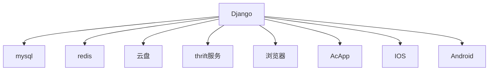

[toc]

# Django框架课-1.1 课程概论和Python3语法

## 课程概论

### Django简介

> Django是最近流行起来的，Youtube、Instagram等公司采用了Django框架，但是国内的大型中型公司还使用的比较少。
>
> 可以作为Web、App、小程序、AcWing云端App等各种项目的后端

Django的优势：

- 开发效率高，生态完善，有[官方社区](https://www.djangoproject.com/)长期支持（<u>基本问题都可以在网上搜到</u>）
- 运行效率高（常见误区：python运行效率低，所以python写的应用运行效率低）
  - 项目运行效率瓶颈有很多，比如：**数据库查询**、**网络带宽/延迟**、**硬盘读写速度**等，这些与框架关系不大。
  - **计算密集型的模块可以用C/C++实现，然后编译成动态链接库再import进来**。（就是说某个模块的运行效率比较低的话，大不了直接用C++代码实现再import进来）
  - 计算密集型的微服务可以通过thrift等工具对接，微服务的Server端代码可以用C/C++语言实现。
  - **有很多工具可以将Python代码翻译成C/C++**，比如Cython、Pypy。AcWing 题库中的不少题目，会发现Python3比Java还快一些。
  - 既适合大公司，也适合个人开发者，**平均开发一个Web/AC App只需要半个月-1个月**。

Django的前后端分离

- 数据库方面：Django自带的数据库sqlite3（前期开发），如果sqlite3上数据太大的话，可以很方便的将数据迁移到mysql服务器。

  **数据库速度**

  - Server端：云盘<Mysql<Redits（内存数据库）
  - Client端：Web Storage，js内存（不刷新就不会消失）

### 实战项目介绍

> 课程中会开发一款支持在线联机对战的简易版吃鸡游戏，前后端分离，前端支持AC APP端和Web端。

**功能概述**

1. 游戏菜单、游戏设置：熟悉http协议
2. 存储对局信息、账户信息：熟悉数据库操作
3. 在Redis中存储每局对战状态：熟悉内存数据库操作
4. 在线聊天室、实时移动、实时放技能：熟悉websocket协议
5. 在线匹配系统：熟悉thrift和微服务
6. 配置nginx：熟悉nginx部署云服务

