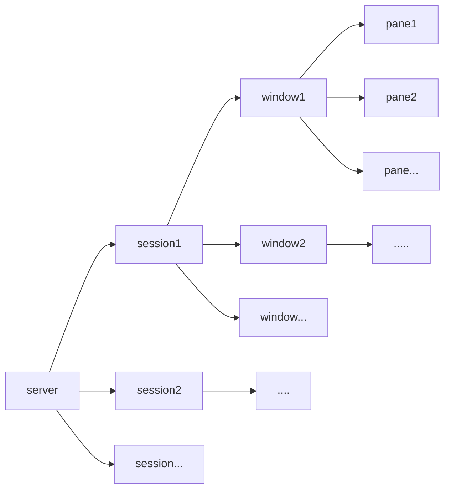

[toc]

# Linux基础课-2.1 tmux和vim

> 两个**至关重要**的工具(未来开发服务器的时候经常会用)
>
> 这两个工具是集成在终端内部的，不需要另外安装！
>
> 唯一的技巧就是多多练习!!

==17个tmux和43个vim指令==

## 关于内外交互问题

### Linux与Windows进行交互

> ~~Linux内部`ctrl+insert`即可复制内部内容到Windows~~
>
> 经过修改后，现在已经支持==ctrl+shift+c/v==作为Linux和Windows的内外交互指令了
>
> 博主用的是Ubnutu 20.04 LTS（默认值处打开`使用ctrl+shift+c/v作为复制粘贴的快捷键即可`）

### 不同文件之间交互

> Plus：这块内容可以等到看完tmux和vim之后再来浏览
>
> 注意此时需要处于同一个pane下
>
> 比方说此时需要将test1.txt的前5行复制到test2.txt中
>
> ```shell
> vim test1.txt
> gg+v+5G+$+y
> :q
> vim test2.txt
> p
> :wq
> ```

## tmux

### 基本功能介绍

1. 分屏操作:（不是一般的多开窗口，而是在同一个窗口内部进行分屏）理论上只要你能看得清，就能无限分屏下去（好叼）
2. tmux允许我们和服务器断开连接后，在服务器上继续运行指令（就像某些突发事件发生的时候，比如断网，tmux就能保护你正在编写的内容，又比如你正在训练一个模型，可能一训练就要训练好几天（万一一不小心把窗口关掉了，工作就丢失了），这时候就需要tmux来保持运行），就是能使我们的进程不会因为某些原因中断（把进程挂到云端、后台去执行）

### 基本结构介绍

> 输入一个tmux就是打开了一个会话，然后看到的就是一个window，如果分屏的话就能看到很多pane
>
> 就像这样的一个结构
>
> session->window->pane

tmux:每一个tmux可以开一堆session(可以理解为会话)



- pane:可以理解为小窗口，每一个小窗口又都会打开一个shell对话框

Plus:不知道为啥，但是AC Terminal中的tmux的划分窗口快捷键前缀是`ctrl+a`,而本地Ubuntu中的快捷键是`ctrl+b`（现在清楚了，是y总帮我们设置的，因为ctrl+a更方便，虽然会和内置指令产生冲突hhh），如果要在自己的tmux实现这一功能只需要在tmux的配置文件.tmux.conf中添加相关指令即可

### 常用基础指令介绍

> 无特殊说明，`ctrl+b`均为前缀指令

1. `ctrl+b %`:垂直分屏

2. `ctrl+b "`:水平分屏

3. `ctrl+d`:关闭当前pane，如果此时pane为当前window，则自动关闭window，如果当前session的window均关闭，则自动关闭当前session，直到退出shell窗口为止

4. ~~`ctrl+b 方向键`:选择相邻的pane~~

5. ~~同时按下`ctrl+b+方向键`:调整相邻pane的分割线位置~~

   4、5可以使用一句话解决，在tmux配置文件.tmux.conf中添加

   ```shell
   set -g mouse on # 使鼠标操作生效，可以直接调整分割线位置和选取pane
   # 当然在某些不叫麻烦的还是需要采取原来的方法
   ```

   比方说下面这种情况，中间那条分割线就只能采用原始的方法调整

   

6. `ctrl+b z`:可以将某一个pane全屏/取消全屏

7. `ctrl+b d`:将一个会话==挂起==，`tmux+a/attach`回到原来会话

   举个栗子：

   

   `ctrl+b d`

   

   `tmux+a`:返回原来界面

   

8. `ctrl+b s/w`:通过`方向键`进行展开和`enter`进行选择（w和s基本类似，只有展开级不同）

   具体展开效果如下图所示

   

9. `ctrl+b+c`:在当前session中创建一个新的window（较少用，一般开多个session，每个session一个window，每个window多个pane）

   创建完成后变为两个window，如下图

   

12. `tmux new -s session_name`:新建一个名为`session_name`的会话

13. `tmux ls`:查看所有session

14. `tmux kill -session -t session_name`:关闭一个session

    `tmux kill -session -a -t s1`:关闭除s1外的所有会话

    `tmux kill -server`:关闭所有会话

    `tmux a -t session_name`:连接上某个已经存在的session

    `tmux rename -t s1 s2`:重命名session

15. `ctrl+d`:退出pane、windows、session，可以终止会话

    `ctrl+b d`:只是暂时挂起session

## vim


> vim:终端编辑器，类似于Nodepad++和vscode的综合体，但是自由性碾压二者
>
> os指导书推荐网站http://coolshell.cn/articles/5426.html/
>
> **重点！！！**

### 基本介绍

==基本功能介绍==

**命令行编辑器**：可以编辑文本、c++代码、python、java、js、html、配置文件等等等等，而且还会**根据你文件的扩展名来判断文件类型**，并自动进行**代码高亮**，灰常方便，甚至有格式化（补全代码的功能），总结一句话，只要你vim玩的够花，它就是一个加强版的vscode（完全按照你的个人喜好配置的那种）

==使用方式介绍==

**使用方式**:`vim+filename`，如果文件存在，则打开它，如果不存在，则创建一个新的文件，并命名为filename

==模式介绍==

1. **一般命令模式**

   也叫默认模式，就是刚刚加入页面的模式，无法编辑：此时按不同的字符，可以进行不同的操作

2. **编辑模式**

   一般命令模式下输入`i`，即可进入编辑模式，就可以开始码字写代码啦，按`esc`即可退出命令模式回到一般命令模式

3. **命令行模式**

   一般命令模式下输入`:` `/` `?`三个字母中任意一个字母，即可进入命令行模式

   命令行模式下，可以<u>查找、替换、保存、退出、配置编辑器</u>等等

### 具体操作介绍

> 刚开始使用vim的时候，你会发现在命令行里面写代码远远没有在编辑器里面写代码来的快，但是使用熟练之后就会发现，vim里面的大量指令可以大大减少鼠标操作的次数，从而大大提升书写代码的速度！！

1. `i`:进入编辑模式

2. `esc`:进入一般命令模式

3. `0/$`:将光标移动到**本行**的开头/结尾

4. `n<space>`:将光标向后移动n个字符

5. `n<enter>`:将光标向下移动n行

6. `G`:将光标移动到最后一行

5. `:n`:将光标移动到第n行（建议使用另外一种方式，这种方法无法使用组合命令）

6. `gg`:将光标移动到第一行，反正就是连按g（和G关联起来）

   为啥要知道这些移动到第几行的指令呢，比如你在翻看网站日志的使用，动辄几十万行.....是不可能手翻翻到第1行的

   或许你会问这么大的文件vim都打不开吧？但是vim就是那么牛逼，十几个G的文件都能贼快的打开，甩word几百条街的那种

7. `/word`:向光标之后查找第一个word字符串

8. `?word`:向光标之前查找第一个word字符串

9. `n/N`:重复/反向重复前一个查找操作

10. `:n1,n2s/word1/word2/g` :n1,n2为数字，将n1-n2行之间的word1字符串替换成word2字符串

    全局替换:`:1,$s/word1/word2/g`

    替换前询问:`:n1,n2s/word1/word2/gc`

    具体效果如下图

    

    执行操作后

    

13. `:noh`:关闭关键词查找高亮

    `:set hlsearch`:开启

12. `v+方向键`:选中文本（有啥用嘞？选中了之后不就可以开始复制粘贴剪切删除了嘛...）

13. `d`:剪切选中文本

14. `dd`:剪切当前行

15. `y`:复制选中的文本

16. `yy`:复制当前行

17. `p`:粘贴文本(如果复制的是行的话，那么会在下一行粘贴)

18. `u`:撤销操作

19. `ctrl+r`:取消撤销

20. `shift+>`:等价与tab

21. `shift+<`:等价于shift+tab

22. `:w`:保存

23. `:w!`:强制保存(对只读文件进行保存，当然能否修改还得看你是否有权限)

24. `:q`:退出

25. `:q!`:强制退出(适用于你**修改了但是你不想保存相关修改**)

26. `:wq`:保存+退出

27. `:set nonu`:取消行号（当你需要跨行复制文本的时候，因为行号会被复制出来）

    不过貌似我本地的vim不会出现这个问题？

28. `:set nu`:设置行号

29. `gg+d+G`:删除所有，`gg+d+5+<enter>`删除前五行（组合操作）

30. `==`:当前行格式化

31. `gg=G`:全文格式化（NB！）

32. `:set paste`:设置成粘贴模式，取消代码自动缩进

    代码自动缩进是个好东西，可惜在粘贴代码的时候会出现多重缩进的问题（及其占用带宽），所以从windows本地粘贴代码的时候一定注意要`:set paste`

33. `:set nopaste`:取消粘贴模式，开启代码自动缩进

34. `ctrl+q`:当vim卡死的时候，该指令可以取消当前正在执行的命令

### 关于vim的异常处理

每次使用vim编辑文件的时候，会自动创建一个.filename.swp的临时文件

如果此时再次打开一个pane，在这个pane中再次打开该文件，那么此时就会出现读写冲突的报错

1. 关掉一个进程，保证只有一个进程打开该文件
2. 直接删除`.filename.swp`，`rm`莽就完了

### 关于vim属性的配置

> 两种配置方法
>
> 1. 临时配置：直接在打开的文件中执行配置指令
> 2. 永久指令：创建一个`.vimrc`配置文件，每次修改文件内容的时候执行一下`source .vimrc`（启用配置）
>
> 这一块先写一部分，其余内容以后会来进一步完善

```shell
vim .vimrc

source .vimrc//启动配置文件
```

- 设置查找高亮`set hlsearch`

**目前配置一览**

```shell
set number
set fileencodings=utf-8,ucs-bom,gb18030,gbk,gb2312,cp936
set termencoding=utf-8
set encoding=utf-8
set mouse=a
set showmatch
set tabstop=4
set shiftwidth=4
set autoindent
set ruler
set hlsearch
syntax on
colorscheme koehler
```

#### vim主题推荐

1. blue
2. murphy
3. slate

## 作业

> (0) 进入homework_0文件夹，创建文件names.txt，并顺次将下列姓名写入该文件，每个名字占一行。
> AcWing、yxc、Bob、张强、李明、Alice
> (1) 进入homework_1文件夹，打开problem.txt，并依次删除下列字符：
>  [1] 最后一行第101个字符
>  [2] 第3行第8个字符
>  [3] 第1行第30个字符
>  [4] 第16行第55个字符
>  [5] 第9行第80个字符
>  最后保存文件并退出。
> (2) 进入homework_2文件夹，打开problem.txt，并依次执行如下操作：
>  [1] 在第1个"two"的后面添加"abc"
>  [2] 在第2个"two"的前面添加"def"
>  [3] 将第3个"two"后面的连续12个字符删掉
>  [4] 将第4个"two"所在的行删掉
>  最后保存文件并退出。
> (3) 进入homework_3文件夹，打开problem.txt，并依次执行如下操作：
>  [1] 将第5行至第15行中所有of替换成OF。
>  [2] 将全文中所有的the替换成THE。
>  [3] 将第偶数个is替换成IS，第奇数个is不变。下标从1开始
> (4) 进入homework_4文件夹，打开problem.txt，并依次执行如下操作：
>  [1] 删除第11行
>  [2] 将所删除的行粘贴到文件最后一行的下一行
>  [3] 复制第5行
>  [4] 将所复制的行粘贴到文件当前最后一行的下一行
> (5) 进入homework_5文件夹，打开problem.txt，并依次执行如下操作：
>  [1] 删除第11行第15个字符（包含该字符）至第13行第5个字符（包含该字符）
>  [2] 将所删除的内容粘贴到文件末尾（注意不要另起一行）
>  [3] 复制第5行第88个字符（包含该字符）至第7行第6个字符（包含该字符）
>  [4] 将所复制的内容粘贴到当前文件末尾（注意不要另起一行）
> (6) 进入homework_6文件夹，并依次执行如下操作：
>  [1] 清空source0.cpp
>  [2] 将source1.cpp中的第1-3行和第12-24行复制到source0.cpp中
> (7) 进入homework_7文件夹，格式化source.cpp
> (8) 进入homework_8文件夹，打开source.cpp，并依次执行如下操作：
>  [1] 将第15-21行向右缩进2次。
>  [2] 将第22-23行向左缩进1次。
> (9) 进入homework_9文件夹，打开链接：https://www.acwing.com/activity/content/code/content/1694465/
>  新建文件source.cpp，将链接中的代码抄进source.cpp文件中。
>
> Plus:以后的作业都要写成shell脚本来执行

### 作业0

```shell
vim names.txt
<esc>
:wq
```

### 作业1

```shell
vim problem.txt
//最后1行第101个字符
G
101+<space>
d+<-
//第3行第8个字符
:3
8+<space>
d+<-
//第1行第30个字符
gg
30+<space>
d+<-
//第16行第55个字符
:16
55+<space>
d+<-
//第9行第80个字符
:9
80+<space>
d+-<
//保存并退出
:wq
```

### 作业2

```shell
vim problem.txt
gg
/two
3+<space>
i
abc
<esc>
n
def
3+<space>
n
3+<space>
d+12+<space>
n
dd
```

### 作业3

```shell
:5,15s/of/OF/g
:1,$s/the/THE/g
:1,$s/is/IS/gc #只需要每次替换前确认一遍即可
```

### 作业4

```shell
:11
dd
G
p
:5
yy
G
p
```

### 作业5

```shell
:11
14+<space> # 因为n+<space>是定位到第n个字符后面
v
13G # 这里使用:13定位是错误的，不懂原理
5+<space>
d
G
$
p
5G
87+<space>
v
13G+5+<space>
y
G
$
p
:wq
```

### 作业6

```shell
vim source0.cpp
gg+d+G
:wq
vim source1.cpp
:set nonu # 取消行号
gg+v+3G+$+y
:q
vim source0.cpp
p
:wq
vim source1.cpp
12G+v+24G+$+y
:q
vim source0.cpp
G+$+->
i+<enter>
esc
p
:wq
```

### 作业7

```shell
vim source.cpp
gg=G # 格式化当前行`==`
```

### 作业8

```shell
vim source.cpp
15G+v+21G+<shift>+>
15G+v+21G+<shift>+>
22G+v+23G+<shift>+<
```

### 作业9

```shell
直接照抄就行啦~
```

