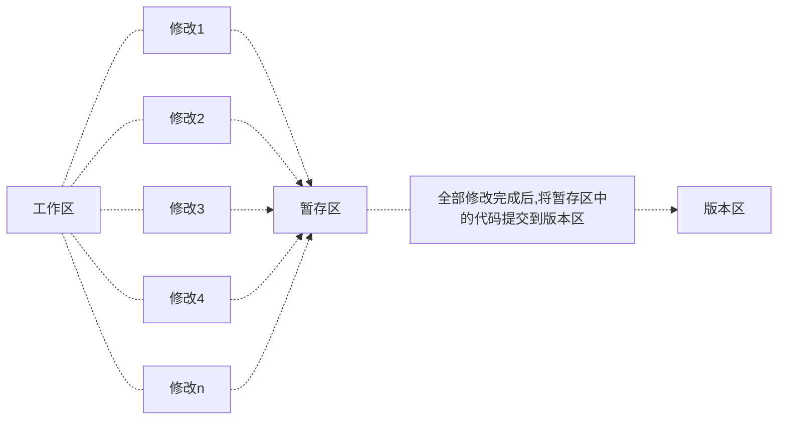

[toc]

# Linux基础课-5.1 git

> 首先声明一点，学习git的方式和tmux、vim那种零散的学习方式不同，git必须要==系统==的学习，否则学了跟没学没什么区别，==切忌现学现查==
>
> 系统学习！！！！


## git宏观认识

> 简单来说，<u>git就是一个很方便的用来管理各种代码版本的工具</u>，使用一个==树结构==来管理各种代码版本，从一个最原始的起点开始，每一个节点都代表代码的不同版本，而每一个节点可以延伸出多个不同的分支，还能快速实现不同分支之间相互合并的操作+回滚操作（回复到之前的节点）
>
> git就是代码版本的一颗树，每一次修改代码，都会在原有的基础上延伸出一个新的节点，git就是版本的大集合
>
> 自己一个人开发项目的话，可能一两个分支就够用了（主要用的是git的版本回退操作）
>
> 而团队开发项目的话，git的==分支合并==功能和==版本回退==功能就都非常重要了
>
> PLUS：注意git和github完全是两个不同的概念，git版本管理是完全位于本地的，只能说github可以使用git来管理github。

### What is git used for？

#### 功能1：版本回退

> 比方我们正在写一个贼大项目的代码，代码一写就是好几个月，一开始搭了一个模块1.0，欸，不太好用，就想着怎么去优化优化它，优化完了之后成了模块2.0、模块3.0.....模块n.0，结果有一天，突然发现这模块不得劲儿了，得想办法找会初始版本1.0，这咋办嘞，总不能继续删删改改改回原来的版本吧（这样非常非常容易出错，因为你很难记得当时代码的实现逻辑），而这就是git将要做的工作，==版本回退==。
>
> 大致流程图如下......
>
> ```mermaid
> flowchart TB
> moudle1.0--upgrade-->moudle2.0
> moudle1.0--run-->B{Accept!}
> moudle2.0--run-->A{Error!}
> A-.-git-.->moudle1.0
> ```

#### 功能2：分支合并

> 同样是在开发一个项目，三个人分别负责开发不同的三个模块，终于开发完成了，那么要怎么将那么多代码合并到一起呢，如果只是通过文件的方法（人工的对模块代码进行比对合并），那会非常麻烦，而这就涉及到了git的第二个功能：==分支合并==。

### git中的基本概念

> 对于git仓库的介绍

|                            工作区                            |                            暂存区                            |                            版本区                            |                 版本结构                 |                           HEAD指针                           |
| :----------------------------------------------------------: | :----------------------------------------------------------: | :----------------------------------------------------------: | :--------------------------------------: | :----------------------------------------------------------: |
| 仓库的目录，工作区是独立于各个分支的（就是你当前的工作目录，独立是说所有分支的工作区都是同一个，和分支没关系），就是用户编写的代码文件，所有的文件操作均在工作区中完成 | 数据暂时存放的区域，类似于工作区写入版本库前的缓存区，暂存区是独立于各个分支的（就像一个缓冲区） | 存放所有的已经提交到本地仓库的代码版本，以版本结构的形式存储所有提交的代码版本（是真正进行项目发布的版本） | 树结构，树中的每一个节点代表一个代码版本 | 版本区的指针，每次只会指向版本树结构的一个子节点，每次将暂存区中的代码提交到版本区，实际上就==类似一个插入链表的过程==，<u>创建一个新的节点，再将当前 的HEAD指针的next指向新节点，最后将HEAD指向新节点</u> |

<font color="red">红色代表工作区已修改的还没提交到暂存区的文件修改</font>

<font color="green">绿色代表以及提交到暂存区的修改</font>

---

**一般利用git开发项目的流程**



## git具体操作

> 我们以一个具体的实例来理解git的各种操作

### 创建账户

> 创建完后会发现家目录下多了一个.gitconfig文件，里面存放的就是git的相关配置

```shell
git config --global user.name wwt # 设置用户名
git config --global user.email 1270414897@qq.com # 设置邮箱
```

## 创建仓库

首先我们创建一个普普通通的project文件夹`mkdir project`，此时它还是一个普通的文件夹，和git沾不上边

然后我们进入project，执行git仓库初始化指令

```shell
cd project
git init
```


此时我们已经创建了一个空的仓库project了，而所有的信息都被隐藏到了一个==.git==文件夹里，我们可以进入仓库康康，比方说我们看一下HEAD文件的内容（存放指针指向）

```shell
cat HEAD
```


大概意思就是此时HEAD指针指向了当前的master分支传递

## git仓库基本操作流程

创建完一个仓库后干啥呢，当然是写说明文档了，所以我们直接`vim readme.md`，写了一个说明文档

此时仓库新增了文件，让我们来看看仓库的状态

```shell
git status
```


大致意思就是：当前目录（工作区）下又一个已修改的文件没有被存放到暂存区里

此时可以使用`git add readme.md`将文件放入暂存区里，放完之后是这样的。

```shell
git add readme.md
git status
```


觉得差不多可以了，准备提交项目版本1.0

```shell
git commit -m "commit project1.0" # -m后面放置对于你提交版本的说明，方便与你一起合作的开发者理解
```

**这就是最最基本的git操作**

---

## git仓库进阶操作

1. `git diff xx`：用于查看**工作区**的xx文件相对于**暂存区**修改了那些内容

2. `git restore xx`：**撤销工作区**对xx文件所作的修改（实际上是将暂存区中的文件内容回滚到工作区，如果暂存区中不存在内容，则将版本区HEAD指向的版本回滚到工作区）

3. `git restore --staged xx`：撤销提交到暂存区的xx文件，但是不撤销工作区所作的修改

4. `git rm --cached xx`：将文件从仓库索引目录中删掉（貌似是舍弃了对其的管理？不太理解）

5. `git log`：查看**当前分支**的所有历史版本（当前分支的含义就是指从**根节点走到当前节点的所有节点版本**）

6. `git log --pretty=oneline`：和上面指令一样，只不过将每条结果改为一行显示

7. `git reset --hard HEAD^`或者`git reset --hard HEAD~`：将版本库向上回滚一个版本，但是注意不会将版本的内容删除（可以理解为只是指针的移动），此时工作区被修改

   - `git reset --hard HEAD^^`：向上回滚两次，一次类推

   - `git reset --hard HEAD~100`：往上回滚100个版本

   - `git reset --hard 版本号`：可以回退到任意版本，版本号可以通过`git reflog`查看

     

6. `git reflog`：查看HEAD指针的**移动历史**（包括被回滚的版本）

## git仓库高级操作

> 也不能说是高级操作吧，稍微具体一点应该说是git在云端的操作
>
> 此时我们的所有文件修改都存储在本地的.git文件夹下，但是万一哪一天本地的电脑硬盘突然挂了呢，那不是直接GG，下面就来教大家如何将git版本库push到云端。

### 云端的选择

>  一般来说，大家用的都是Github，但是最近几年github的网络实在是不太稳定，甚至会出现自己存储在云端的代码pull不下来的情况，所以本课程采用的是一个部署在国内的Gitlab——[AC Git](git.acwing.com)

<u>云端仓库基本创建设置</u>：注意如果本地以及有一个现成的项目想要push到云端，最后一项切记不要勾选


### git云端操作

> 鉴于之前在本地仓库已经完成了基本的操作，现在只需要将本地仓库和云端创建的仓库对应起来即可

1. `cd到本地仓库文件夹`
2. 使用远程仓库给你的指令（这一步的目的是将本地的仓库和远程仓库连接）：`git remote add origin git@git.acwing.com:a_little_buaaer/project_test.git`
3. 上传本地文件夹：`git push -u origin master`（master是本地分支）

这样就完成了本地和云端仓库的同步，可以通过云端的历史查看往期的各种版本

==云端==


==本地==


> 此时发现已经相互对应了起来，🐂🍺
>
> 而且在云端要到查看某个版本更加容易，所以云端可以作为浏览代码的各种版本的工具

选择`浏览文件`即可


PLUS：如果要删除本地仓库，请执行`rm project -rf`，加上`f`是为了提高权限

---

> 假设你换了一台全新的电脑，本地仓库啥的全都丢失了，这时就需要使用`git clone`命令来下载云端仓库到本地。

1. 使用ssh克隆（本质实际上就是scp文件传输）：`git clone git@git.acwing.com:a_little_buaaer/project_test.git`
2. 使用http克隆（同上，不多说）

可以发现，尽管文件是和云端仓库完全同步了，但是实际上还是存在不同（所有版本管理记录都丢失了，但是所有版本节点还是有的）


## git分支

> 个人开发：一般只会在主分支上开发，这时一般不会用到git分支相关的内容
>
> 团队/多人开发：一般会开辟一个新的分支，而不会直接在主分支上开发
>
> 

1. 创建分支：`git checkout -b branch_name`，即可在当前节点创建一个新的分支

2. 查看分支：`git branch`，可以查看当前创建的所有分支，`*`指向的是当前所在的分支

   

3. 切换分支：`git checkout branch_name`注意，此时工作区中的内容也同样被修改为HEAD指向的版本区的内容

4. 合并分支：`git merge branch_name`，可以将branch_name分支的最新版本合并到当前分支的当前节点上

   对于仓库内的`readme.md`文件

   合并前

   

   合并后

   

   但是其实这个合并只是快速合并，并没有产生复制，只是将节点指向了合并过来的版本（不过也不用纠结那么多.......）

5. 删除分支：`git branch -d branch_name`
