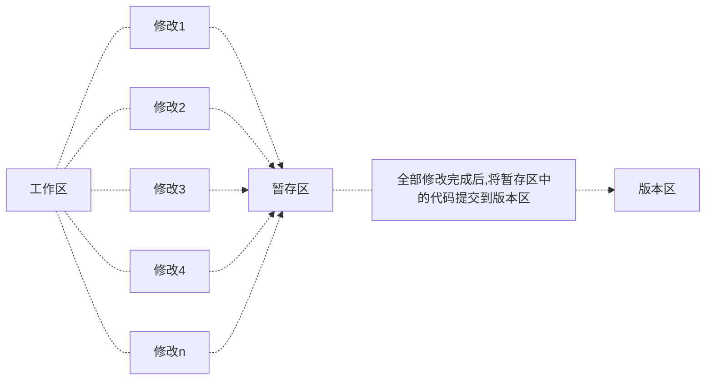
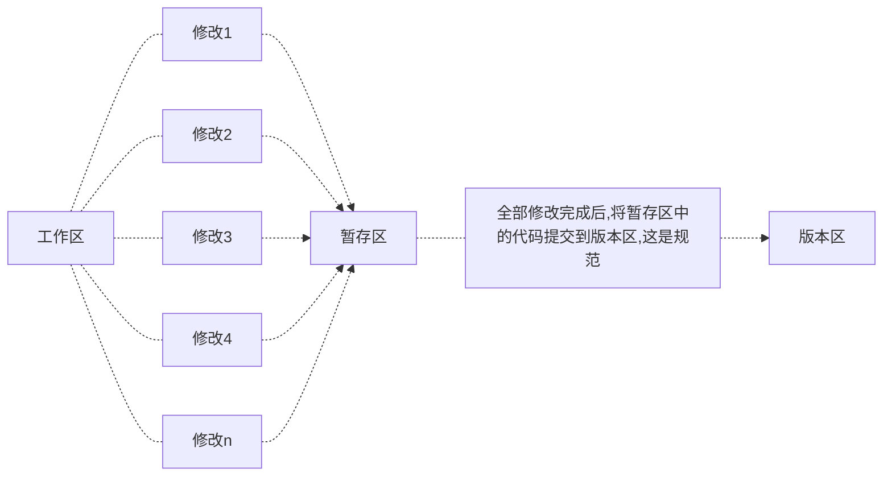

[toc]

# Linux基础课-5.1 git

> 首先声明，学习git的方式和tmux、vim那种零散的学习方式不同，git必须要==系统==的学习，否则学了跟没学没什么区别，==切忌现学现查==
>
> 系统学习！！！！

## git宏观认识

> 简单来说，<u>git就是一个很方便的用来管理各种代码版本的工具</u>，使用一个==树结构==来管理各种代码版本，从一个最原始的起点开始，**每一个节点都代表代码的不同版本**，而每一个节点可以延伸出多个不同的分支，还能快速实现不同分支之间相互合并的操作+回滚操作（回复到之前的节点/版本）
>
> git就是代码版本的一颗树，每一次修改代码，都会在原有的基础上延伸出一个新的节点，git就是版本的大集合
>
> 自己一个人开发项目的话，可能一两个分支就够用了（主要用的是git的版本回退操作）
>
> 而团队开发项目的话，git的==分支合并==功能和==版本回退==功能就都非常重要了
>
> *<font color="green">Ps:</font>注意git和github完全是两个不同的概念，git版本管理是完全位于本地的，只能说github内置了git来管理仓库。*

### What is git used for？

#### 功能1：版本回退

> 比方我们正在写一个贼大项目的代码，代码一写就是好几个月，一开始搭了一个模块1.0，欸，不太好用，就想着怎么去优化优化它，优化完了之后成了模块2.0、模块3.0.....模块n.0，结果有一天，突然发现这模块不得劲儿了，得想办法找会初始版本1.0，这咋办嘞，总不能继续删删改改改回原来的版本吧（这样非常非常容易出错，因为你很难记得当时代码的实现逻辑），而这就是git将要做的工作，==版本回退==。
>
> 大致流程图如下......
>
> ```mermaid
> flowchart TB
> moudle1.0--upgrade-->moudle2.0
> moudle1.0--run-->B{Accept!}
> moudle2.0--run-->A{Error!}
> A-.-git-.->moudle1.0
> ```

#### 功能2：分支合并

> 同样是在开发一个项目，三个人分别负责开发不同的三个模块，终于开发完成了，那么要怎么将那么多代码合并到一起呢，如果只是通过文件的方法（人工的对模块代码进行比对合并），那会非常麻烦，而这就涉及到了git的第二个功能：==分支合并==。

### git中的基本概念

> 对于git仓库的介绍

|                            工作区                            |                            暂存区                            |                            版本区                            |                 版本结构                 |                           HEAD指针                           |
| :----------------------------------------------------------: | :----------------------------------------------------------: | :----------------------------------------------------------: | :--------------------------------------: | :----------------------------------------------------------: |
| 仓库的目录，工作区是独立于各个分支的（就是你当前的工作目录，独立是说所有分支的工作区都是同一个，和分支没关系），就是用户编写的代码文件，所有的文件操作均在工作区中完成 | 数据暂时存放的区域，类似于工作区写入版本库前的缓存区，暂存区是独立于各个分支的（就像一个缓冲区） | 存放所有的已经提交到本地仓库的代码版本，以版本结构的形式存储所有提交的代码版本（是真正进行项目发布的版本） | 树结构，树中的每一个节点代表一个代码版本 | 版本区的指针，每次只会指向版本树结构的一个子节点，每次将暂存区中的代码提交到版本区，实际上就==类似一个插入链表的过程==，<u>创建一个新的节点，再将当前 的HEAD指针的next指向新节点，最后将HEAD指向新节点</u> |

>  关于git文件状态

<font color="red">红色代表工作区已修改的还没提交到暂存区的文件修改（modified），或者是未跟踪的某个文件的变化（untracked）</font>

<font color="green">绿色代表以及提交到暂存区的修改（staged）</font>

---

**一般利用git开发项目的流程**



## git具体操作

### 创建账户

> 创建完后会发现家目录下多了一个.gitconfig文件，里面存放的就是git的相关配置

```shell
# 我个人的git设置如下
git config --global user.name wwt-13 # 设置用户名
git config --global user.email 1270414897@qq.com # 设置邮箱
```

## 创建仓库

首先我们创建一个普普通通的project文件夹`mkdir project`，此时它还是一个普通的文件夹，和git沾不上边

然后我们进入project，执行git仓库初始化指令

```shell
cd project
git init
```

此时已经创建了一个空的仓库project了，而所有的信息都被隐藏到了一个==.git==文件夹里

## git仓库基本操作流程

创建完一个仓库后干啥呢，当然是写说明文档了，所以直接`vim readme.md`，写了一个说明文档

此时仓库新增了文件，看看仓库的状态

```shell
git status
```


大致意思就是：当前目录（工作区）下有一个已修改的文件没有被存放到暂存区里

此时可以使用`git add readme.md`将文件放入暂存区里，放完之后是这样的（可以思考一下之前画的那幅图，此时一个修改被提交到暂存区）。

再贴一遍




```shell
git add readme.md
git status
```


如果觉得差不多可以了，那么就准备提交项目版本1.0吧！

```shell
git commit -m "commit project1.0" # -m后面放置对于你提交版本的说明，方便与你一起合作的开发者理解
```

**这就是最最基本的git操作**

---

## git-标签

> 像其他版本控制系统（VCS）一样，Git 可以给仓库历史中的某一个提交打上标签，以示重要。 比较有代表性的是人们会使用这个功能来**标记发布结点**（ `v1.0` 、 `v2.0` 等等）

在Git中，有两种标签，轻量标签（lightweight）与附注标签（annotated，具有标签注释）

创建附注标签非常简单，只需要在添加tag的时候加上`-a`即可

```shell
# 创建轻量标签
git tag v1.3
# -m后面跟随的是标签注释
git tag -a v1.4 -m "My Project v1.4"
```

### 常用命令

- 查看所有标签`git tag`
- 查看某个具体标签`git show <tag name>`
- 给某个过往版本打上标签`git tag -a v1.2 <commit id>`
- 删除标签`git tag -d <tag name>`

### 远程仓库命令

> *<font color="red">Attention:</font>直接git push不会提交本地仓库的标签，需要执行额外的指令提交标签，并且相应的标签删除也是如此（当然他人拉去你的仓库是可以得到远程仓库的标签的）*

- 提交本地仓库的所有标签`git push origin --tags`
- 删除远程仓库的特定标签`git push origin --delete <tagname>`

## git仓库进阶操作

> 这块内容可能记得不是很详细（没配图文说明（懒）），建议实际操作一下

1. `git diff xx`：用于查看**工作区**的xx文件相对于**暂存区**修改了那些内容

2. `git restore xx`：**撤销工作区**对xx文件所作的修改（实际上是**将暂存区中的文件内容回滚到工作区**，如果暂存区中不存在内容，则将版本区HEAD指向的版本回滚到工作区）

3. `git restore --staged xx`：撤销提交到暂存区的xx文件，但是不撤销工作区所作的修改

4. `git rm --cached xx`：将文件从仓库索引目录中删掉（貌似是舍弃了对其的管理？不太理解），感觉从现在看来和指令3基本同理

5. `git log`：查看**当前分支**的所有历史版本（当前分支的含义就是指从**根节点走到当前节点的所有节点版本**）

6. `git log --pretty=oneline`：和上面指令一样，只不过将每条结果改为**一行**显示

7. `git reset --hard HEAD^`或者`git reset --hard HEAD~`：将版本库向上回滚一个版本，但是注意不会将版本的内容删除（可以理解为只是指针的移动），此时工作区被修改

   - `git reset --hard HEAD^^`：向上回滚两次，以此类推

   - `git reset --hard HEAD~100`：往上回滚100个版本

   - `git reset --hard 版本号`：可以回退到任意版本，版本号可以通过`git reflog`查看

8. `git reflog`：查看HEAD指针的**移动历史**（包括被回滚的版本）

## git仓库高级操作

> 也不能说是高级操作吧，稍微具体一点应该说是git在云端的操作
>
> 此时所有文件修改都存储在本地的.git文件夹下，但是万一哪一天本地的电脑硬盘突然挂了呢，那不是直接GG，下面就来康康如何将git版本库push到云端。

### 云端的选择

>  一般来说，大家用的都是Github，但是最近几年github的网络实在是不太稳定，甚至会出现自己存储在云端的代码pull不下来的情况，所以本人采用的是一个部署在国内的Gitlab——[AC Git](git.acwing.com)（就是AcWing建的专属git，和我们学校的是一个原理）
>
>  *<font color="green">Ps:</font>现在采用的是Github——2022.7.22*

<u>云端仓库基本创建设置</u>：注意如果本地以及有一个现成的项目想要push到云端，最后一项切记不要勾选（就是不要在云端创建README.md）


### git云端操作

> 鉴于之前在本地仓库已经完成了基本的操作，现在只需要将本地仓库和云端创建的仓库对应起来即可

1. `cd到本地仓库文件夹`

2. 使用远程仓库给你的指令（这一步的目的是将本地的仓库和远程仓库连接）：`git remote add origin git@git.acwing.com:a_little_buaaer/project_test.git`

3. 上传本地文件夹：`git push -u origin master`（master是本地分支，注意只有第一次需要加上-u）

   如果是新电脑上传的话需要先在GitHub添加ssh公钥后才能提交，具体操作见<a href="./Linux基础课-4.1 SSH.md">SSH公钥</a>

这样就完成了本地和云端仓库的同步，可以通过云端的历史查看往期的各种版本

==云端==


==本地==


> 此时发现已经相互对应了起来，🐂🍺
>
> 而且在云端要到查看某个版本更加容易，所以云端可以作为浏览代码的各种版本的工具，直接选择`浏览文件`即可

*<font color="green">Ps:</font>如果要删除本地仓库，请执行`rm project -rf`，加上`f`是为了提高权限*

---

> 假设你换了一台全新的电脑，本地仓库啥的全都丢失了，这时就需要使用`git clone`命令来下载云端仓库到本地。

1. 使用ssh克隆（本质实际上就是scp文件传输）：`git clone git@git.acwing.com:a_little_buaaer/project_test.git`
2. 使用http克隆（同上，不多说）

可以发现，尽管文件是和云端仓库完全同步了，但是实际上还是存在不同（所有版本管理记录都丢失了，也就是说git reflog只能查看到最新的git clone分支，*所有版本节点还是有的，但是修改记录丢失*）

### 解决本地git clone速度慢的问题

> 原理暂时不清楚，直接按照教程说的做好了

1. 查询GitHub网页ip

   ```shell
   nslookup github.global.ssl.fastly.Net
   nslookup github.com
   ```

   

   

2. 修改hosts文件

   ```shell
   sudo vim /etc/hosts
   103.252.115.153 github.global.ssl.fastly.Net
   20.205.243.166 github.com
   ```

3. 更新DNS缓存命令

   ```shell
   sudo dscacheutil -flushcache
   ```

-----

> 以下部分为多人开发需要掌握的，以后再来复习

## git分支

> 个人开发：一般只会在主分支上开发，这时一般不会用到git分支相关的内容
>
> 团队/多人开发：一般会开辟一个新的分支，而不会直接在主分支上开发
>
> 
>
> Plus1：注意暂存区是和各个分支独立的，只有commit后才会提交到当前分支
>
> Plus2：个人开发常用指令，git add/commit/push/pull

1. 创建分支：`git checkout -b branch_name`，即可在当前节点**创建**一个新的分支

1. 切换分支：`git checkout branch_name`注意，此时工作区中的内容也同样被修改为HEAD指向的版本区的内容

3. 查看所有分支：`git branch`，可以查看当前创建的所有分支，`*`指向的是当前所在的分支

   

4. 合并分支：`git merge branch_name`，可以将branch_name分支的最新版本合并到当前分支的当前节点上（无冲突的话顺利合并，冲突的话需要解决冲突）

   对于仓库内的`readme.md`文件

   合并前

   

   合并后

   

   但是其实这个合并只是快速合并，并没有产生复制，只是将节点直接指向了合并过来的版本（不过也不用纠结那么多.......）

5. 删除分支：`git branch -d branch_name`（快速复制的话，就相当于直接过继节点）

6. 分支冲突：很多时候，分支合并的时候会出现分支冲突，比方以test.cpp为例

   ```mermaid
   flowchart LR
   HEAD_pre-->HEAD:添加了888
   HEAD_pre-->dev:添加了777
   ```

   此时将master分支和dev分支合并，就会出现分支冲突

   此时再执行`git merge dev`，就会出现如下画面

   

   显示**自动合并失败，请手动调整冲突并提交结果**

   此时可以进入test.cpp查看具体冲突因素

   

   HEAD表示当前分支的内容，dev表示合并分支的内容，此时你需要修改冲突

7. 将本地其他分支同步到云端：

   1. 首先`git branch branch_name`到所需分支，再使用`git push`（git push是自动将当前分支上传到云端已连接的仓库）

      

      显示：当前分支并不存在云端分支，所以需要使用以下指令再云端创建dev分支并提交dev分支

   2. `git push --set-upstream origin dev`：提交成功

      

### 多人开发问题

> 多人合作的时候，所有人都位于不同的服务器下，所以如果要共同合作同一个项目，都需要将服务器的公钥传输到云端
>
> 生成公钥：直接`cd .ssh`然后`ssh-keygen`即可

然后直接使用`git clone`即可从云端克隆下所需项目（注意，*一般只会clone下master分支*）

那么如何另其他分支也和云端同步呢

1. 在本地新建一个和云端名字一样的分支：`git checkout -b branch_name`
2. 将云端分支同步到本地，`git branch --set-upstream-to=origin/branch_name1 branch_name2`：将远程的branch_name1分支与本地的branch_name2分支对应

好了现在甲和乙都clone了云端的dev分支，并且同时开始编辑readme.txt文件

1. 甲添加了`iii`，并且commit了一个新的版本`iii`，最终push到了云端的dev分支，push成功了！

2. 乙添加了`jjj`，并且commit了一个新的版本`jjj`，此时他也想将自己的修改push上去，但是直接报错，显示当前提交的版本和云端存在冲突，需要先`git pull`下来再进行冲突处理

   

3. 乙使用了`git pull`，下面是具体冲突显示，HEAD下面表示本机所作的修改，另外一部分只其他人做的修改

   

   解决冲突后，push成功

   

## git指令补充

### Git配置

- `git config --list`显示当前的Git配置
- `git config -e --global`编辑当前的Git配置文件（全局）

### 工作区$\leftrightarrow$暂存区

- `git mv origin_file modified_file`修改文件名并将这个修改放入暂存区
- `git commit -v`提交到工作区的时候显示所有diff信息（工作区和暂存区的差异，我的评价是：没啥用🤔）

### 工作区$\leftrightarrow$版本区

- `git commit -a -m "add sth"`直接将工作区中的修改提交到版本区

### 分支

- `git branch -r`列举出所有的远程分支

- `git cherry-pick <commit>`选择一个commit**提交的修改**，合并到当前分支。（注意是分支的修改！！！）

  假如我需要cherry-pick一个分支的修改到当前分支，但是被合并的分支是**merge分支**（也就是说**此时会产生歧义**，你到底是要应用主分支的修改呢还是merge来源分支的修改呢），所以此时需要指定修改来源，`-m`来指定，`1`代表主分支，`2`代表merge来源分支

  **产生冲突**

  > 如果操作过程中发生代码冲突，Cherry pick 会停下来，让用户决定如何继续操作。

  1. `git add.`+`git cherry-pick --continue`

     用户解决冲突后，使用--continue让cherry-pick继续进行

  2. `--abort`

     发生代码冲突后，放弃合并，返回操作前的样子

  3. `--quit`
     退出cherry pick但是不会到操作前的样子

- `git push origin --delete branch_name`删除远程分支

#### 分支跟踪

> 从远程分支分出来的分支都是跟踪分支，当对该分支进行push和pull的时候，如果**本地分支**和**远程分支**<u>同名</u>，git就会知道需要推送到哪个远程分支。
>
> 其实每次clone一个仓库的时候，本地都会新建一个master分支来track远程的origin/master分支

*<u>分支跟踪使用的两种情况</u>*

1. <font color="orange">本地新建了一个分支但是远程没有</font>

   ```shell
   git push --set-upstream origin branch_name
   ```

   此时会在远程自动创建一个branch_name分支，并且本地的branch_name分支会自动**track**该分支，此时便可以通过`git push`和`git pull`自动同步了

2. <font color="brown">远程新建了一个分支但是本地没有</font>

   - `git checkout --track origin/branch_name`
   - `git checkout branch_name`

   以上两种方法应该是等效的

## 关于解决git冲突的高级操作

> 实验指导书：[git stash解决git pull冲突](http://www.01happy.com/git-resolve-conflicts/)

## 关于练习使用git的网站

> 实验指导书：[GitHug](https://github.com/Gazler/githug)

## 关于OS实验课的分支说明

**labx**

这是我们提交实验代码的分支，这个分支不需要我们手动创建。当写好代码提交到服务器上后，在该次实验结束后，使用后面提到的可获取到新的实验分支，到时只需要使用git checkout labx即可进行新的实验。

```shell
git checkout lab0
```

**labx-exam laxb-extra**

这是我们周一小测实验的分支，每次需要使用 git branch 指令将刚完成的实验分支拷贝一份到对应分支下，并进行小测代码的填写。

```shell
git checkout -b branch_name # 创建分支即可默认拷贝
git push origin branch_name # git push即可将本地分支提交到云端分支(云端自动创建)
```

**labx-result**

这是我们每次实验结果的分支，每次的实验结果将会在该分支工作区的 **log** 文件夹下，数字越大代表检测的时间越近。测试下方Summary : Number (in 100)，只要Number >= 60即算作通过本次实验。

# 一个学习Git操作的可视化网站

[visualizing-git](https://git-school.github.io/visualizing-git/)
