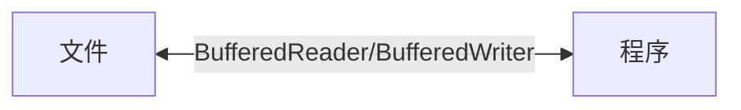

# IO流原理以及流分类

-   按操作数据单位不同分为：字节流（8bit，*对于二进制文件可以保证无损操作*）、字符流（按字符，一个字符对应的字节数有文件编码决定，*适合操作文本文件*）
-   按数据流向分为：输入流、输出流
-   按流的角色不同分为：节点流、处理流/包装流

| （==抽象==基类） |    字节流    | 字符流 |
| :--------------: | :----------: | :----: |
|    **输入流**    | InputStream  | Reader |
|    **输出流**    | OutputStream | Writer |

1.   Java的IO流共涉及40多个类，但是非常规则，都是由如上4个抽象基类派生而来的
2.   由这四个类派生出来的子类名称都是以其父类名作为子类名的后缀


流可以理解为文件数据交通工具（或者说文件处理工具）

## 节点流和处理流

-   节点流：从一个==特定的数据源==读写数据

-   处理流（别名包装流）：是==“连接”在已存在的流（节点流/处理流）之上，数据源不是固定的==，为程序提供更为强大的读写功能，比如BufferedReader、BufferedWriter等

    1.   处理流包装了节点流，既可以消除不同节点流的实现差异，也可以提供更方便的方法完成输入输出

    2.   处理流对节点流进行了包装，使用了修饰器涉及模式，不会直接与数据源相连

*节点流、处理流一览图*


什么是处理流（以BufferedReader为例）？？



BufferedReader的源码如下


>   可以看出，BufferedReader类中，包含了属性Reader类，也就是说*BufferedReader类关联Reader类*，即可以**封装一个节点流**，该节点流可以是任意的Reader子类。

处理流的优势

1.   性能的提高：主要以增加缓冲的方式来提高输入输出的效率
2.   操作的便捷：处理流可能提供了一系列便捷的方法来一次输入输出大批量的数据，使用更加灵活方便

## 对象流

>   ObjectInputStream和ObjectOutputStream（同样也是处理流，只需要传入InputStream的子类即可）
>
>   看需求
>
>   1.   将`int num=100;`这个int数据保存到文件中，注意不是100这个数字，而是`int 100`，并且要求要能够从文件中直接恢复`int 100`
>   2.   将`Dog dog=new Dog("小黄",3)`这个dog对象保存到文件中，并且能够从文件中恢复
>
>   上面的要求，就是能够将*基本数据类型*或者*对象*进行==序列化==和==反序列化==操作

**序列化和反序列化**

1.   序列化就是在保存数据的时候，保存数据的值和数据类型

2.   反序列化就是在恢复数据的时候，回复数据的值和数据类型

3.   需要让某个对象支持序列化机制，则必须让其类是可序列化的，为了让某个类是可序列化的，该类必须实现如下两个接口之一

     -   `Serializable`（推荐，因为这是一个标记接口，里面没有任何方法）

         ```java
         public interface Serializable {}
         ```

     -   `Externalizable`（该接口有方法需要实现，一次一般选择Serializable接口来实现）

注意序列化的属性不包括static和transient修饰的成员

序列化中涉及到的类也必须实现serializable接口

## 转换流

>   将字节流转换为字符流（通过指定编码方式解决！）

==用于解决文件乱码问题==

## 打印流

>   PrintStream、PrintWriter
>
>   打印流只有输出流
>
>   输出位置不局限于屏幕，可以打印到各种地方

