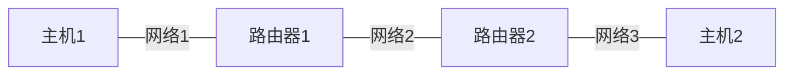

# 网络的相关概念

**网络通信**

>   概念：两台设备之间通过网络实现数据传输
>
>   *java.net*包下提供了一系列的类或接口，供程序员使用，完成网络通信
>
>   （下面是简易示例）



**网络**

>   概念：两台或者多台设备通过一定的物理设备连接起来构成了网络
>
>   根据网络的覆盖范围不同，对网络进行分类
>
>   -   局域网：覆盖范围小，仅覆盖一个教室或机房
>   -   城域网：覆盖范围大，可覆盖一个城市
>   -   广域网：覆盖范围最大，可以覆盖全国，甚至全球，*万维网是广域网的代表*

**ip地址**

>   概念：用于唯一标识计算机在网络中的地址
>
>   查看ip地址指令`ipconfig`
>
>   ip地址的表现形式（ipv4模式）：*点分十进制*`xx.xx.xx.xx`（每个十进制数的范围0-255）
>
>   
>
>   ip地址的组成：网络地址+主机在该网络中的地址<font color="red">192.168</font>.<font color="green">16.99  </font>
>
>   ipv6和ipv4基本一致，出现ipv6的原因就是为了*解决网络地址资源的数量问题*和*非主机设备接入网络地址的问题*
>
>   ipv4地址分类（非重点）
>
>   |   种类   |        结构（二进制）        |           范围            |
>   | :------: | :--------------------------: | :-----------------------: |
>   |    A     |  0-网络号（7）-主机号（24）  |  0.0.0.0~127.255.255.255  |
>   |    B     | 10-网络号（14）-主机号（16） | 128.0.0.0~191.255.255.255 |
>   |    C     | 110-网络号（21）-主机号（8） | 192.0.0.0~223.255.255.255 |
>   |    D     |     1110-多播组号（28）      | 224.0.0.0~239.255.255.255 |
>   |    E     |     11110-留待后用（27）     | 240.0.0.0~247.255.255.255 |
>   | 本机地址 |          127.0.0.1           |                           |
>
>   <u>*必须明确的一点*</u>：做网络编程的时候，必须明确==对方的ip地址==（不然消息发送给谁？）
>
>   本机的ip地址不是固定的是，而是由系统底层协议在每次开机的时候自动分配的（也可以设置为手动分配），属于动态ip
>
>   而对于购买的服务器来说，它们的ip地址就是固定的静态的（比方说百度、淘宝的IP地址）
>
>   ```shell
>   ping www.baidu.com
>   # 180.101.49.11
>   ```

**域名和端口**

>   ip地址：`180.101.49.11`
>
>   域名：`www.baidu.com`
>
>   域名类似于变量名，就是为了方便记忆
>
>   端口号概念：*用于标识计算机上某一个特定的网络程序*（范围0~65535）
>
>   **0~1024端口已被占用**，比如ssh 22、ftp 21、smtp 25、http 80
>
>   常见网络程序端口号如下
>
>   1.   tomcat：8080
>   2.   mysql：3306
>   3.   oracle：1521
>   4.   sqlserver：1433
>
>   一个主机上可以跑很多服务，这些服务又分别被不同的端口监听，如果要访问百度主机提供的*对应服务*，那么本地主机就需要提供`百度主机ip地址+对应服务的端口号`
>
>   <u>不需要与外界网络交互的程序不需要监听端口</u>

**网络通讯协议**

>   在日常的人与人交流中，语言就是一种协议
>
>   而==在网络编程中，程序之间传输数据的组织形式就是网络通讯协议==
>
>   举个简单的例子（现实中的网络传输协议要复杂很多）
>
>   ```java
>   class Message{
>      int id;//发送id
>      String sender;
>      String getter;
>      Date sendTime;
>      String content;
>   }
>   ```
>
>   现实中的网络通讯协议：*TCP/IP*（Transmission Control Protocol/Internet Protocol）（传输控制协议/因特网互联协议）
>
>   该协议是Internet最基本的协议、国际互联网络的基础
>
>   简单来说，就是由网络层的IP协议和传输层的TCP协议组成
>
>   *数据进入协议栈的封装过程（用户获取数据的解包过程就是该过程的逆过程）*
>
>   
>
>   全部数据封装完毕后按照二进制格式通过网络发送到其他主机
>
>   | ==TCP/IP模型==  | TCP/IP模型各层对应的协议  |
>   | :-------------: | :-----------------------: |
>   |     应用层      | HTTP、ftp、telnet、DNS... |
>   |  传输层（TCP）  |        TCP、UDP...        |
>   |  网络层（IP）   |     IP、ICMP、ARP...      |
>   | 物理+数据链路层 |           Link            |
>
>   *注意*：<u>传输层称为TCP层只是因为TCP协议最重要、使用最广泛</u>，实际上除了TCP协议外还有UDP等等协议（其余各层同理）

**TCP和UDP**

>   TCP（传输控制协议）
>
>   1.   使用TCP协议前，须先建立TCP连接，形成传输数据的通道
>   2.   传输前，采用“三次握手”方式，**是可靠的**
>   3.   TCP协议进行通信的两个应用进程：**客户端、服务端**
>   4.   在连接中可进行**大数据量**的传输
>   5.   传输完毕，需释放已建立的连接，**效率低**
>
>   三次握手演示
>
>   客户端发送包
>
>   
>
>   服务端接收包，再向客户端发送包
>
>   
>
>   客户端接受包，再向服务端发送包
>
>   
>
>   三次握手结束后，客户端就可以向服务端发送大量数据
>
>   UDP（用户数据协议）
>
>   1.   **将数据、源、目的封装成数据包，不需要建立连接**
>   2.   每个数据包的**大小限制在64KB以内**，不适合传输大量数据
>   3.   因为无需连接，所以是**不可靠的**（无法保证数据一定能接受）
>   4.   发送数据结束时**无需释放资源**（因为不是面向连接的），**速度快**
>   5.   举例：厕所通知（Tom通知Kim明天上午开会，直接对整个厕所广播，也不管Kim在不在厕所里，并且说完就走）、发短信
