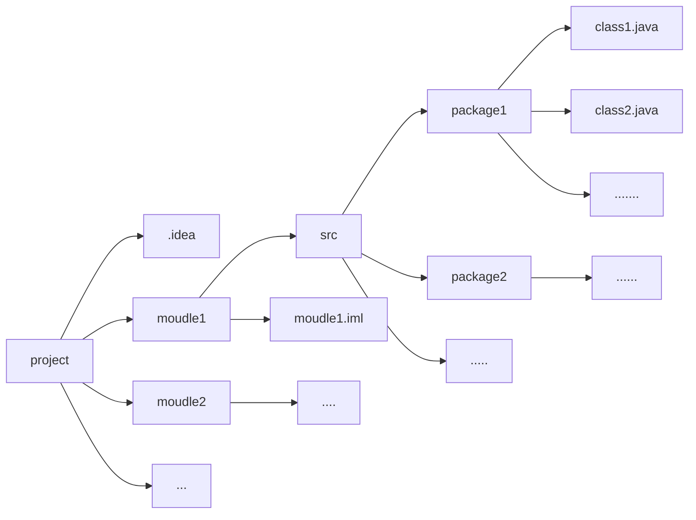
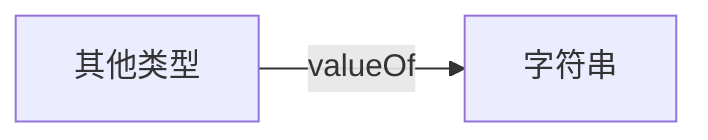

[toc]

# 填坑

<a href="#test">局部变量和成员变量</a>

<a href="#垃圾回收">垃圾回收</a>

<a href="#方法/静态区">方法/静态区</a>

<a href="#常量池">常量池</a>

<a href="#初始化">初始化</a>

<a href="#栈的优势">栈的优势</a> 

 <a href="#序列化">序列化</a> 

# Java基础汇总

## Java概述

> 了解学习一门语言，首先自然需要了解它的相关特性和历史

- Java 编程语言是一种通用的、并行的、基于类的、面向对象的语言
- Java语言是一门**完备的**、面向生产的语言，而非C++/C性质的研究型语言
- Java语言是高层次的，所以它无法用于表示机器层次的细节（Java内置了垃圾回收、内存管理，这些东西一般不需要我们手动调用）
- Java程序具备跨平台性（==code once, run anywhere==）

### JVM、JRE和JDK

1. JVM：Java虚拟机，跨平台性实现的基础，编写的java程序运行在JVM上，而JVM运行在操作系统上（Oracle为不同的操作系统提供了不同的JVM）
2. JRE：java程序的运行环境，包含了**JVM**和java程序运行所需的核心类库（*如果要运行一个已有的java程序，那么安装JRE即可*）
3. JDK：java程序开发工具包，包含了JRE和开发者所需的各种工具（自己开发一个java程序，需要安装JDK）


## 第一个Java程序

> 关于Java环境的配置不多说，这里详细解释一下所写的第一个Java程序`Hello.java`
>
> $Attention:版本Java17,编辑器IDEA$

Java文件`Hello.java`

```java
public class Hello{
    public static void main(String[] args){
        System.out.println("Hello,Java!");
    }//这是注释
}
```

- $Line1$：`public class Hello`

  1. 其中public代表了类Hello的访问权限，此处的public代表该类是**公共**的，可以被项目的任何类所引用（import），常见的访问权限按照权限大小依次有（$public,protected,default,private$）

  2. `class`代表Hello是一个类，可以类比`int a`

  3. `Hello`每个**文件名**必须和该文件中的**公共类名**一致，<font color='red'>$Why?$</font>

     <font color='red'>$Answer$</font>:Java程序是被解释执行的，它在运行的时候并不是将所有的.class文件（java源代码编译后的字节码文件，对于一个.java文件，其中包含几个类，就会编译出几个对应的.class文件）全都放到内存中，而是在遇到import的时候才回去相应的文件路径下查找相应的.class文件。而对于一个**public类**而言，<u>它是可以被项目中的任何一个类import的</u>，此时**将类名和文件名对应就可以方便虚拟机在相应的路径中去查找相应类的信息**（不然开销会很大）。

     当然，如果java源文件中不存在公共类，那么java源文件的命名也确实无所谓（*当然这样设计的话，这个java源文件也就没什么意义了（因为不存在公共的对外接口）*）

  4. 每个java源文件中只能有且最好要有一个public类，该类是这个java源文件的唯一对外公共接口（***这是一种设计上的规范，当然Java的语法也规定了必须这样***）

     > *对于java源文件中各种类的架构要求会在后面进行具体叙述*

- $Line2$:`public static void main(String[] args)`

  1. 同上，public用于修饰main方法的访问权限

  2. `static`用于修饰该方法是静态的，static关键字修改此方法在类中**只有一份**

     《Java编程思想》中的一句话概括了static关键字的含义

     > “static方法就是没有**this**的方法。在static方法内部不能调用非静态方法，反过来是可以的。而且可以在没有创建任何对象的前提下，**仅仅通过类本身来调用static方法**。这实际上正是static方法的主要用途。”

  3. `void`修饰的是该方法返回的变量类型（这个相信有编程基础的都懂）

  4. `main`，main方法在Java公共类中的一个非常特殊的方法，运行Java文件时，main方法是Java程序的**唯一公开接口**（程序**由此开始运行**）。

     > 今天在复习的时候发现，哪怕public类中不存在main入口，Java程序依旧会由非public中的main方法开始执行。（相当神奇，但是自己写项目的时候可不能这样写）

  5. `String[] args`代表的是main方法接受的参数，代表需要传入一个字符串数组，可以类比于C中的`int main(int argc,char *argv)`

- $Line3$:`System.out.prinln(...)`就是Java一个常用的字符串输出函数

Java程序命令行运行（IDEA下的话直接运行即可）

```shell
javac Hello.java # 将Hello.java源文件编译成Hello.class字节码文件
java Hello # 执行字节码文件
```

## IDEA的基本使用

> 这里讲讲Java编辑器——IDEA的基本使用技巧（**个人开发**中常用的）

首先看一下IDEA中Java项目的基本结构



一个项目分为不同的模块，所有代码都存放在各个模块的src文件夹下，src文件夹又有多层嵌套的各种包....（这块不太好解释，总之知道一下就行）

### IDEA快捷键

> 这里讲的快捷键在日常开发中非常常用（并且在JetBrain开发的一套软件里都适用——如果你没改默认快捷键的话）

|     快捷键      |                             功能                             |
| :-------------: | :----------------------------------------------------------: |
|   `Alt+Enter`   | 导入包和自动修正代码（遇到warning、error不会改，上去就是一个Alt+Enter） |
|    `Ctrl+y`     |                     ==删除光标所在的行==                     |
|    `Ctrl+d`     |          ==复制光标所在行，并复制到光标所在行下面==          |
|  `Ctrl+Alt+l`   |                        ==格式化代码==                        |
|    `Ctrl+/`     |                        注释/取消注释                         |
| `Ctrl+Shift+/`  |                    多行注释/取消多行注释                     |
|    `Alt+Ins`    |                         自动生成代码                         |
| `ctrl按住+点击` |                  直接查看所选类/方法的源码                   |
|   `shift+F6`    |                      ==批量修改变量名==                      |
|    `ctrl+f`     |                          文件内搜索                          |
|  `shift+shift`  |                      全局搜索（貌似？）                      |

## Java基础语法

### 修饰符汇总

> 这里先罗列一些Java修饰符的作用，具体细节会到Java面向对象中详细阐述

#### 访问修饰符

> ***用来定义类、方法、变量访问权限***

- $public$：对==所有类==可见。使用对象：类、接口、变量、方法
- $protected$：对==同一包内的类==和==所有子类==可见。使用对象：<u>变量</u>、<u>方法</u>。 **注意：不能修饰类（外部类）**
- $default$：（默认）， 在==同一包==内可见，不使用任何修饰符。使用对象：类、接口、变量、方法。
- $private$：在==同一类==内可见。使用对象：变量、方法。 **注意：不能修饰类（外部类）**

#### 非访问修饰符

> 为了实现一些其他的功能，Java也提供了许多非访问修饰符

- $static$：static 关键字用来声明独立于对象的静态变量，无论一个类实例化多少对象，它的静态变量只有一份拷贝
- $final$：final 表示"最后的、最终的"含义，变量一旦赋值后，不能被重新赋值。被 final 修饰的实例变量必须显式指定初始值
- $abstract$：抽象类不能用来实例化对象，声明抽象类的唯一目的是为了将来对该类进行扩充
- $synchronized和volatile$：主要用于线程的编程

### Java语法糖

> 注：这里所说的语法糖适用于==Java17==
>
> $Plus:$这里的语法糖是我的个人理解，就是罗列一下我个人觉得比较方便+奇特的Java语法。

#### var

> 自动变量推断关键字，省时省力，等价于C++中的auto关键字

```java
StringBuilder sb=new StringBuilder();
var sb=new StringBuilder();
```

#### foreach

> 实际上就是增强版的for循环，foreach 语句用于循环访问集合以获取所需信息，但**不应用于更改集合内容**以避免产生不可预知的副作用，可以用于遍历对象集合（可以用foreach实现的一定可以通过for循环直接实现）
>
> 具体实现看下面的例子

```java
for(valueType value:valueSet){
    loop body...
}
var array=new int[5]{1,243,24,4,23};
for(int i:array){
    System.out.println(i);
}
```

#### switch

> 注意，这里说的是从Java14起开始支持的**新版Switch语句**

1. 使用`->`
2. 取消了`break`，语法**不再默认具备穿透性**
3. 可以直接**返回值**（也可以通过`yield`返回值），相当于直接集成了一个判断函数

*这里直接举个例子体会下*

```java
import java.util.Scanner;//Java输入读取包
public class SwitchTest{
    public static void main(String[] args){
        var scan=Scanner(System.in);
        String flag=scan.nextLine();
        int opt=switch(flag){
                case "apple"->1;
                case "banana"->23;
                case "orange","fruit"->1234;
                default->{
                    int code=scan.nextInt();
                    yield code*2;
                }//复杂操作采用yield的形式返回
        };
    }
}
```

#### 可变参数

>   Java5中提供了边长参数，允许在调用方法的时候传入不定长度的参数（**本质上还是基于数组实现的**）
>
>   ```java
>   void outPut(int...x);
>   ```

*使用注意事项*

1.   可变参数必须作为函数的最后一个参数（所以方法中最多只能传入一个可变参数）
2.   Java中的可变参数，会被编译器转型为一个数组
3.   长参数在编译为字节码后，在方法签名中就是以数组形态出现的，所以不能作为方法的重载
4.   可变参数可以兼容数组，反之不能

<u>个人感觉可变参数的唯一作用就是减少了一些代码量</u>（但是貌似不是很推荐使用？）

### 基本数据类型

> 这个非常简单，稍微介绍下就可以了

- 整数类型：$byte,short,int,long$
- 浮点数类型：$float,double$
- 字符类型：$char$（特殊，Unicode类型存储，所以需要占用两个字节）
- 布尔类型：$boolean$

关于Java基本数据类型的**占用空间**


#### Attention

1. 使用float类型时，数据需要加上后缀`f`
2. 使用long类型时，数据需要加上后缀`l`

#### 类型转换

- 普通数据类型：直接采用强制类型zhuan'huan

- 规则：数据范围（非字节数）由小转到大

  ```java
  long num=100;
  double num_dou=2.5f;
  float num_flo=100l;//long字节数为8字节，但是它可以转化为4字节的float类型！
  ```

- byte/short/int在进行运算的时候，会先提升为int类型再进行计算，所以得到的值都是int

### 引用数据类型（基础）

> 除开上面提到的八种基本类型，其他的都是引用数据类型（确信
>
> 这里说说几种比较常用的$数组$和$String$
>
> $Plus$:可以使用Java中内置的方法getClass()查看数据类型
>
> ```java
> Integer i=5;
> System.out.println(i.getClass())
> ```

#### 引用数据类型的内存分配

##### 声明

>   引用数据类型的声明并不为对应实例分配内存空间，而只是分配一个==栈上的引用空间==
>
>   ```java
>   String str;
>   classTest test;
>   ```
>
>   

#### 局部变量和成员变量

>   局部变量：这里只类中定义的方法中的局部变量
>
>   成员变量：类的成员变量
>
>   <span name="test">==该部分还需填坑（大修改，这里只是一时兴起创建的）==</span>

1.   定义的位置不同
2.   在内存中的位置不同
     -   成员变量存储在堆内存的对象中
     -   局部变量存储在**栈内存**的方法中
3.   声明周期不同
     -   成员变量随着对象的出现而出现在堆中，随着对象的消失（被gc回收）而从堆中消失
     -   局部变量随着方法的运行而出现在栈中，随着方法的弹栈而消失
4.   初始化不同
     -   成员变量因为在堆内存中，所有成员变量具有默认的初始化值
     -   局部变量没有默认的初始化值，必须手动的给其赋值才可以使用

#### 数组

> 在Java中内置了各种强大的容器的情况下，$Why\ we\ still\ need\ to\ learn\ 数组？$
>
> - **效率高**，数组是一种效率最高的存储和随机访问对象引用序列的方式
> - 数组可以持有**值类型**，而容器不能（？
>
> <font color='gree'>Java数组的本质还是一个对象</font>

关于数组在内存空间中的存储形式，如图


*创建数组的两种方式*

- 指定数组维度
  - 为数组开辟指定大小的数组维度。
  - 如果数组元素是**基础数据类型**，会将每个元素设为默认值；如果是**引用类型**，元素值为 `null`。
- 不指定数组维度
  - 用花括号中的实际元素初始化数组，数组大小与元素数相同。

```java
int[] array1=new int[2];//此时已开辟内存
int[] array2=new int[]{1,2,3};
```

基本方法：`array.length`用于获取数组的长度

##### 数组拓展：Arrays类

> JDK所提供的$java.util.Arrays$类，包含了常用的数组操作——排序sort、查找binarySearch、填充fill、打印toString、转列表asList、哈希hash等等

1. $Arrays.toString()$打印数组

   ```java
   int[] a = { 1, 2 };
   System.out.println(a); // 打印数组引用的值；[I@119d7047
   System.out.println(Arrays.toString(a)); // 打印数组元素的值；[1,2]
   ```

2. $Arrays.equals(a,b)$比较两个数组是否相同

   输出结果

   

   数组之间的比较需要采用Arrays的equals方法，不能直接采用对象自带的。

3. $Arrays.sort()$数组排序，默认为升序

   ```java
   int[] a={1,2,312,12,4312};
   Arrays.sort(a);
   System.out.println(Arrays.toString(a));
   ```

   如果需要**降序排序**的话，需要实现Comparator接口复写的compare方法，并且必须是包装类（可以类比C++）

   ```java
   package p1;
   
   import java.util.Arrays;
   import java.util.Comparator;
   
   public class SortTest {
       public static void main(String[] args) {
           Integer[] a={12,321,412,3,1,123,413,4};
           Comparator<Integer> cmp=new MyComparator();
           Arrays.sort(a,cmp);
           System.out.println(Arrays.toString(a));
       }
   }
   class MyComparator implements Comparator<Integer>{
       @Override
       public int compare(Integer a,Integer b){
           return b-a;
       }
   }
   ```

4. $Arrays.binarySearch()$二分查找对应元素下标，不存在返回-1

   ```java
   int[] a={1,2,312,124,2134,123};
   Arrays.sort(a);
   System.out.println(Arrays.binarySearch(a,312));
   ```

#### String

> 作为Java中使用最频繁的引用类型，关于String的性能问题却常常被忽略，深入了解其特性，高效的使用字符串，可以提升系统的整体性能
>
> <u>关于String中常用的方法</u>
>
> 

##### String的不可变性

**Java中String类型的基本定义**

```java
public final class String
    implements java.io.Serializable, Comparable<String>, CharSequence {
    /** The value is used for character storage. */
    private final char value[];
```

1. final修饰，表示String类**不可被继承**

2. 数据存储与被final修饰的char[]数组，表示String对象**不可被修改**

3. String类变量一旦声明就不可变；如果赋值，改变的只是指向的地址，原来的字符串依旧存在并且产生垃圾

   

总结：String类是一种不可变对象

#####  字符串基本

> 关于字符串的一些最常用的方法.

```java
String test="01234567890";
test.length();//11
test.indexOf('0');//0
test.lastIndexOf('0');//10
test.charAt(0);//0查看index=0处的字符串，相当于数组的arr[index](注意java字符串不具备下标查看的功能)
```

##### 字符串判断

```java
boolean equals(Object obj);//比较字符串的内容是否相同
boolean equalsIgnoreCase(String str);//忽略大小写
boolean startsWith(String str);//是否以str开头
boolean endsWith(String str);//....结尾
```

##### 字符串转换

```java
char[] toCharArray();//把字符串转换为字符数组
String toLowerCase();//把字符串转换为小写字符串
String toUpperCase();//把字符串转换为大写字符串
```

##### 字符串拼接

- 字符串常量的拼接

  **字符串常量的拼接，编译器会将其优化为一个常量字符串**

  ```java
  String str="a"+"b"+"c";//会直接优化成String str="abc"
  System.out.println("Str="+str);
  ```

- 字符串变量的拼接

  ```java
  String str="";
  for(int i=0;i<100;i++){
      str=str+i;//被优化成str=(new StringBuilder(String.valueOf(str)).append(i).toString)
  }
  ```

  但是每次循环都生成一个`StringBuilder`示例再转化为`string`，这样会大大降低系统的性能

  $正确使用方法$：使用`StringBuilder`的`append`方法替代`+`

##### 字符串-杂

```java
//其他的一些常用方法
String trim();//去除字符串两边的空格
String[] split(String str);//按照传入的指定字符串分割字符串
byte[] getBytes(String charsetName);//使用指定的字符集将字符串编码成byte序列，并将结果存放在一个新的byte数组中(默认的话是使用平台的默认字符集)
```

#### 字符串拓展-编码问题

##### ASCII

共==128==个，使用==一个字节的低7位==来表示

##### ISO8859-1

在ASCII码的基础上涵盖了大多数西欧语言字符，仍然是单字节编码，它总共能表示256个字符

##### GBK

由于ASCII编码不支持中文，因此国人就定义了一套编码规则——GBK

1.   字节小于等于127时，和==ASCII相同编码==
2.   只要第一个字节==大于127==，就固定表示该字节和之后一个字节是一个汉字的开始（双字节代表汉字）

##### Unicode

因为世界上国家很多，如果每个国家都自己定义一套自己的编码，结果导致互相之间谁也不懂谁的编码，无法沟通交流，这是及时的出现了一个组织$ISO(国际标准化组织)$，该组织定义了一套编码方案来解决所有国家之间的沟通交流问题，这套编码方案就叫$Unicode$（更恰当的来说应该不是编码规则而是一套新的字符集）

1.   每个字符必须使用==2个字节==来表示
2.   对于==ASCII码表中的字符，编码不变==，只是将其长度扩展为16位
3.   为每个字符分配一个唯一的ID（码点）

缺点：传输ASCII表中的字符时完全可以使用一个字节表示，这就导致了传输数据比较浪费带宽，存储数据比较浪费硬盘

##### UTF-8

$UTF-8$的诞生就是为了解决上面$Unicode$的缺点。

使用变长编码，使用1-4个字节进行传输和存储数据（具体的转换方式这里就不说了）。

#### 深浅拷贝问题

>   任何编程语言中，都有深浅拷贝的概念
>
>   这里对Java中的深拷贝和浅拷贝做一个详细的解说。
>
>   前置条件：深浅拷贝都是对一个**已有对象**的操作。

##### 概念理解

在Java中，出来*基本数据类型*（元类型）之外，还存在类的实例对象这个引用数据类型，一般使用`=`做赋值操作的时候，对于==基本数据类型==而言，拷贝的是它的**值**，而对于==引用数据类型==而言，拷贝的则是这个**对象的引**用（类比c中的指针赋值，它们依然指向同一个对象）。

而浅拷贝和深拷贝就是在这个基础之上做的区分，如果在拷贝这个对象的时候，只对基本数据类型进行了拷贝，而对引用数据类型只是进行了引用的传递，而没有真实的创建一个新的对象，则认为是浅拷贝。反之，在对引用数据类型进行拷贝的时候，创建了一个新的对象，并且复制其内的成员变量，则认为是深拷贝。

##### Java中的深浅拷贝方法

>   主要讲解Object上的clone()方法

在Java中，所有的类都继承自Object，而在Object上，存在一个clone()方法（被声明为**protected**，而我们所使用的方法都是Object的子类，所以都~~可以使用这个方法~~==必须实现Cloneable接口才能使用这个方法==）

***该方法源码***

```java
protected Object clone() throws CloneNotSupportedException{
    //限制所有调用clone()方法的对象，都必须实现Cloneable接口，否则将抛出CloneNotSupportedException异常
    if(!(this instanceof Cloneable)){
        throw new CloneNotSupportedException("Class "+getClass().getName()+" doesn't implement Cloneable";
    }
    return internalClone();
}
//CLoneable接口
public interface Cloneable{
    //啥也没实现，只是用于指定该对象可以被拷贝的标记
}
```

最终会调用internalClone()方法来完成具体的操作。

internalClone()方法，实际上是一个native方法，可以clone()一个对象得到一个==新的对象实例==。


通过观察输出结果可以看出，`=`和`clone()`的不同之处，clone()确确实实创建了一个新的对象，而`=`则完全是只是对对象的引用（<font color="red">$Attention:$</font>不是浅拷贝！）

>   ==但是此处的clone只是一次浅拷贝的操作==
>
>   可以看下面两幅图来理解一下利用`clone()`实现的浅拷贝和利用`=`实现的对象引用之间的之间的不同之处。
>
>   `=`实现的对象引用
>
>   
>
>   `clone()`方法实现的浅拷贝（指上面实现的浅clone()方法）
>
>   
>
>   注意，这里的浅拷贝和c/c++中的认识一致，基本数据类型是完全拷贝，但是引用数据类型同样还是对象引用。
>
>   <font color="red">$Attention:$</font>如果此时想要访问clone得到的对象的属性和方法的话，必须进行**类型转化**！！！

现在浅拷贝的问题解决了，问题就集中到如何进行==深拷贝==（**在对引用数据类型进行拷贝的时候，创建了一个新的对象，并且复制其内的成员变量**）上了！


==两种方法==

1.   重写`clone()`

     需要将类中定义的所有引用数据类型都去Cloneable接口实现clone()方法

     ```java
     @Override
     protected Father clone() throws CloneNotSupportedException
         //这里使用protected是为了防止子类直接调用父类的方法抛出异常
         return (Father) super.clone();
     }
     @Override
     protected Son clone() throws CloneNotSupportedException {
         Son son= (Son) super.clone();//待返回克隆的对象
         son.name=new String(name);
         son.father=father.clone();
         return son;
     }
     ```

     比较繁琐，但是因为`clone()`是Object类的native方法的缘故使得该方法的速度极快

     这种方法可以实现深拷贝，但是还有一个问题，如果引用的层数太多了怎么办，难道要给每个引用对象重写`clone()`吗🤔（不得累死）？

     

     此时就需要借助一下==序列化==

2.   序列化

     >   <span name="序列化">暂时</span>超出理解范围，等我学学Redits再来看看。

### 类型转换（通用）

> 关于==字符串==类型和其他==基本类型==的通用转换方式

- 要将其他任意基本类型转换为字符串，可以直接使用String通用的静态方法`valueOf()`，编译器会根据传入参数自动选择合适的方法
- 要将字符串转换为其他类型，则需要根据具体情况具体考虑



```java
String.valueOf(123); // "123"
String.valueOf(45.67); // "45.67"
String.valueOf(true); // "true"
String.valueOf(new Object()); // 类似java.lang.Object@636be97c
```

```java
//int包装类Integer
int n1=Integer.parseInt("123");//自动拆箱
int n2=Integer.parseInt("0xff",16);//按照指定的机制转换字符串
//Double等包装类也有类似的parse转换字符串的方法
```

### 基本IO

> 基本IO就是指Java中输入为stdin，输出为stdout的IO，不涉及文件操作

#### input

> 需要使用到的Java类，**Scanner**，该类由正则构造，所以支持正则判断输入输出
>
> ```java
> import java.util.Scanner;//导入Scanner类
> var scan=new Scanner(System.in);//System.in代表从控制台接受输入输出
> var s=new String();
> s.nextLine();//读入一整行数据，回车为终止符
> ```

**常用方法**

1. `next()`等待当前的输入，并读入当前的有效字符（注：next中，空格和回车是无效字符，next()可以理解为读取单词）

   ```java
   public static void main(String[] args) {
       Scanner scan = new Scanner(System.in);
       System.out.print("输入的数据为:" + scan.next());
   }
   ```

   ```markdown
   注："[in]:"后的字符为输入，"[out]:"后的字符为输出。
   用例1
   [in]:hello world
   [out]:输入的数据为:hello
   ---
   用例2
   [in]:   hello world
   [out]:输入的数据为:hello
   ---
   用例3
   [in]:
   
   hello world
   [out]:输入的数据为:hello
   ```

2. `nextLine()`和next()类似，只是会将**空格**作为**有效字符**输入，将回车作为终止符，常用于读取字符串

3. `nextInt()`读取整数

4. `hasNextInt()`判断是否还有整数输入

5. `hasNext()`等待当前输入，常用于循环读入（循环读取单词）

6. `hasNextLine()`和`hasNext()`基本一致（循环读取句子），下面用一个示例来看看二者的区别

   ```java
   //1
   public static void main(String[] args) {
       var scan=new Scanner(System.in);
       while(scan.hasNext()){
           System.out.println(scan.next());
       }
   }
   ```

   ```java
   //2
   public static void main(String[] args) {
       var scan=new Scanner(System.in);
       while(scan.hasNextLine()){
           System.out.println(scan.nextLine());
       }
   }
   ```

   ```markdown
   [in]:   hello world
   [out1]: hello
   [out2]: hello world
   ```

$Thinking$:如何实现完善的循环输入？要求终止字符串为`exit/Exit`

```java
public static void main(String[] args){
    var scan=new Scanner(System.in);
    while(!s.hasNext("exit|Exit")){//等价于定义了特殊终止符exit、Exit
        System.out .println("Your input word is "+scan.next());
    }
}
```

#### output

> 相比于较为复杂的输入，Java中的输出就显得简单很多，常用的只有三个函数

```java
System.out.println();//最常用的输出语句：输出为基本类型时，自动转化为string
//输出为引用类型时，会自动调用对应的toString方法(所以可以通过重写toString()方法来修改输出对象获取的信息)
System.out.print();//和上面相比少了默认的换行
System.out.printf();//格式化输出，类比C
```

**注意**：null是可以被输出的！

```java
public static void main(String[] args) {
    String s = null;
    System.out.println(s);
}//会输出null
```

## Java面向对象

> 面向对象编程，就是一种通过对象，把现实世界映射到计算机模型中去的编程思想。
>
> 具体概念定义不多解释。
>
> $Plus:$**类的成员变量**编译器会给默认值，可以直接使用。 

### 构造函数和this指针

> 构造函数就是在对象被声明时默认会调用的函数，可以被重写
>
> 如果没有显示定义的话会调用默认的无参构造函数，但是一旦声明了有参构造函数，就无法再调用默认的无参构造函数了，此时使用`new A()`，会产生报错
>
> **this指针**就是指向**对象实例**的指针（很多语言都有，注意是实例不是对象！！）
>
> 并且this还可以用来代替本类得到构造函数
>
> - `this(5);//调用类中一个形参的构造函数`

```java
public class A{
    private int id;
    public A(int id){
        this.id=id;//
    }
}
```

### 信息隐藏

> 面向对象中的法则：信息隐藏（类的成员属性只能通过定义公开接口来进行访问）

- 类的成员属性：private
- 类的方法属性：外部只能通过public方法类修改类的成员属性

>  朋友再熟悉，也不会到他的抽屉里直接拿东西，而是通过他的公开接口来访问、修改东西

- 为了访问类中的成员属性，一般会定义通用的成员方法getter/setter

  ```java
  public class test{
      private int a;
      private int b;
      public void setA(int a){
          this.a=a;
      }
      public void setB(int b){
          this.b=b;
      }
      public int getA(){
          return this.a;
      }
      public int getB(){
          return this.b;
      }
  }
  ```

- 可以通过IDE快速生成(IDEA：alt+insert即可)

  

### 类的继承

>   物以类聚，世间万物皆对象，<u>对象也可以分成若干类别</u>，类别内的对象，属性和方法都具有一定的共同点
>
>   于是，将这些共同点提取出来，就形成了**父类/基类/超类**
>
>   而其他类也自动成为**子类/派生类**
>
>   ```java
>   public class Father{
>       int a;
>       int b;
>       public void test(){
>           ...
>       }
>   }
>   public class Son extends Father{
>       
>   }
>   ```
>
>   $Plus:$继承是面向对象编程中非常强大的一种机制，它首先可以复用代码。当我们让`Son`从`Father`继承时，`Son`就获得了`Father`的所有功能，我们只需要为`Son`编写新增的功能即可

#### Java中继承的特点

1.   子类可以继承父类中的所有属性和方法（除了==私有属性+私有方法+构造函数==）

     <font color="red">$Attention:$</font>此性质仅限同包继承，跨包继承的话default修饰的属性和方法同样无法访问。

2.   同名方法：子类优先级**高于**父类

3.   ==单根继承==原则：每个类都只能继承一个类（Java特有）

     <font color="red">$Attention:$</font>Java这样定义继承，主要是为了方便，对比C++中的多继承，要求是父类和子类的所有成员变量和方法都不能同名，这当变量和方法很多的时候将非常麻烦。而Java定义的单根继承就解决了这一问题，并且尽管Java只能继承一个父类，但是却可以==实现多个接口==，这也弥补了单根继承的不足。

4.   所有Java类都默认继承==java.lang.Object==类（Object类中有**clone、equals、finalize、getClass、hashCode、toString**等方法）

     **这个类非常重要，之后会进行具体分析**

---

#### 继承构造函数

>   对于父类的构造函数，子类不会继承，但是在子类的构造函数中，如果不显式声明的话，构造函数的第一句话会默认调用父类的**无参构造函数**（此时如果父类不存在无参构造函数的话，jvm会报错）。

```java
public class Son extends Father{
    public Son(int name,int age){
        super();//默认存在
        super(name,age);//如果写了这个super，则会覆盖上面的构造函数
    }
}
```

#### 阻止继承


#### 关于Object超类


### 转型、多态和契约设计

#### 转型

>   变量之间可以互相转换，那么当然<u>*类与类之间*</u>也可以互相转化了（**仅限有继承关系的类**）。
>
>   <font color="red">$Attention:$</font>这一性质是Java中各种解耦思想的基础所在！！！！！

-   子类可以转化为父类，但是父类不能转化为子类

    因为子类继承了父类的所有内容，所以当然可以转化为父类（只需要将子类添加的部分内容“==舍弃==”即可），但是父类转化为子类却会出现内容缺失，所以无法转化。

-   只有一种情况父类可以合法转化为子类，那就是这个父类本身就是子类转化而来的。

    ```java
    Human obj1=new Man();
    Man obj2=(Man)obj1;
    ```

##### instanceof方法

$Plus:$为了避免向下转型（父转子）出错，Java还提供了`instanceof`操作符，用于判断一个实例是不是某种类型

```java
Person p=new Person();
System.out.println(p instanceof Person);//true
Person p=null;
System.out.println(p instanceof Person);//false
```

`instanceof`实际上判断一个变量所指向的实例是否是指定类型，或者这个类型的子类。如果一个引用变量为`null`，那么对任何`instanceof`的判断都为`false`

基于该方法，可以在转型时添加如下判断：

```java
Person p=new Student();
if(p instanceof Student){
    Student s=(Student)p;
}
//Java14开始，可以直接在判断的时候进行转型，缩减代码量
if(p instanceof Student s){
	//可以直接使用变量s
    System.out.println(s);
}
```

#### 多态

>   ==针对某个类型的方法调用，其真正执行的方法取决于运行时期实际类型的方法。==
>
>   在继承关系中，子类可以定义与父类方法完全相同的方法，称之为重写/覆写（override/overwrite）
>
>   同时子类方法的优先级要大于父类优先级。
>
>   *下面来康个例子*

```java
package Lab03;
public class Son extends Father {
    int grade = 100;
    @Override
    public void test() {
        System.out.println("Son.test");
    }
    static void plus() {
        System.out.println("plus");
    }
    public static void main(String[] args) {
        Son s1 = new Son();
        Father s2 = (Father) new Son();
        s1.test();//输出Son.test
        s2.test();//输出Son.test
        System.out.println(s1.grade);
//        System.out.println(s2.grade);
        plus();//可以直接调用静态方法
    }
}
class Father {
    int age;
    String name;
    public void test() {
        System.out.println("Father.test");
    }
}
```

-   子类的方法重写了父类的方法
-   子类定义的变量，父类无法访问（哪怕<u>该父类由子类转化而来</u>，该性质可以参考下图）


==总结==：多态的特性就是，运行期才能动态决定调用的子类方法。

==转型和多态的作用==

1.   可以以统一的接口来操纵某一类中不同的对象的动态行为
2.   用于实现对象之间的**<u>*解耦合*</u>**

#### 抽象类介绍

>   了解了转型和多态后，就可以按照该思想来理解Java中定义的抽象。
>
>   先举个抽象类的例子：
>
>   ```java
>   public abstract class Shape{
>       int area;
>       public abstract int calArea();
>       //定义了一个方法但是没有实现它
>   }//因为物体形状未知时，无法确定实际计算公式
>   ```
>
>   一个完整（健康）的类：<u>**所有被定义的方法都必须实现。**</u>
>
>   将上述概念转换一下，即可得到抽象类的具体定义。
>
>   抽象类：==一个存在方法被定义但是却未实现该方法的类==

**抽象类的性质**

-   只有一个完整的类才可以被实例化，所以**抽象类无法被实例化**（其实是可以的，但是非常不推荐）
-   抽象类和抽象方法的关键字`abstract`
-   抽象类的组成：成员变量、具体方法（抽象类也可以有被实现的方法）、**抽象方法**
-   抽象类也是类，同样满足Java的单根继承原则
-   子类可以继承抽象类，但是仅当实现了父类中所有的`abstract`方法后才能成为完整类，否则还是抽象类

抽象类先讲到这里，对于它是使用和理解待会再将（因为要把它和接口放在一起加以区分）

---

#### 接口介绍

>   学废了抽象类后，再来理解接口就很简单了，直接给出Java中接口的定义。
>
>   **接口**：==一个定义的所有方法都没有实现的类==

**接口的性质**

-   类只能继承（$extends$）一个类，但是可以实现（$implements$）多个接口，这就解决了单根继承带来的问题。
-   类比抽象类，继承一个接口，就**<u>必须把接口中的所有方法都实现</u>**
-   接口算是特殊的类，它同样是.java文件，编译后也是.class字节码文件
-   接口能够继承多个接口，**实现方法的叠加**
-   接口中的变量和方法：变量会被隐式定义为`public static final`，所以接口中定义的变量都是常量，方法会被隐式定义为`public abstract`

从这里可以隐约看出接口和抽象类的区别，接口是一种**极度抽象**的类型，它比抽象类更加“抽象”，并且一般情况下不在接口中定义变量。

语法注意：$extends$要在$implements$之前

---

#### interface vs abstract class

>   关于抽象类、接口的区别！

##### 语法层次上的区别

1.   抽象类可以提供成员方法的实现细节，而接口中只能存在`public abstract `方法；
2.   抽象类中的成员变量可以是各种类型的，而接口中的成员变量只能是`public static final`类型的；
3.   ==接口==中不能含有**静态代码块**以及**静态方法**，而抽象类可以有静态代码块和静态方法；
4.   一个类只能继承一个抽象类，而一个类却可以实现多个接口。

##### ==设计层次上的区别==

1.   ==抽象类是一种对事物的抽象==，即对类抽象。而==接口则是对行为的抽象==。

     抽象类是对整个类整体进行抽象，包括属性、行为，但是接口却是对类局部（行为）进行抽象。

     举个简单的例子：飞机和鸟都是不同类的事物，但是它们都有一个共性，那就是都会飞。那么在设计的时候，可以将飞机设计为一个类Airplane，将鸟设计为一个类Bird，但是不能将**<u>飞行</u>**这个特性也设计为类，因为它只是一个行为特性，而不是对一类事物的抽象描述。

     此时可以将<u>**飞行**</u>设计为一个接口Fly，包含方法fly( )，然后Airplane和Bird分别根据自己的需要实现Fly这个接口。然后至于有不同种类的飞机，比如战斗机、民用飞机等直接继承Airplane即可，对于鸟也是类似的，不同种类的鸟直接继承Bird类即可。

     从这里可以看出，继承是一个 "是不是"的关系，而 接口 实现则是 "有没有"的关系。如果一个类继承了某个抽象类，则子类必定是抽象类的种类，而接口实现则是有没有、具备不具备的关系，比如鸟是否能飞（或者是否具备飞行这个特点），能飞行则可以实现这个接口，不能飞行就不实现这个接口。

2.   设计层面的不同，抽象类作为很多子类的父类，它是一种==模板式的设计==，而接口时一种行为规范，是一种==辐射式的设计==。

     什么是模板式设计？最简单例子，大家都用过ppt里面的模板，如果用模板A设计了ppt B和ppt C，ppt B和ppt C公共的部分就是模板A了，如果它们的公共部分需要改动，则只需要改动模板A就可以了，不需要重新对ppt B和ppt C进行改动。而辐射式设计，比如某个电梯都装了某种报警器，一旦要更新报警器，就必须全部更新。也就是说对于抽象类，如果需要添加新的方法，可以直接在抽象类中添加具体的实现，子类可以不进行变更；而对于接口则不行，如果接口进行了变更，则所有实现这个接口的类都必须进行相应的改动。

举一个例子来帮助理解：门都有open()和close()这两个动作，要求我们通过定义抽象类和接口来定义这个抽象概念。

**抽象类实现**

```java
public abstract class Door{
    public abstract void oepn();
    public abstract void close();
}
```

**接口实现**

```java
interface Door{
    public abstract void open();
    public abstract void close();
}
```

那么如果此时需要给门添加报警的行为alarm()，该如何实现呢？

1.   将这三个功能都放在抽象类里，这样一来所有继承于这个抽象类的子类都具备了报警功能，也就是说所有类型的门都固有的具备了open、close、alarm的行为
2.   将这三个功能都放在接口里面，需要用到报警功能的类就需要实现这个接口中的open( )和close( )，也许这个类根本就不具备open( )和close( )这两个功能，比如火灾报警器。（没太理解）

总结一下，比较规范的定义方式为，open()、close()是门本身固有的行为属性，利用抽象类来实现，而alarm()属于衍生的附加行为，所以可以将其设计成一个单独的接口，需要使用报警功能的时候再单独实现它。

```java
interface Alram {
    void alarm();
}
abstract class Door {
    void open();
    void close();
}
class AlarmDoor extends Door implements Alarm {
    void oepn() {
      //....
    }
    void close() {
      //....
    }
    void alarm() {
      //....
    }
}
```

#### Java中的契约思想


### static、final和常量设计

#### Java单例模式

>   东西太多了，先贴几个链接，到时候学了多线程后再来细看
>
>   https://www.cnblogs.com/gaohanghang/p/13575765.html
>
>   https://www.cnblogs.com/binbingg/p/14144790.html
>
>   https://www.zhihu.com/question/60307849

#### Java访问权限


### 垃圾回收

>   垃圾回收(Garbage Collection)是Java虚拟机(JVM)垃圾回收器提供的一种用于在空闲时间不定时回收无任何对象引用的对象占据的内存空间的一种机制
>
>   $Plus:$这个东西细讲的话可以引申出一大堆内容，所以这里只做简单叙述，以后有时间再来<span name="垃圾回收">填坑</span>。

-   引用：如果Rederence类型的数据中存储的数值代表的是另外<u>**一块内存的起始地址**</u>，就称这块内存代表着一个引用。

-   垃圾：无任何对象引用的对象。

**首先声明**：不推荐显示调用fianlize方法

`object.fianlize()`方法用于实例被垃圾回收器回收时触发的操作（只有当GC（垃圾回收器）确定不存在该对象的更多引用的时候，对象的垃圾回收器才会调用这个方法），同时`System.gc()`可以增加finalize的执行几率。

#### 关于匿名对象的使用

>   使用情景，如果某个对象只会进行一次函数调用，那么我们就可以将其声明为匿名对象（这样的话该对象就会被java内存管理当作垃圾回收）
>
>   我们经常将一个匿名对象作为一个**实参**传递给一个函数调用。
>
>   ```java
>   new A();
>   ```

### Java类初始化顺序

>   对于静态变量、静态初始化块、变量、初始化块、构造器
>
>   它们的初始化顺序依次是：（静态变量、静态初始化块）>（变量、初始化块）>构造器

-   静态代码块：使用**static**声明，jvm加载类的时候执行，仅执行一次
-   构造代码块：类中直接用`{}`定义，每一次创建对象的时候执行
-   **执行顺序**优先级：静态块、main()、构造块、构造方法

---

#### 构造函数

```java
public A(){
    //构造函数
}
```

1.   ==对象==一实例化，就会调用对应的构造函数，也就是说，**<u>不实例化对象，构造函数不运行</u>**
2.   一个对象实例化，构造函数只运行一次，而普通方法可以被该对象调用多次。

#### 构造代码块

```java
{
    //构造代码块
}
```

1.   构造代码块的作用是*给对象进行初始化*

2.   *对象一被实例化就会运行构造代码块，并且优于构造函数运行*。

     注意：只有对象被实例化的时候才会运行构造代码块，**类不能调用构造代码块**，并且构造代码块要限于构造函数执行

3.   ==构造代码块和构造函数的区别==：**<u>构造代码块是给所有对象进行统一初始化，而构造函数是给对应的对象初始化</u>**，也就是说对于不同的对象而言，它们可以运行不同的构造函数，但是不论实例化哪个对象，都会先执行同一个构造代码块。

     >   构造代码块定义的是不同对象共性的初始化内容

#### 静态代码块

```java
static{
    //静态代码块
}
```

1.   静态代码块随着类的加载而执行，只执行一次，并且优于主函数。

2.   静态代码块可以类比构造代码块，就是**给类进行初始化**的。

3.   静态代码块中的变量是局部变量，和普通函数中的局部变量性质相同（经过下图测试证实）。

     

4.   静态代码块可以有多个

#### 实例测试代码

1.   独立类

     ```java
     public class InitialOrderSingleTest {
         /*静态代码块*/
         static {
             System.out.println("类的静态代码块");
         }
     
         /*代码块*/ {
             System.out.println("类的代码块");
         }
     
         /*构造函数*/
         public InitialOrderSingleTest() {
             System.out.println("类的构造函数");
         }
     
         public static void main(String[] args) {
             InitialOrderSingleTest test = new InitialOrderSingleTest();
             InitialOrderSingleTest test1 = new InitialOrderSingleTest();
         }
     }
     Output:
     类的静态代码块
     类的代码块
     类的构造函数
     类的代码块
     类的构造函数
     ```

     >   对于一个类而言，按照如下顺序执行
     >
     >   1.   执行静态代码块
     >   2.   执行构造代码块
     >   3.   执行构造函数
     >
     >   对于静态变量、静态初始化块、变量、初始化块、构造函数
     >
     >   它们的初始化顺序依次是（静态变量|静态初始化块）>（变量|初始化块）>构造函数

2.   独立类（全）

     ```java
     public class InitialOrderSingleAllTest {
         /*静态变量*/
         public static String staticField = "静态变量";
         /*普通变量*/
         public String field = "普通变量";
     
         /*静态初始化块*/
         static {
             System.out.println(staticField);
             System.out.println("静态初始化块");
         }
     
         /*初始化块*/ {
             System.out.println(field);
             System.out.println("初始化块");
         }
     
         /*构造函数*/
         public InitialOrderSingleAllTest() {
             System.out.println("构造函数");
         }
     
         public static void main(String[] args) {
             new InitialOrderSingleAllTest();
         }
     }
     Output:
     静态变量
     静态初始化块
     普通变量
     初始化块
     构造函数
     ```

3.   关于继承

     ```java
     //Father
     public class InitialOrderExtendFatherTest {
         public static String staticFieldFather = "Father的静态成员变量";
         public String fieldFather = "Father的普通成员变量";
     
         static {
             System.out.println(staticFieldFather);
             System.out.println("Father的静态代码块");
         }
     
         {
             System.out.println(fieldFather);
             System.out.println("Father的构造代码块");
         }
     
         public InitialOrderExtendFatherTest() {
             System.out.println("Father的构造函数");
         }
     
     }
     //Son
     public class InitialOrderExtendSonTest extends InitialOrderExtendFatherTest {
         public static String staticFieldSon = "Son的静态成员变量";
         public String fieldSon = "Son的普通成员变量";
     
         static {
             System.out.println(staticFieldSon);
             System.out.println("Son的静态代码块");
         }
     
         {
             System.out.println(fieldSon);
             System.out.println("Son的构造代码块");
         }
     
         public InitialOrderExtendSonTest() {
             // 目前还是不太理解super显式调用的问题
             System.out.println("Son的构造函数");
         }
     
         public static void main(String[] args) {
             new InitialOrderExtendSonTest();
         }
     }
     Output:
     Father的静态成员变量
     Father的静态代码块
     Son的静态成员变量
     Son的静态代码块
     Father的普通成员变量
     Father的构造代码块
     Father的构造函数
     Son的普通成员变量
     Son的构造代码块
     Son的构造函数
     ```

     >   涉及到继承时，按照如下顺序执行
     >
     >   同级成员之间的初始化顺序按照定义顺序进行
     >
     >   1.   执行父类的静态代码块，并初始化父类的静态成员变量
     >   2.   执行子类的静态代码块，并初始化子类的静态成员变量
     >   3.   （执行父类的构造代码块|初始化父类的普通成员变量），执行父类的构造函数
     >   4.   （执行子类的构造代码块|初始化子类的普通成员变量），执行子类的构造函数
     >
     >   

4.   特殊情况：<span name="初始化">不触发初始化实例分析</span>

     实例1：<u>比较神奇，暂时无法理解</u>

     ```java
     class SuperClass {
         static {
             System.out.println("SuperClass init");
         }
     
         public static int value = 123;
     }
     
     class SubClass extends SuperClass {
         static {
             System.out.println("SubClass init");
         }
     }
     
     public class InitialSpecial {
         public static void main(String[] args) {
             System.out.println(SubClass.value);
         }
     }
     Output:
     SuperClass init
     123
     ```

     实例2：关于常量的调用

     ```java
     class ConstClass {
     
         static {
             System.out.println("ConstClass init!");
         }
     
         public static final String HELLOWORLD = "hello world";
     }
     
     public class InitialConstantTest {
         public static void main(String[] args) {
             System.out.println(ConstClass.HELLOWORLD);
         }
     }
     Output:
     hello world
     ```

     这里没有初始化ConstClass类，是因为在编译的时候，常量（static final 修饰的）会存入***调用类***的常量池【这里说的是main函数所在的类的常量池】，调用的时候本质上没有引用到定义常量的类，而是直接访问了自己的常量池

总结分析：

1.   访问SubClass.main()方法，于是装载器就会为你寻找已经编译的SubClass类的代码（也就是SubClass.class文件）。在<u>装载的过程中，装载器注意到它有一个基类（也就是extends所要表示的意思）</u>，于是它再装载基类。==不管你创不创建基类对象，这个过程总会发生==。如果基类还有基类，那么第二个基类也会被装载，依此类推
2.   执行根基类的static初始化，然后是下一个派生类的static初始化，依此类推。这个顺序非常重要，**因为派生类的“static初始化”有可能要依赖基类成员的正确初始化**
3.   当所有必要的类都已经装载结束，开始执行main()方法体，并用new SubClass()创建对象
4.   类SubClass存在父类，则调用父类的构造函数，你可以使用super来指定调用哪个构造函数。基类的构造过程以及构造顺序，同派生类的相同。首先基类中各个变量按照字面顺序进行初始化，然后执行基类的构造函数的其余部分
5.   对子类成员数据按照它们***声明的顺序***初始化，执行子类构造函数的其余部分

---

实战测试一下：对于作业给出的代码进行分析

```java
class A {
    int value;
    static A a1 = new A(1);
    public A(int i) {
        System.out.println("initialize A"+i);
        value = i;
    }

    public A(A a) {
        System.out.println("copy from A"+a.value);
        value = a.value;
    }
    static A a2 = new A(2);

}

class B {
    A a8;
    // A a7 = new A(a6);
    A a6 = new A(6);
    static A a3 = new A(3);
    static A a4;
    static {
        a4 = new A(4);
    }
    static A a5 = new A(5);

    public B(int i) {
        System.out.println("initialize B"+i);
        a8 = new A(8);
    }
    A a7 = new A(a6);
}

public class Initialization {
    static B b1 = new B(1);
    static B b2;
    public static void main(String[] args) {
        System.out.println("main begins");
        A a9 = new A(9);
        b2 = new B(2);
        System.out.println("main ends");
    }
}
```

分析：

1.   首先初始化静态代码块和静态成员变量

     ```markdown
     initialize A1
     initialize A2
     initialize A3
     initialize A4
     initialize A5
     initialize A6 // 外部静态变量初始化的时候如果对某个对象进行了初始化，那么就要调用其构造代码块和构造函数
     copy from A6
     initialize B1
     initialize A8
     ```

2.   然后初始化构造代码块、普通成员变量构造函数（实例化的时候调用）

     ```markdown
     main begins
     initialize A9
     initialize A6
     copy from A6
     initialize B2
     initialize A8
     main ends
     ```

     

## Java常用类

### 数字相关

### 字符串相关

#### RegExp

### 时间相关

### 格式化相关


## Java异常处理

>   计算机程序运行的时候，总是会出现各种各样的错误。
>
>   1.   有一些错误是**用户**造成的，比如，希望用户输入一个`int`类型的年龄，但是用户的输入是`abc`（输入类型出错）
>   2.   程序想要读写某个文件的内容，但是用户已经把它删除了（文件内容不存在）
>   3.   网络突然断了，无法连接远程服务器；内存耗尽，程序崩溃；.....（各种随机性的错误）
>
>   ---
>
>   所以说，一个“健壮”的程序，必须具备处理各种各样异常的能力（==CTS2也必须贯彻这一点！！==）
>
>   Java在语言层面内置了一套异常处理机制，使用异常来表示错误

异常是一种`class`，它本身就带有类型信息。

关于异常处理的两种常见方案：

1.   不处理下层函数抛出的异常，继续将捕获到的异常抛出给上层
2.   选择在本方法对异常进行处理。

### Java中异常的体系结构

>   Java把异常当作对象来进行处理，并定义了一个基类`java.lang.Throwable`作为所有异常的超类。
>
>   
>
>   在Java API中已经内置了很多异常类，这些异常类分为两大类，==错误`Error`==和==异常`Exception`==
>
>   <font color="red">$Attention:$</font>错误不是异常，而是脱离程序员控制的问题。（比方说栈溢出）

`Throwable`分成了两个不同的分支，**一个分支是`Error`，它表示不希望被程序捕获或者是程序无法处理的错误**。**另一个分支是`Exception`，它表示用户程序可能捕捉的异常情况或者说是程序可以处理的异常**。其中异常类`Exception`又分为运行时异常(`RuntimeException`)和非运行时异常。

Java异常又可以分为不受检查异常（`Unchecked Exception`）和检查异常（`Checked Exception`）

-   `Error`：错误类是由Java虚拟机生成并抛出的，大多数错误与代码编写者所执行的操作无关

-   `Exception`：

    在`Exception`分支中有一个重要的子类`RuntimeException(运行时异常)`，该类型的异常属于==程序的逻辑异常==，比如`ArrayIndexOutOfBoundsException(数组下标越界)`、`NullPointerException(空指针异常)`等等，这些异常属于`Unchecked Exception(不检查异常)`，它们往往由程序本身的逻辑错误导致，一般通过修改程序来进行处理。

    而`RuntimeException`之外的异常被统称为`非运行时异常`，是程序逻辑中必须处理的异常，包括`IOException`、`ReflectiveOperationException`等等，这些异常必须在程序逻辑中捕获或者处理。

==Java规定如下==

>   1.   **必须捕获的异常**：包括`Exception`及其子类，但不包括`RuntimeException`及其子类，这种类型的异常称为Checked Exception
>   2.   **不需要捕获的异常**：包括`Error`及其子类，`RuntimeException`及其子类
>
>   <font color="red">$Attention:$</font>编译器对`RuntimeException及其子类`不做强制捕获要求，但是程序逻辑是否需要包含对应的异常处理还要看情况而定。

### 异常抛出+捕获

>   异常捕获使用`try...catch...finally`语句，把可能发生异常的代码放到`try{...}`中，然后使用`catch`捕获对应的`Exception`及其子类

方案1：**选择在上层处理异常**

```java
import java.io.UnsupportedEncodingException;
import java.nio.charset.StandardCharsets;
import java.util.Arrays;
import java.util.Scanner;

public class ExceptionTest01 {
    public static byte[] toByte(String s, String charsetName) {
        try {
            return s.getBytes(charsetName);
        } catch (UnsupportedEncodingException e) {
            //如果系统不支持GBK编码，会捕获到UnsupportedEncodingException
            System.out.println(e);
            return s.getBytes(StandardCharsets.UTF_8);
        }
        catch(...){
            ...
        }
        ...//可以进行多重catch试图捕获多种异常
    }

    public static void main(String[] args) {
        var scan = new Scanner(System.in);
        String str = scan.nextLine();
        String charsetName = scan.next();
        System.out.println(Arrays.toString(toByte(str, charsetName)));
    }
}
```

方案2：**选择继续抛出异常**

```java
import java.io.UnsupportedEncodingException;
import java.util.Arrays;
import java.util.Scanner;

public class ExceptionTest02 {
    //选择把异常留给main函数进行处理
    public static byte[] toByte(String s, String charsetName) throws UnsupportedEncodingException {
        return s.getBytes(charsetName);
    }

    public static void main(String[] args) {
        var scan = new Scanner(System.in);
        String str = scan.nextLine();
        String charsetName = scan.next();
        try {
            System.out.println(Arrays.toString(toByte(str, charsetName)));
        } catch (UnsupportedEncodingException e) {
            System.out.println(e);
        }
    }
}
```

方法3：直接在main函数中抛出异常（这种处理一般用于只想测试代码的情况）

$Plus$：打印异常的时候，推荐使用`e.printStackTrace()`，该方法能提供比`System.out.println(e)`==更加详细的异常信息==（会输出异常出现的位置，并且是层层递进的向上查询，下图是两种方法的对比）。


==$Thinking:为什么需要这几种不同给异常处理形式呢？它们之间有什么区别？$==

#### Throw\&Catch Exception?

-   ==抛出异常==

    要理解抛出异常，首先要明白什么是异常情形，它是阻止当前方法或作用域继续执行的问题。

    其此需要区分**异常情形**和**普通问题**：

    -   普通问题是指在<u>当前环境下</u>能够得到**足够的信息**，总能够处理这个错误（此时推荐的处理方案就是try+catch处理）

    -   异常情形则指当前环境下无法获取足够的信息，所以需要从当前环境跳出，并把问题提交给上一级环境（此时推荐throw）

        此时发生的事情如下：首先，是像创建普通的java对象一样将使用`new`在堆上<u>创建一个异常对象</u>；然后，*当前的执行路径（已经无法继续下去了）被终止*，并且从当前环境中弹出对**异常对象的引用**，其次异常处理机制接管程序，并寻找一个恰当的地方继续执行这个程序。

    ```java
    if(stu==null){
        throw new NullPointerException();
    }
    ```

-   **`捕获异常`**

    在方法抛出异常之后，运行时系统将转为寻找合适的异常处理器（exception handler）。潜在的异常处理器是异常发生时依次存留在调用栈中的方法的集合。当异常处理器所能处理的异常类型与方法抛出的异常类型相符时（**catch中的参数为对应的exception**），即为合适的异常处理器。运行时系统从发生异常的方法开始，依次回查调用栈中的方法，直至找到含有合适异常处理器的方法并执行。当运行时系统遍历调用栈而未找到合适的异常处理器，则运行时系统终止。同时，意味着Java程序的终止

----

#### Java异常处理关键字介绍

>   Java异常处理涉及到五个关键字，分别是：`try`、`catch`、`finally`、`throw`、`throws`

1.   ==try==：用于**监听**。将要监听的代码（可能抛出异常的代码块）放在try语句块之内，当try语句块内发生异常时，就抛出异常。

2.   ==catch==：用于**捕获异常**（try语句中抛出的）。

     $Plus$:注意使用多catch语句的时候，子类必须放在其超类的前面（否则永远捕获不到）

     匹配原则：如果抛出的异常对象属于`catch`子句的异常类，或者属于该异常类的子类，则认为生成的异常对象与`catch`块捕获的异常类型相匹配（导致上面）

3.   ==finally==：`finally`**<u>语句块总是会被执行</u>**。==它主要用于回收在try块里打开的物理资源==（如数据库连接、网络连接和磁盘文件等等）。<u>只有`finally`语句块执行完毕后，才会回来执行try或者catch中的return语句或者throw语句</u>，所以如果`finally`语句块中使用了return或者throw等终止方法的语句（***不推荐***），就不会跳回执行，直接停止

4.   ==throw==：用于抛出异常。

     $Plus:$一般会将抛出异常和声明异常结合

     ```java
     throw new NullPointerException();
     ```

5.   ==throws==：用在方法签名中，用于声明该方法可能抛出的异常。

     如果某个方法可能会抛出某种异常又不想处理，那么可以使用throws将可能产生的异常传递给上层方法处理。

---

#### 同逻辑异常捕获

>   如果异常A和异常B之间的处理逻辑相同，但是又不存在继承关系，那么按照之前所学就得编写多条`catch`语句。
>
>   其实可以直接使用`|`将它们合并到一起。

```java
public static void main(String[] args){
    try{
        process();
    }
    catch(IOException|NumberFormatException e){
        System.out.println(".....");
    }
    //永远在最外层的放置一个catch Exception，防止意料之外的异常产生。
    catch(Exception e){
        .....
    }
}
```

#### 抛出异常规范

>   如果一个方法捕获了某个异常后，又在`catch`语句中抛出了新的异常，就相当于将抛出的异常类型进行了隐式转换，这会导致一些问题的产生。

如下面这段代码

```java
public class ExceptionTest03 {
    public static void main(String[] args) {
        try {
            String str = null;
            process1(str);
        } catch (IllegalArgumentException e) {
            e.printStackTrace();
        }
    }

    static void process1(String s) {
        try {
            process2(s);
        } catch (NullPointerException e) {
            throw new IllegalArgumentException();
        } catch (Exception e) {
            e.printStackTrace();
        }
    }

    static void process2(String s) {
        if (s == null) {
            throw new NullPointerException();
        }
    }
}
```

真正错误抛出的地点是`process2`，但是异常栈信息到`process1`就断了。


为了能追踪到完整的异常栈，在构造异常的时候，把原始的`Exception`实例传进去，新的`Exception`就可以持有原始`Exception`信息。对上述代码改进如下

```java
throw new IllegalArgumentException(e);//此时即可打印出完整的异常栈
```


<font color="red">$Attention:$</font>捕获到异常并再次抛出时，一定要留住==原始异常==，否则很难定位第一案发现场！

### 自定义异常

>   Java中预定义的异常类型如下图所示，当我们在代码中需要抛出异常的时候，尽量使用JDK中已经定义了的异常类型，比方说，参数检查不合法，应该抛出：`IllegalArgumentException`


在一个大型项目中，可以自定义新的异常类型，此时，==保持一个合理的异常继承体系是非常重要的==。

1.   自定义一个`BaseException`作为**根异常**，然后相继派生出各种业务类型的异常

2.   `BaseException`需要从一个合适的`Exception`派生（一般选择`RuntimeException`）

3.   需要在`BaseException`中重载多个构造函数

     <font color="green">$Suggestion:$</font>无参构造+给父类的message属性赋值的构造函数

## Java数据结构

## Java文件IO


## JVM内存分布

> 镇楼图在上（这幅图比较复杂，主要借助这张图了解一下内存分配的各种细节）
>
> 
>
> Java的内存分配与管理是Java的核心技术之一，这里主要分析一下Java中类和对象在内存中的表现形式
>
> **基础概念**——Java在内存分配时涉及到的几个区域
>
> **栈区（stack）、堆区（heap）、方法区/静态区（Method Area）、常量池**

### 各大区简介

#### 栈区（stack）

>   用于存放基本类型数据和*对象的引用变量*的数据（类比指针），但是方法本身不存放在栈中，而是存放在堆中

当在一段代码块<u>定义一个变量</u>时，Java就在栈中为这个变量分配内存空间，当该变量<u>退出该作用域</u>后，Java会**自动释放**掉为该变量所分配的内存空间，该内存空间可以立即被另作他用。==栈中的数据大小和生命周期是可以确定的==，当没有引用指向数据时，这个数据就会消失。

每个方法（Method）执行时，都会创建一个方法栈区，**用于存储局部变量表、操作数栈、动态链接、方法出口信息等**

栈中所存储的**变量和引用**都是**局部的（即：定义在方法体中的变量或者引用，包括final修饰的局部变量）**

---

Note：该部分目前了解即可（还没学线程）

每个线程包含一个栈区，栈中只保存基本数据类型的变量和引用数据类型的变量，每个栈中的数据(基本数据类型和对象的引用)都是私有的，其它栈是无法进行访问的。栈分为3个部分：基本类型变量区、执行环境上下文、操作指令区(存放操作指令)

----

<u>*栈的优势*</u>：存取速度比堆要快，仅次于寄存器，==栈数据可以共享==（<span name="栈的优势">暂时</span>没看懂，咋共享？）

<u>*栈的缺点*</u>：存在栈中的==数据大小与生存期必须是确定的==，缺乏灵活性

#### 堆区（heap）

>   堆内存用于存放new创建的**对象**和**数组**，在堆中分配的内存，由Java虚拟机的自动垃圾回收器gc来进行管理

==堆内存是被所有线程共享的一块内存区域==，在虚拟机启动时创建。

在堆中产生了一个数组或对象后，需要在栈中定义一个特殊的变量（也可以不定义，像**匿名对象**这种只需要使用一次的对象就可以不定义引用而直接作为临时对象调用，之后会被gc回收），让栈中这个变量的取值等于数组或对象在堆内存中的首地址，栈中的这个变量就成了*数组或对象*的**引用变量**。引用变量就相当于是为数组或对象起的一个名称，以后就可以在程序中使用栈中的引用变量来访问堆中的数组或对象。

引用变量是普通的变量，定义时在栈中分配，**引用变量在程序运行到其作用域之外后被释放**。而数组和对象本身在堆中分配，即使程序运行到使用 new 产生数组或者对象的语句所在的代码块之外，<u>*数组和对象本身占据的内存不会被释放*</u>，数组和对象在没有引用变量指向它的时候，才变为垃圾，不能在被使用，但仍然占据内存空间不放，在随后的一个==不确定的时间==被垃圾回收器收走（释放掉），这也是Java比较占内存的原因

堆的优点：可以动态地分配内存大小，生存期也不必事先告诉编译器，因为它是在运行时动态分配内存的，Java的垃圾收集器会自动收走这些不再使用的数据

堆的缺点：由于在运行时动态分配内存，存取速度较慢

#### 方法/静态区（method area）

>   方法区用于存放对象中用static定义的静态成员。
>
>   **它存储已被Java虚拟机加载的类信息、常量、静态变量、即时编译器编译后的代码等,它跟堆一样，被所有的线程共享**

这里具体存放的东西有点多，先放个链接在这里https://www.joshua317.com/article/189，以后<span name="方法/静态区">填坑</span>

#### 常量池

<span name="常量池">常量池</span>

### 实例分析Java内存分配的具体过程

```java
public class Main {
    public static void main(String[] args) {
        //实例化一个Cat对象
        Cat cat = new Cat();
        //给成员变量赋值
        cat.name = "招财";
        cat.age = 2;
        cat.weight = 2.02;
        //打印
        System.out.println("小猫的名字："+cat.name + " 小猫的年龄："+cat.age);
        //调用成员方法
        cat.say();
    }
}
class Cat {
    /**
     * 成员变量 name
     */
    String name;
    /**
     * 成员变量 age
     */
    int age;
    /**
     * 成员变量 weight
     */
    double weight;

    public void say()
    {
        System.out.println("喵喵~~");
    }
}
```

1.   程序的执行过程中，首先`Main`类的成员属性和成员方法会被加载到方法区

     

2.   随后程序执行`Main`类的`main()`方法，`main()`方法体会被压入栈区

     

3.   程序执行到`Cat cat=new Cat();`的时候，首先会将Cat类的成员属性和成员方法加载到方法区，用于存放 Cat 实例对象，并给成员属性及成员方法分配对应的地址空间，比如下图的0x000001~0x000004即为对象分配的堆内存地址，但此时成员属性都是默认值,比如int类型默认值为0，String类型默认值为null，==成员方法地址值为方法区对应成员方法体的内存地址值==；然后在栈内存中会给变量cat分配一个栈地址`34b23231`，用来存放Cat实例对象的引用地址的值`74a14482`

     

4.   接下来对cat实例进行赋值

     ```java
     cat.name ="招财";//非new形式，会将字符串存入常量池
     cat.age=2;
     cat.weight=2.02;
     ```

     先在栈区找到引用变量cat，然后根据地址值找到 new Cat() 对象的内存地址，并对里面的属性进行赋值操作。由于成员属性name的类型为String，为引用数据类型，所以此时会在常量池开辟一块地址空间`2x00000000`，存放`招财`这个值，而age的类型为int，weight的类型为double，都为基本数据类型，所以值直接存放堆中

     

5.   当程序执行到 `cat.say() ;`方法时，会先到栈区找到cat这个引用变量（这个变量存的是对象的引用地址），然后根据该地址值在堆内存中找到 new Cat() 对象里面的`say()`方法进行调用，在调用`say()`方法时，会在栈区开辟一块空间进行运行

     

6.   在方法体`void say()`被调用完成后，就会立刻马上从栈内弹出（出站 )，最后，在main()函数完成后，main()函数也会出栈

## Java规范

> 尽量采用阿里Java开发规范进行开发
>
> ==因为IDEA内置了阿里规范插件hhh==

### 命名风格

- 类名：大驼峰式命名（UserId）
- 方法名、参数名、成员变量名、局部变量名：统一采用小驼峰式命名（userId）
- 常量名：全部大写，且单词之间使用下划线隔开（USET_ID）
- 抽象类：同意使用Abstract/Base开头
- 异常类：使用Exception结尾
- 测试类：以它要测试的类的名称开始，以Test结尾
- 包名：统一采用小写格式

### 注释规范

-   方法内部的注释可以采用行注释
-   对方法的注释必须采用==javadoc==的形式（就是跨行注释的形式）