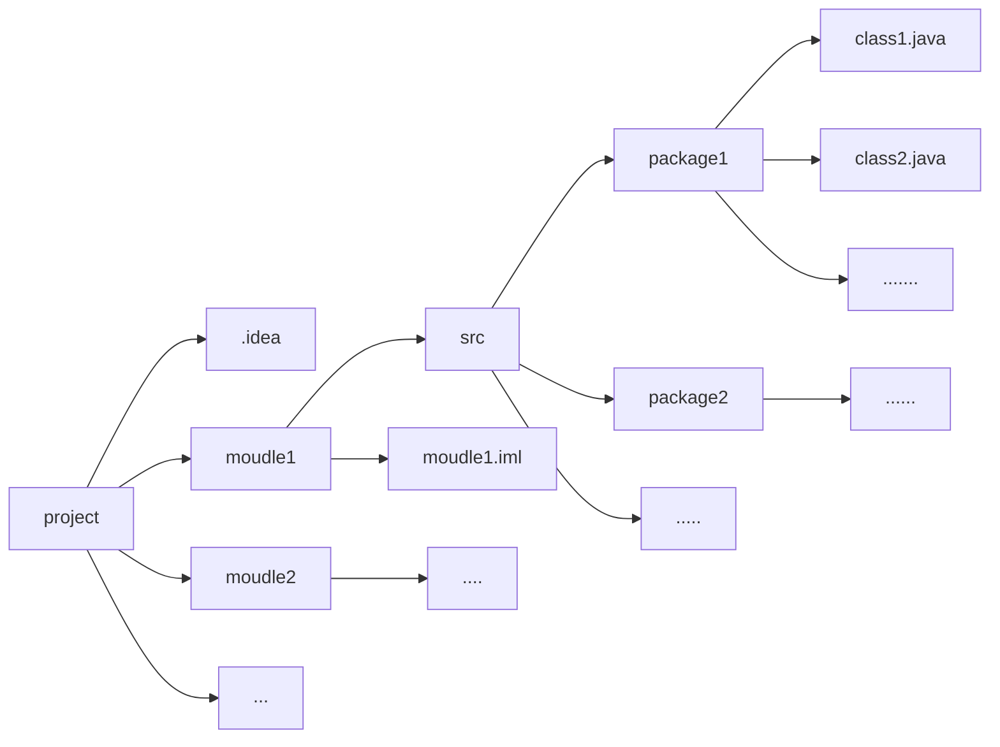
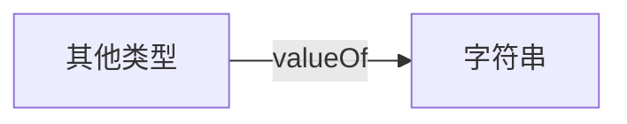

[toc]

# Java基础汇总

## Java概述

> 了解学习一门语言，首先自然需要了解它的相关特性和历史

- Java 编程语言是一种通用的、并行的、基于类的、面向对象的语言
- Java语言是一门**完备的**、面向生产的语言，而非C++/C性质的研究型语言
- Java语言是高层次的，所以它无法用于表示机器层次的细节（Java内置了垃圾回收、内存管理，这些东西一般不需要我们手动调用）
- Java程序具备跨平台性（==code once, run anywhere==）

### JVM、JRE和JDK

1. JVM：Java虚拟机，跨平台性实现的基础，编写的java程序运行在JVM上，而JVM运行在操作系统上（Oracle为不同的操作系统提供了不同的JVM）
2. JRE：java程序的运行环境，包含了**JVM**和java程序运行所需的核心类库（*如果要运行一个已有的java程序，那么安装JRE即可*）
3. JDK：java程序开发工具包，包含了JRE和开发者所需的各种工具（自己开发一个java程序，需要安装JDK）


## 第一个Java程序

> 关于Java环境的配置不多说，这里详细解释一下所写的第一个Java程序`Hello.java`
>
> $Attention:版本Java17,编辑器IDEA$

Java文件`Hello.java`

```java
public class Hello{
    public static void main(String[] args){
        System.out.println("Hello,Java!");
    }//这是注释
}
```

- $Line1$：`public class Hello`

  1. 其中public代表了类Hello的访问权限，此处的public代表该类是**公共**的，可以被项目的任何类所引用（import），常见的访问权限按照权限大小依次有（$public,protected,default,private$）

  2. `class`代表Hello是一个类，可以类比`int a`

  3. `Hello`每个**文件名**必须和该文件中的**公共类名**一致，<font color='red'>$Why?$</font>

     <font color='red'>$Answer$</font>:Java程序是被解释执行的，它在运行的时候并不是将所有的.class文件（java源代码编译后的字节码文件，对于一个.java文件，其中包含几个类，就会编译出几个对应的.class文件）全都放到内存中，而是在遇到import的时候才回去相应的文件路径下查找相应的.class文件。而对于一个**public类**而言，<u>它是可以被项目中的任何一个类import的</u>，此时**将类名和文件名对应就可以方便虚拟机在相应的路径中去查找相应类的信息**（不然开销会很大）。

     当然，如果java源文件中不存在公共类，那么java源文件的命名也确实无所谓（*当然这样设计的话，这个java源文件也就没什么意义了（因为不存在公共的对外接口）*）

  4. 每个java源文件中只能有且最好要有一个public类，该类是这个java源文件的唯一对外公共接口（***这是一种设计上的规范，当然Java的语法也规定了必须这样***）

     > *对于java源文件中各种类的架构要求会在后面进行具体叙述*

- $Line2$:`public static void main(String[] args)`

  1. 同上，public用于修饰main方法的访问权限

  2. `static`用于修饰该方法是静态的，static关键字修改此方法在类中**只有一份**

     《Java编程思想》中的一句话概括了static关键字的含义

     > “static方法就是没有**this**的方法。在static方法内部不能调用非静态方法，反过来是可以的。而且可以在没有创建任何对象的前提下，**仅仅通过类本身来调用static方法**。这实际上正是static方法的主要用途。”

  3. `void`修饰的是该方法返回的变量类型（这个相信有编程基础的都懂）

  4. `main`，main方法在Java公共类中的一个非常特殊的方法，运行Java文件时，main方法是Java程序的**唯一公开接口**（程序**由此开始运行**）。

     > 今天在复习的时候发现，哪怕public类中不存在main入口，Java程序依旧会由非public中的main方法开始执行。（相当神奇，但是自己写项目的时候可不能这样写）

  5. `String[] args`代表的是main方法接受的参数，代表需要传入一个字符串数组，可以类比于C中的`int main(int argc,char *argv)`

- $Line3$:`System.out.prinln(...)`就是Java一个常用的字符串输出函数

Java程序命令行运行（IDEA下的话直接运行即可）

```shell
javac Hello.java # 将Hello.java源文件编译成Hello.class字节码文件
java Hello # 执行字节码文件
```

## IDEA的基本使用

> 这里讲讲Java编辑器——IDEA的基本使用技巧（**个人开发**中常用的）

首先看一下IDEA中Java项目的基本结构



一个项目分为不同的模块，所有代码都存放在各个模块的src文件夹下，src文件夹又有多层嵌套的各种包....（这块不太好解释，总之知道一下就行）

### IDEA快捷键

> 这里讲的快捷键在日常开发中非常常用（并且在JetBrain开发的一套软件里都适用——如果你没改默认快捷键的话）

|     快捷键      |                             功能                             |
| :-------------: | :----------------------------------------------------------: |
|   `Alt+Enter`   | 导入包和自动修正代码（遇到warning、error不会改，上去就是一个Alt+Enter） |
|    `Ctrl+y`     |                     ==删除光标所在的行==                     |
|    `Ctrl+d`     |          ==复制光标所在行，并复制到光标所在行下面==          |
|  `Ctrl+Alt+l`   |                        ==格式化代码==                        |
|    `Ctrl+/`     |                        注释/取消注释                         |
| `Ctrl+Shift+/`  |                    多行注释/取消多行注释                     |
|    `Alt+Ins`    |                         自动生成代码                         |
| `ctrl按住+点击` |                  直接查看所选类/方法的源码                   |
|   `shift+F6`    |                      ==批量修改变量名==                      |
|    `ctrl+f`     |                          文件内搜索                          |
|  `shift+shift`  |                      全局搜索（貌似？）                      |

## Java基础语法

### 修饰符汇总

> 这里先罗列一些Java修饰符的作用，具体细节会到Java面向对象中详细阐述

#### 访问修饰符

> ***用来定义类、方法、变量访问权限***

- $public$：对==所有类==可见。使用对象：类、接口、变量、方法
- $protected$：对==同一包内的类==和==所有子类==可见。使用对象：<u>变量</u>、<u>方法</u>。 **注意：不能修饰类（外部类）**
- $default$：（默认）， 在==同一包==内可见，不使用任何修饰符。使用对象：类、接口、变量、方法。
- $private$：在==同一类==内可见。使用对象：变量、方法。 **注意：不能修饰类（外部类）**

#### 非访问修饰符

> 为了实现一些其他的功能，Java也提供了许多非访问修饰符

- $static$：static 关键字用来声明独立于对象的静态变量，无论一个类实例化多少对象，它的静态变量只有一份拷贝
- $final$：final 表示"最后的、最终的"含义，变量一旦赋值后，不能被重新赋值。被 final 修饰的实例变量必须显式指定初始值
- $abstract$：抽象类不能用来实例化对象，声明抽象类的唯一目的是为了将来对该类进行扩充
- $synchronized和volatile$：主要用于线程的编程

### Java语法糖

> 注：这里所说的语法糖适用于==Java17==
>
> $Plus:$这里的语法糖是我的个人理解，就是罗列一下我个人觉得比较方便+奇特的Java语法。

#### $var$

> 自动变量推断关键字，省时省力，等价于C++中的auto关键字

```java
StringBuilder sb=new StringBuilder();
var sb=new StringBuilder();
```

#### $foreach$

> 实际上就是增强版的for循环，foreach 语句用于循环访问集合以获取所需信息，但**不应用于更改集合内容**以避免产生不可预知的副作用，可以用于遍历对象集合（可以用foreach实现的一定可以通过for循环直接实现）
>
> 具体实现看下面的例子

```java
for(valueType value:valueSet){
    loop body...
}
var array=new int[5]{1,243,24,4,23};
for(int i:array){
    System.out.println(i);
}
```

#### $switch$

> 注意，这里说的是从Java14起开始支持的**新版Switch语句**

1. 使用`->`
2. 取消了`break`，语法**不再默认具备穿透性**
3. 可以直接**返回值**（也可以通过`yield`返回值），相当于直接集成了一个判断函数

*这里直接举个例子体会下*

```java
import java.util.Scanner;//Java输入读取包
public class SwitchTest{
    public static void main(String[] args){
        var scan=Scanner(System.in);
        String flag=scan.nextLine();
        int opt=switch(flag){
                case "apple"->1;
                case "banana"->23;
                case "orange","fruit"->1234;
                default->{
                    int code=scan.nextInt();
                    yield code*2;
                }//复杂操作采用yield的形式返回
        };
    }
}
```

#### $可变参数$

>   Java5中提供了边长参数，允许在调用方法的时候传入不定长度的参数（**本质上还是基于数组实现的**）
>
>   ```java
>   void outPut(int...x);
>   ```

*使用注意事项*

1.   可变参数必须作为函数的最后一个参数（所以方法中最多只能传入一个可变参数）
2.   Java中的可变参数，会被编译器转型为一个数组
3.   长参数在编译为字节码后，在方法签名中就是以数组形态出现的，所以不能作为方法的重载
4.   可变参数可以兼容数组，反之不能

<u>个人感觉可变参数的唯一作用就是减少了一些代码量</u>（但是貌似不是很推荐使用？）

### 基本数据类型

> 这个非常简单，稍微介绍下就可以了

- 整数类型：$byte,short,int,long$
- 浮点数类型：$float,double$
- 字符类型：$char$（特殊，Unicode类型存储，所以需要占用两个字节）
- 布尔类型：$boolean$

关于Java基本数据类型的**占用空间**


#### $Attention$

1. 使用float类型时，数据需要加上后缀`f`
2. 使用long类型时，数据需要加上后缀`l`

#### $类型转换$

- 普通数据类型：直接采用强制类型zhuan'huan

- 规则：数据范围（非字节数）由小转到大

  ```java
  long num=100;
  double num_dou=2.5f;
  float num_flo=100l;//long字节数为8字节，但是它可以转化为4字节的float类型！
  ```

- byte/short/int在进行运算的时候，会先提升为int类型再进行计算，所以得到的值都是int

### 引用数据类型（基础）

> 除开上面提到的八种基本类型，其他的都是引用数据类型（确信
>
> 这里说说几种比较常用的$数组$和$String$
>
> $Plus$:可以使用Java中内置的方法getClass()查看数据类型
>
> ```java
> Integer i=5;
> System.out.println(i.getClass())
> ```

#### $数组$

> 在Java中内置了各种强大的容器的情况下，$Why\ we\ still\ need\ to\ learn\ 数组？$
>
> - **效率高**，数组是一种效率最高的存储和随机访问对象引用序列的方式
> - 数组可以持有**值类型**，而容器不能（？
>
> <font color='gree'>Java数组的本质还是一个对象</font>

关于数组在内存空间中的存储形式，如图


*创建数组的两种方式*

- 指定数组维度
  - 为数组开辟指定大小的数组维度。
  - 如果数组元素是**基础数据类型**，会将每个元素设为默认值；如果是**引用类型**，元素值为 `null`。
- 不指定数组维度
  - 用花括号中的实际元素初始化数组，数组大小与元素数相同。

```java
int[] array1=new int[2];//此时已开辟内存
int[] array2=new int[]{1,2,3};
```

基本方法：`array.length`用于获取数组的长度

##### $数组拓展：Arrays类$

> JDK所提供的$java.util.Arrays$类，包含了常用的数组操作——排序sort、查找binarySearch、填充fill、打印toString、转列表asList、哈希hash等等

1. $Arrays.toString()$打印数组

   ```java
   int[] a = { 1, 2 };
   System.out.println(a); // 打印数组引用的值；[I@119d7047
   System.out.println(Arrays.toString(a)); // 打印数组元素的值；[1,2]
   ```

2. $Arrays.equals(a,b)$比较两个数组是否相同

   输出结果

   

   数组之间的比较需要采用Arrays的equals方法，不能直接采用对象自带的。

3. $Arrays.sort()$数组排序，默认为升序

   ```java
   int[] a={1,2,312,12,4312};
   Arrays.sort(a);
   System.out.println(Arrays.toString(a));
   ```

   如果需要**降序排序**的话，需要实现Comparator接口复写的compare方法，并且必须是包装类（可以类比C++）

   ```java
   package p1;
   
   import java.util.Arrays;
   import java.util.Comparator;
   
   public class SortTest {
       public static void main(String[] args) {
           Integer[] a={12,321,412,3,1,123,413,4};
           Comparator<Integer> cmp=new MyComparator();
           Arrays.sort(a,cmp);
           System.out.println(Arrays.toString(a));
       }
   }
   class MyComparator implements Comparator<Integer>{
       @Override
       public int compare(Integer a,Integer b){
           return b-a;
       }
   }
   ```

4. $Arrays.binarySearch()$二分查找对应元素下标，不存在返回-1

   ```java
   int[] a={1,2,312,124,2134,123};
   Arrays.sort(a);
   System.out.println(Arrays.binarySearch(a,312));
   ```

#### $String$

> 作为Java中使用最频繁的引用类型，关于String的性能问题却常常被忽略，深入了解其特性，高效的使用字符串，可以提升系统的整体性能
>
> <u>关于String中常用的方法</u>
>
> 

##### $String的不可变性$

**Java中String类型的基本定义**

```java
public final class String
    implements java.io.Serializable, Comparable<String>, CharSequence {
    /** The value is used for character storage. */
    private final char value[];
```

1. final修饰，表示String类**不可被继承**

2. 数据存储与被final修饰的char[]数组，表示String对象**不可被修改**

3. String类变量一旦声明就不可变；如果赋值，改变的只是指向的地址，原来的字符串依旧存在并且产生垃圾

   

总结：String类是一种不可变对象

##### $字符串基本$

> 关于字符串的一些最常用的方法.

```java
String test="01234567890";
test.length();//11
test.indexOf('0');//0
test.lastIndexOf('0');//10
test.charAt(0);//0查看index=0处的字符串，相当于数组的arr[index](注意java字符串不具备下标查看的功能)
```

##### $字符串判断$

```java
boolean equals(Object obj);//比较字符串的内容是否相同
boolean equalsIgnoreCase(String str);//忽略大小写
boolean startsWith(String str);//是否以str开头
boolean endsWith(String str);//....结尾
```

##### $字符串转换$

```java
char[] toCharArray();//把字符串转换为字符数组
String toLowerCase();//把字符串转换为小写字符串
String toUpperCase();//把字符串转换为大写字符串
```

##### $字符串拼接$

- 字符串常量的拼接

  **字符串常量的拼接，编译器会将其优化为一个常量字符串**

  ```java
  String str="a"+"b"+"c";//会直接优化成String str="abc"
  System.out.println("Str="+str);
  ```

- 字符串变量的拼接

  ```java
  String str="";
  for(int i=0;i<100;i++){
      str=str+i;//被优化成str=(new StringBuilder(String.valueOf(str)).append(i).toString)
  }
  ```

  但是每次循环都生成一个`StringBuilder`示例再转化为`string`，这样会大大降低系统的性能

  $正确使用方法$：使用`StringBuilder`的`append`方法替代`+`

##### $字符串-杂$

```java
//其他的一些常用方法
String trim();//去除字符串两边的空格
String[] split(String str);//按照传入的指定字符串分割字符串
byte[] getBytes(String charsetName);//使用指定的字符集将字符串编码成byte序列，并将结果存放在一个新的byte数组中(默认的话是使用平台的默认字符集)
```

#### $字符串拓展-编码问题$

##### $ASCII$

共==128==个，使用==一个字节的低7位==来表示

##### $ISO8859-1$

在ASCII码的基础上涵盖了大多数西欧语言字符，仍然是单字节编码，它总共能表示256个字符

##### $GBK$

由于ASCII编码不支持中文，因此国人就定义了一套编码规则——GBK

1.   字节小于等于127时，和==ASCII相同编码==
2.   只要第一个字节==大于127==，就固定表示该字节和之后一个字节是一个汉字的开始（双字节代表汉字）

##### $Unicode$

因为世界上国家很多，如果每个国家都自己定义一套自己的编码，结果导致互相之间谁也不懂谁的编码，无法沟通交流，这是及时的出现了一个组织$ISO(国际标准化组织)$，该组织定义了一套编码方案来解决所有国家之间的沟通交流问题，这套编码方案就叫$Unicode$（更恰当的来说应该不是编码规则而是一套新的字符集）

1.   每个字符必须使用==2个字节==来表示
2.   对于==ASCII码表中的字符，编码不变==，只是将其长度扩展为16位
3.   为每个字符分配一个唯一的ID（码点）

缺点：传输ASCII表中的字符时完全可以使用一个字节表示，这就导致了传输数据比较浪费带宽，存储数据比较浪费硬盘

##### $UTF-8$

$UTF-8$的诞生就是为了解决上面$Unicode$的缺点。

使用变长编码，使用1-4个字节进行传输和存储数据（具体的转换方式这里就不说了）。

#### $深浅拷贝问题$

>   任何编程语言中，都有深浅拷贝的概念
>
>   这里对Java中的深拷贝和浅拷贝做一个详细的解说。
>
>   前置条件：深浅拷贝都是对一个**已有对象**的操作。

##### $概念理解$

在Java中，出来*基本数据类型*（元类型）之外，还存在类的实例对象这个引用数据类型，一般使用`=`做赋值操作的时候，对于==基本数据类型==而言，拷贝的是它的**值**，而对于==引用数据类型==而言，拷贝的则是这个**对象的引**用（类比c中的指针赋值，它们依然指向同一个对象）。

而浅拷贝和深拷贝就是在这个基础之上做的区分，如果在拷贝这个对象的时候，只对基本数据类型进行了拷贝，而对引用数据类型只是进行了引用的传递，而没有真实的创建一个新的对象，则认为是浅拷贝。反之，在对引用数据类型进行拷贝的时候，创建了一个新的对象，并且复制其内的成员变量，则认为是深拷贝。

##### $Java中的深浅拷贝方法$

>   主要讲解Object上的clone()方法

在Java中，所有的类都继承自Object，而在Object上，存在一个clone()方法（被声明为**protected**，而我们所使用的方法都是Object的子类，所以都~~可以使用这个方法~~==必须实现Cloneable接口才能使用这个方法==）

***该方法源码***

```java
protected Object clone() throws CloneNotSupportedException{
    //限制所有调用clone()方法的对象，都必须实现Cloneable接口，否则将抛出CloneNotSupportedException异常
    if(!(this instanceof Cloneable)){
        throw new CloneNotSupportedException("Class "+getClass().getName()+" doesn't implement Cloneable";
    }
    return internalClone();
}
//CLoneable接口
public interface Cloneable{
    //啥也没实现，只是用于指定该对象可以被拷贝的标记
}
```

最终会调用internalClone()方法来完成具体的操作。

internalClone()方法，实际上是一个native方法，可以clone()一个对象得到一个==新的对象实例==。


通过观察输出结果可以看出，`=`和`clone()`的不同之处，clone()确确实实创建了一个新的对象，而`=`则完全是只是对对象的引用（<font color="red">$Attention:$</font>不是浅拷贝！）

>   ==但是此处的clone只是一次浅拷贝的操作==
>
>   可以看下面两幅图来理解一下利用`clone()`实现的浅拷贝和利用`=`实现的对象引用之间的之间的不同之处。
>
>   `=`实现的对象引用
>
>   
>
>   `clone()`方法实现的浅拷贝（指上面实现的浅clone()方法）
>
>   
>
>   注意，这里的浅拷贝和c/c++中的认识一致，基本数据类型是完全拷贝，但是引用数据类型同样还是对象引用。
>
>   <font color="red">$Attention:$</font>如果此时想要访问clone得到的对象的属性和方法的话，必须进行**类型转化**！！！

现在浅拷贝的问题解决了，问题就集中到如何进行==深拷贝==（**在对引用数据类型进行拷贝的时候，创建了一个新的对象，并且复制其内的成员变量**）上了！


==两种方法==

1.   重写`clone()`

     需要将类中定义的所有引用数据类型都去Cloneable接口实现clone()方法

     ```java
     @Override
     protected Father clone() throws CloneNotSupportedException
         //这里使用protected是为了防止子类直接调用父类的方法抛出异常
         return (Father) super.clone();
     }
     @Override
     protected Son clone() throws CloneNotSupportedException {
         Son son= (Son) super.clone();//待返回克隆的对象
         son.name=new String(name);
         son.father=father.clone();
         return son;
     }
     ```

     比较繁琐，但是因为`clone()`是Object类的native方法的缘故使得该方法的速度极快

     这种方法可以实现深拷贝，但是还有一个问题，如果引用的层数太多了怎么办，难道要给每个引用对象重写`clone()`吗🤔（不得累死）？

     

     此时就需要借助一下==序列化==

2.   序列化

     >   暂时超出理解范围，等我学学Redits再来看看。

### 类型转换（通用）

> 关于==字符串==类型和其他==基本类型==的通用转换方式

- 要将其他任意基本类型转换为字符串，可以直接使用String通用的静态方法`valueOf()`，编译器会根据传入参数自动选择合适的方法
- 要将字符串转换为其他类型，则需要根据具体情况具体考虑



```java
String.valueOf(123); // "123"
String.valueOf(45.67); // "45.67"
String.valueOf(true); // "true"
String.valueOf(new Object()); // 类似java.lang.Object@636be97c
```

```java
//int包装类Integer
int n1=Integer.parseInt("123");//自动拆箱
int n2=Integer.parseInt("0xff",16);//按照指定的机制转换字符串
//Double等包装类也有类似的parse转换字符串的方法
```

### 基本IO

> 基本IO就是指Java中输入为stdin，输出为stdout的IO，不涉及文件操作

#### $input$

> 需要使用到的Java类，**Scanner**，该类由正则构造，所以支持正则判断输入输出
>
> ```java
> import java.util.Scanner;//导入Scanner类
> var scan=new Scanner(System.in);//System.in代表从控制台接受输入输出
> var s=new String();
> s.nextLine();//读入一整行数据，回车为终止符
> ```

**常用方法**

1. `next()`等待当前的输入，并读入当前的有效字符（注：next中，空格和回车是无效字符，next()可以理解为读取单词）

   ```java
   public static void main(String[] args) {
       Scanner scan = new Scanner(System.in);
       System.out.print("输入的数据为:" + scan.next());
   }
   ```

   ```markdown
   注："[in]:"后的字符为输入，"[out]:"后的字符为输出。
   用例1
   [in]:hello world
   [out]:输入的数据为:hello
   ---
   用例2
   [in]:   hello world
   [out]:输入的数据为:hello
   ---
   用例3
   [in]:
   
   hello world
   [out]:输入的数据为:hello
   ```

2. `nextLine()`和next()类似，只是会将**空格**作为**有效字符**输入，将回车作为终止符，常用于读取字符串

3. `nextInt()`读取整数

4. `hasNextInt()`判断是否还有整数输入

5. `hasNext()`等待当前输入，常用于循环读入（循环读取单词）

6. `hasNextLine()`和`hasNext()`基本一致（循环读取句子），下面用一个示例来看看二者的区别

   ```java
   //1
   public static void main(String[] args) {
       var scan=new Scanner(System.in);
       while(scan.hasNext()){
           System.out.println(scan.next());
       }
   }
   ```

   ```java
   //2
   public static void main(String[] args) {
       var scan=new Scanner(System.in);
       while(scan.hasNextLine()){
           System.out.println(scan.nextLine());
       }
   }
   ```

   ```markdown
   [in]:   hello world
   [out1]: hello
   [out2]: hello world
   ```

$Thinking$:如何实现完善的循环输入？要求终止字符串为`exit/Exit`

```java
public static void main(String[] args){
    var scan=new Scanner(System.in);
    while(!s.hasNext("exit|Exit")){//等价于定义了特殊终止符exit、Exit
        System.out.println("Your input word is "+scan.next());
    }
}
```

#### $output$

> 相比于较为复杂的输入，Java中的输出就显得简单很多，常用的只有三个函数

```java
System.out.println();//最常用的输出语句：输出为基本类型时，自动转化为string
//输出为引用类型时，会自动调用对应的toString方法(所以可以通过重写toString()方法来修改输出对象获取的信息)
System.out.print();//和上面相比少了默认的换行
System.out.printf();//格式化输出，类比C
```

**注意**：null是可以被输出的！

```java
public static void main(String[] args) {
    String s = null;
    System.out.println(s);
}//会输出null
```

## Java面向对象

> 面向对象编程，就是一种通过对象，把现实世界映射到计算机模型中去的编程思想。
>
> 具体概念定义不多解释。
>
> $Plus:$**类的成员变量**编译器会给默认值，可以直接使用。

### 构造函数和this指针

> 构造函数就是在对象被声明时默认会调用的函数，可以被重写
>
> 如果没有显示定义的话会调用默认的无参构造函数，但是一旦声明了有参构造函数，就无法再调用默认的无参构造函数了，此时使用`new A()`，会产生报错
>
> **this指针**就是指向对象实例的指针（很多语言都有）
>
> 并且this还可以用来代替本类得到构造函数
>
> - `this(5);//调用类中一个形参的构造函数`

```java
public class A{
    private int id;
    public A(int id){
        this.id=id;//
    }
}
```

### 信息隐藏

> 面向对象中的法则：信息隐藏（类的成员属性只能通过定义公开接口来进行访问）

- 类的成员属性：private
- 类的方法属性：外部只能通过public方法类修改类的成员属性

>  朋友再熟悉，也不会到他的抽屉里直接拿东西，而是通过他的公开接口来访问、修改东西

- 为了访问类中的成员属性，一般会定义通用的成员方法getter/setter

  ```java
  public class test{
      private int a;
      private int b;
      public void setA(int a){
          this.a=a;
      }
      public void setB(int b){
          this.b=b;
      }
      public int getA(){
          return this.a;
      }
      public int getB(){
          return this.b;
      }
  }
  ```

- 可以通过IDE快速生成(IDEA：alt+insert即可)

  

### 类的继承

>   物以类聚，世间万物皆对象，<u>对象也可以分成若干类别</u>，类别内的对象，属性和方法都具有一定的共同点
>
>   于是，将这些共同点提取出来，就形成了**父类/基类/超类**
>
>   而其他类也自动成为**子类/派生类**
>
>   ```java
>   public class Father{
>       int a;
>       int b;
>       public void test(){
>           ...
>       }
>   }
>   public class Son extends Father{
>       
>   }
>   ```
>
>   $Plus:$继承是面向对象编程中非常强大的一种机制，它首先可以复用代码。当我们让`Son`从`Father`继承时，`Son`就获得了`Father`的所有功能，我们只需要为`Son`编写新增的功能即可

#### $Java中继承的特点$

1.   子类可以继承父类中的所有属性和方法（除了==私有属性+私有方法+构造函数==）

     <font color="red">$Attention:$</font>此性质仅限同包继承，跨包继承的话default修饰的属性和方法同样无法访问。

2.   同名方法：子类优先级高于父类

3.   单根继承原则：每个类都只能继承一个类（Java特有）

     <font color="red">$Attention:$</font>Java这样定义继承，主要是为了方便，对比C++中的多继承，要求是父类和子类的所有成员变量和方法都不能同名，这当变量和方法很多的时候将非常麻烦。而Java定义的单根继承就解决了这一问题，并且尽管Java只能继承一个父类，但是却可以==实现多个接口==，这也弥补了单根继承的不足。

4.   所有Java类都默认继承==java.lang.Object==类（Object类中有**clone、equals、finalize、getClass、hashCode、toString**等方法）

     **这个类非常重要，之后会进行具体分析**

---

基于protected


#### $关于Object超类$

### 转型、多态和契约设计


### static、final和常量设计


### Java访问权限


### 抽象类和接口


### 垃圾回收

>   垃圾回收(Garbage Collection)是Java虚拟机(JVM)垃圾回收器提供的一种用于在空闲时间不定时回收无任何对象引用的对象占据的内存空间的一种机制
>
>   $Plus:$这个东西细讲的话可以引申出一大堆内容，所以这里只做简单叙述，以后有时间再来填坑。

-   引用：如果Rederence类型的数据中存储的数值代表的是另外<u>**一块内存的起始地址**</u>，就称这块内存代表着一个引用。

-   垃圾：无任何对象引用的对象。

**首先声明**：不推荐显示调用fianlize方法

`object.fianlize()`方法用于实例被垃圾回收器回收时触发的操作（只有当GC（垃圾回收器）确定不存在该对象的更多引用的时候，对象的垃圾回收器才会调用这个方法），同时`System.gc()`可以增加finalize的执行几率。

## Java常用类

### 数字相关

### 字符串相关

#### $RegExp$

### 时间相关

### 格式化相关


## Java异常处理

>   计算机程序运行的时候，总是会出现各种各样的错误。
>
>   1.   有一些错误是**用户**造成的，比如，希望用户输入一个`int`类型的年龄，但是用户的输入是`abc`（输入类型出错）
>   2.   程序想要读写某个文件的内容，但是用户已经把它删除了（文件内容不存在）
>   3.   网络突然断了，无法连接远程服务器；内存耗尽，程序崩溃；.....（各种随机性的错误）
>
>   ---
>
>   所以说，一个“健壮”的程序，必须具备处理各种各样异常的能力（==CTS2也必须贯彻这一点！！==）
>
>   Java在语言层面内置了一套异常处理机制，使用异常来表示错误

异常是一种`class`，它本身就带有类型信息。

关于异常处理的两种常见方案：

1.   不处理下层函数抛出的异常，继续将捕获到的异常抛出给上层
2.   选择在本方法对异常进行处理。

### Java中异常的体系结构

>   Java把异常当作对象来进行处理，并定义了一个基类`java.lang.Throwable`作为所有异常的超类。
>
>   
>
>   在Java API中已经内置了很多异常类，这些异常类分为两大类，==错误`Error`==和==异常`Exception`==
>
>   <font color="red">$Attention:$</font>错误不是异常，而是脱离程序员控制的问题。（比方说栈溢出）

`Throwable`分成了两个不同的分支，**一个分支是`Error`，它表示不希望被程序捕获或者是程序无法处理的错误**。**另一个分支是`Exception`，它表示用户程序可能捕捉的异常情况或者说是程序可以处理的异常**。其中异常类`Exception`又分为运行时异常(`RuntimeException`)和非运行时异常。

Java异常又可以分为不受检查异常（`Unchecked Exception`）和检查异常（`Checked Exception`）

-   `Error`：错误类是由Java虚拟机生成并抛出的，大多数错误与代码编写者所执行的操作无关

-   `Exception`：

    在`Exception`分支中有一个重要的子类`RuntimeException(运行时异常)`，该类型的异常属于==程序的逻辑异常==，比如`ArrayIndexOutOfBoundsException(数组下标越界)`、`NullPointerException(空指针异常)`等等，这些异常属于`Unchecked Exception(不检查异常)`，它们往往由程序本身的逻辑错误导致，一般通过修改程序来进行处理。

    而`RuntimeException`之外的异常被统称为`非运行时异常`，是程序逻辑中必须处理的异常，包括`IOException`、`ReflectiveOperationException`等等，这些异常必须在程序逻辑中捕获或者处理。

==Java规定如下==

>   1.   **必须捕获的异常**：包括`Exception`及其子类，但不包括`RuntimeException`及其子类，这种类型的异常称为Checked Exception
>   2.   **不需要捕获的异常**：包括`Error`及其子类，`RuntimeException`及其子类
>
>   <font color="red">$Attention:$</font>编译器对`RuntimeException及其子类`不做强制捕获要求，但是程序逻辑是否需要包含对应的异常处理还要看情况而定。

### 异常抛出+捕获

>   异常捕获使用`try...catch...finally`语句，把可能发生异常的代码放到`try{...}`中，然后使用`catch`捕获对应的`Exception`及其子类

方案1：**选择在上层处理异常**

```java
import java.io.UnsupportedEncodingException;
import java.nio.charset.StandardCharsets;
import java.util.Arrays;
import java.util.Scanner;

public class ExceptionTest01 {
    public static byte[] toByte(String s, String charsetName) {
        try {
            return s.getBytes(charsetName);
        } catch (UnsupportedEncodingException e) {
            //如果系统不支持GBK编码，会捕获到UnsupportedEncodingException
            System.out.println(e);
            return s.getBytes(StandardCharsets.UTF_8);
        }
        catch(...){
            ...
        }
        ...//可以进行多重catch试图捕获多种异常
    }

    public static void main(String[] args) {
        var scan = new Scanner(System.in);
        String str = scan.nextLine();
        String charsetName = scan.next();
        System.out.println(Arrays.toString(toByte(str, charsetName)));
    }
}
```

方案2：**选择继续抛出异常**

```java
import java.io.UnsupportedEncodingException;
import java.util.Arrays;
import java.util.Scanner;

public class ExceptionTest02 {
    //选择把异常留给main函数进行处理
    public static byte[] toByte(String s, String charsetName) throws UnsupportedEncodingException {
        return s.getBytes(charsetName);
    }

    public static void main(String[] args) {
        var scan = new Scanner(System.in);
        String str = scan.nextLine();
        String charsetName = scan.next();
        try {
            System.out.println(Arrays.toString(toByte(str, charsetName)));
        } catch (UnsupportedEncodingException e) {
            System.out.println(e);
        }
    }
}
```

方法3：直接在main函数中抛出异常（这种处理一般用于只想测试代码的情况）

$Plus$：打印异常的时候，推荐使用`e.printStackTrace()`，该方法能提供比`System.out.println(e)`==更加详细的异常信息==（会输出异常出现的位置，并且是层层递进的向上查询，下图是两种方法的对比）。


==$Thinking:为什么需要这几种不同给异常处理形式呢？它们之间有什么区别？$==

#### $Throw\&Catch\ Exception?$

-   ==抛出异常==

    要理解抛出异常，首先要明白什么是异常情形，它是阻止当前方法或作用域继续执行的问题。

    其此需要区分**异常情形**和**普通问题**：

    -   普通问题是指在<u>当前环境下</u>能够得到**足够的信息**，总能够处理这个错误（此时推荐的处理方案就是try+catch处理）

    -   异常情形则指当前环境下无法获取足够的信息，所以需要从当前环境跳出，并把问题提交给上一级环境（此时推荐throw）

        此时发生的事情如下：首先，是像创建普通的java对象一样将使用`new`在堆上<u>创建一个异常对象</u>；然后，*当前的执行路径（已经无法继续下去了）被终止*，并且从当前环境中弹出对**异常对象的引用**，其次异常处理机制接管程序，并寻找一个恰当的地方继续执行这个程序。

    ```java
    if(stu==null){
        throw new NullPointerException();
    }
    ```

-   **`捕获异常`**

    在方法抛出异常之后，运行时系统将转为寻找合适的异常处理器（exception handler）。潜在的异常处理器是异常发生时依次存留在调用栈中的方法的集合。当异常处理器所能处理的异常类型与方法抛出的异常类型相符时（**catch中的参数为对应的exception**），即为合适的异常处理器。运行时系统从发生异常的方法开始，依次回查调用栈中的方法，直至找到含有合适异常处理器的方法并执行。当运行时系统遍历调用栈而未找到合适的异常处理器，则运行时系统终止。同时，意味着Java程序的终止

----

#### $Java异常处理关键字介绍$

>   Java异常处理涉及到五个关键字，分别是：`try`、`catch`、`finally`、`throw`、`throws`

1.   ==try==：用于**监听**。将要监听的代码（可能抛出异常的代码块）放在try语句块之内，当try语句块内发生异常时，就抛出异常。

2.   ==catch==：用于**捕获异常**（try语句中抛出的）。

     $Plus$:注意使用多catch语句的时候，子类必须放在其超类的前面（否则永远捕获不到）

     匹配原则：如果抛出的异常对象属于`catch`子句的异常类，或者属于该异常类的子类，则认为生成的异常对象与`catch`块捕获的异常类型相匹配（导致上面）

3.   ==finally==：`finally`**<u>语句块总是会被执行</u>**。==它主要用于回收在try块里打开的物理资源==（如数据库连接、网络连接和磁盘文件等等）。<u>只有`finally`语句块执行完毕后，才会回来执行try或者catch中的return语句或者throw语句</u>，所以如果`finally`语句块中使用了return或者throw等终止方法的语句（***不推荐***），就不会跳回执行，直接停止

4.   ==throw==：用于抛出异常。

     $Plus:$一般会将抛出异常和声明异常结合

     ```java
     throw new NullPointerException();
     ```

5.   ==throws==：用在方法签名中，用于声明该方法可能抛出的异常。

     如果某个方法可能会抛出某种异常又不想处理，那么可以使用throws将可能产生的异常传递给上层方法处理。

---

#### $同逻辑异常捕获$

>   如果异常A和异常B之间的处理逻辑相同，但是又不存在继承关系，那么按照之前所学就得编写多条`catch`语句。
>
>   其实可以直接使用`|`将它们合并到一起。

```java
public static void main(String[] args){
    try{
        process();
    }
    catch(IOException|NumberFormatException e){
        System.out.println(".....");
    }
    //永远在最外层的放置一个catch Exception，防止意料之外的异常产生。
    catch(Exception e){
        .....
    }
}
```

#### $抛出异常规范$

>   如果一个方法捕获了某个异常后，又在`catch`语句中抛出了新的异常，就相当于将抛出的异常类型进行了隐式转换，这会导致一些问题的产生。

如下面这段代码

```java
public class ExceptionTest03 {
    public static void main(String[] args) {
        try {
            String str = null;
            process1(str);
        } catch (IllegalArgumentException e) {
            e.printStackTrace();
        }
    }

    static void process1(String s) {
        try {
            process2(s);
        } catch (NullPointerException e) {
            throw new IllegalArgumentException();
        } catch (Exception e) {
            e.printStackTrace();
        }
    }

    static void process2(String s) {
        if (s == null) {
            throw new NullPointerException();
        }
    }
}
```

真正错误抛出的地点是`process2`，但是异常栈信息到`process1`就断了。


为了能追踪到完整的异常栈，在构造异常的时候，把原始的`Exception`实例传进去，新的`Exception`就可以持有原始`Exception`信息。对上述代码改进如下

```java
throw new IllegalArgumentException(e);//此时即可打印出完整的异常栈
```


<font color="red">$Attention:$</font>捕获到异常并再次抛出时，一定要留住==原始异常==，否则很难定位第一案发现场！

### 自定义异常

>   Java中预定义的异常类型如下图所示，当我们在代码中需要抛出异常的时候，尽量使用JDK中已经定义了的异常类型，比方说，参数检查不合法，应该抛出：`IllegalArgumentException`


在一个大型项目中，可以自定义新的异常类型，此时，==保持一个合理的异常继承体系是非常重要的==。

1.   自定义一个`BaseException`作为**根异常**，然后相继派生出各种业务类型的异常

2.   `BaseException`需要从一个合适的`Exception`派生（一般选择`RuntimeException`）

3.   需要在`BaseException`中重载多个构造函数

     <font color="green">$Suggestion:$</font>无参构造+给父类的message属性赋值的构造函数

## Java数据结构

## Java文件IO


## JVM内存分布

> 镇楼图在上
>
> 

## Java规范

> 尽量采用阿里Java开发规范进行开发
>
> ==因为IDEA内置了阿里规范插件hhh==

### 命名风格

- 类名：大驼峰式命名（UserId）
- 方法名、参数名、成员变量名、局部变量名：统一采用小驼峰式命名（userId）
- 常量名：全部大写，且单词之间使用下划线隔开（USET_ID）
- 抽象类：同意使用Abstract/Base开头
- 异常类：使用Exception结尾
- 测试类：以它要测试的类的名称开始，以Test结尾
- 包名：统一采用小写格式

### 注释规范

-   方法内部的注释可以采用行注释
-   对方法的注释必须采用==javadoc==的形式（就是跨行注释的形式）