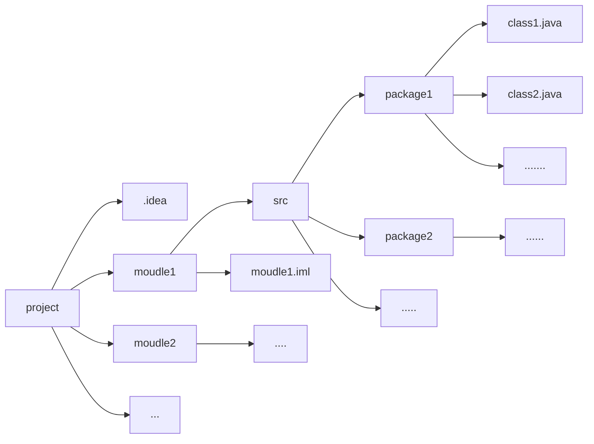

[toc]

# Java基础汇总

## Java概述

> 了解学习一门语言，首先自然需要了解它的相关特性和历史

- Java 编程语言是一种通用的、并行的、基于类的、面向对象的语言
- Java语言是一门**完备的**、面向生产的语言，而非C++/C性质的研究型语言
- Java语言是高层次的，所以它无法用于表示机器层次的细节（Java内置了垃圾回收、内存管理）
- Java程序具备跨平台性（==code once, run anywhere==）

### JVM、JRE和JDK

1. JVM：Java虚拟机，跨平台性实现的基础，编写的java程序运行在JVM上，而JVM运行在操作系统上（Oracle为不同的操作系统提供了不同的JVM）
2. JRE：java程序的运行环境，包含了**JVM**和java程序运行所需的核心类库（*如果要运行一个已有的java程序，那么安装JRE即可*）
3. JDK：java程序开发工具包，包含了JRE和开发者所需的各种工具（自己开发一个java程序，需要安装JDK）


## 第一个Java程序

> 关于Java环境的配置不多说，这里详细解释一下所写的第一个Java程序`Hello.java`
>
> $Attention:版本Java17,编辑器IDEA$

Java文件`Hello.java`

```java
public class Hello{
    public static void main(String[] args){
        System.out.println("Hello,Java!");
    }//这是注释
}
```

- $Line1$：`public class Hello`

  1. 其中public代表了类Hello的访问权限，此处的public代表该类是**公共**的，可以被项目的任何类所引用（import），常见的访问权限按照权限大小依次有（$public,protected,default,private$）

  2. `class`代表Hello是一个类，可以类比`int a`

  3. `Hello`每个**文件名**必须和该文件中的**公共类名**一致，<font color='red'>$Why?$</font>

     <font color='red'>$Answer$</font>:Java程序是被解释执行的，它在运行的时候并不是将所有的.class文件（java源代码编译后的字节码文件，对于一个.java文件，其中包含几个类，就会编译出几个对应的.class文件）全都放到内存中，而是在遇到import的时候才回去相应的文件路径下查找相应的.class文件。而对于一个**public类**而言，<u>它是可以被项目中的任何一个类import的</u>，此时**将类名和文件名对应就可以方便虚拟机在相应的路径中去查找相应类的信息**（不然开销会很大）。

     当然，如果java源文件中不存在公共类，那么java源文件的命名也确实无所谓（*当然这样设计的话，这个java源文件也就没什么意义了*）

  4. 每个java源文件中只能有且最好要有一个public类，该类是这个java源文件的唯一对外公共接口（***这是一种设计上的规范，当然Java的语法也规定了必须这样***）

     > *对于java源文件中各种类的架构要求会在后面进行具体叙述*

- $Line2$:`public static void main(String[] args)`

  1. 同上，public用于修饰main方法的访问权限

  2. `static`用于修饰该方法是静态的，static关键字修改此方法在类中**只有一份**

     《Java编程思想》中的一句话概括了static关键字的含义

     > “static方法就是没有**this**的方法。在static方法内部不能调用非静态方法，反过来是可以的。而且可以在没有创建任何对象的前提下，**仅仅通过类本身来调用static方法**。这实际上正是static方法的主要用途。”

  3. `void`修饰的是该方法返回的变量类型（这个相信有编程基础的都懂）

  4. `main`，main方法在Java公共类中的一个非常特殊的方法，运行Java文件时，main方法是Java程序的**唯一公开接口**（程序由此开始运行）。

  5. `String[] args`代表的是main方法接受的参数，代表需要传入一个字符串数组，可以类比于C中的`int main(int argc,char *argv)`

- $Line3$:`System.out.prinln(...)`就是Java一个常用的字符串输出函数

Java程序命令行运行（IDEA下的话直接运行即可）

```shell
javac Hello.java # 将Hello.java源文件编译成Hello.class字节码文件
java Hello # 执行字节码文件
```

## IDEA的基本使用

> 这里讲讲Java编辑器——IDEA的基本使用技巧（**个人开发**中常用的）

首先看一下IDEA中Java项目的基本结构



一个项目分为不同的模块，所有代码都存放在各个模块的src文件夹下，src文件夹又有多层嵌套的各种包....（这块不太好解释，总之知道一下就行）

### IDEA快捷键

> 这里讲的快捷键在日常开发中非常常用（并且在JetBrain开发的一套软件里都适用——如果你没改默认快捷键的话）

|     快捷键      |                             功能                             |
| :-------------: | :----------------------------------------------------------: |
|   `Alt+Enter`   | 导入包和自动修正代码（遇到warning、error不会改，上去就是一个Alt+Enter） |
|    `Ctrl+y`     |                     ==删除光标所在的行==                     |
|    `Ctrl+d`     |          ==复制光标所在行，并复制到光标所在行下面==          |
|  `Ctrl+Alt+l`   |                        ==格式化代码==                        |
|    `Ctrl+/`     |                        注释/取消注释                         |
| `Ctrl+Shift+/`  |                    多行注释/取消多行注释                     |
|    `Alt+Ins`    |                         自动生成代码                         |
| `ctrl按住+点击` |                  直接查看所选类/方法的源码                   |
|   `shift+F6`    |                      ==批量修改变量名==                      |
|    `ctrl+f`     |                          文件内搜索                          |
|  `shift+shift`  |                      全局搜索（貌似？）                      |

## Java基础语法

### 修饰符汇总

> 这里先罗列一些各种Java修饰符的作用，具体细节会到Java面向对象中详细阐述

### 访问修饰符

> ***用来定义类、方法、变量访问权限***

- $public$：对==所有类==可见。使用对象：类、接口、变量、方法
- $protected$：对==同一包内的类==和==所有子类==可见。使用对象：变量、方法。 **注意：不能修饰类（外部类）**
- $default$：（默认）， 在==同一包==内可见，不使用任何修饰符。使用对象：类、接口、变量、方法。
- $private$：在==同一类==内可见。使用对象：变量、方法。 **注意：不能修饰类（外部类）**

### 非访问修饰符

> 为了实现一些其他的功能，Java也提供了许多非访问修饰符

- $static$：static 关键字用来声明独立于对象的静态变量，无论一个类实例化多少对象，它的静态变量只有一份拷贝
- $final$：final 表示"最后的、最终的"含义，变量一旦赋值后，不能被重新赋值。被 final 修饰的实例变量必须显式指定初始值
- $abstract$：抽象类不能用来实例化对象，声明抽象类的唯一目的是为了将来对该类进行扩充
- $synchronized和volatile$：主要用于线程的编程

### Java语法糖

> 注：这里所说的语法糖适用于==Java17==

#### $var$

> 自动变量推断关键字，省时省力，等价于C++中的auto关键字

```java
StringBuilder sb=new StringBuilder();
var sb=new StringBuilder();
```

#### $foreach$

> 实际上就是增强版的for循环，foreach 语句用于循环访问集合以获取所需信息，但**不应用于更改集合内容**以避免产生不可预知的副作用，可以用于遍历对象集合（可以用foreach实现的一定可以通过for循环直接实现）
>
> 具体实现看下面的例子

```java
for(valueType value:valueSet){
    loop body...
}
var array=new int[5]{1,243,24,4,23};
for(int i:array){
    System.out.println(i);
}
```

#### $switch$

> 注意，这里说的是从Java14起开始支持的**新版Switch语句**

1. 使用`->`
2. 取消了`break`，语法**不再默认具备穿透性**
3. 可以直接**返回值**（也可以通过`yield`返回值），相当于直接集成了一个判断函数

*这里直接举个例子体会下*

```java
import java.util.Scanner;//Java输入读取包
public class Switch{
    public static void main(String[] args){
        var scan=Scanner(System.in);
        
    }
}
```

### 基本数据类型

> 这个非常简单，稍微介绍下就可以了

- 整数类型：$byte,short,int,long$
- 浮点数类型：$float,double$
- 字符类型：$char$（特殊，Unicode类型存储，所以需要占用两个字节）
- 布尔类型：$boolean$

关于Java基本数据类型的**占用空间**


#### $Attention$

1. 使用float类型时，数据需要加上后缀`f`
2. 使用long类型时，数据需要加上后缀`l`

#### $类型转换$

- 规则：数据范围（非字节数）由小转到大

  ```java
  long num=100;
  double num_dou=2.5f;
  float num_flo=100l;//long字节数为8字节，但是它可以转化为4字节的float类型！
  ```

- byte/short/int在进行运算的时候，会先提升为int类型再进行计算，所以得到的值都是int

### 引用数据类型（基础）

> 除开上面提到的八种基本类型，其他的都是引用数据类型（确信
>
> 这里说说几种比较常用的$数组$和$String$
>
> $Plus$:可以使用Java中内置的方法getClass()查看数据类型
>
> ```java
> Integer i=5;
> System.out.println(i.getClass())
> ```

#### $数组$

> 在Java中内置了各种强大的容器的情况下，$Why\ we\ still\ need\ to\ learn\ 数组？$
>
> - **效率高**，数组是一种效率最高的存储和随机访问对象引用序列的方式
> - 数组可以持有**值类型**，而容器不能（？
>
> <font color='gree'>Java数组的本质还是一个对象</font>

关于数组在内存空间中的存储形式，如图


*创建数组的两种方式*

- 指定数组维度
  - 为数组开辟指定大小的数组维度。
  - 如果数组元素是**基础数据类型**，会将每个元素设为默认值；如果是**引用类型**，元素值为 `null`。
- 不指定数组维度
  - 用花括号中的实际元素初始化数组，数组大小与元素数相同。

```java
int[] array1=new int[2];//此时已开辟内存
int[] array2=new int[]{1,2,3};
```

基本方法：`array.length`用于获取数组的长度

##### $数组拓展：Arrays类$

> JDK所提供的$java.util.Arrays$类，包含了常用的数组操作——排序sort、查找binarySearch、填充fill、打印toString、转列表asList、哈希hash等等

1. $Arrays.toString()$打印数组

   ```java
   int[] a = { 1, 2 };
   System.out.println(a); // 打印数组引用的值；[I@119d7047
   System.out.println(Arrays.toString(a)); // 打印数组元素的值；[1,2]
   ```

2. $Arrays.equals(a,b)$比较两个数组是否相同

   输出结果

   

   总之反正数组之间的比较还是要采用Arrays的equals方法，不能直接采用对对象自带的。

3. $Arrays.sort()$数组排序，默认为升序

   ```java
   int[] a={1,2,312,12,4312};
   Arrays.sort(a);
   System.out.println(Arrays.toString(a));
   ```

   如果需要**降序排序**的话，需要实现Comparator接口复写的compare方法，并且必须是包装类（可以类比C++）

   ```java
   package p1;
   
   import java.util.Arrays;
   import java.util.Comparator;
   
   public class SortTest {
       public static void main(String[] args) {
           Integer[] a={12,321,412,3,1,123,413,4};
           Comparator<Integer> cmp=new MyComparator();
           Arrays.sort(a,cmp);
           System.out.println(Arrays.toString(a));
       }
   }
   class MyComparator implements Comparator<Integer>{
       @Override
       public int compare(Integer a,Integer b){
           return b-a;
       }
   }
   ```

4. $Arrays.binarySearch()$二分查找对应元素下标，不存在返回-1

   ```java
   int[] a={1,2,312,124,2134,123};
   Arrays.sort(a);
   System.out.println(Arrays.binarySearch(a,312));
   ```

#### $String$

> 作为Java中使用最频繁的引用类型，关于String的性能问题却常常被忽略，深入了解其特性，高效的使用字符串，可以提升系统的整体性能

##### $String的不可变性$

**Java中String类型的基本定义**

```java
public final class String
    implements java.io.Serializable, Comparable<String>, CharSequence {
    /** The value is used for character storage. */
    private final char value[];
```

1. final修饰，表示String类不可被继承
2. 数据存储与被final修饰的char[]数组，表示String对象不可被修改


### 基本IO

> 基本IO就是指Java中输入为stdin，输出为stdout的IO，不涉及文件操作

#### $input$

> 需要使用到的Java类，**Scanner**，该类由正则构造，所以支持正则判断输入输出
>
> ```java
> import java.util.Scanner;//导入Scanner类
> var scan=new Scanner(System.in);//System.in代表从控制台接受输入输出
> var s=new String();
> s.nextLine();//读入一整行数据，回车为终止符
> ```

**常用方法**

1. `next()`等待当前的输入，并读入当前的有效字符（注：next中，空格和回车是无效字符）

   ```java
   public static void main(String[] args) {
       Scanner scan = new Scanner(System.in);
       System.out.print("输入的数据为:" + scan.next());
   }
   ```

   ```markdown
   注："[in]:"后的字符为输入，"[out]:"后的字符为输出。
   用例1
   [in]:hello world
   [out]:输入的数据为:hello
   ---
   用例2
   [in]:   hello world
   [out]:输入的数据为:hello
   ---
   用例3
   [in]:
   
   hello world
   [out]:输入的数据为:hello
   ```

2. `nextLine()`和next()类似，只是会将**空格**作为**有效字符**输入，将回车作为终止符，常用于读取字符串

3. `nextInt()`读取整数

4. `hasNextInt()`判断是否还有整数输入

5. `hasNext()`等待当前输入，常用于循环读入（循环读取单词）

6. `hasNextLine()`和hasNext()基本一致（循环读取句子），下面用一个示例来看看二者的区别

   ```java
   //1
   public static void main(String[] args) {
       var scan=new Scanner(System.in);
       while(scan.hasNext()){
           System.out.println(scan.next());
       }
   }
   ```

   ```java
   //2
   public static void main(String[] args) {
       var scan=new Scanner(System.in);
       while(scan.hasNextLine()){
           System.out.println(scan.nextLine());
       }
   }
   ```

   ```markdown
   [in]:   hello world
   [out1]: hello
   [out2]: hello world
   ```

$Thinking$:如何实现完善的循环输入？要求终止字符串为`exit/Exit`

```java
public static void main(String[] args){
    var scan=new Scanner(System.in);
    while(!s.hasNext("exit|Exit")){//等价于定义了特殊终止符exit、Exit
        System.out.println("Your input word is "+scan.next());
    }
}
```

#### $output$


## Java面向对象

### 构造函数

### 信息隐藏和this指针

### static、final和常量设计

### Java访问权限

### 类的继承

### 抽象类和接口

## Java常用类

### 数字相关

### 字符串相关

#### $RegExp$

### 时间相关

### 格式化相关


## Java异常处理

## Java数据结构

## Java文件IO


## Java规范