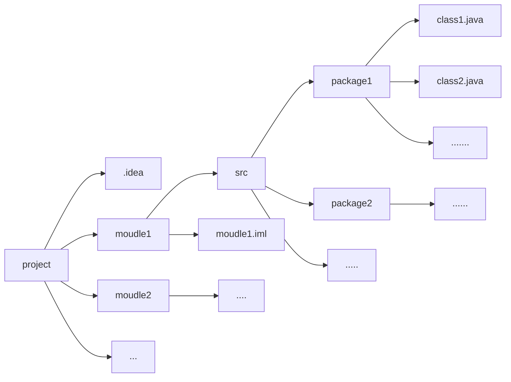

# IDEA

## IDEA的项目结构

## 关于src文件夹和.iml文件

所有java源代码都要放置在src文件夹下

.iml文件目前与我们写代码没啥关系，它里面放置的是一些IDEA的**配置文件**

## 关于out文件夹

所有.class文件都放置在项目下的out文件夹下（经过编译后的字节码文件）

## IDEA基本配置

> 略

## IDEA常用快捷键

|      快捷键      |                    功能                    |
| :--------------: | :----------------------------------------: |
|   `Alt+Enter`    |            导入包，自动修正代码            |
|     `Ctrl+y`     |            ==删除光标所在的行==            |
|     `Ctrl+d`     | ==复制光标所在行，并复制到光标所在行下面== |
|   `Ctrl+Alt+l`   |               ==格式化代码==               |
|     `Ctrl+/`     |               注释/取消注释                |
|  `Ctrl+Shift+/`  |           多行注释/取消多行注释            |
|    `Alt+Ins`     |                自动生成代码                |
| `Alt+Shift+箭头` |               移动当前代码行               |
| `ctrl按住+点击`  |         直接查看所选类/方法的源码          |
|    `shift+F6`    |               批量修改变量名               |

## Java的内存划分

整体上划分为五个部分

1. **栈**(stack)内存：存放的都是方法中的局部变量，方法的运行一定要在栈中运行

   局部变量：方法的参数，方法内部的变量

   作用域：一旦超出作用域{}，立即从栈内存中释放

2. **堆**(heap)内存：凡是new出来的东西，都在堆中

   堆内存里面的东西都有一个地址值：16进制

   堆内存里面的数据，都有一个默认值

   规则：整数 0、浮点数 0.0、字符 '\u0000'、bool false、引用 null

3. 方法区(Method area)：存储.class相关信息，包含方法的信息

4. 本地方法栈(Native Method Stack)：与操作系统相关

5. 寄存器（pc Register）：与CPU相关