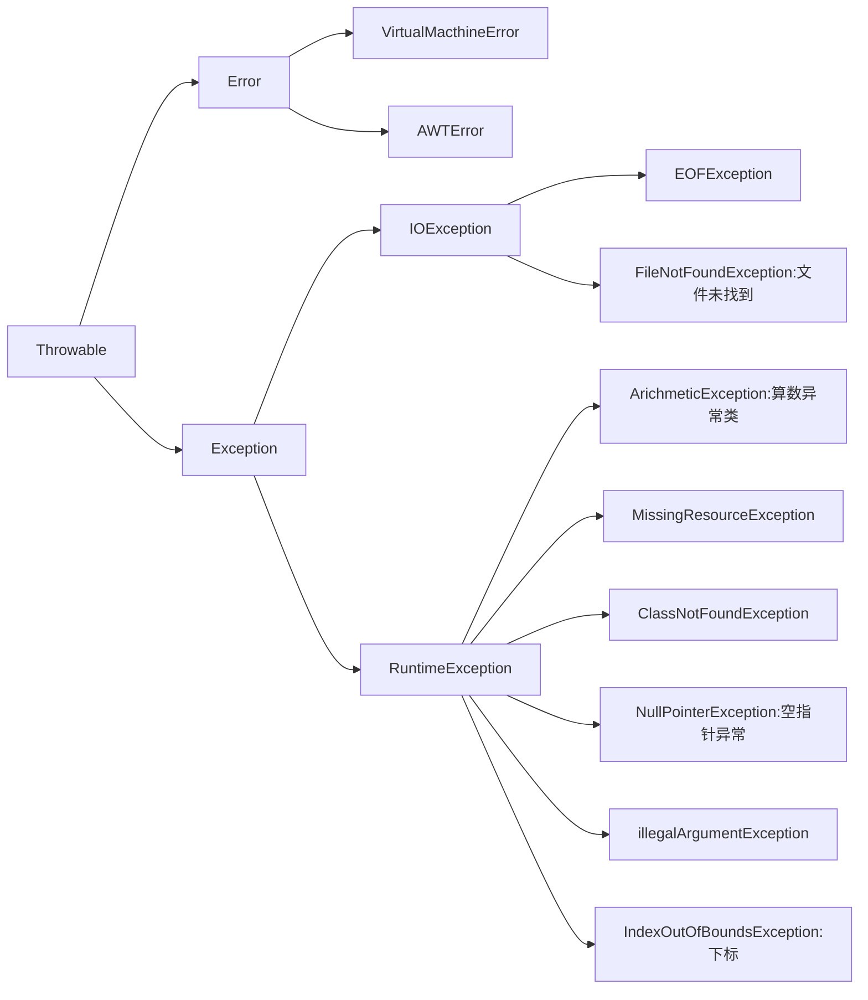

# Java异常分类

- 异常：程序不正常的行为或者状态
  - int a=5/0
  - 数组越界访问
  - 读取文件，结果文件不存在等等
- 异常处理
  - 程序返回到安全状态
  - 允许用户保存结果，并以适当方式关闭程序

Java异常分层图

- Throwable：所有错误的祖先

  - Error：系统内部错误或者资源耗尽。（不用管）

  - ==Exception==：程序有关的异常，需要重点关注

    - RuntimeException：程序自身的错误

      5/0、空指针、数组越界问题等等

    - 非RuntimeException：外界相关的错误

      打开一个不存在的文件、加载一个不存在的类

另外一种分类方式

- Unchecked Exception：（==编译器不会辅助检查的，需要程序员自己管的==）异常，包括Error子类和Runtime Exception子类
- 非RuntimeException的Exception子类：（编译器会辅助检查）异常，checked exception
- Checked Exception：编译器会辅助判断，一般在发生后处理
- Unchecked Exception：以预防为主，不会辅助检查
- Error：我们不用管（y'gai

