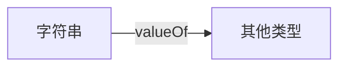
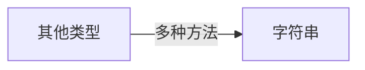
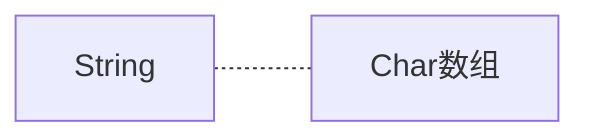

[toc]

# Java核心类

## 字符串与编码

> 这里只记录我目前没了解过的内容

1. 大小写转换

   ```java
   String name="wwt";
   nameBig=name.toUpperCase(name);
   nameSmall=name.toLpperCase(name);
   ```

2. 忽略大小写比较

   ```java
   String name1="wwt";
   String name2="WWT";
   System.out,println(name1.equalsIgnoreCase());//忽略大小写比较
   ```

3. 取得字串的各种方法

   ```java
   String name="wwt";
   "HEllo".contains("llo");//是否包含字串(注意该方法的参数是CharSequence而不是String)
   name.indexOf("HE");//HE字串的起始下标
   name.substring(statIndex,endIndex);//提取字串
   ```

4. 去除首尾空白字符：包括空格、`\t`、`\r`、`\n`

   ```java
   " \tHello\r\n".trim();
   " \tHello\r\n".strip();//会移除中文字符
   ```

5. 字符串替换（replaceAll支持**Regex**）

   ```java
   "String213".replace("213","123");//正常替换
   "String123".replace("[\\d]+",".");//正则表达式匹配替换(注意是贪婪匹配)
   ```

6. 字符串分割：使用split方法，同样支持**Regex**

   ```java
   String s="A,B,C,D,E";
   String ss=s.split("\\,");
   ```
   
7. 字符串拼接：使用join方法

   ```java
   String[] ss={"A","B","C","D"};
   String s=String.join("**",ss);
   ```

8. 格式化字符串：使用formatted和format方法，使用方法和System.out.printf类似（所以直接看例子就行）

   ```java
   public class Main {
       public static void main(String[] args) {
           String s = "Hi %s, your score is %d!";
           System.out.println(s.formatted("Alice", 80));
           System.out.println(String.format("Hi %s, your score is %.2f!", "Bob", 59.5));
       }
   }
   ```

### 类型转换（通用）

> - 要将其他任意基本类型转换为字符串，可以直接使用通用的静态方法`valueOf()`，编译器会根据传入参数自动选择合适的方法
> - 要将字符串转换为其他类型，就需要根据情况考虑



```java
String.valueOf(123); // "123"
String.valueOf(45.67); // "45.67"
String.valueOf(true); // "true"
String.valueOf(new Object()); // 类似java.lang.Object@636be97c
```



```java
//int包装类Integer
int n1=Integer.parseInt("123");//自动拆箱
int n2=Integer.parseInt("0xff",16);//按照指定的机制转换字符串
//Double等包装类也有类似的parse转换字符串的方法
```



```java
char[] cs="Hello".toCharArray();//字符串转换为char[]
String s=new String(cs);//注意这里也是直接复制创建（根据String对象的final修饰符）
```

### 字符串编码

> 始终牢记：Java的`String`和`char`在内存中总是以Unicode编码表示，Unicode为两字节

### StringBuilder和StringBuffer

> Java中支持拼接插入字符串的类，可变对象，操作效率要远远高于String对象
>
> StringBuffer支持同步，但是就效率而言一般都用StringBuilder

```java
StringBuilder sb=new StringBuilder("12123");
for(int i=0;i<1000;i++){
    sb.append(',');
    sb.append(i);//或者直接+i
    sb.insert(0, "Hello, ");
}
```

### 链式操作

> 由StringBuilder引申出来的链式操作
>
> ```java
> public class stringBuilder {
>     public static void main(String[] args) {
>         var sb=new StringBuilder("1232132");
>         System.out.println(sb);
>         sb.append('c').append("123123").append(1231);
>         System.out.println(sb);
>     }
> }
> ```
>
> 查看StringBuilder的源码可以发现，**执行链式操作的关键就是StringBuilder定义的append()方法会返回this对象**

