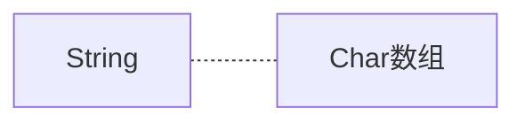

[toc]

# Java核心类

## 字符串与编码

> 这里只记录我目前没了解过的内容

1. 大小写转换

   ```java
   String name="wwt";
   nameBig=name.toUpperCase(name);
   nameSmall=name.toLpperCase(name);
   ```

2. 忽略大小写比较

   ```java
   String name1="wwt";
   String name2="WWT";
   System.out,println(name1.equalsIgnoreCase());//忽略大小写比较
   ```

3. 取得字串的各种方法

   ```java
   String name="wwt";
   "HEllo".contains("llo");//是否包含字串(注意该方法的参数是CharSequence而不是String)
   name.indexOf("HE");//HE字串的起始下标
   name.substring(statIndex,endIndex);//提取字串
   ```

4. 去除首尾空白字符：包括空格、`\t`、`\r`、`\n`

   ```java
   " \tHello\r\n".trim();
   " \tHello\r\n".strip();//会移除中文字符
   ```

5. 字符串替换（replaceAll支持**Regex**）

   ```java
   "String213".replace("213","123");//正常替换
   "String123".replace("[\\d]+",".");//正则表达式匹配替换(注意是贪婪匹配)
   ```

6. 字符串分割：使用split方法，同样支持**Regex**

   ```java
   String s="A,B,C,D,E";
   String ss=s.split("\\,");
   ```
   
7. 字符串拼接：使用join方法，它使用指定的字符串连接字符串数组

   ```java
   String[] ss={"A","B","C","D"};
   String s=String.join("**",ss);
   ```

8. 格式化字符串：使用formatted和format方法，使用方法和System.out.printf类似（所以直接看例子就行）

   ```java
   public class Main {
       public static void main(String[] args) {
           String s = "Hi %s, your score is %d!";
           System.out.println(s.formatted("Alice", 80));
           System.out.println(String.format("Hi %s, your score is %.2f!", "Bob", 59.5));
       }
   }
   ```

### 类型转换（通用）

> - 要将其他任意基本类型转换为字符串，可以直接使用通用的静态方法`valueOf()`，编译器会根据传入参数自动选择合适的方法
> - 要将字符串转换为其他类型，就需要根据情况考虑


```java
String.valueOf(123); // "123"
String.valueOf(45.67); // "45.67"
String.valueOf(true); // "true"
String.valueOf(new Object()); // 类似java.lang.Object@636be97c
```


```java
//int包装类Integer
int n1=Integer.parseInt("123");//自动拆箱
int n2=Integer.parseInt("0xff",16);//按照指定的机制转换字符串
//Double等包装类也有类似的parse转换字符串的方法
```



```java
char[] cs="Hello".toCharArray();//字符串转换为char[]
String s=new String(cs);//注意这里也是直接复制创建（根据String对象的final修饰符）
```

### 字符串编码

> 始终牢记：Java的`String`和`char`在内存中总是以Unicode编码表示，Unicode为两字节

### StringBuilder和StringBuffer

> Java中支持拼接插入字符串的类，可变对象，操作效率要远远高于String对象
>
> StringBuffer相比StringBuilder支持同步，但是就效率而言**一般都用StringBuilder**
>
> 其实现原理是通过预分配缓冲区，并且和C++类似，会进行动态扩容，只有当append内容超出capcity的时候，才会重新分配空间。
>
> 当需要append的次数过大的时候，可以通过预分配空间的方式提高效率
>
> ```java
> var sb=new StringBuilder(1000);//预分配了1000字节的
> ```

```java
StringBuilder sb=new StringBuilder("12123");
for(int i=0;i<1000;i++){
    sb.append(',');
    sb.append(i);//或者直接+i
    sb.insert(0, "Hello, ");
}
```

使用System.currentTineMillis比较StringBuilder和StringBuffer的运行效率

```java
package p1;

public class StringTest {
    public static void main(String[] args) {
        int n=100000000;
        long startT,endT;
        //只能通过getInstance方法获取其子类
        var sb=new StringBuilder();
        var sB=new StringBuffer();
        System.out.println("StringBuilder Test");
        startT=System.currentTimeMillis();//获取ms时间
        //System.nanoTime();//获取ns时间
        for(int i=0;i<n;i++){
            sb.append("1234");
        }
        endT=System.currentTimeMillis();
        System.out.println("共耗时"+(endT-startT)+"ms");
        System.out.println("StringBuffer Test");
        startT=System.currentTimeMillis();//获取ms时间
        for(int i=0;i<n;i++){
            sB.append("1234");
        }
        endT=System.currentTimeMillis();
        System.out.println("共耗时"+(endT-startT)+"ms");
    }
}

```

#### 链式操作

> 由StringBuilder引申出来的链式操作
>
> ```java
> public class stringBuilder {
>     public static void main(String[] args) {
>         var sb=new StringBuilder("1232132");
>         System.out.println(sb);
>         sb.append('c').append("123123").append(1231);
>         System.out.println(sb);
>     }
> }
> ```
>
> 查看StringBuilder的源码可以发现，**执行链式操作的关键就是StringBuilder定义的append()方法会返回this对象**

### StringJoiner

> 如果想要高效的拼接字符，应该使用StringBuilder
>
> 但是呢，很多时候，我们需要拼接的字符串像这样`a,b,c,d,e,d,f,d`
>
> ```java
> public class Main{
>     public static void main(String[] args){
>        	String[] name={"a","b","c","d"};
>         var sb=new StringBuilder();
>         for(var i:name){
>             sb.append(i).append(",");
>         }
>         sb.delete(sb.length()-1,sb.length());//删除末尾多添加的","
>         System.out.println(sb);
>     }
> }
> ```
>
> 但是这样的效率较低且实现繁琐，这里推荐使用Java内置的类StringJoiner
>
> 使用方法
>
> ```java
> var sJ=new StringJoiner("sep","start","end");//指定分隔字符串，起始字符串和结束字符串
> ```

```java
package p1;

import java.util.StringJoiner;

public class StringJoinerTest{
    public static void main(String[] args){
        long start,end;
        int n=10000000;
        var sb=new StringBuilder();
        var sJ=new StringJoiner(",");
        System.out.println("StringBuilder Test");
        start=System.currentTimeMillis();
        for(int i=1;i<n;i++){
            sb.append(i).append(",");
        }
        sb.delete(sb.length()-1,sb.length());//删除末尾多添加的","
        end=System.currentTimeMillis();
        System.out.println(end-start);
        System.out.println("StringJoiner Test");
        start=System.currentTimeMillis();
        for(int i=1;i<n;i++){
            sJ.add(Integer.toString(i));
        }
        end=System.currentTimeMillis();
        System.out.println(end-start);
    }
}
```

- 利用StringJoiner添加此类字符，可以将时间优化到原来的一半左右。

## JavaBean

> 符合某种**类型定义规范**的class被称为JavaBean类

- 使用*private*来修饰属性，使用*public*来操作属性

- 并且属性的读写方法分别以`get`和`set`开头

  ```java
  //举个例子
  public class Person{
      private String name;
      private int age;
      
      public Person(String name,String age){
          this.name=name;
          this.age=age;
      }
      public String getName(){
          return this.name;
      }
      public void setName(String name){
          this.name=name;
      }
      public int getAge(){
          return this.age;
      }
      public void setAge(){
          this.age=age;
      }
  }
  ```
  
  通常将一组对应的读方法（getter）和写方法（setter）称为属性
  
  将**只有`getter`方法的属性**称为只读属性（常见）
  
  将**只有`setter`方法的属性**称为只写属性（较少见）
  
  $Attention:getter和setter的定义也是数据封装的一种方法$
  
  ### 关于JavaBean的作用
  
  > JavaBean主要用于<font color="red">传递数据</font>，**即把一组数据合并成一个JavaBean便于数据传输**。（妙啊）
  
  ## 枚举类
  
  首先看两个比较来体会枚举类的作用
  
  <font color="orange">普通类</font>

```java
public class WeekDay{
    public static final int SUN = 0;
    public static final int MON = 1;
    public static final int TUE = 2;
    public static final int WED = 3;
    public static final int THU = 4;
    public static final int FRI = 5;
    public static final int SAT = 6;
}
```

<font color="orange">枚举类</font>

```java
public enum WeekDay{
    SUN,MON,TUE,WED,TUE,FRI.SAT
}
```

就直接看普通类和枚举类的区别，明显可以感觉出代码量的巨大区别，下面再来看看普通类在使用上的问题

```java
if (day == Weekday.SAT || day == Weekday.SUN) {
    // TODO: work at home
}
```

1. 如果day=7，同样可以和SUN比较，编译器无法检查比较范围
2. 定义的常量可以和其他类型（指只要是int类型就能比较）的常量比较，不符合面向对象的思想

所以需要引入枚举类

---

- 首先，`enum`常量本身带有类型信息，即`Weekday.SUN`类型是`Weekday`，编译器会自动检查出类型错误
- 不同类型的枚举不能互相比较或者赋值，因为类型不符。例如，不能给一个`Weekday`枚举类型的变量赋值为`Color`枚举类型的值

这就使得编译器可以在编译期间就自动检查出所有可能潜在的错误

enum是一种引用类型，但是它也可以使用`==`直接比较（**类比常量池，枚举类在JVM中只有唯一的示例**）

### 关于enum枚举类的特点

举个例子看一下就行

定义color枚举类

```java
public enum Color{
    RED,GREEN,BLUE;
}
```

经过编译器编译得到的class大概如下

```java
public final class Color extends Enum { // 继承自Enum，标记为final class
    // 每个实例均为全局唯一:
    public static final Color RED = new Color();
    public static final Color GREEN = new Color();
    public static final Color BLUE = new Color();
    // private构造方法，确保外部无法调用new操作符:
    private Color() {}
}
```

1. final决定了无法继承
2. private决定了无法使用new实例化
3. static决定了每个实例都是唯一实例

### 枚举类常用方法

- name()：返回常量名

  ```java
  String s=WeekDay.SUN.name();//"SUN"
  ```

- ordinal()：返回实例在类中的顺序，默认从0开始计数

  可以定义private构造方法自定义常量顺序（此顺序和ordinal返回的不同）

  ```java
  enum Weekday {
      MON(1), TUE(2), WED(3), THU(4), FRI(5), SAT(6), SUN(0);
  
      public final int dayValue;
  
      private Weekday(int dayValue) {
          this.dayValue = dayValue;
      }
  }
  ```

- toString()：返回值和name()一致，但是和name()的区别在于toString()可以被重写，这就导致了你可以**自定义enum实例的别名**，这使得调用toString的时候更具备可读性。

  ```java
  enum Weekday {
      MON(1, "星期一"), TUE(2, "星期二"), WED(3, "星期三"), THU(4, "星期四"), FRI(5, "星期五"), SAT(6, "星期六"), SUN(0, "星期日");
  
      public final int dayValue;
      private final String chinese;
  
      private Weekday(int dayValue, String chinese) {
          this.dayValue = dayValue;
          this.chinese = chinese;
      }
  
      @Override
      public String toString() {
          return this.chinese;
      }
  }
  ```

## 记录类

> 直接跳过，暂时用不到

## 大数类

> 这个之前看过，所以直接记录不会的方法即可

### BigInteger

BigInteger继承自Number类，并且Number类定义了转换为基本类型的几个方法

- 转换为`byte`：`byteValue()`
- 转换为`short`：`shortValue()`
- 转换为`int`：`intValue()`
- 转换为`long`：`longValue()`
- 转换为`float`：`floatValue()`
- 转换为`double`：`doubleValue()`

​	因此，通过上述方法，可以把`BigInteger`转换成基本类型。如果`BigInteger`表示的范围超过了基本类型的范围，转换时将丢失高位信息，即结果不一定是准确的。如果需要**准确地转换成基本类型**，<u>可以使用`intValueExact()`、`longValueExact()`等方法</u>，在转换时如果超出范围，将直接抛出`ArithmeticException`异常。

### BigDecimal

> 直接跳过！

## 常用工具类

### Math

> 大部分方法和C++、Python一致

```java
Math.abs(-100); // 100
Math.abs(-7.8); // 7.8
Math.max(100, 99); // 100
Math.min(1.2, 2.3); // 1.2
Math.pow(2, 10); // 2的10次方=1024
Math.sqrt(2); // 1.414...
Math.exp(2); // 7.389...
Math.log(4); // 1.386...
Math.log10(100); // 2
Math.sin(3.14); // 0.00159...
Math.cos(3.14); // -0.9999...
Math.tan(3.14); // -0.0015...
Math.asin(1.0); // 1.57079...
Math.acos(1.0); // 0.0
//数学常量
double pi = Math.PI; // 3.14159...
double e = Math.E; // 2.7182818...
Math.sin(Math.PI / 6); // sin(π/6) = 0.5
```

### 随机类

#### 伪随机数：$Random$

> `var r=new Random(seed)`，不显式说明seed的时候，会默认使用当前的时间戳作为种子，所以每次产生的随机出序列不同

```java
Random r = new Random();
r.nextInt(); // 2071575453,每次都不一样
r.nextInt(10); // 5,生成一个[0,10)之间的int
r.nextLong(); // 8811649292570369305,每次都不一样
r.nextFloat(); // 0.54335...生成一个[0,1)之间的float
r.nextDouble(); // 0.3716...生成一个[0,1)之间的double
```

#### 安全随机数：$SecureRandom$

> 注意这是**安全随机数**，但不是**真随机数**（真随机数只能通过量子力学原理来获取）
>
> `var sr=new SecureRandom()`
>
> SecureRandom无法指定种子，它使用的是RNG算法。
>
> 实际使用的时候，可以优先获取高**强度的安全随机数生成器**，如果没有提供，再使用普通等级的安全随机数生成器

```java
public class Main {
    public static void main(String[] args) {
        SecureRandom sr = null;
        try {
            sr = SecureRandom.getInstanceStrong(); // 获取高强度安全随机数生成器
        } catch (NoSuchAlgorithmException e) {
            sr = new SecureRandom(); // 获取普通的安全随机数生成器
        }
        byte[] buffer = new byte[16];
        sr.nextBytes(buffer); // 用安全随机数填充buffer
        System.out.println(Arrays.toString(buffer));
    }
}
```

> 安全随机数的主要应用范围在密码学中

