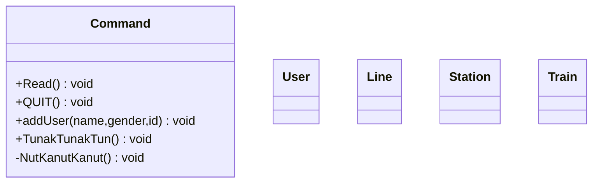

# CTS

## 整体UML图

核心类分析

1.   `Command`类

     实现整体的数据操控，命令行控制类

     `Read`方法从命令行中获取指令并且根据输入的指令调取各种不同的方法

     -   *QUIT*：退出售票系统
     -   *addUser [姓名] [性别] [卡号]*：添加用户
     -   *TunakTunakTun*：从标准模式进入超级管理员模式
     -   *NutKanutKanut*：退出超级管理员模式
     -   *addLine 线路编号 负载能力 站点名k 里程数k*：（超级管理员模式）添加
     -   *delLine 线路编号*：（超级管理员模式）删除路线
     -   *addStation 线路编号 新站点名 里程数*：（超级管理员模式）添加车站
     -   *delStation 线路编号 站点名*：（超级管理员模式）删除车站
     -   *lineInfo 线路编号*：输出线路信息
     -   *listLine*：列出所有线路的信息
     -   *addTrain 列车车次 线路号 坐席1票价 坐席1张数 坐席2票价 坐席2张数 坐席3票价 坐席3张数*：（超级管理员模式）添加列车
     -   *delTrain 列车车次*：（超级管理员模式）删除列车
     -   *checkTicket 列车车次 出发站 目的站 席位代号*：查询列车余票和票价信息
     -   *listTrain 线路编号*：列出某线路上的所有列车信息
     -   *login Aadhaar卡号 姓名*：用户登录，购票前序操作
     -   *logout*：用户登出
     -   *buyTicket 列车车次 出发站 目的站 席位代号 张数*：购买车票
     -   *listOrder*：查询自己已经购买了的车票

     注：这里的席位代号不是正常的席位代号，而是车票类型

     关于报错优先级，**命令名称>参数数量>参数合法性（从左到右）**

     数据存储直接使用单例模式存在内存里就行，没有要求需要长期存储

     超级管理员的权限可以通过内部类来实现

## Read函数分析

可能的获取参数

报错信息输出

1.   命令不存在`Command does not exist`
2.   对应参数数量和类型是否正确，若不正确则输出`Arguments illegal`
3.   命令规定的异常处理内容，按照上文描述依次检验处理

4.   其他错误处理，发生未在上述列举出的错误，输出`Unknown error`

|     选项      |                             参数                             |                    含义                    |   枚举名    | 报错信息1 | 报错信息2 | 报错信息3 | 报错信息4 |
| :-----------: | :----------------------------------------------------------: | :----------------------------------------: | :---------: | :-------: | :-------: | :-------: | :-------: |
|     QUIT      |                              ——                              |                  退出程序                  |    QUIT     |           |           |           |           |
|    addUser    |                        姓名-性别-卡号                        |                  添加用户                  |   ADDUSER   |           |           |           |           |
| TunakTunakTun |                              ——                              |               进入管理员模式               |   UPGRADE   |           |           |           |           |
| NutKanutKanut |                              ——                              |               退出管理员模式               |  DOWNGRADE  |           |           |           |           |
|    addLine    |         线路编号-负载能力-站点名（多）-里程数（多）          |                  添加路线                  |   ADDLINE   |           |           |           |           |
|    delLine    |                           线路编号                           |                  删除路线                  |   DELLINE   |           |           |           |           |
|  addStation   |                   线路编号-新站点名-里程数                   |                  添加站点                  | ADDSTATION  |           |           |           |           |
|  delStation   |                       线路编号-站点名                        |                  删除站点                  | DELSTATION  |           |           |           |           |
|   lineInfo    |                           线路编号                           |             展示某条线路的信息             |  LINEINFO   |           |           |           |           |
|   listIine    |                              ——                              | 展示所有线路的信息（按照线路编号升序展示） |  LISTIINE   |           |           |           |           |
|   addTrain    | 列车车次-线路号-坐席1票价-坐席1张数-坐席2票价-坐席2张数-坐席3票价-坐席3张数 |                添加一班列车                |  ADDTRAIN   |           |           |           |           |
|   delTrain    |                           列车车次                           |                删除一班列车                |  DELTRAIN   |           |           |           |           |
|  checkTicket  |               列车车次-出发地-目的地-席位代号                |           查询列车余票和票价信息           | CHECKTICKET |           |           |           |           |
|   listTrain   |                           线路编号                           |         列出某线路上的所有列车信息         |  LISTTRAIN  |           |           |           |           |
|     login     |                       Aadhaar卡号-姓名                       |                  用户登录                  |    LOGIN    |           |           |           |           |
|    logout     |                              ——                              |                  退出登录                  |   LOGOUT    |           |           |           |           |
|   buyTicket   |             列车车次-出发地-目的地-席位代号-张数             |                用户购买车票                |  BUYTICKET  |           |           |           |           |
|   listOrder   |                              ——                              |              查询已购买的车票              |  LISTORDER  |           |           |           |           |
|               |                                                              |                                            |             |           |           |           |           |

1.   命令不存在`Command does not exist`（已实现）
2.   对应参数数量和类型是否正确，若不正确则输出`Arguments illegal`（已实现）
3.   命令规定的异常处理内容，按照上文描述依次检验处理

4.   其他错误处理，发生未在上述列举出的错误，输出`Unknown error`（已实现）

