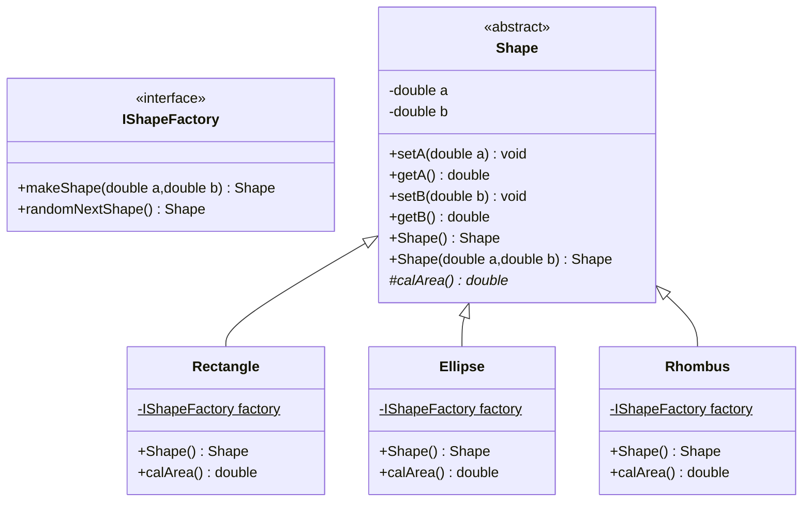

# UML类图绘制

```mermaid
classDiagram
class IShapeFactory{
	<<interface>>
	+makeShape(double a,double b) Shape
	+randomNextShape() Shape
}
class Shape{
	<<abstract>>
	-double a
	-double b
	+setA(double a) void
	+getA() double
	+setB(double b) void
	+getB() double
	+Shape() Shape
	+Shape(double a,double b) Shape
	#calArea()* double
}
class Rhombus{
	-IShapeFactory factory$
	+Shape() Shape
	+calArea() double
}
class Rectangle{
	-IShapeFactory factory$
	+Shape() Shape
	+calArea() double
}
class Ellipse{
	-IShapeFactory factory$
	+Shape() Shape
	+calArea() double
}
Shape<|--Rectangle
Shape<|--Ellipse
Shape<|--Rhombus
```

