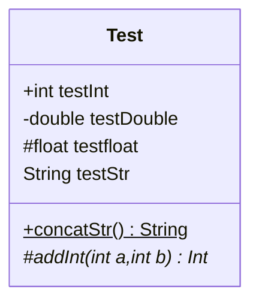
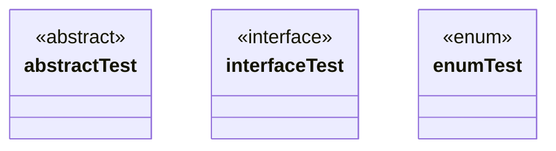
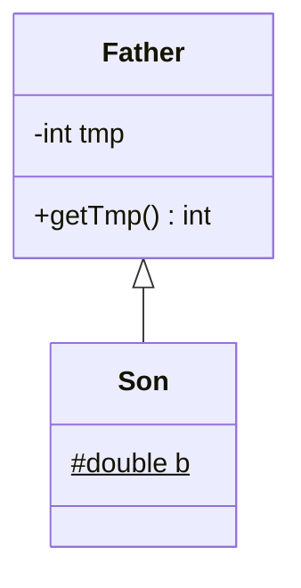
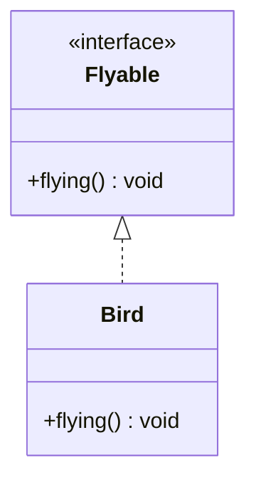
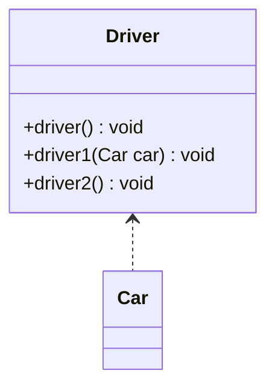
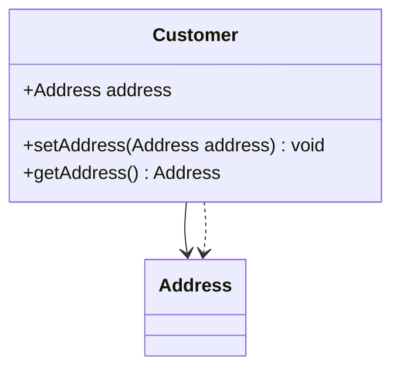
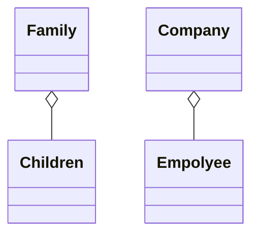
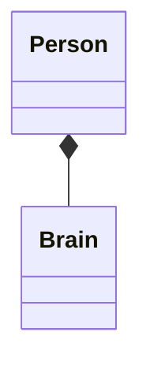
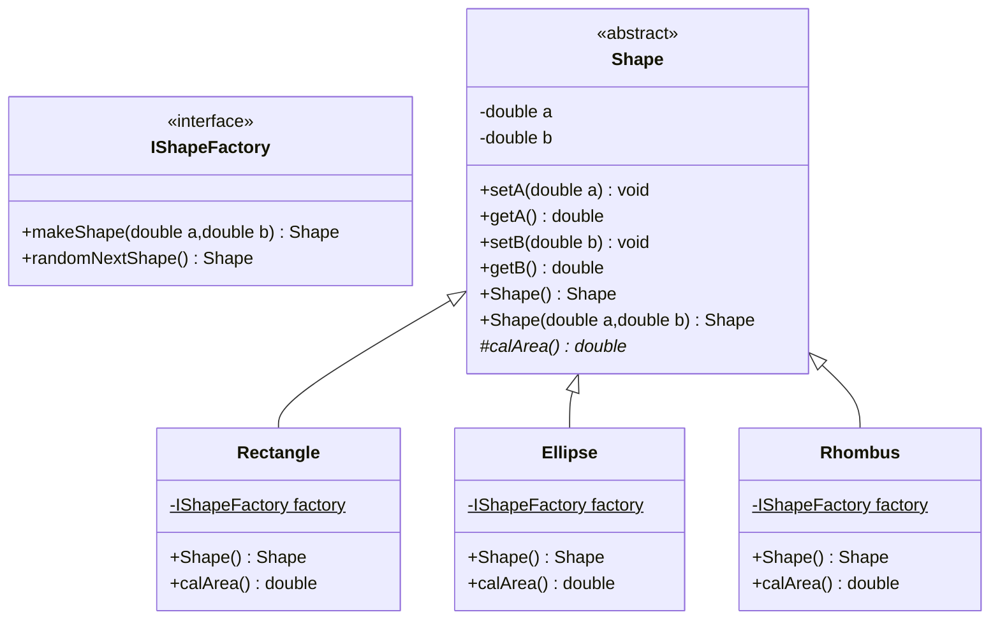

# UML类图绘制规范

>   懒得使用各种绘图工具来绘制UML类图，所以直接选择使用Typora内部支持的Mermaid语法来使用代码绘制UML类图
>
>   *Plus:*<u>顺带梳理一下Java中类与类之间的基本关系</u>

## UML类图绘制基本语法

### 修饰符

|  修饰符   | 表示方法 |        具体实例         |
| :-------: | :------: | :---------------------: |
|  public   |   `+`    |       `+int test`       |
|  private  |   `-`    |       `-int test`       |
| protected |   `#`    |       `#int test`       |
|  default  |   `空`   |       `int test`        |
|  static   |   `$`    |       `int test$`       |
| abstract  |   `*`    | `someAbstractMethod()*` |



### 抽象类、接口表示

|  类型  |    表示方法     | 具体实例 |
| :----: | :-------------: | :------: |
| 抽象类 | `<<abstract>>`  |    ——    |
|  接口  | `<<interface>>` |    ——    |
| 枚举类 |   `<<enum>>`    |    ——    |



## UML类图绘制之关系

>   各类关系汇总
>
>   ==泛化（继承）、实现、依赖、组合、聚合、关联==

### 泛化/继承（Generalization/Inheritance）

>   就是继承关系（`“is-a”`关系），子类与父类之间的继承关系

```java
class Father{
    private int tmp;
    public int getTmp(){
        return tmp;
    }
}
class Son extends Father{
    protected static double b;
}
```



### 实现（Realization）

>   就是`implements`，是类与接口之间的关系

```java
public interface Flyable{
    public void flying();
}
public class Bird implements Flyable{
    public void flying(){
        System.out.println("I can fly");
    }
}
```



### 依赖（Dependency）

>   依赖关系，即`“use-a”`关系，依赖关系就是一个类使用到了另外一个类B（“弱引用”），这种使用关系是==具有偶然性、临时性的、非常弱的==，但是类B的变化会影响到类A。
>
>   在代码层面，体现为***类B作为参数被类A在某个method方法中使用等等***
>
>   <u>一般而言，依赖关系在JAVA中体现为局域变量、==方法的形参==，或者对静态方法的调用</u>

```java
public class Driver{
    public void driver(){
        Car car=new Car();//局部变量
    }
    public void driver1(Car car){};//方法参数
    public void driver2(){
        Car.move();//静态方法的调用
    }
}
```



### 关联（Association）

>   关联关系（`“has-a”`），是类与类之间的联结。
>
>   关联体现的是两个类之间语义级别的一种强依赖关系，这种关系比依赖更强，不存在依赖关系的偶然性，关系也不是临时性的，而是**长期的**，关联可以是双向的也可以是单项的
>
>   代码层面的体现：如果A单项关联B，则可以说`A has B`，通常表现为A中具备B的全局变量

```java
public class Customer {  
    public Address address;  
    public void setAddress (Address address){        
        this.address= address;  
    }
    public Address getAddress (){          
        return address;  
    }
}  
```



#### 聚合（Aggregation）

>   聚合是关联关系的一种特例，体现的是整体和部分的关系。
>
>   此时的整体与部分是可分离的，它们可以具有各自的生命周期，==部分可以属于多个整体对象，也可以被多个整体对象共享==
>
>   比如计算机与CPU、公司与员工之间的关系等等
>
>   在代码层面，和关联关系是一致的，只能从语义级别上来区分
>
>   <font color="red">聚合关系中作为成员变量的类一般使用set方法赋值（因为它们的生命周期不是同时开始的）</font>



#### 组合（Composition）

>   是关联关系（`has-a`）的强调，级别比聚合关系更高（`contain-a`）
>
>   同样体现的是整体与部分的关系，但是==此时的整体和部分是不可分的，整体生命周期的结束也意味着部分生命周期的结束==，比如人和人的大脑。
>
>   <font color="red">在JAVA中，组合关系一般使用成员变量来实现，组合关系中的成员变量一般会在==构造方法==中赋值</font>







