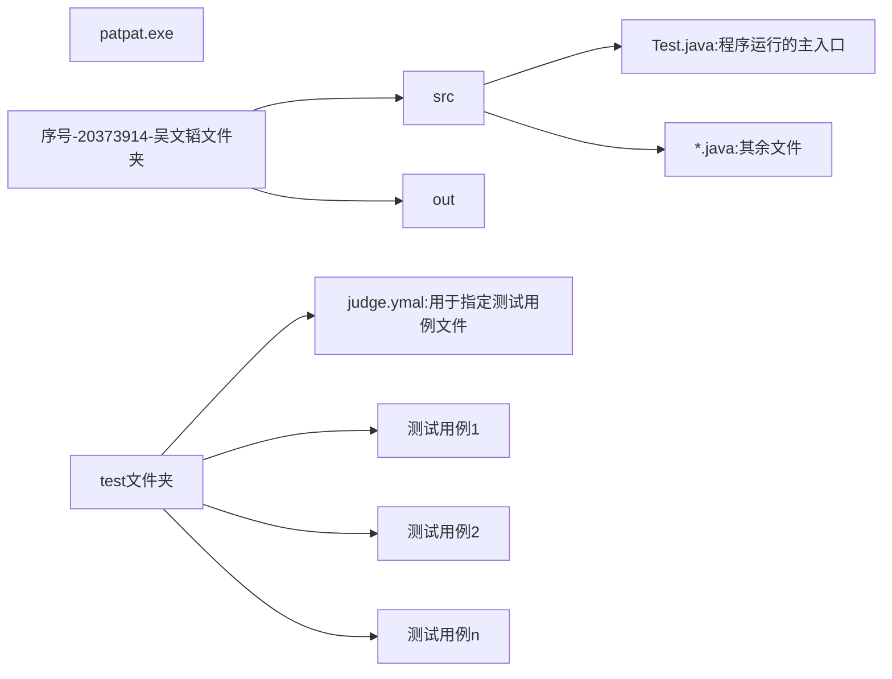

# 关于评测代码

## 提交代码的文件结构

> test文件夹中的内容主要是用于本地测评的



## 注册账号

1. 在patpat.exe所在的目录下打开命令行，或者直接打开然后cd过去

2. 输入`patpat.exe reg -sid 20373914 -pwd q1270414897`

   显示Registration Success，代表注册成功

## 本地评测

### 本地评测数据编写

#### judge.yaml

> 用于指定测试数据集合
>
> ```shell
> tests:[testcase1.yaml,testcase2.yaml,....]
> ```

#### testcase.yaml

> 测试数据

```shell
name: testcase2 # 注意这里需要空空格
data:
  -
    - |
      quit
      quit1
      quit my name
      QUIT
    - haoye!
```

测试指令

```shell
patpat.exe stu -judge 实验序号-20373914-吴文韬 
```

## 线上评测

```shell
patpat.exe ta -judge 实验序号-20373914-吴文韬 -pwd q1270414897 -tag 标注(随便写)
```

