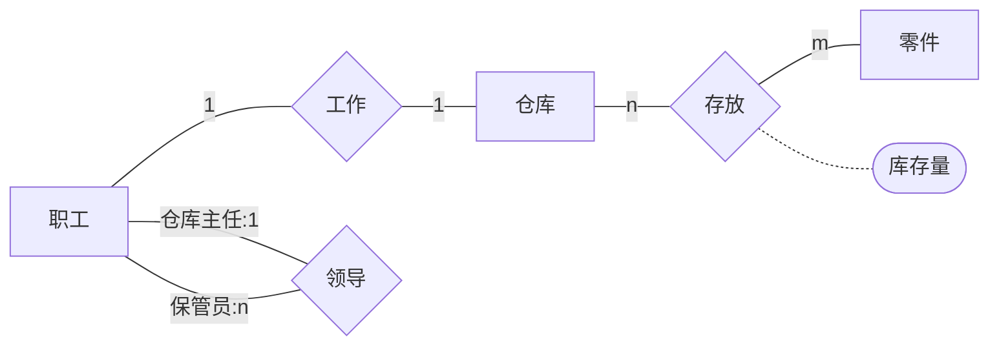
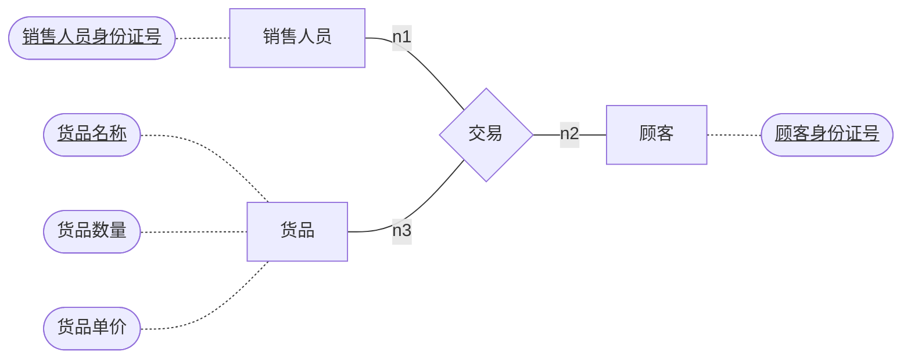
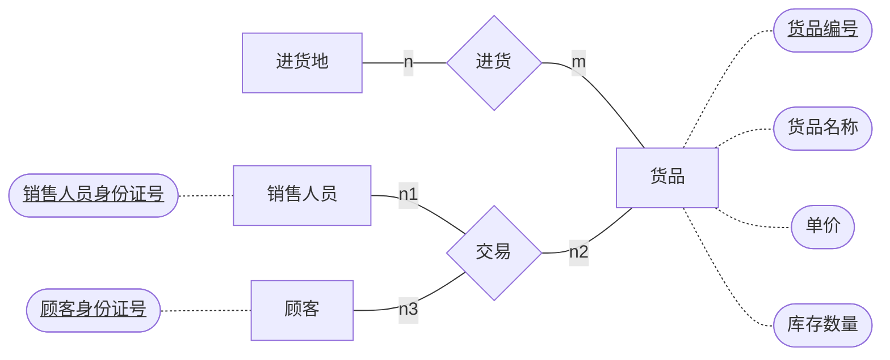

[toc]

# ER模型习题

## 课上习题

> 一个**仓库**可以存放多种零件，一种**零件**可以存放在多个仓库中。
>
>  某种零件在某个仓库中的数量用**库存量**描述。
>
> 一个仓库有多个职工当仓库保管员。
>
> 一个职工只能在一个仓库工作。 
>
> 职工之间具有领导被领导的关系，即仓库主任领导若干保管员。

### 具体分析

1. 仓库和零件之间是**多对多**的存放关系
2. 存放关系的**属性**：库存量
3. 职工分为仓库主任和保管员，领导关系为**一元关系**，且仓库主任和保管员之间为一对多关系
4. 职工与仓库之间为**一对一**的工作关系

### 具体实现

## 1.0

> 现开发一套销售管理系统，需保存交易记录信息，包括销售人员身份证号、顾客身份证号、售卖货品名称、数量、单价。请绘制数据库建模的ER图。

### 具体分析

> 主旨：开发一套销售关系系统
>
> 实体：销售人员、顾客、货品
>
> 关系：销售人员、顾客、货品之间的三元交易关系
>
> ~~因为要保存的是交易记录，所以感觉应该以交易这个关系为**中心**展开~~
>
> ~~**并且因为一条交易记录只有依靠题目中的所有属性才能唯一确定，所以我感觉应该把所有属性放在交易关系上**~~
>
> 不把销售人员和顾客归为一类是因为这样建模结构更加清晰

### 具体实现

## 2.0

> 现开发一套销售管理系统，需保存进销存信息，包括：1). 货品清单，包括货品编号、货品名称、单价、库存数量；2). 交易记录，包括销售人员身份证号、顾客身份证号、售卖货品编号。请绘制数据库建模的ER图。

### 具体分析

> 实体：进货地、货品、销售人员、顾客
>
> 关系：进货地与货品之间的多对多进货关系、销售人员顾客和货品之间的三元交易关系

### 具体实现

## 3.0

> 现开发一套销售管理系统，需保存进销存信息，包括：1). 货品清单，包括货品编号、货品名称、单价、库存数量；2). 人员信息，包括人员身份证号，姓名，性别；3). 交易记录，包括销售人员身份证号、顾客身份证号、售卖货品编号。请绘制数据库建模的ER图。

### 具体分析

## 4.0

> 现开发一套销售管理系统，需保存进销存信息，包括：1). 货品清单，包括货品编号、货品名称、单价、库存数量；2). 销售人员信息，包括人员身份证号，姓名，性别，职级，薪水； 3). 顾客信息，包括身份证号，姓名，会员卡号，生日； 4). 交易记录，包括销售人员身份证号、顾客身份证号、售卖货品编号。请绘制数据库建模的ER图。

### 4.1

> 进一步的，若要记录的是口罩销售，每人限定只能买一次，怎样建模

