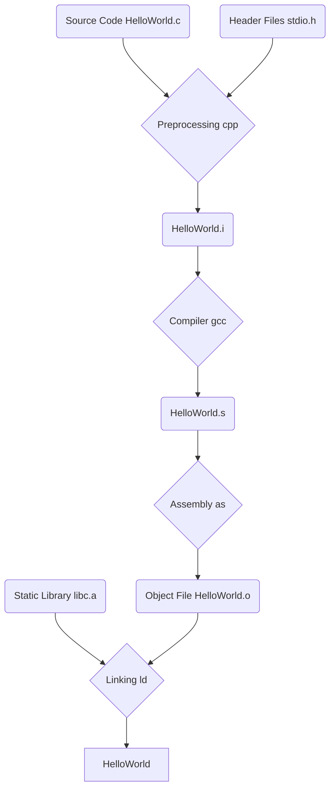

# 编译、链接详解

```c
#include<stdio.h>
int main(){
	printf("Hello,World!\n");
}
```

## Linux编译过程总体概览



Attention：printf函数的定义在链接的时候才被加入到文件中

## 预编译

> 预编译过程主要是处理源代码中那些以#开头的**预编译指令**，具体来说
>
> - 处理#define，将所有的宏定义#define展开
> - 处理#if、#else、#endif等等条件编译指令
> - 处理#include，原地插入文件
> - 删除所有注释

```shell
gcc HelloWorld.c -E -o HelloWorld.i
# 通过上述指令对源文件进行预编译
```

使用HelloWorld.c来进行一个测试

```c
//HelloWorld.c
#include<stdio.h>
#define MACRO 4 //宏定义MACRO
int main(){
    int i;
    printf("Hello,World!\n");
    i=MACRO;/*this is comment line*/
    #include "const_table.h" //自定义头文件
    return 0;
}
//const_table.h中的内容如下
const char table[10]={0,1,2,3,4,5,6,7,8,9};
```

执行预编译指令`gcc HelloWorld.c -E -o HelloWorld.i`

再来看看HelloWorld.i中相比HelloWorld.c中多了什么东西

主要看看主程序那一块


1. 将`MACRO`宏定义替换为了常量4
2. 将`const_table.h`和`stdio.h`中的内容插入了`HelloWorld.i`中
3. 删除了所有注释

## 编译

> 编译过程是最核心也是最复杂的过程，它主要是对于编译完的文件进行词法、语法、语义分析并进行优化，最终产生对应的汇编文件

可以使用如下命令来调用编译器

```shell
gcc HelloWorld.i -S -o HelloWorld.s
```

> 因为编译过于复杂所以不学（bushi

---

## 汇编

> 汇编器把汇编代码转换为目标文件，比较单纯。

```shell
as HelloWorld.s -o HelloWorld.o
```

汇编完后转换为elf文件（可执行、可装载格式），此时无法使用`vim HelloWorld.o`打开（只会得到一堆乱码）

此时需要使用特定的指令进行反汇编解析：`objdump -h HelloWorld.o`


上述内容将在下面进行讲解

### 链接

> - 链接器最终将多个目标文件链接起来形成可执行文件
>
> <font color="red">为什么需要链接？</font>
>
> 简单来说每个源代码模块都能独立的进行编译，而**链接要做的就是处理各个模块之间的互相引用**。
>
> 比如HelloWorld.c中的main函数其实并不知道printf这个函数的**地址**，链接器在链接的时候会根据**引用到的符号printf**，自动去相应的模块查找printf的地址，然后将HelloWorld.c模块中引用到的printf的指令进行**重新修正（重定位）**，让它的目标地址称为**真正的printf函数的地址**，这个就是链接的基本过程。

链接分为<font color="orange">静态链接</font>和<font color="red">动态链接</font>

```shell
gcc HelloWorld.c -o hello # 这是动态链接
```

下面首先来看看静态链接的过程。

```shell
gcc HelloWorld.c -o -static hello_st
```

通过`ls -ll`查看动态链接和静态链接的区别


非常明显，两者的**文件大小**差别非常大

## Linux目标文件

> Linux下的可执行文件的格式称为ELF格式（Executable Linkage Format）
>
> Linux下的目标文件只是没有经过链接的过程，它本身的格式就是按照可执行文件的格式存储的，只是结构稍有不同

- ELF文件的内容是按照**“段（section）”**的形式进行存储的

下面可以通过具体的例子来看看ELF文件中是什么样子

```shell
file filename # file命令可以用于查看文件的格式
```


- relocatable：可重定位的文件

再来看看可执行文件的文件格式


