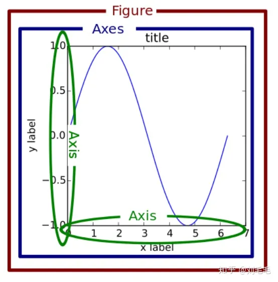
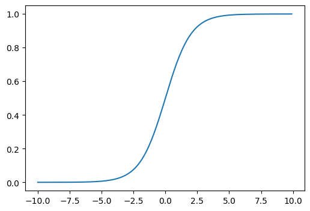
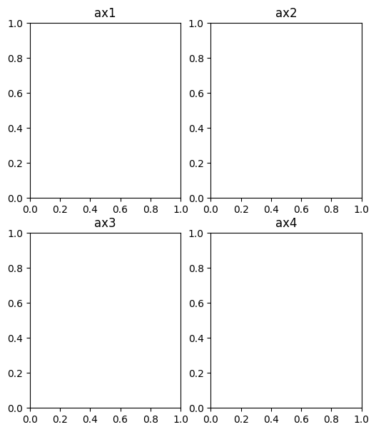
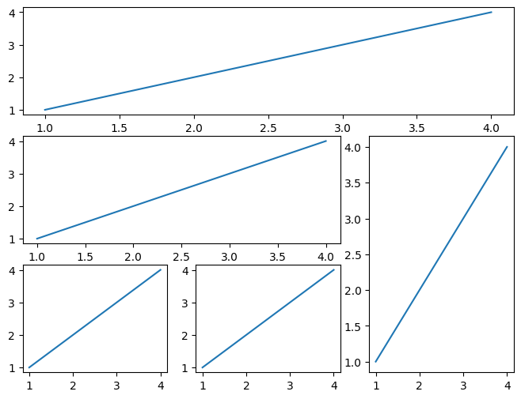

[toc]

# pyplot 绘图

> 其实一年前就有想法好好学学 python 里的画图库 matplotlib 库，主要是因为每次可视化一些结果的时候，都是搜一些别人写好的代码，看的时候感觉乱乱的，不是说别人写的乱，而是每个人在某些点上实现的方式不太一样，还有就是觉得，总用别人的，就觉得不是自己创造的，没有成就感。这段时间做了个比赛，可视化分析的时候，又在搜代码，想自己加点东西，感觉很费劲，又不知道该怎么加，所以决定好好学一下，并做好总结。[^1]
>
> 该段话出自某知乎文章，个人认为和自己学习 pyplot 绘图的目的如出一辙，每次都是用到了再学，总觉得学到的东西零散不成体系，这次就借着最近刚好有大量函数绘图的需求，来系统的学习一下这个 Python 非常出名的绘图库

## 基本绘图原理

> 在 pyplot 绘图中，有三个非常重要的概念需要理解，它们分别是 figure、axes、axis

-   `figure`: 画布，顾名思义，所有图像都绘制在画布上
-   `axes`: 坐标系，如果画布是母图的话，那么坐标系就是一幅幅子图
-   `axis`: 坐标轴，每一幅图像的 x、y、z 轴

具体可以参照下面给出的官方图 👇🏻



绘制一副图，首先**创建画布**，然后**创建坐标系**(_根据情况可能需要创建多个_)，最后**根据提供的数据绘制图像**+**添加图例注释**等等，这就是 pyplot 绘图的 4 个基本步骤

pyplot 也支持不创建坐标系直接绘图，那样的话会以整个画布为默认坐标系，_这类绘图的缺点是同一画布无法绘制多幅图像_[^2]

下面是绘图的基本代码

```python
# math和numpy库也经常需要使用所以顺便导入
import numpy as np
import matplotlib.pyplot as plt

# 绘图函数
def f1(i):
    return 1 / (1 + math.exp(-i))

# 创建数据集
x = np.arange(-10, 10, 0.1)
y = []
for i in x:
    y.append(f1(i))
# 创建画布(num是画布编号「num会影响画布绘制的顺序等等」，figsize指定画布大小)
fig = plt.figure(num=1, figsize=(6, 4))
# 添加坐标系，其中1,1,1代表nrows=1，ncols=1，index=1,代表该画布为1x1，并且坐标系绘制在第一个位置上
# 也有另外一种表达位置的方法，比如222，等价于(2,2,2)
ax = fig.add_subplot(1, 1, 1)
# 根据数据绘制图形(plot()方法只是将各个点直线连接而已)
ax.plot(x, y)
# plt.show()会默认绘制当前打开的所有画布对象，绘制完成后会自动关闭所有打开的画布对象并释放内存，所以一般来说，画布对象都是一次性的，无法通过plt.show()再次调用，这也是jupyter适合图形绘制的原因之一
plt.show()
```

得到图像如下所示 ↓



至此，pyplot 的基本绘图原理差不多就讲完了

---

## 子图绘制

> 一般来说，只需要掌握到子图绘制基本即可，后续的网格绘制复杂子图简单了解即可

### 简单子图绘制

> 子图，其实就是上面提到的**axes 坐标轴**，绘制多个子图，其实只需要在画布上创建多个`axes`即可

常见有以下两种创建子图的形式

-   `add_subplot(nrows, ncols, index, **kwargs)`: add_subplot(2,2,1)
-   `add_subplot(pos, **kwargs)`: add_subplot(221)

其实可以很容易的看出法 2 就是法 1 的缩写,其中前两个数代表的是子图的**行数**和**列数**，第三个数则代表子图的*index*(从左往右数,从 1 开始)

```python
# 略去导包过程
fig = plt.figure(num=1, figsize=(6, 7))
# 创建2x2的子图
rows, cols = 2, 2
ax = []
for i in range(rows * cols):
    ax.append(fig.add_subplot(rows, cols, i + 1))
    # 设置子图标题
    ax[i].set_title("ax" + str(i + 1))
```

得到图象如下图所示 👇🏻



_PS_: 需要注意一下子图标题的绘制方法[^3]->见链接评论区

### 复杂子图绘制

> 由于平时基本不会使用，所以这里只举个例子了解一下即可

```python
import matplotlib.gridspec as gridspec  # 调用网格

fig = plt.figure(num=1, figsize=(8, 6))  # 创建画布
gs = gridspec.GridSpec(3, 3)  # 设定网格

ax1 = fig.add_subplot(gs[0, :])  # 选定网格
ax1.plot([1, 2, 3, 4], [1, 2, 3, 4])

ax2 = fig.add_subplot(gs[1, :-1])
ax2.plot([1, 2, 3, 4], [1, 2, 3, 4])

ax3 = fig.add_subplot(gs[1:, -1])
ax3.plot([1, 2, 3, 4], [1, 2, 3, 4])

ax4 = fig.add_subplot(gs[2, 0])
ax4.plot([1, 2, 3, 4], [1, 2, 3, 4])

ax5 = fig.add_subplot(gs[2, 1])
ax5.plot([1, 2, 3, 4], [1, 2, 3, 4])

plt.show()
```



## 显示设置

> Matplotlib 默认不支持中文字体，这在设置图例的时候是一大问题，因为其默认只支持 ASCII 字符，所以需要手动设置配置文件使其支持中文字体显示
>
> **详细的设置介绍**[^4]

共有以下三种配置方法,优先级：*法1>法2>法3*

### Setting rcParams at runtime(动态设置rcParams)

> **rc**其实就是`runtime configuration`的缩写,所有的rc设置都储存在一个字典变量(`matplotlib.rcParams`,)里
>
> 注意`pyplot`中同样导入了这个字典变量，所以设置plt.rcParams是等效的`mpl.rcParams == plt.rcParams  # True`

### Using style sheets(使用样式表:推荐)

### Changing the matplotlibrc file(直接修改配置文件:永久)

# 参考资料

[^1]: https://zhuanlan.zhihu.com/p/139052035
[^2]: https://blog.csdn.net/weixin_41261833/article/details/104299701
[^3]: https://www.runoob.com/matplotlib/matplotlib-label.html
[^4]: https://matplotlib.org/stable/tutorials/introductory/customizing.html
