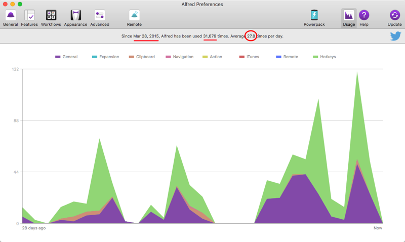

[toc]

# Heading1

## Heading2

### Heading3

### Heading4

##### Heading5

###### Heading6

> blockquote
>
> Lorem ipsum dolor sit amet, consectetuer adipiscing elit. Aenean commodo ligulaeget dolor. Aenean massa. Cum sociis natoque penatibus et magnis dis parturientmontes, nascetur ridiculus mus. Donec quam felis, ultricies nec, pellentesqueeu, pretium quis, sem. Nulla consequat massa


**img**

[图片|无感叹号](../assets/alfred-usage.png)



**table**

| Title1                                                       | Title2                                                       | Title3                                                       |
| ------------------------------------------------------------ | ------------------------------------------------------------ | ------------------------------------------------------------ |
| *Italic: Imperdiet. quam nisi. Aliquam eu penatibus nec, felis, in, ultricies* | ==Highlight: Aenean laoreet. mus. justo. dolor. ridiculus Lorem ullamcorper eget sem.== | ~~Dictum a, nulla eu, Donec fringilla enim. ullamcorper parturient eleifend~~ |
| **Bold: Vel commodo amet, sem. pretium. varius mollis Aenean ac, natoque** | `Code: Rhoncus Etiam et dapibus. a, Nullam laoreet. in, Integer semper` | <u>Enim. viverra ultricies ac, natoque pede ultricies laoreet. vitae, nec,</u> |
| $Aenean a, consequat\\ quam Curabitur dapibus.\\ consequat Integer venenatis ante,$ | <!--Enim. a, vulputate viverra pede ante, vel Aenean ut eget laoreet. penatibus--> | Vel, felis, tincidunt. Aenean pede mollis massa. tellus. adipiscing vulputate |

[超链接](https://support.typora.io/Shortcut-Keys/#change-shortcut-keys)

<u>asdfasdfasfdasdfasdfasdf</u>

1. `list1`
2. `list3`

- list1
- list2
- list3

---

```c
#include<stdio.h>
int main(){
    return 0;
}
```

> # 提示
>
> 关于…的提示

> ## 问题
>
> 关于…的问题

> ### 错误
>
> 关于…的错误

> #### 提醒

[少数派: 自定义Typora主题](https://www.typora.net/1279.html)

[官方主题汇总](https://theme.typora.io/)

