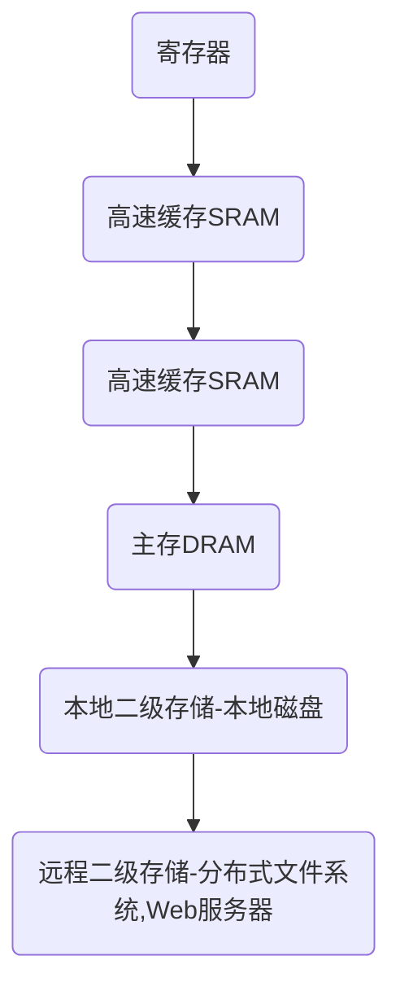

# 引论

## 虚拟内存机制

> [视频地址](https://www.bilibili.com/video/BV1jE411W7e8)
>
> 首先需要了解以下计算机的存储系统
>
> 从上到下，访问速度越来越慢、存储空间大小越来越大
>
> 从下到上，访问速度越来越快、成本（每字节）越来越高

### 为什么需要虚拟内存

> 在早期的计算机中，其实并不存在虚拟内存的概念（只有物理内存）。运行一个程序，都是直接把程序全部装入内存，然后运行。

使用这种简单粗暴的手段操作内存，当运行**多个**程序的时候，经常会出现下列问题

- ==<u>进程之间的地址空间不隔离</u>==（所有进程访问的都是整个物理地址空间），不存在**权限保护**的概念

  这将导致一个进程可以随意修改其他进程的内存数据，甚至修改内核地址空间中的数据。

- ==内存使用效率低下==（~~*why？暂时还没太理解*~~）

  当内存空间不足的时候，需要将其他程序暂时拷贝到磁盘，然后再将新的程序装入内存运行。

  > <u>*这块地方的解释如下*</u>
  >
  > 比方说内存空间总共128M，程序A需要使用给10M，程序B需要使用110M，程序C需要使用30M
  >
  > 当程序A和B在运行的时候，内存可以充分分配。
  >
  > 但是当程序C加入的时候，会发现内存空间不够了，需要停掉一部分程序，并将这一部分程序装载到磁盘。
  >
  > 此时操作系统会将程序B分块运行，先在内存中运行一小块，将另外一部分暂时装入磁盘中。
  >
  > 然后等程序C运行完毕，再将磁盘中还未运行的部分重新装入内存继续运行。（大致意思就是这样）

  由于大量数据的装入装出（再加上磁盘数据的访问速度限制），导致内存使用的效率十分低下（可能是因为内存程序的运行受限于磁盘数据的装载？）

- ==程序运行的地址不确定==

  内存地址的随机分配，导致了程序运行的地址也同样不能确定。

  该性质是由第二条性质导致的，因为“哪里有空哪里运行程序”（大致理解一下就行）

### 页和页框

### 页表

### 页表共享

### 虚拟内存的好处