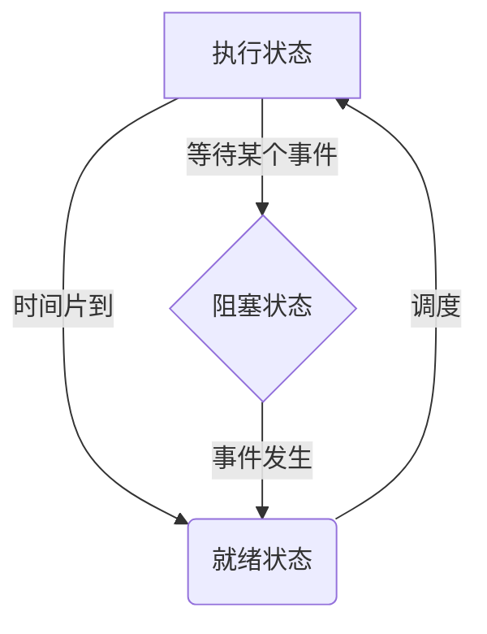

[toc]

# OS 期末复习

1. 引论
2. 系统引导
3. 内存管理
    - 页表自映射
4. 进程与并发程序设计
    - PV 操作
    - 进程死锁问题
    - 进程调度算法
    - 并发问题
5. IO
6. 磁盘管理
    - 磁盘问题
7. 文件系统
8. 安全
9. 分布式

## 进程与并发程序设计

### Bernstein 条件

> 总结一下就是两个**并发进程**不会发生*竞争*的条件
>
> _竞争_：多个进程读写一个**共享数据**时结果依赖于它们执行的相对时间

-   $R(Si)$: Si 的读子集, 其值在 Si 中被引用的变量的集合
-   $W(Si)$: Si 的写子集, 其值在 Si 中被改变的变量的集合

Bernstein 条件如下:

1. $R(S1)\cap W(S2)=\emptyset$
2. $R(S2)\cap W(S1)=\emptyset$
3. $W(S1)\cap W(S2)=\emptyset$

### 原语

> 原语是有*若干条指令*所组成的指令序列，_用于实现某个特定的操作功能_

原语的特点如下 👇🏻

-   指令序列的执行是连续的，_不可分割的_
-   是 OS 核心的组成部分
-   必须在**管态(内核态)**下执行，且常驻内存

原语和系统调用都是操作系统提供给应用程序的基本操作，但是**原语通常是底层的、直接的、更加基础的操作**，而**系统调用则是由操作系统内核或者驱动程序提供的更高层次的、间接的操作接口**

### 进程状态及其转换

进程的三种基本状态 ↓

-   就绪状态: _进程已获得除处理机外的所需资源_，等待配处理机资源；只要分配 CPU 就可执行
-   执行状态: _占用处理机资源_；在没有其他进程可以执行时（如所有进程都在阻塞状态），通常会自动执行系统的 idle 进程（相当于空操作）
-   阻塞状态: 正在执行的进程，由于发生某种事件而无法执行，便*放弃处理机处于暂停状态*

**进程状态转换图**⭐️



### 同步与互斥

> **进程的并发性**是操作系统的设计基础，也*是所有同步互斥问题产生的原因*

几个概念解释

-   竞争：多个进程对同一共享数据同时进行访问，最后的结果是不可预测的，它取决于各个进程对共享数据访问的相对次序
-   竞争条件：多个进程并发访问和操作同一数据且执行结果与访问的特定顺序有关
-   临界资源：**一次只允许一个进程访问的资源**(比如*打印机*，当然可以通过 Spooling 技术将打印机转换为共享设备)
-   临界区：每个进程*访问临界资源的那段代码*

进程同步与互斥 👇🏻

1. **进程互斥**：多个进程，_不能同时进入关于同一组共享变量的临界区域_，否则可能发生与时间有关的错误，这种现象被称作进程互斥
2. **进程同步**：系统中各进程之间*能有效地共享资源和相互合作*，从而使程序的执行具有可再现性的过程称为进程同步(_一般是互斥进程通过某些机制约束实现的_)

#### 临界区管理基本准则

1. 没有进程在临界区是，想加入临界区的进程可进入(_空闲让进_)
2. 任意两个进程不能同时进入临界区(_忙则等待_)
3. 任意一个临界区外的进程不能妨碍其他进程进入临界区
4. 任何一个进程进入临界区的要求应该在有限时间内得到满足(_有限等待_)

#### 基于忙等的互斥方法

##### 方法 1

```c
P:
while(Occupied);
Occupied=true;
-----
临界区
-----
Occupied=false;
```

```c
Q:
while(Occupied);
Occupied=true;
-----
临界区
-----
Occupied=false;
```

问题：P、Q 进程均卡在，while(Occupied)，此时 R 进程设置`Occupied=false`，P、Q 进程均开始执行，两者都能进入临界区，**此方法错误**。

##### 方法 2

```c
P:
while(turn==Q);
turn=P;
-----
临界区
-----
turn=Q;
```

```c
Q:
while(turn==P);
turn=Q;
-----
临界区
-----
turn=P;
```

问题：确实实现了严格互斥，但是*要求两进程只能严格交替的进入临界区*(多进程同理，只能按照严格顺序进入交接区)，违反了临界区管理准则，错误。

##### 方法 3

```c
P:
pturn=true;
while(qturn);
-----
临界区
-----
pturn=false;
```

```c
Q:
qturn=true;
while(pturn);
-----
临界区
-----
qturn=false;
```

问题：`pturn=qturn=true`直接死锁了，错误。

##### 方法 4

```c
P:
pturn=true;
while(qturn){
    pturn=false;
}
ptrun=true;
-----
临界区
-----
pturn=false;
```

```c
Q:
qturn=true;
while(pturn){
    qturn=false;
}
qtrun=true;
-----
临界区
-----
qturn=false;
```

问题：如果同时进入循环，并且同时设置为`pturn=qturn=false`，则 P、Q 会同时进入临界区，错误。

##### Dekker 算法

```c
P:
pturn=true;
while(qturn){
    if(turn==1){
        pturn=false;
        whlie(turn==1);
        pturn=true;
    }
}
-----
临界区
-----
turn=1;
pturn=false;
```

```c
Q:
qturn=true;
while(pturn){
    if(turn==0){
        qturn=false;
        whlie(turn==0);
        qturn=true;
    }
}
-----
临界区
-----
turn=0;
qturn=false;
```

缺点：`while(turn==1/0)`忙等浪费 CPU 事件

##### Peterson 算法

```c

```

#### _PV 操作(信号量机制)_

> 信号量只能通过初始化和两个标准的原语(P(S),V(S))来访问，不受进程调度打断
>
> 使用了一种新的变量类型(Semaphore)

-   `S.value>0`时表示**资源的个数**
-   `S.value<0`时表示**等待进程的个数**
-   **P 操作分配资源**
-   **V 操作释放资源**

多进程同步：屏障 Barriers

> 如何通过信号量实现 Barriers 来实现进程组的同步？

```c
n=the number of threads;
count=0;//记录抵达barrier的进程数
mutex=Semaphore(1);//初始化S类型变量为1(用于保护count)
barrier=Semaphore(0);//初始化S类型变量为0

P(mutex);
count+=1;
V(mutex);

if(count==n){
    V(barrier);
}
P(barrier);
-----
Run thread......
-----
V(barrier);
```

##### 经典的同步互斥问题

###### 生产者-消费者问题

> 若干进程通过有限的共享缓冲区交换数据。其中，**“生产者”进程不断写入**，而 _“消费者”进程不断读出_；共享缓冲区共有 `N`(只能存放 n 个产品) 个；**任何时刻只能有一个进程对共享缓冲区进行操作**。

-   生产者：生产产品，放置产品(有空缓冲区)
-   消费者：取出产品(缓冲区内有产品)，消费产品

```c
mutex=Semaphore(1);//设置互斥型号量
empty=Semaphore(N);//设置空闲缓冲区大小
full=Semaphore(0);//缓冲区内产品数量
//显然有full+empty==N

生产者:
P(empty);
P(mutex);
one>>buffer;
V(mutex);
V(full);

消费者:
P(full);
P(mutex);
one<<buffer;
V(mutex);
V(empty);
```

###### 生产者-消费者扩展问题

###### 读者-写者问题

> 对**共享资源的读写操作**，_任意时刻“写者”最多只允许一个，而“读者”则允许多个_
>
> 实例：12306 订票系统(多人可查看同一张票，但只允许一人买一张票)
>
> 需要注意的是，**当存在读进程激活的时候，不允许写进程进入**

```c
wmutex=Semaphore(1);//写进程保护
readcount=0;//代表正在读的进程数(注意是“正在读”)
mutex=Semaphore(1);//用户保护对readcount的操作

读者:
P(mutex)
if(readcount==0){
    P(wmutex);
}
readcount++;
V(mutex)
read()
P(mutex)
readcount--;
if(readcount==0){
    V(wmutex);
}
V(mutex);
// 该算法是对读者有利的

写者:
P(wmutex);
write();
V(wmutex);
```

下面实现读写者公平的算法 👇🏻

1. 当有写者出现的时候，不允许新读者继续加入
2. 也就是说只要限制`readcount++`即可

```c
rwmutex=Semaphore(1);//用于限制读者++
wmutex=Semaphore(1);//写进程保护
readcount=0;//代表正在读的进程数(注意是“正在读”)
mutex=Semaphore(1);//用户保护对readcount的操作

读者:
P(rwmutex)
P(mutex)
if(readcount==0){
    P(wmutex);
}
readcount++;
V(mutex)
V(rwmutex)
read()
P(mutex)
readcount--;
if(readcount==0){
    V(wmutex);
}
V(mutex);
// 该算法是读写公平的

写者:
P(rwmutex);
P(wmutex);
write();
V(wmutex);
V(rwmutex);
```

###### 哲学家进餐问题

> 5 个哲学家围绕一张圆桌而坐，桌子上放着 5 支筷子，每两个哲学家之间放一支；
> 哲学家的动作包括思考和进餐，**进餐时需要同时拿起他左边和右边的筷子，思考时也要同时将两支筷子放回原处**
> 如何保证哲学家的动作游戏进行？(_不出现相邻者同时进餐_；_不出现有人永远拿不到筷子_)

```c
chopstick=Semaphore(1)[5];
while(true){
    P(chopstick[i]);//假设总是先拿起左筷子，先放下左筷子
    P(chopstick[(i+1)%5]);
    eat();//吃饭
    V(chopstick[i]);
    V(chopstick[(i+1)%5]);
    think();//进餐
}
// 问题在于5位哲学家同时拿起左筷子，然后去拿右筷子时会造成死锁
```

-   对上述算法进行改进，限制**仅当左右筷子均可用时**，才允许他拿起筷子
-   可以使用`mutex`限制或者*AND 型型号量*实现

```c
chopstick=Semaphore(1)[5];
while(true){
    P(chopstick[i],chopstick[(i+1)%5]);
    eat();
    V(chopstick[i],chopstick[(i+1)%5]);
    think();
}
// AND型信号量机制实现（比起mutex实现更加简洁，并且mutex还有同时只能存在一个哲学家进餐的限制）
```

###### 理发师问题

> 理发店里有一位理发师，一把理发椅和 n 把供等候理发的顾客坐的椅子；
> 如果没有顾客，理发师便在理发椅上睡觉，当一个顾客到来的时候，叫醒理发师；
> 如果理发师正在理发，又有顾客来到，则如果有空椅子可坐，就坐下来等待，否则就离开

```c
#define CHIRS 10;
barber=Semaphore(1);
customers=Semaphore(0);
mutex=Semaphore(1);
waiting=0;

理发师:
while(true){
    P(customers);
    P(mutex);
    waiting--;
    V(mutex);
    V(barber);
    cut_hair();
}

顾客:
P(mutex);
if(waiting<CHIRS){
    waiting++;
    V(mutex);
    V(customers);
    P(barber);
    get_hair_cut();
}
else{
    V(mutex);
}
```

##### 实战

###### 题目 1

> 寿司店问题:
> 假设一个寿司店有 5 个座位，如果你到达的时候有一个空座位，你可以立刻就坐。但是如果你到达的时候 5 个座位都是满的有人已经就坐，这就意味着这些人都是一起来吃饭的，那么你需要等待所有的人一起离开才能就坐。编写同步原语，实现这个场景的约束。

```c
eating=0;
waiting=0;
mutex=Semaphore(1);
block=Semaphore(0);//等待队列
must_wait=false;

P(mutex);
if(must_wait){
    waiting++;
    V(mutex);
    P(block);
}
else{
    eating++;
    must_wait=(eating==5);
    V(mutex);
}
eat();
P(mutex);
eating--;
if(eating==0){
    n=min(5,waiting);
    waiting-=n;
    eating+=n;
    must_wait=(eating==5);
    V(block)(n);//唤醒n个顾客

}
V(mutex);
```

###### 题目 2

> 一个自动生产线上有 4 个机器人（R1-R4）。
> R1、R2 分别不断生产 2 种不同的零件 X、Y。
> R3 负责不断将 R1、R2 生产的零件 X、Y 装配成零件 Z；
> R4 负责不断将零件 Z 加工成成品 P；
> 有一个共享的零件暂存区，最多可以放 10 个零件，每次同时仅允许一个机器人访问这个零件暂存区。
> 所有机器人都要通过零件暂存区传递零件。
> R1、R2 需要等 R3 将它们之前生产的零件从暂存区中取走后，才能将新生产的零件放入（也就是说，暂存区中零件 X 和 Y 的数量分别都不会大于 1）。
> 请用 PV 操作给出上述 4 个机器人的同步互斥过程，给出信号量（Semaphore）的定义、初值和必要的注释说明。除了信号量外，不应定义其他变量
>
> R1 的主要动作包括 produceX()、putX()；
> R2 的主要动作包括 produceY()、putY()；
> R3 的主要动作包括 getX()、getY()、produceZ()和 putZ()；
> R4 的主要动作包括 getZ()、produceP()。
> 上述动作应该包含在同步互斥过程中，并在合适的位置添加相应的信号量的 PV 操作。上述动作中，只有访问零件暂存区的动作（get 或者 put 开头的）需要互斥访问暂存区，生产动作（produce 开头的）可以并发

```c
X=Semaphore(1);
Y=Semaphore(1);
x=Semphore(0);
y=Semphore(0);
z=Semphore(0);
robot=Semaphore(1);
buffer=Semaphore(10);//暂存区的空闲位置

R1_1://不断生产x零件
while(true){
    produceX();
}
R1_2://将x零件放入缓冲区
while(true){
    P(robot);
    P(buffer);//申请缓冲区
    P(X);//然后看看缓冲区是否存在X，存在则无法放入
    putX();
    V(robot);
}

R2_1://不断生产y零件
while(true){
    produceY();
}
R2_2://将y零件放入缓冲区
while(true){
    P(robot);
    P(buffer);
    P(Y);
    putY();
    V(robot);
}

R3_1://从缓冲区中取出零件组装z
while(true){
    P(robot);
    P(x)
    getX();
    V(x);
    P(y);
    getY();
    V(y);
    V(buffer);
    V(buffer);
    produceZ();
    V(robot);
}
R3_2://将z零件放入缓冲区
while(true){
    P(robot);
    P(buffer);
    putZ();
    V(Z);
    V(robot);
}

R4://将零件z加工成P
while(true){
    P(robot);
    P(Z)
    getZ();
    produceP();
    V(Z);
    V(robot);
}

```

###### 题目 3

>

### 进程调度

> CPU 调度的任务是**控制、协调多个进程对 CPU 的竞争**，也就是按照一定的策略(_调度算法_)，从**就绪队列**中选择一个进程，并把 CPU 的控制权交给选中进程

-   周转时间：作业从提交到完成(得到结果)所经历的时间
-   **平均带权周转时间**：$\frac{\sum{\frac{作业周转时间}{作业实际执行实际}}}{作业数量}$
    _带权周转时间越小，说明作业的完成效率越高，也就是说系统的效率越高_
-   响应时间：用户输入一个请求到系统给出首次响应的时间
-   **吞吐量**：单位时间内完成的作业数量(平均周转时间不是吞吐量的倒数，因为作业是可以并发执行的)
-   非抢占方式：一旦处理器分配给一个进程，它就一直占用处理器，直到该进程自己因调用原语操作或等待 I/O 等原因而进入阻塞状态，或时间片用完时才让出处理器，重新进行调度
-   _抢占式方式_：就绪队列中一旦有优先级高于当前运行进程优先级的进程存在时，便立即进行进程调度，把处理器转给优先级高的进程

#### 常见调度算法

##### FCFS:先来作业优先(First Come, First Serve)

> 最简单的调度算法，就只是按*照就绪队列中的先后顺序调度*
>
> 当前作业/进程占用 CPU，知道执行完或阻塞，才让出 CPU(非抢占)
>
> 特点是有利于长作业、CPU 繁忙的作业，不利于短作业、I/O 繁忙的作业(以为必须等待当前进程完成或阻塞后才能继续 I/O)

##### SJF:最短作业优先(Shortest Job First)

> 对*预计执行时间短的进程优先分配 CPU*，后来的短作业并不抢占正在执行的作业，目的是**减少平均周转时间**
>
> 优点是提高了系统吞吐量并优化了平均周转时间；
> 缺点是对长作业不利，可能长时间无法执行（并且也没有考虑作业优先级的问题）；难以准确预估作业执行时间，影响调度性能

###### 小测试

> 有三道作业，它们的提交时间和运行时间如下表
>
> 试给出在下面两种调度算法(FCFS、SJF)下，作业的执行顺序、平均周转时间和平均带权周转时间

| 作业号 | 提交时刻 | 运行时间/h |
| ------ | -------- | ---------- |
| 1      | 10:00    | 2          |
| 2      | 10:10    | 1          |
| 3      | 10:25    | 0.25       |

-   FCFS:1->2->3
-   SJF:1->3->2

| 作业号 | 提交时刻 | 运行时间/h | 调度顺序 | 开始时刻 | 完成时刻 | 周转时间       | 带权周转时间    |
| ------ | -------- | ---------- | -------- | -------- | -------- | -------------- | --------------- |
| 1      | 10:00    | 2          | 1        | 10:00    | 12:00    | 2              | 1               |
| 2      | 10:10    | 1          | 2        | 12:00    | 13:00    | $2\frac{5}{6}$ | $2\frac{5}{6}$  |
| 3      | 10:25    | 0.25       | 3        | 13:00    | 13:15    | $2\frac{5}{6}$ | $11\frac{1}{3}$ |

| 作业号 | 提交时刻 | 运行时间/h | 调度顺序 | 开始时刻 | 完成时刻 | 周转时间        | 带权周转时间    |
| ------ | -------- | ---------- | -------- | -------- | -------- | --------------- | --------------- |
| 1      | 10:00    | 2          | 1        | 10:00    | 12:00    | 2               | 1               |
| 2      | 10:10    | 1          | 3        | 12:15    | 13:15    | $3\frac{1}{20}$ | $3\frac{1}{20}$ |
| 3      | 10:25    | 0.25       | 2        | 12:00    | 12:15    | $1\frac{5}{6}$  | $7\frac{1}{3}$  |

##### SRTF:最短剩余时间优先(Shortest Remaining Time First)

> 将短作业优先 SJF 进行改进，改为*抢占式*(完成时间短的进程优先执行)，就能得到 SRTF 算法了
>
> 缺点：源源不断的短任务到来，可能使长的任务长时间得不到运行

##### HRRF:最高响应比优先(Highest Response Ratio First)

> 是 FCFS 算法和 SJF 算法的折中，既考虑了作业的等待时间，又考虑作业的运行时间，既照顾短作业又不使长作业的等待时间过长，改善了调度性能
>
> 在每次*调度*作业投入运行时，先**计算就绪作业队列中每个作业的响应比 RP(响应优先级)**，然后选择其值最大的作业投入运行(_非抢占_)
>
> $RP=1+\frac{已等待时间}{要求运行时间}$
>
> 短作业能获得较高的响应比，并且长作业在等待时间够长后，也能获得足够高的响应比
>
> 缺点是计算响应比需要性能开销

##### RR:时间片轮转(Round Robin)

> 将所有就绪队列按照 FCFS 原则，排成一个队列，每次调度时将 CPU 分派给队首进程，执行一个时间片，时间片结束，中断，调度程序据此暂停当前进程的执行，将其送到就绪队列的末尾；反复执行

###### 举例

| 作业 | 到达时间 | 作业时常 |
| ---- | -------- | -------- |
| A    | 0        | 4        |
| B    | 1        | 3        |
| C    | 2        | 5        |
| D    | 3        | 2        |
| E    | 4        | 4        |

-   FCFS
    -   调度顺序:A->B->C->D->E
    -   周转时间:4+6+10+11+14=45
    -   平均周转时间:45/5=9
    -   平均带权周转时间:$\frac{\frac{4}{4}+\frac{6}{3}+\frac{10}{5}+\frac{11}{2}+\frac{14}{4}}{5}=\frac{1+2+2+5.5+3.5}{5}=2.8$
-   SJF
    -   调度顺序:A->D->B->E->C
    -   周转时间:4+8+16+3+9=40
    -   平均周转时间:40/5=8
    -   平均带权周转时间:$\frac{\frac{4}{4}+\frac{8}{3}+\frac{16}{5}+\frac{3}{2}+\frac{9}{4}}{5}=2.123$
-   RR
    -   时间片长度为 1

```mermaid
gantt
    title 不同调度算法的调度流程
    dateFormat  s
    axisFormat %S
    section FCFS
    A: a,0,4s
    B: done,1,4
    B: b,after a,3s
    C: done,2,7
    C: c,after b,5s
    D: done,3,12
    D: d,after c,2s
    E: done,4,14
    E: e,after d,4s
    section SJF
    A: a1,0,4s
    B: done,1,6
    B: b1,after d1,3s
    C: done,2,13
    C: c1,after e1,5s
    D: done,3,4
    D: d1,after a1,2s
    E: done,4,9
    E: e1,after b1,4s
    section RR
    A: 0,1s
    A: done,1,5
    B: 1,1s
    B: done,2,6
    C: 2,1s
    C: done,3,7
    D: 3,1s
    D: done,4,8
    E: 4,1s
    E: done,5,9
    A: 5,1s
    A: done,6,10
    B: 6,1s
    B: done,7,11
    C: 7,1s
    C: done,8,12
    D: 8,1s
    E: 9,1s
    E: done,10,13
    A: 10,1s
    A: done,11,14
    B: 11,1s
    C: 12,1s
    C: done,13,2s
    E: 13,1s
    E: done,14,2s
    A: 14,1s
    C: 15,1s
    C: done,16,1s
    E: 16,1s
    C: 17,1s
```



##### 优先级算法(Priority Scheduling)

> 调度时选择优先级最高的进程执行
>
> 分为抢占式和非抢占式:
> **抢占式**:在就绪队列发生变化时，判断是否会发生抢占
> _非抢占式_:只需要在进程结束时根据就绪队列优先级进行调度即可

-   静态优先级:创建进程时就确定，知道进程结束前都不改变
-   动态优先级:同样是创建进程时确定的，但是在进程运行的过程中可以自动改变，以便获得更好的调度性能
    -   在就绪队列中，_等待时间延长则优先级提高_，从而使优先级较低的进程在等待足够的时间后，其优先级提高到可被调度执行
    -   **进程每执行一个时间片，就降低其优先级**，从而一个进程持续执行时，其优先级降低到出让 CPU

##### MQ:多级队列(Multi-level)

> 暂不介绍

### 死锁

> 产生的原因：资源竞争、**并发执行顺序不当**

死锁产生的 4 个必要条件

1. 互斥条件：指进程对所分配到的资源进行排它性使用，即在一段时间内某资源只由一个进程占用。如果此时还有其它进程请求资源，则请求者只能等待，直至占有资源的进程用毕释放
2. 请求且占有条件：指进程已经占有至少一个资源，但又提出了新的资源请求，而该资源已被其它进程占有，此时请求进程阻塞，但又对自己已获得的其它资源保持不放
3. 不可剥夺条件：指进程已获得的资源，在未使用完之前不能被剥夺，只能在使用完时由自己释放
4. 环路等待条件：指在发生死锁时，必然存在一个进程— —资源的环形链，即进程集合{P0，P1，P2，···，Pn}中 的 P0 正在等待一个 P1 占用的资源；P1 正在等待 P2 占用的资源，……，Pn 正在等待已被 P0 占用的资源

#### 竞争资源

-   可剥夺资源: 是指某进程在获得这类资源后，该资源可以再被其他进程或系统剥夺。如**CPU**，**内存**
-   非可剥夺资源: 当系统把这类资源分配给某进程后，再不能强行收回，**只能在进程用完后自行释放**(如*打印机*)
-   临时性资源: 这是指由一个进程产生，被另一个进程使用，短时间后便无用的资源，故也称为消耗性资源。如消息、中断

实例：

> 使用*信号量*实现线程 A 和线程 B 的汇合(Rendezvous)。使得 a1 永远在 b2 之前执行，而 b1 永远在 a2 之前执行

```c
a=Semaphore(1);
b=Semaphore(1);

A:
statement a1;
V(a);
P(b)
statement a2;

B:
statement b1;
V(b);
P(a);
statement b2;
```

#### 活锁(livelock)和饥饿(starvation)

-   活锁：是指任务或者执行者没有被阻塞，由于某些条件没有满足，导致一直重复尝试，失败，尝试，失败(和死锁的区别在于，处于活锁的实体正在不断改变状态，活锁是可能自行解开的，避免活锁的简单方法是采用先来先服务的策略)
-   饥饿：某些进程可能由于资源分配策略的不公平导致长时间等待。当等待时间给进程推进和响应带来明显影响时，称发生了进程饥饿，_当饥饿到一定程度的进程所赋予的任务即使完成也不再具有实际意义时称该进程被饿死_(starve to death)

#### 处理死锁

1. 不允许死锁发生
    - 预防死锁(静态)：直接破坏死锁的产生条件
    - 避免死锁(动态)：在资源分配之前进行判断
2. _允许死锁发生_
    - **预测与解锁死锁**
    - 鸵鸟算法

##### 死锁预防(Deadlock Prevention)

##### 死锁避免(Deadlock Avoidance)

##### 死锁检测(Deadlock Detection)

##### 习题

###### 习题 1

> 下标给出的 5 个进程的到达时间、运行时间、优先级数

### 判断题

-   [x] 若系统没有 running 进程，则一定没有 ready 进程
-   [ ] 用户进程可以自行修改 PCB
-   [x] 进程在运行中可以将自身状态变为阻塞态
-   [ ] 子进程可以继承父进程拥有的全部资源
-   [ ] 中断是进程切换的充分必要条件

## IO

IO 控制技术

-   程序控制 IO
-   中断驱动方式
-   直接存储访问方式(DMA)
-   通道技术
