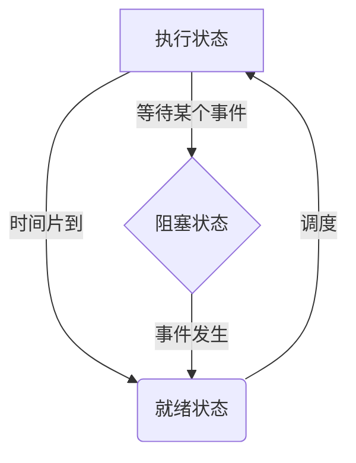
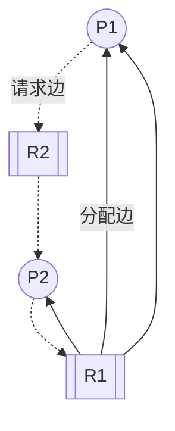
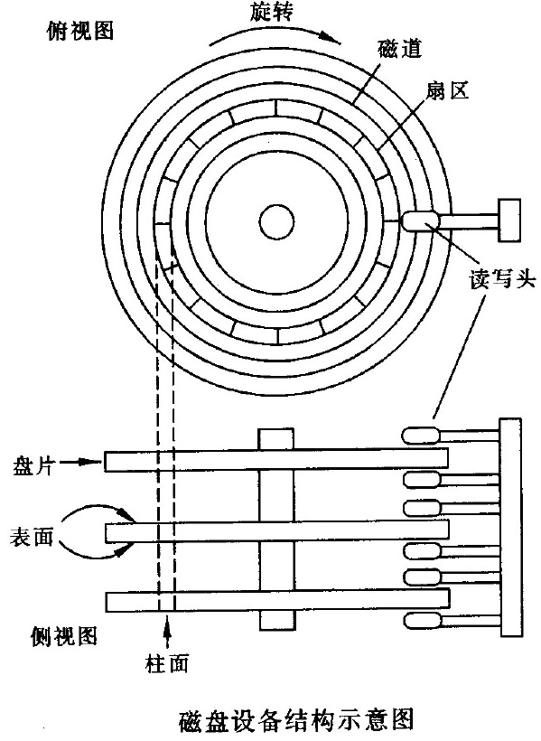

[toc]

# OS 期末复习

1. 引论
2. 系统引导
3. 内存管理
    - 页表自映射
4. 进程与并发程序设计
    - PV 操作
    - 进程死锁问题
    - 进程调度算法
    - 并发问题
5. IO
6. 磁盘管理
    - 磁盘问题
7. 文件系统
8. 安全
9. 分布式

## 内存管理

### 页面置换策略

#### FIFO

> 先进先出算法，选择在主存中**驻留时间最长**的一页淘汰

##### Second Chance

> 改进的 FIFO 算法，原理是给每个页面增加一个访问标志，用于表示该页面是否在加入队列后被再次访问过
>
> 假设 A 是 FIFO 队列中最旧的页面(位于队尾)，且被放入队列后被访问过，则将 A 移动到 FIFO 队头，并将访问标志清空，直到下次移动到队尾的时候淘汰

##### Clock or NRU

> 最近未使用算法，同样是 FIFO 的改进算法
>
> 当前指针指向 C，如果 C 被访问过，则清除 C 的访问标志，并将指针指向*下一位*
>
> 如果 C 没有被访问过，则将新页面放入到 C 的位置, 置访问标志，并将指针指向*下一位*

#### LRU

> 最近最久不用算法，选择最近一段时间最久不用的页面淘汰(使用了局部性原理，性能接近最优算法)

-   设置一个**特殊的栈**，保存当前使用的各个页面的页面号
-   每当进程访问某页面时，便将该页面的页面号从栈中移出，将它压入栈顶。栈底始终是最近最久未使用页面的页面号

#### 最优置换

> 置换未来最久不会被使用的页(理论最优解，但是无法实现)

## 进程与并发程序设计

### Bernstein 条件

> 总结一下就是两个**并发进程**不会发生*竞争*的条件
>
> _竞争_：多个进程读写一个**共享数据**时结果依赖于它们执行的相对时间

-   $R(Si)$: Si 的读子集, 其值在 Si 中被引用的变量的集合
-   $W(Si)$: Si 的写子集, 其值在 Si 中被改变的变量的集合

Bernstein 条件如下:

1. $R(S1)\cap W(S2)=\emptyset$
2. $R(S2)\cap W(S1)=\emptyset$
3. $W(S1)\cap W(S2)=\emptyset$

### 原语

> 原语是有*若干条指令*所组成的指令序列，_用于实现某个特定的操作功能_

原语的特点如下 👇🏻

-   指令序列的执行是连续的，_不可分割的_
-   是 OS 核心的组成部分
-   必须在**管态(内核态)**下执行，且常驻内存

原语和系统调用都是操作系统提供给应用程序的基本操作，但是**原语通常是底层的、直接的、更加基础的操作**，而**系统调用则是由操作系统内核或者驱动程序提供的更高层次的、间接的操作接口**

### 进程状态及其转换

进程的三种基本状态 ↓

-   就绪状态: _进程已获得除处理机外的所需资源_，等待配处理机资源；只要分配 CPU 就可执行
-   执行状态: _占用处理机资源_；在没有其他进程可以执行时（如所有进程都在阻塞状态），通常会自动执行系统的 idle 进程（相当于空操作）
-   阻塞状态: 正在执行的进程，由于发生某种事件而无法执行，便*放弃处理机处于暂停状态*

**进程状态转换图**⭐️



### 同步与互斥

> **进程的并发性**是操作系统的设计基础，也*是所有同步互斥问题产生的原因*

几个概念解释

-   竞争：多个进程对同一共享数据同时进行访问，最后的结果是不可预测的，它取决于各个进程对共享数据访问的相对次序
-   竞争条件：多个进程并发访问和操作同一数据且执行结果与访问的特定顺序有关
-   临界资源：**一次只允许一个进程访问的资源**(比如*打印机*，当然可以通过 Spooling 技术将打印机转换为共享设备)
-   临界区：每个进程*访问临界资源的那段代码*

进程同步与互斥 👇🏻

1. **进程互斥**：多个进程，_不能同时进入关于同一组共享变量的临界区域_，否则可能发生与时间有关的错误，这种现象被称作进程互斥
2. **进程同步**：系统中各进程之间*能有效地共享资源和相互合作*，从而使程序的执行具有可再现性的过程称为进程同步(_一般是互斥进程通过某些机制约束实现的_)

#### 临界区管理基本准则

1. 没有进程在临界区是，想加入临界区的进程可进入(_空闲让进_)
2. 任意两个进程不能同时进入临界区(_忙则等待_)
3. 任意一个临界区外的进程不能妨碍其他进程进入临界区
4. 任何一个进程进入临界区的要求应该在有限时间内得到满足(_有限等待_)

#### 基于忙等的互斥方法

##### 方法 1

```c
P:
while(Occupied);
Occupied=true;
-----
临界区
-----
Occupied=false;
```

```c
Q:
while(Occupied);
Occupied=true;
-----
临界区
-----
Occupied=false;
```

问题：P、Q 进程均卡在，while(Occupied)，此时 R 进程设置`Occupied=false`，P、Q 进程均开始执行，两者都能进入临界区，**此方法错误**。

##### 方法 2

```c
P:
while(turn==Q);
turn=P;
-----
临界区
-----
turn=Q;
```

```c
Q:
while(turn==P);
turn=Q;
-----
临界区
-----
turn=P;
```

问题：确实实现了严格互斥，但是*要求两进程只能严格交替的进入临界区*(多进程同理，只能按照严格顺序进入交接区)，违反了临界区管理准则，错误。

##### 方法 3

```c
P:
pturn=true;
while(qturn);
-----
临界区
-----
pturn=false;
```

```c
Q:
qturn=true;
while(pturn);
-----
临界区
-----
qturn=false;
```

问题：`pturn=qturn=true`直接死锁了，错误。

##### 方法 4

```c
P:
pturn=true;
while(qturn){
    pturn=false;
}
ptrun=true;
-----
临界区
-----
pturn=false;
```

```c
Q:
qturn=true;
while(pturn){
    qturn=false;
}
qtrun=true;
-----
临界区
-----
qturn=false;
```

问题：如果同时进入循环，并且同时设置为`pturn=qturn=false`，则 P、Q 会同时进入临界区，错误。

##### Dekker 算法

```c
P:
pturn=true;
while(qturn){
    if(turn==1){
        pturn=false;
        whlie(turn==1);
        pturn=true;
    }
}
-----
临界区
-----
turn=1;
pturn=false;
```

```c
Q:
qturn=true;
while(pturn){
    if(turn==0){
        qturn=false;
        whlie(turn==0);
        qturn=true;
    }
}
-----
临界区
-----
turn=0;
qturn=false;
```

缺点：`while(turn==1/0)`忙等浪费 CPU 事件

##### Peterson 算法

```c

```

#### _PV 操作(信号量机制)_

> 信号量只能通过初始化和两个标准的原语(P(S),V(S))来访问，不受进程调度打断
>
> 使用了一种新的变量类型(Semaphore)

-   `S.value>0`时表示**资源的个数**
-   `S.value<0`时表示**等待进程的个数**
-   **P 操作分配资源**
-   **V 操作释放资源**

多进程同步：屏障 Barriers

> 如何通过信号量实现 Barriers 来实现进程组的同步？

```c
n=the number of threads;
count=0;//记录抵达barrier的进程数
mutex=Semaphore(1);//初始化S类型变量为1(用于保护count)
barrier=Semaphore(0);//初始化S类型变量为0

P(mutex);
count+=1;
V(mutex);

if(count==n){
    V(barrier);
}
P(barrier);
-----
Run thread......
-----
V(barrier);
```

##### 经典的同步互斥问题

###### 生产者-消费者问题

> 若干进程通过有限的共享缓冲区交换数据。其中，**“生产者”进程不断写入**，而 _“消费者”进程不断读出_；共享缓冲区共有 `N`(只能存放 n 个产品) 个；**任何时刻只能有一个进程对共享缓冲区进行操作**。

-   生产者：生产产品，放置产品(有空缓冲区)
-   消费者：取出产品(缓冲区内有产品)，消费产品

```c
mutex=Semaphore(1);//设置互斥型号量
empty=Semaphore(N);//设置空闲缓冲区大小
full=Semaphore(0);//缓冲区内产品数量
//显然有full+empty==N

生产者:
P(empty);
P(mutex);
one>>buffer;
V(mutex);
V(full);

消费者:
P(full);
P(mutex);
one<<buffer;
V(mutex);
V(empty);
```

###### 生产者-消费者扩展问题

###### 读者-写者问题

> 对**共享资源的读写操作**，_任意时刻“写者”最多只允许一个，而“读者”则允许多个_
>
> 实例：12306 订票系统(多人可查看同一张票，但只允许一人买一张票)
>
> 需要注意的是，**当存在读进程激活的时候，不允许写进程进入**

```c
wmutex=Semaphore(1);//写进程保护
readcount=0;//代表正在读的进程数(注意是“正在读”)
mutex=Semaphore(1);//用户保护对readcount的操作

读者:
P(mutex)
if(readcount==0){
    P(wmutex);
}
readcount++;
V(mutex)
read()
P(mutex)
readcount--;
if(readcount==0){
    V(wmutex);
}
V(mutex);
// 该算法是对读者有利的

写者:
P(wmutex);
write();
V(wmutex);
```

下面实现读写者公平的算法 👇🏻

1. 当有写者出现的时候，不允许新读者继续加入
2. 也就是说只要限制`readcount++`即可

```c
rwmutex=Semaphore(1);//用于限制读者++
wmutex=Semaphore(1);//写进程保护
readcount=0;//代表正在读的进程数(注意是“正在读”)
mutex=Semaphore(1);//用户保护对readcount的操作

读者:
P(rwmutex)
P(mutex)
if(readcount==0){
    P(wmutex);
}
readcount++;
V(mutex)
V(rwmutex)
read()
P(mutex)
readcount--;
if(readcount==0){
    V(wmutex);
}
V(mutex);
// 该算法是读写公平的

写者:
P(rwmutex);
P(wmutex);
write();
V(wmutex);
V(rwmutex);
```

###### 哲学家进餐问题

> 5 个哲学家围绕一张圆桌而坐，桌子上放着 5 支筷子，每两个哲学家之间放一支；
> 哲学家的动作包括思考和进餐，**进餐时需要同时拿起他左边和右边的筷子，思考时也要同时将两支筷子放回原处**
> 如何保证哲学家的动作游戏进行？(_不出现相邻者同时进餐_；_不出现有人永远拿不到筷子_)

```c
chopstick=Semaphore(1)[5];
while(true){
    P(chopstick[i]);//假设总是先拿起左筷子，先放下左筷子
    P(chopstick[(i+1)%5]);
    eat();//吃饭
    V(chopstick[i]);
    V(chopstick[(i+1)%5]);
    think();//进餐
}
// 问题在于5位哲学家同时拿起左筷子，然后去拿右筷子时会造成死锁
```

-   对上述算法进行改进，限制**仅当左右筷子均可用时**，才允许他拿起筷子
-   可以使用`mutex`限制或者*AND 型型号量*实现

```c
chopstick=Semaphore(1)[5];
while(true){
    P(chopstick[i],chopstick[(i+1)%5]);
    eat();
    V(chopstick[i],chopstick[(i+1)%5]);
    think();
}
// AND型信号量机制实现（比起mutex实现更加简洁，并且mutex还有同时只能存在一个哲学家进餐的限制）
```

###### 理发师问题

> 理发店里有一位理发师，一把理发椅和 n 把供等候理发的顾客坐的椅子；
> 如果没有顾客，理发师便在理发椅上睡觉，当一个顾客到来的时候，叫醒理发师；
> 如果理发师正在理发，又有顾客来到，则如果有空椅子可坐，就坐下来等待，否则就离开

```c
#define CHIRS 10;
barber=Semaphore(1);
customers=Semaphore(0);
mutex=Semaphore(1);
waiting=0;

理发师:
while(true){
    P(customers);
    P(mutex);
    waiting--;
    V(mutex);
    V(barber);
    cut_hair();
}

顾客:
P(mutex);
if(waiting<CHIRS){
    waiting++;
    V(mutex);
    V(customers);
    P(barber);
    get_hair_cut();
}
else{
    V(mutex);
}
```

##### 实战

###### 题目 1

> 寿司店问题:
> 假设一个寿司店有 5 个座位，如果你到达的时候有一个空座位，你可以立刻就坐。但是如果你到达的时候 5 个座位都是满的有人已经就坐，这就意味着这些人都是一起来吃饭的，那么你需要等待所有的人一起离开才能就坐。编写同步原语，实现这个场景的约束。

```c
eating=0;
waiting=0;
mutex=Semaphore(1);
block=Semaphore(0);//等待队列
must_wait=false;

P(mutex);
if(must_wait){
    waiting++;
    V(mutex);
    P(block);
}
else{
    eating++;
    must_wait=(eating==5);
    V(mutex);
}
eat();
P(mutex);
eating--;
if(eating==0){
    n=min(5,waiting);
    waiting-=n;
    eating+=n;
    must_wait=(eating==5);
    V(block)(n);//唤醒n个顾客

}
V(mutex);
```

###### 题目 2

> 一个自动生产线上有 4 个机器人（R1-R4）。
> R1、R2 分别不断生产 2 种不同的零件 X、Y。
> R3 负责不断将 R1、R2 生产的零件 X、Y 装配成零件 Z；
> R4 负责不断将零件 Z 加工成成品 P；
> 有一个共享的零件暂存区，最多可以放 10 个零件，每次同时仅允许一个机器人访问这个零件暂存区。
> 所有机器人都要通过零件暂存区传递零件。
> R1、R2 需要等 R3 将它们之前生产的零件从暂存区中取走后，才能将新生产的零件放入（也就是说，暂存区中零件 X 和 Y 的数量分别都不会大于 1）。
> 请用 PV 操作给出上述 4 个机器人的同步互斥过程，给出信号量（Semaphore）的定义、初值和必要的注释说明。除了信号量外，不应定义其他变量
>
> R1 的主要动作包括 produceX()、putX()；
> R2 的主要动作包括 produceY()、putY()；
> R3 的主要动作包括 getX()、getY()、produceZ()和 putZ()；
> R4 的主要动作包括 getZ()、produceP()。
> 上述动作应该包含在同步互斥过程中，并在合适的位置添加相应的信号量的 PV 操作。上述动作中，只有访问零件暂存区的动作（get 或者 put 开头的）需要互斥访问暂存区，生产动作（produce 开头的）可以并发

```c
X=Semaphore(1);
Y=Semaphore(1);
x=Semphore(0);
y=Semphore(0);
z=Semphore(0);
robot=Semaphore(1);
buffer=Semaphore(10);//暂存区的空闲位置

R1_1://不断生产x零件
while(true){
    produceX();
}
R1_2://将x零件放入缓冲区
while(true){
    P(robot);
    P(buffer);//申请缓冲区
    P(X);//然后看看缓冲区是否存在X，存在则无法放入
    putX();
    V(robot);
}

R2_1://不断生产y零件
while(true){
    produceY();
}
R2_2://将y零件放入缓冲区
while(true){
    P(robot);
    P(buffer);
    P(Y);
    putY();
    V(robot);
}

R3_1://从缓冲区中取出零件组装z
while(true){
    P(robot);
    P(x)
    getX();
    V(x);
    P(y);
    getY();
    V(y);
    V(buffer);
    V(buffer);
    produceZ();
    V(robot);
}
R3_2://将z零件放入缓冲区
while(true){
    P(robot);
    P(buffer);
    putZ();
    V(Z);
    V(robot);
}

R4://将零件z加工成P
while(true){
    P(robot);
    P(Z)
    getZ();
    produceP();
    V(Z);
    V(robot);
}

```

###### 题目 3

>

### 进程调度

> CPU 调度的任务是**控制、协调多个进程对 CPU 的竞争**，也就是按照一定的策略(_调度算法_)，从**就绪队列**中选择一个进程，并把 CPU 的控制权交给选中进程

-   周转时间：*作业从提交到完成(得到结果)所经历的时间*
-   **平均带权周转时间**：$\frac{\sum{\frac{作业周转时间}{作业实际执行时间}}}{作业数量}$
    _带权周转时间越小，说明作业的完成效率越高，也就是说系统的效率越高_
-   响应时间：用户输入一个请求到系统给出首次响应的时间
-   **吞吐量**：单位时间内完成的作业数量(平均周转时间不是吞吐量的倒数，因为作业是可以并发执行的)
-   非抢占方式：一旦处理器分配给一个进程，它就一直占用处理器，直到该进程自己因调用原语操作或等待 I/O 等原因而进入阻塞状态，或时间片用完时才让出处理器，重新进行调度
-   _抢占式方式_：就绪队列中一旦有优先级高于当前运行进程优先级的进程存在时，便立即进行进程调度，把处理器转给优先级高的进程

#### 常见调度算法

##### FCFS:先来作业优先(First Come, First Serve)

> 最简单的调度算法，就只是按*照就绪队列中的先后顺序调度*
>
> 当前作业/进程占用 CPU，直到执行完或阻塞，才让出 CPU(非抢占)
>
> 特点是有利于长作业、CPU 繁忙的作业，不利于短作业、I/O 繁忙的作业(以为必须等待当前进程完成或阻塞后才能继续 I/O)

##### SJF:最短作业优先(Shortest Job First)

> 对*预计执行时间短的进程优先分配 CPU*，后来的短作业并不抢占正在执行的作业，目的是**减少平均周转时间**
>
> 优点是提高了系统吞吐量并优化了平均周转时间；
> 缺点是对长作业不利，可能长时间无法执行（并且也没有考虑作业优先级的问题）；难以准确预估作业执行时间，影响调度性能

###### 小测试

> 有三道作业，它们的提交时间和运行时间如下表
>
> 试给出在下面两种调度算法(FCFS、SJF)下，作业的执行顺序、平均周转时间和平均带权周转时间

| 作业号 | 提交时刻 | 运行时间/h |
| ------ | -------- | ---------- |
| 1      | 10:00    | 2          |
| 2      | 10:10    | 1          |
| 3      | 10:25    | 0.25       |

-   FCFS:1->2->3
-   SJF:1->3->2

| 作业号 | 提交时刻 | 运行时间/h | 调度顺序 | 开始时刻 | 完成时刻 | 周转时间       | 带权周转时间    |
| ------ | -------- | ---------- | -------- | -------- | -------- | -------------- | --------------- |
| 1      | 10:00    | 2          | 1        | 10:00    | 12:00    | 2              | 1               |
| 2      | 10:10    | 1          | 2        | 12:00    | 13:00    | $2\frac{5}{6}$ | $2\frac{5}{6}$  |
| 3      | 10:25    | 0.25       | 3        | 13:00    | 13:15    | $2\frac{5}{6}$ | $11\frac{1}{3}$ |

| 作业号 | 提交时刻 | 运行时间/h | 调度顺序 | 开始时刻 | 完成时刻 | 周转时间        | 带权周转时间    |
| ------ | -------- | ---------- | -------- | -------- | -------- | --------------- | --------------- |
| 1      | 10:00    | 2          | 1        | 10:00    | 12:00    | 2               | 1               |
| 2      | 10:10    | 1          | 3        | 12:15    | 13:15    | $3\frac{1}{20}$ | $3\frac{1}{20}$ |
| 3      | 10:25    | 0.25       | 2        | 12:00    | 12:15    | $1\frac{5}{6}$  | $7\frac{1}{3}$  |

##### SRTF:最短剩余时间优先(Shortest Remaining Time First)

> 将短作业优先 SJF 进行改进，改为*抢占式*(完成时间短的进程优先执行)，就能得到 SRTF 算法了
>
> 缺点：源源不断的短任务到来，可能使长的任务长时间得不到运行

##### HRRF:最高响应比优先(Highest Response Ratio First)

> 是 FCFS 算法和 SJF 算法的折中，既考虑了作业的等待时间，又考虑作业的运行时间，既照顾短作业又不使长作业的等待时间过长，改善了调度性能
>
> 在每次*调度*作业投入运行时，先**计算就绪作业队列中每个作业的响应比 RP(响应优先级)**，然后选择其值最大的作业投入运行(_非抢占_)
>
> $RP=1+\frac{已等待时间}{要求运行时间}$
>
> 短作业能获得较高的响应比，并且长作业在等待时间够长后，也能获得足够高的响应比
>
> 缺点是计算响应比需要性能开销

##### RR:时间片轮转(Round Robin)

> 将所有就绪队列按照 FCFS 原则，排成一个队列，每次调度时将 CPU 分派给队首进程，执行一个时间片，时间片结束，中断，调度程序据此暂停当前进程的执行，将其送到就绪队列的末尾；反复执行

###### 举例

| 作业 | 到达时间 | 作业时常 |
| ---- | -------- | -------- |
| A    | 0        | 4        |
| B    | 1        | 3        |
| C    | 2        | 5        |
| D    | 3        | 2        |
| E    | 4        | 4        |

-   FCFS
    -   调度顺序:A->B->C->D->E
    -   周转时间:4+6+10+11+14=45
    -   平均周转时间:45/5=9
    -   平均带权周转时间:$\frac{\frac{4}{4}+\frac{6}{3}+\frac{10}{5}+\frac{11}{2}+\frac{14}{4}}{5}=\frac{1+2+2+5.5+3.5}{5}=2.8$
-   SJF
    -   调度顺序:A->D->B->E->C
    -   周转时间:4+8+16+3+9=40
    -   平均周转时间:40/5=8
    -   平均带权周转时间:$\frac{\frac{4}{4}+\frac{8}{3}+\frac{16}{5}+\frac{3}{2}+\frac{9}{4}}{5}=2.123$
-   RR
    -   时间片长度为 1

```mermaid
gantt
    title 不同调度算法的调度流程
    dateFormat  s
    axisFormat %S
    section FCFS
    A: a,0,4s
    B: done,1,4
    B: b,after a,3s
    C: done,2,7
    C: c,after b,5s
    D: done,3,12
    D: d,after c,2s
    E: done,4,14
    E: e,after d,4s
    section SJF
    A: a1,0,4s
    B: done,1,6
    B: b1,after d1,3s
    C: done,2,13
    C: c1,after e1,5s
    D: done,3,4
    D: d1,after a1,2s
    E: done,4,9
    E: e1,after b1,4s
    section RR
    A: 0,1s
    A: done,1,5
    B: 1,1s
    B: done,2,6
    C: 2,1s
    C: done,3,7
    D: 3,1s
    D: done,4,8
    E: 4,1s
    E: done,5,9
    A: 5,1s
    A: done,6,10
    B: 6,1s
    B: done,7,11
    C: 7,1s
    C: done,8,12
    D: 8,1s
    E: 9,1s
    E: done,10,13
    A: 10,1s
    A: done,11,14
    B: 11,1s
    C: 12,1s
    C: done,13,2s
    E: 13,1s
    E: done,14,2s
    A: 14,1s
    C: 15,1s
    C: done,16,1s
    E: 16,1s
    C: 17,1s
```



##### 优先级算法(Priority Scheduling)

> 调度时选择优先级最高的进程执行
>
> 分为抢占式和非抢占式:
> **抢占式**:在就绪队列发生变化时，判断是否会发生抢占
> _非抢占式_:只需要在进程结束时根据就绪队列优先级进行调度即可

-   静态优先级:创建进程时就确定，知道进程结束前都不改变
-   动态优先级:同样是创建进程时确定的，但是在进程运行的过程中可以自动改变，以便获得更好的调度性能
    -   在就绪队列中，_等待时间延长则优先级提高_，从而使优先级较低的进程在等待足够的时间后，其优先级提高到可被调度执行
    -   **进程每执行一个时间片，就降低其优先级**，从而一个进程持续执行时，其优先级降低到出让 CPU

##### MQ:多级队列(Multi-level)

> 暂不介绍

### 死锁

> 产生的原因：资源竞争、**并发执行顺序不当**

死锁产生的 4 个必要条件（以下四个条件是死锁发生的必要不充分条件）

1. **互斥条件**：指进程对所分配到的资源进行排它性使用，即在一段时间内某资源只由一个进程占用。如果此时还有其它进程请求资源，则请求者只能等待，直至占有资源的进程用毕释放
2. **请求且占有条件**：_指进程已经占有至少一个资源，但又提出了新的资源请求，而该资源已被其它进程占有_，此时请求进程阻塞，但又对自己已获得的其它资源保持不放
3. **不可剥夺条件**：指进程已获得的资源，在未使用完之前不能被剥夺，只能在使用完时由自己释放
4. **环路等待条件**：指在发生死锁时，必然存在一个进程——资源的环形链，即进程集合`{P0，P1，P2，···，Pn}`中 的 P0 正在等待一个 P1 占用的资源；P1 正在等待 P2 占用的资源，……，Pn 正在等待已被 P0 占用的资源

什么时候会发生死锁

1. 对系统资源的竞争：各进程对**不可剥夺的资源**(如*打印机*)的竞争可能引起死锁，对可剥夺的资源(CPU)的竞争是不会引起死锁的
2. 进程推进顺序非法：(请求和释放资源的顺序不当，也同样会导致死锁。例如，并发执行的进程 P1、P2 分别申请并占有了资源 R1、R2，之后进程 P1 又紧接着申请资源 R2，而进程 P2 又申请资源 R1,两者会因为申请的资源被对方占有而阻塞，从而发生死锁
3. 信号量的使用不当也会造成死锁：如生产者~消费者问题中，如果实现互斥的 P 操作在实现同步的 P 操作之前，就有可能导致死锁。(可以把互斥信号量、同步信号量也看做是一种抽象的系统资源)

#### 竞争资源

-   可剥夺资源: 是指某进程在获得这类资源后，该资源可以再被其他进程或系统剥夺。如**CPU**，**内存**
-   非可剥夺资源: 当系统把这类资源分配给某进程后，再不能强行收回，**只能在进程用完后自行释放**(如*打印机*)
-   临时性资源: 这是指由一个进程产生，被另一个进程使用，短时间后便无用的资源，故也称为消耗性资源。如消息、中断

实例：

> 使用*信号量*实现线程 A 和线程 B 的汇合(Rendezvous)。使得 a1 永远在 b2 之前执行，而 b1 永远在 a2 之前执行

```c
a=Semaphore(1);
b=Semaphore(1);

A:
statement a1;
V(a);
P(b)
statement a2;

B:
statement b1;
V(b);
P(a);
statement b2;
```

#### 活锁(livelock)和饥饿(starvation)

-   活锁：是指任务或者执行者没有被阻塞，由于某些条件没有满足，导致一直重复尝试，失败，尝试，失败(和死锁的区别在于，处于活锁的实体正在不断改变状态，**活锁是可能自行解开的**，避免活锁的简单方法是采用先来先服务的策略)
-   饥饿：某些进程可能由于资源分配策略的不公平导致长时间等待。当等待时间给进程推进和响应带来明显影响时，称发生了进程饥饿，_当饥饿到一定程度的进程所赋予的任务即使完成也不再具有实际意义时称该进程被饿死_(starve to death)

#### 处理死锁

1. 不允许死锁发生
    - 预防死锁(静态)：直接破坏死锁的产生条件
    - **避免死锁(动态)**：在资源分配之前进行判断
2. _允许死锁发生_
    - **预测与解锁死锁**
    - 鸵鸟算法

##### 死锁预防(Deadlock Prevention)

###### 破坏互斥条件

> 因为只有对互斥使用的资源争抢才会造成死锁，所以只要**把互斥使用的资源改造为允许共享使用**，就不会导致死锁状态了

比如使用*spooling 技术*将打印机改造为共享使用

缺点：<u>并不是所有的资源都可以改造程可共享使用的资源</u>，并且为了系统安全，很多地方还必须保护这种互斥性

###### 破坏不剥夺条件

> 进程所获得的资源在未使用完之前对其他进程为只读，无法夺走，只能主动释放

1. **当某个进程请求新的资源得不到满足时，它必须立即释放保持的所有资源**，待以后需要时，再重新申请。也就是说，即使某些资源尚未使用完，也需要主动释放，从而破坏了不可剥夺条件
2. **当某个进程需要的资源被其他进程所占有的时候，可以由操作系统协助，将想要的资源强行剥夺**。这种方式一般需要考虑各进程的优先级（比如：剥夺调度方式，就是将处理机资源强行剥夺给优先级更高的进程使用）

缺点：

-   实现复杂
-   反复地申请和释放资源会增加系统开销，降低系统吞吐量
-   有很大概率会导致进程饥饿

###### 破坏请求和占有条件

> 采用**静态分配**方法，即*进程在运行前一次申请完它所需要的全部资源*，在它的资源未满足前，不让它投入运行。一旦投入运行后，这些资源就一直归它所有，该进程就不会再请求别的任何资源了

缺点：**有些资源可能只需要用很短的时间，因此如果进程的整个运行期间都一直保持着所有资源，就会造成严重的资源浪费，资源利用率极低**。另外，该策略也有可能导致某些进程饥饿

##### 死锁避免(Deadlock Avoidance)

> 为了提高资源利用率，应该采用**动态分配资源**的方式，但是，使用这种方式又可能产生死锁，为了避免这一问题，**在进行资源动态分配的时候，就应该采用某种算法来预测是否可能发生死锁**，如果存在可能性，就拒绝企图获得资源的请求
>
> 和死锁预防的区别在于，前者所采用的分配策略就决定了死锁不会发生；后者则是在动态分配资源的策略下采用某种算法来预防可能发生的死锁，从而拒绝可能引起死锁的某个资源请求

下面介绍一种死锁避免方法：_银行家算法_


###### 安全序列

> 在介绍银行家算法前，先要了解一下安全序列的概念
>
> 如果**系统按照这种序列分配资源，则每个进程都能顺利完成**(不会发生死锁)，只要找出一个安全序列，则代表这个系统就是安全状态(当然，安全序列可能有**多个**)
>
> 如果系统处于安全状态，就一定不会发生死锁；如果系统处于不安全状态，则系统未必发生死锁，但是发生死锁的时候系统一定处于不安全状态。
> 因此可以**在资源分配之前就先判断这次分配知否会导致系统进入不安全状态，以此决定是否答应此次资源分配的请求**，这就是“_银行家算法_”的核心思想

###### 银行家算法

> 银行家算法是**Dijkstra**为银行系统设计的，以确保银行在发放现金贷款的时候，不会发生不能满足所有客户需求的情况。后来该算法被用在操作系统中，用于避免死锁

举个例子来讲下银行家算法 👇🏻

比如系统有*5 个进程 P0~P4*,**3 种资源 R0~R2**，初始数量为`(10,5,7)`

| 进程 | 最大需求 | 已分配  | 最多还需要 |
| :--: | :------: | :-----: | :--------: |
|  P0  | (7,5,3)  | (0,1,0) |  (7,4,3)   |
|  P1  | (3,2,2)  | (2,0,0) |  (1,2,2)   |
|  P2  | (9,0,2)  | (3,0,2) |  (6,0,0)   |
|  P3  | (2,2,2)  | (2,1,1) |  (0,1,1)   |
|  P4  | (4,3,3)  | (0,0,2) |  (4,3,1)   |

此时剩余资源总数为`(3,3,2)`,请判断此时系统是否处于安全状态?

思路：尝试找出一个安全序列...依次检查剩余可用资源能否满足各进程的需求.

-   P0 最多需要(7,4,3)>(3,3,2)
-   P1 最多需要(1,2,2)<(3,3,2),如果把资源优先分配给 P1，那么 P1 一定能够顺利执行结束，等 P1 执行结束就会归还资源，那么此时剩余资源数为(3,3,2)+(2,0,0)=(5,3,2)
-   可满足 P1 需求，将 P1 加入安全序列，并更新剩余可用资源值为(5, 3, 2)，依次检查剩余可用资源(5,3,2)是否能满足剩余进程(不包括已加入安全序列的进程)的需求
-   P0 最多需要(7,4,3)>(5,3,2)
-   P2 最多需要(6,0,0)>(5,3,2)
-   P3 最多需要(0,1,1)<(5,3,2),那么将资源分配给 P3，执行完后剩余资源数为(5,3,2)+(2,1,1)=(7,4,3)
-   此时安全序列为 P1->P3,剩余可用资源为(7,4,3)
-   P0 最多需要(7,4,3)<=(7,4,3),将资源分配给 P0，执行完后剩余资源数为(7,4,3)+(0,1,0)=(7,5,3)
-   此时安全序列为 P1->P3->P0
-   同理可满足 P2，执行完后剩余资源数为(7,5,3)+(3,0,2)=(10,5,5)
-   此时安全序列为 P1->P3->P0->P2
-   显然满足 P4，......
-   最终得到安全序列 P1->P3->P0->P2->P4

缺点：要求实现说明最大资源要求，在现实中很困难。

算法步骤如下：

-   系统中有 n 个进程，m 种资源，则可用三个 n\*m 的矩阵表示所有进程对各种资源的最大需求量、已分配量、最多还需分配量，分别为 `Max`、`Allocation`、`Need`，其中 Max-Allocation=Need
-   某进程 Pi 向系统申请资源，可用一个长度为 m 的一维数组 `Request` 表示本次申请的各种资源量
-   用一个长度为 m 的一维数组`Available`表示当前系统中还有多少可用资源

```c
Avaiable=[...];
Request=[...];
for(j=0;j<=m;j++){
    if(Request[j]>Need[i][j]){
        // 申请量直接超过所需量了
        panic();
    }
}
for(j=0;j<=m;j++){
    if(Request[j]>Available[i][j]){
        // 申请量直接超过当前剩余量
        wait();
    }
}
Avaiable=Avaiable-Request;
Allocation[i, j] = Allocation[i, j] + Request[j];
Need[i, j] = Need[i, j] - Request[j];
//操作系统执行安全性算法，检查此次资源分配后，系统是否处于安全状态。若安全，才正式分配；否则，恢复相同数据，让进程阻塞等待
```

##### 死锁检测+解除(Deadlock Detection+Release)

> 如果系统中既不采取预防死锁的措施，也不采取避免死锁的措施，系统就很可能发生死锁，在这种情况下，系统应当提供两个算法。
>
> 1. **死锁检测算法**：用于检测系统状态，以确定系统中是否发生了死锁
> 2. **死锁解除算法**：当认定系统中已经发生了死锁，利用该算法可将系统从死锁状态中解脱出来

###### 死锁检测

> 用于检测系统状态，以确定系统中是否发生了死锁
>
> 1. 用图数据结构来保存资源的请求和分配信息
> 2. 提供一种算法，利用上述信息来检测系统是否已进入死锁状态

系统资源分配的有向图可以更为精确地描述死锁现象。该有向图由一一个**节点集合 V**和一个*边集合 E*组成

节点集合 V 分为系统活动进程集合和系统所有资源集合两种，系统活动进程集合描述为$P={p1,p2,...pn}$,系统所有资源类型集合描述为$R={r1,r2,...rm}$

在*系统资源分配有向图*中，以**矩形框代表资源**，用**圆圈表示进程**，从进程 pi 到资源类型 rj 的有向边记为(pi,rj),称为资源的请求边，_它表示进程 pi 已经申请了资源类型 rj 的一个实例，并正在等待该资源_;从资源类型 rj 到进程 pi 的有向边记为(rj,pi),称为资源的分配边，_它表示资源类型 rj 的一个实例已经分配给了进程 pi_



如果系统剩余的可用资源数满足进程的需求，那么这个进程暂时是不会阻塞的，可以顺利地执行下去【比如 P1 进程请求 R2 资源】。如果这个**进程执行结束了把资源归还系统**，就可能使某些正在等待资源的进程被激活，并顺利地执行下去【比如 P2 进程】。相应的，这些被激活的进程执行完了之后又会归还一些资源，这些可能又会**激活另外一些阻塞的进程**......

因此如果一个进程可以顺利的执行结束，那么**当进程对该资源使用完毕后，立即释放资源，因此就消除与该进程节点所连接的边**

由此可得，如果*最终能够消除图中进程节点的所有边*，就称这个图是可以完全简化的，此时一定没有发生死锁(**找到了安全序列**)

如果最终不能消除所有边，那么此时就是发生了死锁，最终还连着边的那些进程就是处于死锁状态的进程。比如下面右图的 P1 和 P2


**死锁检测的算法**：

1. 在资源分配图中，找出既不阻塞又不是孤立的进程 pi(存在有向边相连且该有向边对应资源的**申请数量**小于等于系统已有**空闲资源数量**(等于*总的-已分配*的))，若所有连接边均满足以上条件，则运行并释放资源(**消去所有的请求边和分配边**，称为孤立点)
2. 进程 pi 所释放的资源，可以唤醒某些因等待这些资源而阻塞的进程，原来的阻塞进程可能变为非阻塞进程。根据 1 中的方法进行一系列简化后，若能消去途中所有的边，则称该图是可完全简化的

## I/O 设备管理

> I/O 设备就是可以将数据输入到计算机，或者可以接受计算机输出数据的外部设备
>
> 在 UNIX 系统中，将外部设备抽象为一种特殊的文件，用户可以使用与文件操作相同的方式对外部设备进行操作
>
> -   Write：像外部设备写入数据
> -   Read：从外部设备读入数据

### I/O 设备分类

1. 使用特性
    - 人机交互类：用于人机交互，数据传输速度慢，比如鼠标、键盘、打印机等
    - 存储设备：用于数据存储，数据传输速度快，比如移动硬盘、光盘等
    - 网络通信：用于网络通信，数据传输速度介于上述二者之间，比如调制解调器等
2. 传输速度
    - 低速设备：传输速率为每秒**几个到几百**字节，比如鼠标、键盘等
    - 中速设备：传输速率为每秒**数千至上万**个字节，比如激光打印机等
    - 高速设备：传输速率为每秒**数千字节至干兆**字节的设备，比如磁盘等
3. 信息交换的单位(数据组织)
    - _块设备_： **数据传输的基本单位是块**，**传输速率较高**，可寻址，即对它可随机地读/写任一块，比磁盘等
    - _字符设备_： **数据传输的基本单位是字符**，**传输速率较慢**，**不可寻址**，在输入/输出时常采用中断驱动方式，比如鼠标、键盘等

### I/O 控制器

> 用于实现对 I/O 设备的控制，I/O 设备由**机械部件**和**电子部件(I/O 控制器)**组成

-   机械部件：**I/O 设备的机械部件主要用来执行具体 I/O 操作**。如我们看得见摸得着的鼠标/键盘的按钮；显示器的调节按钮;移动硬盘的磁臂、磁盘盘面
-   电子部件(_I/O 控制器、设备控制器_)：I/O 设备的电子部件通常是一块插入主板扩充槽的印刷电路板。控制器是用于操作端口，总线或设备的一组电子器件

CPU 无法直接控制 I/O 设备的机械部件，因此 I/O 设备设备还要有一个电子部件作为 CPU 和 I/O 设备机械部件之间的“中介”，**用于实现 CPU 对设备的控制**

#### I/O 控制器的功能

1. **接受和识别 CPU 发出的命令**：如 CPU 发来的 read/write 命令，I/O 控制器中会有相应的控制寄存器来存放命令和参数
2. **向 CPU 报告设备的状态**：I/O 控制器中会有相应的*状态寄存器*，用于记录 I/O 设备的当前状态。如:1 表示空闲，0 表示忙碌
3. **数据交换**：I/O 控制器中会设置相应的数据寄存器。输出时，_数据寄存器用于暂存 CPU 发来的数据_，之后再由控制器传送设备【通过 I/O 逻辑】。输入时，数据寄存器用于暂存设备发来的数据，之后 CPU 从数据寄存器中取走数据
4. **地址识别**：类似于内存的地址，_为了区分设备控制器中的各个寄存器，也需要给各个寄存器设置一个特定的“地址”_。<u>I/O 控制器通过 CPU 提供的“地址”来判断 CPU 要读/写的是哪个寄存器</u>

#### I/O 控制器的组成

> 现代计算机系统使用的设备控制器通常有 4 种寄存器，它们分别是**状态**、**控制**、**数据输入**、**数据输出**寄存器

-   状态寄存器：_状态寄存器包含些主机可以读取的、 指示各种状态的位信息_ ，如当前任务是否完成，数据寄存器中是否有数据可以读取，是否出现设备故障等
-   控制寄存器：_主机通过控制寄存器向设备发送命令或改变设备状态_。例如，串口控制器中的一位选择全工通信或单工通信，另一位控制是否进行奇偶校验，第三位设置字长为 7 位或 8 位，其他位选择串口通信所支持的速度
-   数据输入寄存器：_数据输人寄存器用于存放数据以被主机读取_
-   数据输出寄存器：_主机向数据输出寄存器写入数据以便发送给设备_


需要注意的问题：

1. 一个 I/O 控制器可能对应**多个设备**
2. 数据寄存器、控制寄存器、状态寄存器**均可能有多个**(比如每个控制/状态寄存器对应一个具体设备)，且这些寄存器都要有相应的地址，才能方便 CPU 操作。有的计算机会让这些寄存器占用内存地址的一部分，称为**内存映像 I/O**；另一些计算机则采用 I/O 专用地址，即**寄存器独立编址**

> 内存映像 vs 独立编址


### I/O 控制方式

> OS 通过什么样的方式来控制 I/O 设备的数据读写
>
> 1. 程序直接控制方式
> 2. 中断驱动方式
> 3. **DMA 方式**
> 4. 通道控制方式
>
> 需要了解的方面如下 👇🏻
>
> -   完成一次读写操作的流程
> -   CPU 干预的频率
> -   数据传输的单位
> -   主要优缺点

#### 程序直接控制

> 程序控制 I/O，也称**轮询**，它*由 CPU 代表进程向 I/O 模块发出指令*，然后进入**忙等状态**，**直到操作完成后进程才能继续执行**
>
> 从以上描述已经可以看出**CPU 干预的频率是极高的**

1. CPU 向控制器发出读指令，于是设备启动，并且**状态寄存器设置为 1**(数据未就绪)
2. 轮询检查控制器状态(不断执行程序循环，若状态寄存器依旧为 1，代表设备还没准备好 CPU 所需数据，于是 CPU 不断轮询)
3. 输入设备准备好数据，将数据传给 I/O 控制器，并报告自身状态
4. 控制器将输入数据放入**数据输入寄存器**，并设置状态寄存器为 0(就绪)
5. CPU 在轮询中发现设备就绪，即**将数据寄存器中的内容读入 CPU 寄存器**，然后将 CPU 寄存器中的内容存入内存
6. 若还要继续读取数据，则回到 1 继续


数据传输的单位：每次只能读写**一个字**

-   优点：实现简单
-   缺点：CPU 和 I/O 设备只能串行工作，CPU 需要一直轮询，长期处于“忙等”状态，**CPU 利用率低**

#### 中断驱动

> 由于程序直接控制方式 CPU 利用率极低，所以提出了中断驱动方式
>
> 当 I/O 操作结束后**由设备控制器主动去通知设备驱动程序**说这次结束，而不是设备驱动程序不断的轮询查看设备状态

引入中断机制。由于 I/O 设备速度很慢，因此在 CPU 发出读/写命令后，可**将等待 I/O 的进程阻塞，先切换到别的进程执行**。

当 I/O 完成后，控制器会向 CPU 发出一个中断信号，CPU 检测到中断信号后，会保存当前进程的运行环境信息，转去执行中断处理程序处理该中断。处理中断的过程中，CPU 从 I/O 控制器读*一个字*的数据传送到 CPU 寄存器，再写入主存。接着，CPU 恢复等待 I/O 的进
程(或其他进程)的运行环境，然后继续执行。

CPU 干预的频率：

1. 每次 I/O 操作开始之前、完成之后需要 CPU 介入
2. 等待 I/O 完成的过程中 CPU 可以切换到别的进程执行

-   优点：与“程序直接控制方式”相比，在“中断驱动方式”中，I/O 控制器会通过中断信号主动报告 I/O 已完成，CPU 不再需要不停地轮询。CPU 和 I/O 设备可并行工作，CPU 利用率得到明显提升
-   缺点：**每个字在 I/O 设备与内存之间的传输，都需要经过 CPU**。而频繁的中断处理会消耗较多的 CPU 时间

#### DMA

> 虽然中断驱动方式解决了程序直接控制方式 CPU 利用率过低的问题，但是每次只能读写一个字，导致 CPU 也需要频繁切换，同样浪费了很多时间，于是，出现了 DMA 方式
>
> DMA，直接存储器访问方式，是*由一个专门的控制器来完成数据从内存到设备、设备到内存的传输工作*，
>
> -   _数据的传输单位是“块”_，不再是一个字一个字的传输
> -   仅在传输一个或多个数据块的开始和结束时，才需要 CPU 干预


控制器读取块设备数据其实是一个字一个字读取的，**先存取到 DR，DR 存满后，然后再转存到内存**

-   **DR(Data Register,数据寄存器)**：暂存从设备到内存，从内存到设备的数据
-   **MAR(Memory Address Register,内存地址寄存器)**：在输入时，MAR 表示数据应该存放到内存的什么位置；输出时 MAR 表示要输出的数据放在内存中的什么位置。
-   **DC(Data Counter,数据计数器)**：表示剩余要读写的字节数
-   **CR(Command Register,命令/状态寄存器)**：用于存放 CPU 发来的 I/O 命令，或设备的状态信息


CPU 干预的频率： 仅在传送一个或多个数据块的开始和结束时，才需要 CPU 千预

数据传送的单位： 每次读/写一个或多个块(注意:每次读写的只能是连续的多个块,且这些块读入内存后在内存中也必须是连续的)

_数据的流向(不再需要经过 CPU)_

-   优点： 数据传输以“块”为单位，CPU 介入频率进-一步降低。 数据的传输不再需要先经过 CPU 再写入内存，数据传输效率进一步增加。CPU 和 I/O 设备的并行性得到提升。
-   缺点: CPU 每发出一条 I/O 指令，只能读/写一个或多个连续的数据块。如果**要读/写多个离散存储的数据块，或者要将数据分别写到不同的内存区域时，CPU 要分别发出多条 I/O 指令，进行多次中断处理才能完成**。

#### 通道控制

> 通道控制方式也是为了解决 DMA 方式连续存储的问题
>
> 通道：一种硬件，可以理解为是“弱鸡版的 CPU”(与 CPU 相比，通道可以执行的指令很单一，并且通道程序是放在主机内存中的，也就是说通道与 CPU 共享内存)。通道可以识别并执行一系列通道指令，**cpu 告诉通道我已经把你要执行的任务放在了内存，你去取一下，然后照着这个任务清单去做，做完了给我发个信息**


CPU 干预的频率： **极低**，_通道会根据 CPU 的指示执行相应的通道程序，只有完成一组数据块的读/写后才需要发出中断信号，请求 CPU 干预_

数据传送的单位： 每次读/写一组数据块

**数据的流向(在通道的控制下进行)**

优点： CPU、通道、I/O 设备可并行工作，资源利用率很高

## 磁盘存储管理

### 磁盘存储的工作原理

> 磁盘是由表面涂有磁性物质的金属或塑料构成的圆形盘片，通过一个称为**磁头**的导体线圈从磁盘中存取数据。
>
> 在数据读写期间，_磁头固定，磁盘在下面高速旋转_

-   磁道：磁盘的盘面上的数据存储在一组同心圆中，称为磁道，每个磁道与磁头一样宽，一个盘面有上千个磁道。
-   扇区：磁道被划分为几百个扇区，每个扇区固定存储大小(512B)，**相邻磁道以及相邻扇区之间通过一定的间隙隔开，以避免精度错误**
-   柱面：磁盘中，不同盘片相同半径的磁道所组成的圆柱

如下所示，每个磁盘有上下两个面，**每个面都有一个磁头**



扇区是磁盘可寻址的最小存储单位，磁盘地址由*柱面号-盘面号-扇区号*表示

**扇区 0 是最外面柱面的第一个磁道的第一个扇区**


#### 磁盘访问时间

_磁盘访问时间=寻道时间+旋转延迟时间+传输时间_

##### 寻道时间

> 把磁头从当前位置移动到指定磁道上经历的时间，该时间是**启动磁盘时间** s+磁头移动 n 条磁道所花费的时间

$T_s=s+n*m$(m 为磁头移动一条磁道距离所需的时间)

m 是与磁盘驱动器速度有关的常数，约为 0.2ms，磁臂的启动时间约为 2ms

##### 旋转延迟时间

> 磁头定位到某一磁道的扇区所需的时间，假设磁盘的旋转速度为 r，则平均所需延迟时间=$\frac{1}{2}*\frac{1}{r}$

$T_r=\frac{1}{2r}$

##### 传输时间

> $T_t$指把数据从磁盘读出，或向磁盘写如数据所经历的时间，$T_t$的大小与每次所读写的字节数 b，旋转速度 r 以及每个磁道上的字节数 N 有关
>
> 就等于转一圈所需时间\*读取数据占磁道的多少圈

$T_t=\frac{1}{r}*\frac{b}{N}=\frac{b}{r*N}$

总访问时间: $T_a=T_s+T_r+T_t=s+n*m+\frac{1}{2*r}+\frac{b}{r*N}$

假设寻道时间和旋转延迟时间平均为 30ms，而磁盘的传输速率为 1MB/s,如果传输 1KB，此时的总访问时间=31ms，传输时间所占比例很小。当传输 10K 字节的数据时，其访问时间也只是 40ms，所以还是寻道时间和旋转延迟时间占大头(抓主要矛盾)

#### 磁盘调度算法

> 对于 OS 的磁盘 I/O 驱动，**可能收到 I/O 请求的速度大于磁盘实际能够执行的速度**，此时就需要*磁盘调度算法*来选择合适的任务执行
>
> 两个评价标准：**效率**+_公平_

##### 先来先(FCFS)

> 直接按照访问请求到达的先后次序服务

缺点: 效率不高，相邻两次请求可能会造成最内到最外的柱面寻道，使磁头反复移动，增加了服务时间，对机械也不利。

##### 最短寻道时间优先(SSTF)

> 优先选择*距当前磁头最近*的访问请求进行服务，主要考虑寻道优先。

-   优点：改善了磁盘平均服务时间
-   缺点：可能**产生“饥饿”现象**，造成某些访问长期得不到服务

无法满足调度的公平准则

##### 扫描算法(SCAN)

> 在 SSTF 的基础上，同时**考虑磁头移动的方向**
>
> 当有访问请求的时候，磁头向一个方向移动，在移动过程中对遇到的访问请求进行服务，**然后判断该方向上是否还有访问请求，如果有则继续扫描**；否则改变移动方向，并为经过的访问请求服务，如此反复

-   优点：克服了最短寻道优先的缺点，既考虑了距离，又考虑了方向
-   缺点：由于是摆动式的扫描方式，_两侧磁道被访问的频率仍低于中间磁道_

##### 循环扫描算法(CSCAN)

> 按照所要访问的**柱面位置的次序**去选择访问者，移动臂到达最后一个柱面后，立即带动读写磁头快速返回到 0 号柱面(最内侧的柱面)，_返回时不为任何等待访问者服务_，返回后可再次进行扫描

优点：SCAN 算法偏向于处理那些接近最里或最外的磁道的访问请求，所以使用改进型的 CSCAN 算法可避免这个问题(**消除了对两端磁道请求的不公平问题**)

## 文件系统

### 文件组织

> 用户进程活动时，需要大量存取数据信息。为了使用户能够用统一的观点和方法去存取驻留在名种设备介质上的信息，操作系统引入文件的概念，并提供文件读写操作等命令。对于文件的组织形式，可以用两种不同的观点去进行研究，形成两种不同的结构，即**逻辑结构(用户观点)**和*物理结构(实现观点)*

1. 逻辑结构：逻辑结构是从用户角度看到的文件面貌，即用户对信息进行逻辑组织形成的文件结构。总之是为了方便用户
2. 物理结构是信息在物理存储器上的存储方式，是数据的物理表示和组织。研究文件物理结构的目的是选择工作性能良好、设备利用率高的物理文件形式。总之是为了提高外部设备利用率

**文件系统的重要功能之一就是在用户的逻辑文件和相应设备的物理文件之间建立映像关系，实现二者之间的相互转换**

> 在文件的逻辑结构上，文件结构可以分为**无结构文件**和*有结构文件*

-   **无结构文件**：文件内部的数据就是一系列二进制流或者字符流，又称“流式文件”。比如:Windows 操作系统中的.txt 文件
-   **有结构文件**：由一组相似的**记录**组成，又称“记录式文件”。每条记录由若干个数据项组成。比如数据库表文件

### 文件的物理结构

> 类似于内存分页，磁盘中的存储单元也会被分为一个个“块/磁盘块/物理块”，**很多操作系统中，磁盘块的大小与内存块、页面的大小相同**，内存与磁盘之间的数据交换都是以“块”进行的
>
> 在内存管理中，进程的逻辑地址空间被分为一个一个页面同样的，**在外存管理中，为了方便对文件数据的管理，文件的逻辑地址空间也被分为了一个一个的文件“块”**，于是文件的逻辑地址也可以表示为(_逻辑块号，块内地址_)的形式

#### 连续分配

> 连续分配要求每个文件在磁盘上占有一组连续的块，用户通过逻辑地址来操作自的文件。
>
> 操作系统只需要实现(逻辑块号,块内地址)->(物理块号,块内地址)的映射即可，只需转换块号就行，块内地址保持不变

-   优点：支持顺序访问和直接访问(即随机访问);磁头移动次数少,连续分配的文件在顺序访问时速度最快;
-   缺点：连续分配方式要求每个文件在磁盘上占用一组连续的块，不方便文件拓展，只能进行迁移;存储空间利用率低，会产生磁盘碎片

#### 链接分配

> 链接分配采取离散分散的方式，可以为文件分配离散的磁盘块。分为隐式链接和显式链接两种。

用户给出要访问的逻辑块号 i,操作系统找到该文件对应的目录项(FCB：文件控制块,File Control Block)从目录项中找到起始块号(即 0 号块)，将 0 号逻辑块读入内存，由此知道 1 号逻辑块存放的物理块号，于是读入 1 号逻辑块，再找到 2 号逻辑块的存放位置...以此类推。因此，读入 i 号逻辑块，**总共需要 i+1 次磁盘 I/O**


-   优点：**方便文件拓展**，不会有碎片问题，外存利用率高
-   缺点：**只支持顺序访问，不支持随机访问**，查找效率低

#### 索引分配

> _索引分配允许文件离散地分配在各个磁盘块中_，系统会为每个文件建立一张索引表，**索引表中记录了文件的各个逻辑块对应的物理块**(索引表就类似内存管理的页表)
>
> 索引表存放的磁盘块称为**索引块**。文件数据存放的磁盘块称为数据块

> 假设某个新创建的文件“aaa”的数据依次存放在磁盘块`2→5->13->9`。7 号磁盘块作为“aaa”的索引块，索引块中保存了索引表的内容

注： 在显式链接的链式分配方式中，文件分配表 FAT 是一个磁盘对应一张。而索引分配方式中，索引表是一个文件对应一张


那么应该如何实现文件的逻辑块号到物理块号的转换？

用户给出要访问的逻辑块号 i，操作系统找到该文件对应的目录项(FCB) ..**从目录项中可知索引表存放位置**，将索引表从外存读入内存，并*查找索引表*即可只 i 号逻辑块在外存中的存放位置

可见，索引分配方式可以支持随机访问。文件拓展也很容易实现(只需要给文件分配一个空闲块，并增加一个索引表项即可) **但是索引表需要占用一定的存储空间**

> 若每个磁盘块 1KB，一个索引表项 4B，则一个磁盘块就只能存放 256 个索引项，那么如果一个文件的大小超过了 256 块(`256KB`)，索引表就无法完整索引了，那么*如何解决索引分配带来的文件大小限制问题？*

-   链接方案：如果索引表太大，一个索引块装不下，那么可以将多个索引块链接起来存放。
    -   缺点：很明显，若文件很大，索引表很长，就需要将很多个索引块链接起来。想要找到 i 号索引块，必须先依次读入 0~i-1 号索引块，这就导致磁盘 I/O 次数过多，查找效率低下。
-   **多层索引**：建立多层索引(原理类似于多级页表)。使第一层索引块指向第二层的索引块。还可根据文件大小的要求再建立第三层、第四层索引块。采用 K 层索引结构，且顶级索引表未调入内存，则*访问一个数据块只需要 K+1 次读磁盘操作*
    -   缺点：即使是小文件，访问一个数据块依然需要 K+1 次读磁盘


## 题目

### 判断题

-   [x] 若系统没有 running 进程，则一定没有 ready 进程
-   [ ] 用户进程可以自行修改 PCB
-   [x] 进程在运行中可以将自身状态变为阻塞态
-   [ ] 子进程可以继承父进程拥有的全部资源
-   [ ] 中断是进程切换的充分必要条件
