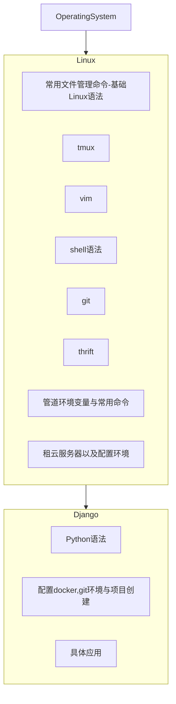

# 关于AcWing-工程课

> 工程无第一，算法无第二
>
> 可以把算法类比为理科，工程类比为文科

## Level1-Linux基础课

> 大部分工程的基础都运行再Linux服务器上，所以首先要学习Linux基础

```mermaid
flowchart TB
    OperatingSystem-->Linux
    subgraph Linux
    	常用文件管理命令-基础Linux语法
		tmux
		vim
		shell语法
		git
		thrift
		管道环境变量与常用命令
		租云服务器以及配置环境
    end
    Linux-->Django
    subgraph Django
    	Python语法
    	配置docker,git环境与项目创建
    	具体应用
    end
```

## Level2-Django、Spring、Go框架课

## Level3-前端Web框架

