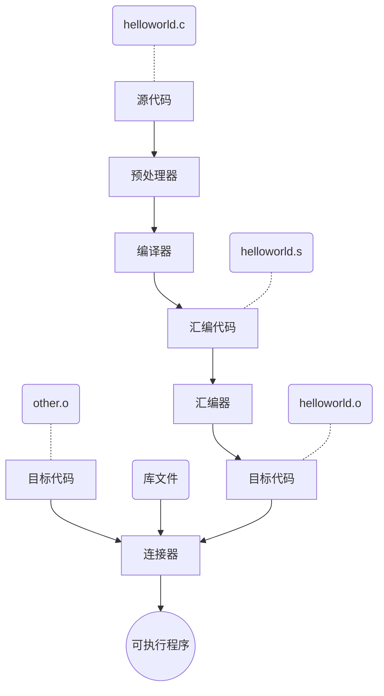

[toc]

# Linux基础课-1.1 常用文件管理命令

## 课程概论

> 关键是多多动手实践

### 学习目标

> 整门课学完之后，可以做出一个怎么样的项目呢？

1. 锻炼动手能力
2. 学完之后可以熟练开发上线各种应用
3. 比如**web**、**app**、**小程序**、**桌面应用**、**游戏**

所用的应用，前端可能千变万化，像qq、各种游戏、小程序、app、甚至编译器，但是后端都统一的有一个$Server$,点击前端的某个按钮，就是向后端的$Server$发送一个**请求**，然后返回相应的**信息**，最后**前端**将这些相关信息渲染出来。

后端$Server$就像一个函数$y=f(x)$，前端传递参数$x$，后端返回页面$f(x)$

所以开发任何应用，都需要学会构建自己后端的$Server$服务器

Plus：市面上超过$90$%的服务器都是$Linux$服务器

而我们这门课学的东西就是$Linux$服务器

#### 关于学习方式

<u>技术不是手段，而是目的。</u>

所以本门课讲究的是**实用主义**，不是像学校课程那样泛滥（不求全，当然自己可以拓展）

**学习方式**：边学边查！！切记滥学！！

### 什么是Linux？

> Linux是啥？Linux是一个操作系统！！
>
> 别看Linux只有一个**小黑框**，但是这个**小黑框**可以实现**Windows**（windows中使用的是图形操作界面）中能够实现的所有内容

**小黑框是啥？**

#### 现代服务器的操作模式

- AcWing网站的服务器模式：分配服务器，首先在远程给所有人开了1000多台虚拟机（可以把它理解为"电脑"）

  而AC Terminal就是分配给你的电脑的屏幕，所以点开AC Terminal，就相当于打开了一个屏幕（可以类比gitbash、powershell，从远程的那台分配给你的主机连了一根线到你的的电脑上）

  

  就像Windows一样，只不过Windows里看到的是很多图形界面，而Linux看到的是小黑框（别看小黑框上啥也没显示，但是实际上里面安装这**几百个**应用）

  那么如果我在本地打开了两个以及多个小黑框呢，很简单，就是远程主机连接了多个屏幕，屏幕之间共享同一个主机，操作一个屏幕，另外一个屏幕也能感受到（只要别同时打开太多）

  而且AcWing提供的服务器是联网的，也就是说可以将你的服务器和其他人的服务器连接，达成上面的共享关系

  同样的关掉AC Terminal，也只是关掉了一个屏幕而已，真正的后端服务器是24小时永不停歇的运行着的（但是屏幕上运行的程序会断掉，当然也可以通过某些命令进行后台运行）

  以后去各种公司工作的时候，你的本地电脑就相当于一个屏幕，然后打开终端，然后可以直接`ssh`到公司的服务器上，而且多台电脑可以连接到同一台服务器上，而且服务器之间也可以进行互传

- 正因如此，所以本课程并不需要在自己电脑上安装一个linux操作系统，因为未来公司以及实践的时候都是在云端ssh到公司服务器上直接操作公司服务器的

**Linux的各种版本**

> 以下两种版本都是市面上最最常用而且稳定的，不同公司使用不同的Linux版本只是一个习惯上问题

1. Ubuntu：本次课程使用
2. CentOS

## Linux的文件系统

> 可以先来康康Windows的文件系统对比一下:几个盘，然后每个盘里面很多文件
>
> 

### 基本目录结构

- 根目录:`/`

  根目录下常见文件夹有以下几种

  

  - **bin:存放常用可执行文件的命令**

  - etc:配置文件(比如各种网站的配置文件)

  - var:使用的比较多的就是log文件夹

    - log:日志文件夹(存放各种网站的日志文件)

  - **lib:存放一些安装包和头文件(c++头文件等等)**、静态链接库

  - home:用户的家目录，存放用户目录

    - acs:用户目录，登录时的初始目录(acs=acwing server)

  - proc:存放一些进程相关的信息，放一些Linux的配置文件(8G内存、64位系统啥的)

    比方说使用`cat cpuinfo`查看服务器配置

    

### 文件路径

> 绝对路径和相对路径的区别就是是否从根目录开始描述

1. 绝对路径

   举个例子：`/home/acs/main.cpp`

2. 相对路径

   同样举个例子：此时路径`/home/`，相对路径`acs/main.cpp`

3. 特殊路径

   - `..`代表上一层目录
   - `.`代表当前目录
   - `~`代表家(home)目录，等价于`/home/acs`

   比方说`/tmp`=`/tmp/.././tmp`

---

## Linux常用文件管理指令

> AC Terminal中：默认<font color="blue">蓝色</font>为文件夹，<font color="white">白色</font>为普通文件，<font color="green">绿色</font>为可执行文件

**<u>重点来啦！！！！</u>**

### 快捷键

1. `ctrl+c`:终止指令、程序，直接终止本行指令书写跳转到下一行
2. `ctrl+u`:清空当前在书写的一行指令（用的较少）
2. `ctrl+z`:挂起当前程序，如果想要恢复该程序使用fg[job_spec]即可
2. `clear`：清除全屏内容
3. `tab`:补全命令，连按两次可以看服务器的推荐指令
4. 方向键:不多说，应该都会（可以回退之前写过的指令）

### 基本文件指令

> 参数顺序是无所谓的嗷，还有指令是支持正则表达式滴
>
> Plus：`ctrl+insert`是linux控制台的复制指令，`shift+insert`则是linux控制台的粘贴指令

1. `ls`:展示指令，类比windows中的`dir`

   - `ls -l`:显示文件的**详细信息**，包括==是否是文件夹==、==读写权限==、==大小==、==修改实践==等等

   - `ls -lh`:指令-lh代表人性化显示所查看的内容，比方说下面两条指令的对比，原来显示的是121288字节，加上h后显示为119k

     ==ls kill -l==:`-rwxr-xr-x 1 root root 121288 Dec 22  2018 sed`

     ==ls kill -lh==:`-rwxr-xr-x 1 root root 119K Dec 22  2018 sed`

   - `ls -a`:显示所有文件，能够显示**被隐藏**起来的文件（一般都是以`.`开头的文件）

   - `ls -ll`=`ls -la`

2. `pwd`:显示当前所在路径

3. `cd`:切换目录指令，不加参数默认返回家目录

   - `cd ..`:返回上层目录
   - `cd -`:返回上一个你待过的目录

4. `cp`:文件复制+粘贴+(重命名)命令，文件复制具体操作如下图所示

   

   - `cp a b -r`:将整个a目录复制到b目录下面

     如果存在==转义字符==，直接+\表示即可

   - `cp a ./c -r`:直接在当前目录下复制一份`a`目录并重命名为`c`，`-r`代表操作文件夹

   - ```
     for var in *.txt
     do
     	cp "$var" "$var.bat"
     done
     ```

     

5. `mkdir`:创建文件夹

   - `mkdir a`:创建一个`a`文件夹
   - `mkdir a/b/c -p`:创建一个a文件夹，并在a文件夹下创建一个b文件夹，并在b文件夹下创建一个c文件夹(都是在文件夹不存在的情况下创建的)，-p用于连续创建文件夹

6. `rm`:删除文件

   - `rm tmp.txt tmp2.txt`:删除`tmp.txt`和`tmp2.txt`两个文件
   - `rm a -r`:删除名为`a`的文件夹，删除多个`rm a b c -r=rm {a..c} -r`
   - `rm {a..c}.txt`:删除`a.txt,b.txt,c.txt`
   - `rm *`:删除当前文件夹下的所有东西，所以`rm a/*`就是删除a文件夹下的所有内容
   - `rm * -rf`:**毁灭吧！！！**（删除所有内容，包括未显示的文件夹，f代表提高权限）

7. `touch`:==创建一个文件==，只是单纯的创建，和vim的创建并编辑不同

8. `mv`:剪切+粘贴指令

   - `mv a/tmp.txt b/`:简简单单嗷
   - `mv tmp2.txt tmp.txt`:就是重命名
   - `mv dir_a/{a.txt,b.txt,c.txt} dir_b/`:移动多个文件，复制同理

9. `cat`:==查看文件的内容==

   - `cat tmp.cpp`:直接在控制台上显示查看内容
   - `cat cpuinfo`:（需要cd到/proc文件夹）查看服务器配置文件

> Plus:删除指定文件
>
> `find -type f -name "*.txt" -delete`:删除当前目录下所有后缀为txt的文件
>
> ```shell
> for var in *.txt
> do
> 	rm "$var"
> done
> ```

## OS新增内容：GCC

> 讲解了一下Linux服务器下如何编译运行C代码具体操作

示例：Linux下直接使用gcc将helloworld.c编译成可执行文件helloworld

```shell
gcc helloworld.c -o helloworld # 得到可执行文件
gcc -E helloworld.c # 只进行预处理
gcc helloworld.c -S -o helloworld.S # 汇编得到helloworld.S
gcc helloworld.c -c -o helloworld.o # 只编译，不链接
gcc -M helloworld.c # 列出文件依赖
```

复习以下C语言编译的基本流程



## OS新增内容：Make和Makefile

### 概述

学习Makefile前，先来了解一下Makefile是干什么用的？

[Makefile](https://www.zhaixue.cc/makefile/makefile-intro.html)是在Linux环境下 C/C++ 程序开发必须要掌握的一个工程管理文件

首先我们假设一个情景，你写了一个helloworld.c文件，此时它还是一个单文件程序，不需要和其他任何文件链接，所以执行它，只需要

```shell
gcc helloworld.c -o helloworld
./helloworld
```

此时对于单文件以及一些比较简单的程序，使用gcc编译运行还是非常方便的

---

此时我们再假设一个情景，你正在开发一个很大的项目，里面可能有几百个c源文件（不要问我为什么非要用c开发这种项目emm），并且它们之间都是相互链接的，那么此时再次编译运行整个项目，就需要......

```shell
gcc moudle1.c moudle2.c ... moudle100.c ... -o a.out
./a.out
```

这是不是太麻烦了点呢？（废话.jpg）

这种时候**自动化编译工具make**就派上用场了，使用make编译程序，不需要每次都输入源文件，直接再命令行下敲击make命令，即可一键自动化完成编译（make编译依赖于Makefile文件，并且可以直接把make指令看作**宏定义**来理解）

总结：==make和Makefile就是为了方便Linux下文件编译运行而产生的（主要用于替代win系统中编译器为我们做的事情，并且由于执行主要依赖于shell命令，自由化程度比起编译器来更高，并且支持的语言不仅仅局限于c）==

### 具体使用

> 使用了一下后，感觉Makefile的原理非常像宏定义？？？

- Makefile文件的基本格式

  ```shell
  target1: dependencies1(构建target目标所需的依赖文件)
  	command1
  	command2
  	... # 获取到target文件所需要执行的指令集合
  target2: ....
  	...
  ```

  再看一个具体实例

  ```shell
  a.out: helloworld.o
      gcc -o a.out helloworld.o
  helloworld.o: helloworld.c
      gcc -c -o helloworld.o helloworld.c
  clean:
      rm -f a.out helloworld.o
  ```

### 网址实例操作

> 网站就是指导书上推荐的第一个http://www.cs.colby.edu/maxwell/courses/tutorials/maketutor
>
> 指导书推荐的第二个网站http://www.gnu.org/software/make/manual/make.html#Reading-Makefiles
>
> 以下文件均放在同一目录下

#### Level1

```c
//hellomake.c
#include <hellomake.h>

int main() {
  // call a function in another file
  myPrintHelloMake();

  return(0);
}
```

```c
//hellofunc.c
#include <stdio.h>
#include <hellomake.h>

void myPrintHelloMake(void) {

  printf("Hello makefiles!\n");

  return;
}
```

```c
//hellomake.h
/*
example include file
*/

void myPrintHelloMake(void);
```

**直接使用gcc编译**

```shell
gcc hellomake.c hellofunc.c -I -o hellomake
# -I代表gcc会在当前目录下寻找所包含的头文件
```

**使用makefile**

```shell
hellomake: hellomake.c hellofunc.c
	gcc hellomake.c hellofunc.c -o hellomake -I ./ # 在当前路径下查找所需头文件
```


## OS新增内容：ctags

> 同样在了解ctags的使用之前，先来了解一下ctags的具体功能
>
> 简单来说：IDEA中不是有个功能，ctrl+方法，再点击就会自动转到该方法具体实现的源文件相应位置处，这样查看起源代码来非常方便快捷，而ctags就是Linux下执行这一功能的（总而言之这些新增的东西全都是为了弥补Linux下没有编辑器的缺陷）

1. 执行`ctags -R *`：在代码目录下生成文件tags
2. 然后在你想要查看的函数那里`ctrl+]`即可跳转到函数实现处
3. 最后`ctrl+o`跳转回原文件


## 光标切换

**使用`echo -ne "\e[2 q"`和`echo -ne "\e[6 q"`可以使得Linux光标在粗光标和细光标之间相互切换**

## 作业

> 涵盖了基本操作和各路大佬的骚操作~

> 作业具体要求
> 创建好作业后，先进入文件夹/home/acs/homework/lesson_1/，然后：
> (0) 进入homework_0文件夹，分别创建文件夹dir_a, dir_b, dir_c
> (1) 进入homework_1文件夹，将a.txt, b.txt, c.txt 分别复制成: a.txt.bak, b.txt.bak, c.txt.bak
> (2) 进入homework_2文件夹，将a.txt, b.txt, c.txt 分别重命名为: a_new.txt, b_new.txt, c_new.txt
> (3) 进入homework_3文件夹，将dir_a文件夹下的a.txt, b.txt, c.txt分别移动到文件夹dir_b下
> (4) 进入homework_4文件夹，将普通文件a.txt, b.txt, c.txt删除
> (5) 进入homework_5文件夹，将文件夹dir_a, dir_b, dir_c删除
> (6) 进入homework_6文件夹，查看task.txt的内容，并按其指示进行操作
> (7) 进入homework_7文件夹，创建文件夹dir_0, dir_1, dir_2，
>  将a.txt, b.txt, c.txt复制到dir_0下，重命名为a0.txt, b0.txt, c0.txt;
>  将a.txt, b.txt, c.txt复制到dir_1下，重命名为a1.txt, b1.txt, c1.txt;
>  将a.txt, b.txt, c.txt复制到dir_2下，重命名为a2.txt, b2.txt, c2.txt;
> (8) 进入homework_8文件夹，分别在dir_a, dir_b, dir_c文件夹下查看task.txt的内容，并分别按照指示进行操作c
> (9) 进入homework_9文件夹，将其中所有txt类型的文件删除

### 作业0

```shell
mkdir {dir_a,dir_b,dir_c}
mkdir dir_{a..c}
```

### 作业1

```shell
//正常操作
cp a.txt a.txt.bak
cp b.txt b.txt.bak
cp c.txt c.txt.bak
//骚操作
for var in *.txt;
do
    cp "$var" "$var.bak"
done
```

### 作业2

```shell
//正常操作
mv a.txt a_new.txt
mv b.txt b_new.txt
mv c.txt c_new.txt
//骚操作
for var in *.txt
do
	mv "$var" "${dir%_*}_new.txt" # 重命名
done
```

### 作业3

```shell
//正常操作
mv dir_a/{a.txt,b.txt,c.txt} dir_b/
//骚操作(其实就是正则)
mv dir_a/{a..c}.txt dir_b/
```

### 作业4

```shell
rm {a..c}.txt
```

### 作业5

```shell
rm dir_{a..c} -r # -p是mkdir中出现的
```

### 作业6

```shell
cat task.txt//主要是查看，其他简单
```

### 作业7

```shell
//骚操作
for i in {0..2}
do
    mkdir "dir_$i"
    for var in *.txt
    do
        cp "$var" "dir_$i/${var%.*}$i.txt"
    done
done
```

> 解释一下
>
> `${var%.*}`:作用是去掉变量var从右边算起第一个`.`字符以及其右边所有内容，返回从右边算起第一个`.`的左边的内容，常用于去除文件后缀得到所需目录
>
> `${var#*.}`:该命令的作用是去掉变量var从左边算起的第一个`.`字符及其左边的内容，返回从左边算起第一个`.`（不含该字符）的右边部分的内容

### 作业8

```shell
cd homework_8
cd dir_a
cat task.txt
rm a.txt
cd ../dir_b/
cat task.txt
mv b.txt b_new.txt
cd ../dir_c/
cat task.txt
cp c.txt c.txt.bak
```

### 作业9

```shell
//骚操作
find -type f -name *.txt -delete
rm *.txt
```

# 小结

> 其余内容正在码字ing~，估计寒假能够学完linux基础课的所有内容
