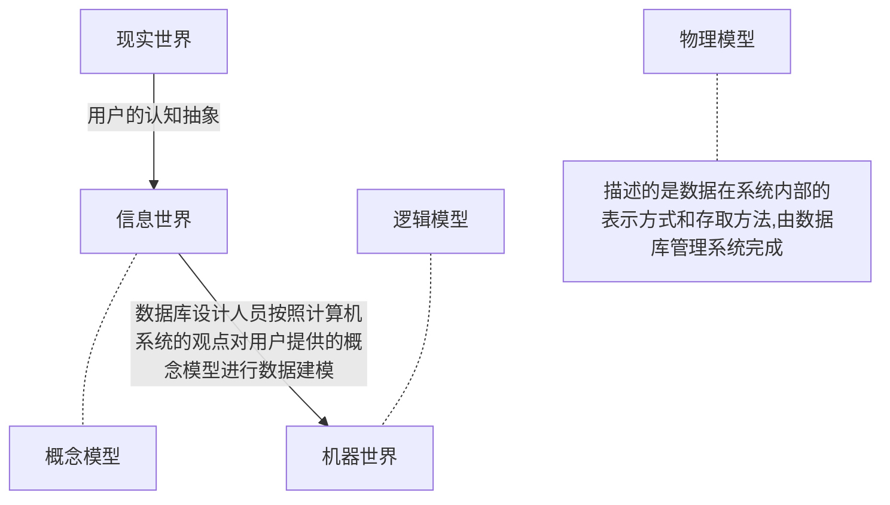
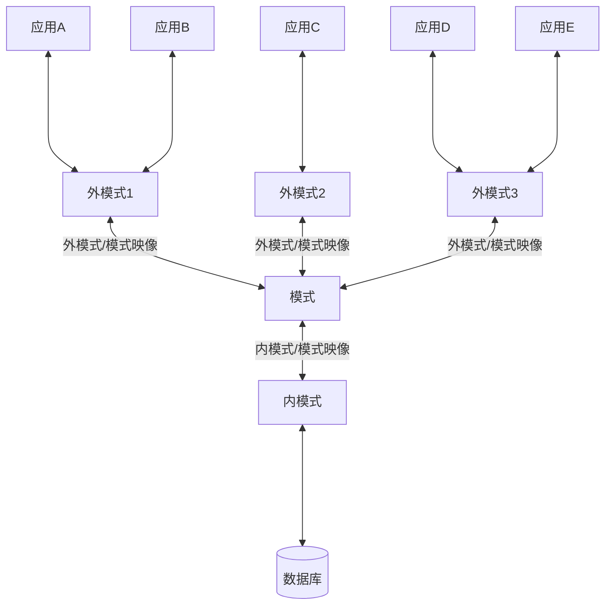

[toc]

# 数据库系统概论

## 数据库基本概念

1. 数据（Data）

   数据是数据库中存储的==基本对象==，是描述事物的==符号记录==

   数字、文字、图形、视频等等

   > 数据的含义称为数据的语义，数据与其语义是不可分的（语义就是对于某一数据的具体解释）
   >
   > ```mermaid
   > graph LR
   > 数据不可分 --> 语义 --> absc
   > ```

2. 数据库（Database）

   通俗定义：数据库是按照<u>一定格式</u>（==数据模型==）存放在计算机存储设备上的虚拟仓库

   严格定义：数据库是**长期储存**在计算机内、**有组织**的、**可共享**的**大量**数据的集合

   > 数据库的基本特征
   >
   > - 数据按一定的数据模型组织（有结构）、描述、存储
   > - 可以为各种用户共享
   > - 冗余度较小（指重复数据在数据库中很少出现）
   > - 易扩展

3. 数据库管理系统（DBMS：Database Management System）

   是位于用户和操作系统之间的一层数据管理软件，是一个大型复杂的软件系统，用于科学的组织和存储数据、高效的获取和维护数据

   > 数据库管理系统的主要功能
   >
   > - 数据定义功能：提供了数据定义语言DDL，可以通过其对数据库中的数据对象进行组成与结构的定义
   >
   > - 数据组织、存储和管理：。。。。
   >
   > - 数据操纵功能：提供数据操纵语言DML，实现对数据库的基本操作（查询、插入、删除、修改）
   >
   > - 数据库的事务管理和运行管理：
   >
   >   数据的安全性、完整性、多用户对数据的并发使用
   >
   >   发生故障后的系统恢复数据库
   >
   > - 数据库的建立和维护功能：。。。。
   >
   > - 其他功能：。。。。

4. 数据库系统（DBS：Database System）

   数据库系统是由数据库、数据库管理系统（以及其引用开发工具）、应用程序、数据库管理员所组成的存储、管理、处理和维护数据的系统

   ```mermaid
   graph LR
   用户1--需求1-->应用系统
   用户2--需求2-->应用系统
   用户3--需求3-->应用系统
   应用系统---数据库管理系统
   数据库管理系统---操作系统
   操作系统---数据库
   数据库管理员--管理-->数据库管理系统
   数据库管理员--管理-->数据库
   ```

   ## 数据管理技术的产生和发展

   > 了解即可

   1. 人工管理阶段：就是人来管，机器不管

      应用程序和数据集一一对应

   2. 文件系统阶段：

      本质上应用程序和数据集还是一一对应的，冗余度还是比较高

      记录内有结构，整体无结构

   3. 数据库系统阶段：

      所有应用程序之间的数据集在数据库中是共享的

   > 数据的整体结构化是数据库的主要特征之一
   >
   > - 数据集不再仅仅针对某一个应用，而是面向整个企业或组织
   > - 不仅数据内部结构化，==整体是结构化的==，数据之间还具有联系
   > - 数据记录可以变长
   > - 数据的最小存取单位是数据项

   ## 数据模型

   > 数据模型就是对现实世界数据特征的抽象，数据模型是用来描述数据、组织数据和对数据进行操作的

- 数据模型应当尽量满足的三种要求

  - 能够比较真实的模拟现实世界
  - 容易被人理解
  - 便于在计算机上实现

  由于三者很难兼顾，因此在数据库系统中针对不同的使用对象和应用目的，采用不同的数据模型

**基本概述**

首先来看看要将现实世界抽象为某一数据库管理系统支持的数据模型所需要经过的步骤



1. 概念模型：又叫做信息模型，是按照用户的观点和认知来对数据进行数据建模，主要用于数据库的设计
2. 逻辑模型：数据库设计人员按照计算机系统的观点对用户提供的概念模型进行数据建模，主要用于数据库管理系统的实现
3. 物理模型：描述的是数据在系统内部的表示方式和存取方法，由数据库管理系统完成（我们一般不需要考虑）

### 概念模型

> 概念模型用于现实世界到信息世界的建模，是数据库设计人员和用户之间交流的语言

==信息世界中的基本概念==

|         概念          |                             语义                             |                         实例                         |
| :-------------------: | :----------------------------------------------------------: | :--------------------------------------------------: |
|    实体（entity）     |   客观存在并且可以互相区别的事务（可以是抽象的概念或联系）   | 一个学生、一个职工、一个部门、教师与院系的工作关系等 |
|   属性（attribute）   |                     实体所具有的某一特征                     |               比如学生的学号、姓名等等               |
|       码（key）       |                   **唯一**标识实体的属性集                   |                   比如学生的学工号                   |
| 实体型（entity type） | 具有相同属性的实体必然具有共同的特征和性质，利用实体名(属性名集合)来抽象刻画同类实体 |              学生(姓名、学号、性别...)               |
| 实体集（entity set）  |                      同一类型实体的集合                      |                       全体学生                       |
| 联系（relationship）  |             实体之间的联系通常指实体集之间的联系             |               比如学生和老师之间的联系               |

实体之间的联系由一对一、一对多、多对多等多种类型（应该比较好理解，不赘述了就）

### 数据模型的组成要素

> 数据模型是严格定义的一组概念的集合，这些概念精确的定义了系统的静态特性、动态特性和完整性约束条件（integrity constraints），因此数据模型通常由数据结构、数据操作和数据的完整性约束条件三部分组成

1. 数据结构*

   数据结构描述数据库的**组成对象**以及**对象之间的联系**。

   也就是说定义了实体、属性和联系（笼统来讲）

   数据结构描述的内容有两类

   - 与对象的类型、内容、性质有关的
   - 与数据之间的联系有关的对象

   总之：数据结构是对系统静态特性的描述

2. 数据操作

   数据操作是指对数据库中各种对象（型）的实例（值）允许执行的操作的集合，包括与操作有关的操作规则

   是对系统动态特性的描述

3. 数据的完整性约束条件

   数据的完整性约束条件是一组完整性规则。

   完整性规则是给定的数据模型中数据及其联系所具有的制约和依存规则，用以限定符合数据模型的数据库状态以及状态变化，以保证数据的正确、有效和相容。

   比方说约束教授的退休年龄是65岁，男职工的退休年龄是60周岁等等

### 常用的数据模型

> 数据库领域中主要的逻辑模型有：
>
> - **层次模型**（hierarchical model）
> - **网状模型**（network model）
> - **关系模型**（relational model）
> - 面向对象数据模型（object oriented data model）
> - 对象关系数据模型（object relational data model）
> - 半结构化数据模型（semistructure data model）

## 数据库系统的结构

> 数据库系统的结构可以有多种不同的层次或不同的角度，这里说明的数据库系统结构是从数据库应用开发人员的角度看的。

<u>数据库系统通常采用三级模式结构，这是数据库系统内部的系统结构</u>

**数据库系统中模式的概念**

数据模型中有“型”（type）和“值”（value）的概念，型是指对某一类数据的结构和属性的说明，值是型的一个具体赋值，类比（学号，姓名）——（123，yxc）

模式（schema）是数据库中全体数据的逻辑结构和特征的描述，<u>它仅仅设计“型”的描述</u>。模式的一个具体值被称为模式的一个实例（instance）

书上的例子........

模式是相对稳定的，实例则是相对变动的

模式反映的是数据的结构和联系，实例反映的则是，数据库某一时刻的状态

### 数据库系统的三级模式结构

> 数据库的三级模式结构是指数据库系统是由外模式、模式和内模式三级构成，如下图



1. ==模式（schema）==

   模式又叫逻辑模式，是数据库中**全体数据**的逻辑结构和特征描述，是**所有用户**的公共视图。<u>它是数据库系统模式结构的中间层，既不涉及数据的物理存储细节和硬件环境，又与具体的应用程序、高级程序设计语言无关。</u>

   **一个数据库只有一个模式**。数据库模式以一种**数据模型**为基础，统一综合考虑了所有用户的需求，并将这些需求有机的结合成一个逻辑整体

   <u>数据库管理系统提供模式数据定义语言（模式DDL）来严格定义模式</u>

2. 外模式（external schema）

   又叫子模式或者用户模式，是数据库用户（包括应用程序员和最终用户）能够看见和使用的**局部数据**的逻辑结构和特征的描述，是数据库用户的数据视图，是与某一应用有关的数据的逻辑表示

   一个数据库根据用户的需求不同（应用需求、保密性等等）具备很多不同的外模式

   基于外模式，每个用户能看见访问的数据都是对应外模式欸的数据，数据库中其他数据对其是不可见的，所以外模式是保证**数据库安全性**的一个有力措施

   <u>同样，数据库管理系统提供模式数据定义语言（模式DDL）来严格定义外模式</u>

3. 内模式（internal schema）

   又叫存储模式，一个数据库只有一个内模式。是数据物理结构和存储方式的描述，是数据在数据库内部的组织形式。

### 数据库的二级映像功能和数据独立性

> 数据库系统的三级模式是数据的三个抽象级别，它把数据的具体组织留给数据库管理系统管理，使用户能够逻辑的、抽象的处理数据，而不必关系数据在计算机中的具体表示方式和存储方式，为了能够在系统内部实现这**三个抽象层次的联系和转换**，数据库管理系统在这三级模式之间提供了两层映像：**外模式/模式映像**和**模式/内模式映像**

1. 外模式/模式映像

   模式描述的是数据的全局逻辑结构，而外模式描述的是数据的局部逻辑结构。

   对于同一个模式有多个外模式，而对应于每一个外模式，数据库系统都有一个外模式/模式映像，它定义了该外模式与模式之间的对应关系，这些映像的定义通常包含在各自外模式的描述中

   当模式（逻辑模式）改变的时候（增加新关系等等），由数据库管理员对各个外模式/模式的映像作出相应的改变，这样可以使得外模式保持不变。应用程序是一句外模式编写的，从而应用程序不用修改，这就保证了程序与程序的逻辑独立性，简称数据的逻辑独立性

2. 模式/内模式映像

   数据库中只有一个模式和内模式，所以模式/内模式映像是唯一的，定义的是全局逻辑和数据存储结构之间的对应关系。

   当数据库的存储结构发生改变的时候，由数据库管理员对模式/内模式映像做出相应改变，可以使得模式不用改变，从而应用程序也不用改变，保证了数据与程序之间的物理独立性，简称数据的物理独立性。

**数据库模式即全局逻辑结构是数据库的中心和关键，它独立与内模式和外模式，所以设计数据库模式结构的时候应该首先确定数据库的逻辑模式**

## 数据库系统的组成（详细）

> 暂时略过

# 第一章习题

1. 数据、数据库、数据库管理系统、数据库系统的概念

   - 数据：数据是数据库中存储的==基本对象==，是描述事物的==符号记录==，像文字、数字等
   - 数据库：数据库是**长期储存**在计算机内、**有组织**的、**可共享**的**大量**数据的集合
   - 数据库管理系统：是位于用户和操作系统之间的一层数据管理软件，是一个大型复杂的**软件系统**，用于科学的组织和存储数据、高效的获取和维护数据
   - 数据库系统：数据库系统是由数据库、数据库管理系统（以及其引用开发工具）、应用程序、数据库管理员所组成的存储、管理、处理和维护数据的系统，是广义上的数据库

2. 使用数据库系统的好处

   - 存储在计算机上，数据可以**长期保存**
   - 数据库采用三级模式结构，并且中间层采用统一的逻辑结构，不同用户/应用之间的数据能够实现相互**共享**，并且采用统一逻辑结构管理，数据的**冗余度小**
   - 数据库采用二级映像功能，模式和外模式，模式和内模式之间相互独立，当内模式/外模式发生改变时，数据库管理员只需要调整模式/外模式映像和模式/内模式映像即可，**数据具有物理独立性和数据独立性**

3. 文件系统和数据库系统的区别和联系

   - 联系
     - 记录都是有结构的
     - 数据可以长期保存
   - 区别
     - 文件系统整体无结构，而数据库系统整体结构化，数据之间有联系
     - 数据库系统可以实现数据共享
     - 数据库系统的数据集不再仅仅针对一个应用，而是面向一整个企业/部门
     - 数据库系统的数据共享也导致了数据之间的冗余度较小
     - 数据库系统的数据具有独立性
     - 数据库系统的外模式使得用户只能访问局部数据，更加安全

4. 举出适合用文件系统而不是数据库系统的例子，以及适合用数据库系统的例子。

   - 文件系统：功能比较简单固定的应用系统，比如简单的数据备份（这个确实想不到）

   - 数据库系统：工厂管理系统、图书管理系统

5. 简述数据库系统的特点

   - 整体结构化
   - 数据共享，冗余度低
   - 数据独立，方便管理
   - 数据弹性大，易于扩充
   - 数据安全性高

6. 数据库管理系统的主要功能（这块就直接复制粘贴了emm）

   - 数据定义功能：提供了数据定义语言DDL，可以通过其对数据库中的数据对象进行组成与结构的定义

   - 数据组织、存储和管理

   - 数据操纵功能：提供数据操纵语言DML，实现对数据库的基本操作（查询、插入、删除、修改）

   - 数据库的事务管理和运行管理：

     数据的安全性、完整性、多用户对数据的并发使用

     发生故障后的系统恢复数据库

   - 数据库的建立和维护功能

   - 其他功能

   15. 试述数据库系统的三级模式，并说明这种结构的优点

   > 首先说说模式的概念：数据库中全体数据的逻辑结构和特征的描述，是“型”的概念

   三级模式：外模式/模式/内模式

   - 模式：面向使用该数据库的所有用户，是数据库中全体数据的逻辑结构和特征的描述，整个数据库的模式是唯一的，位于数据库系统的中间层，是数据库最重要的“模式”
   - 外模式：面向的是用户/应用，是对用户所能看见的局部数据的逻辑结构和特征的描述，根据不同用户的不同需求，一个模式可以对应很多个不同的模式，这样的结构是特定用户只能访问特定的数据，带来了数据的安全性
   - 内模式：面向的是物理层面的数据存储结构，对于一个数据库是唯一的，描述的是数据在数据库内部的组织模式

16. 定义并解释以下术语：模式、外模式、内模式、数据定义语言、数据操纵语言

    - 模式：模式（schema）是数据库中全体数据的逻辑结构和特征的描述，<u>它仅仅设计“型”的描述</u>。模式的一个具体值被称为模式的一个实例（instance）

      模式在数据库中是唯一的，它是链接外模式和内模式的中间层

      数据库模式以一种**数据模型**为基础，统一综合考虑了所有用户的需求，并将这些需求有机的结合成一个逻辑整体

    - 外模式：又叫子模式或者用户模式，是数据库用户（包括应用程序员和最终用户）能够看见和使用的**局部数据**的逻辑结构和特征的描述，是数据库用户的数据视图，是与某一应用有关的数据的逻辑表示

      一个数据库根据用户的需求不同（应用需求、保密性等等）具备很多不同的外模式

      基于外模式，每个用户能看见访问的数据都是对应外模式欸的数据，数据库中其他数据对其是不可见的，所以外模式是保证**数据库安全性**的一个有力措施

    - 内模式：又叫存储模式，一个数据库只有一个内模式。是数据物理结构和存储方式的描述，是数据在数据库内部的组织形式。

    - 数据定义语言：DDL（Data Definition Language），用于对数据库中的数据对象的组成和结构进行定义

    - 数据操纵语言：DML（Data Manipulation Language），用户使用其来进行操纵数据，实现对数据库的基本操作，如查询、插入、删除等等

17. 什么叫数据与程序的物理独立性？什么叫数据与程序的逻辑独立性？为什么数据库系统具有数据与程序独立性？

    这些均由数据库管理系统在这三级模式之间提供的两层映像决定：**外模式/模式映像**和**模式/内模式映像**

    - 数据与程序的物理独立性：当模式（逻辑模式）改变的时候（增加新关系等等），由数据库管理员对各个外模式/模式的映像作出相应的改变，这样可以使得外模式保持不变。应用程序是一句外模式编写的，从而应用程序不用修改，这就保证了程序与程序的逻辑独立性，简称数据的逻辑独立性
    - 数据与程序的逻辑独立性：当数据库的存储结构发生改变的时候，由数据库管理员对模式/内模式映像做出相应改变，可以使得模式不用改变，从而应用程序也不用改变，保证了数据与程序之间的物理独立性，简称数据的物理独立性。
    - 数据库系统具有的数据和程序独立性：数据库管理系统在三级模式之间提供的两层映像保证了数据库系统具有数据和程序独立性

18. 试述数据库系统的组成

    ```mermaid
    flowchart TB
    subgraph 硬件平台及数据库
    足够大的内存
    系统需要由jiao
    end
    subgraph 软件
    数据库管理系统
    操作系统
    高级语言以及编译系统
    应用开发工具
    数据库应用系统
    end
    subgraph 人员
    用户
    应用程序员
    数据库管理员
    系统分析员
    end
    ```

    