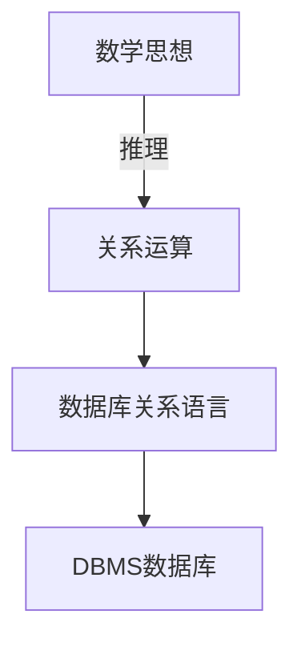

[toc]

# 关系模型的基本概念

> 关系模型与其他模型不同，它是建立在非常严格的数学概念上的。
>
> 关系数据库系统是支持关系模型的数据库系统，根据数据模型的三要素，关系数据模型由**关系数据结构**、**关系操作集合**和**关系完整性约束**组成，分别描述了关系数据库系统的<u>静态特性</u>、<u>动态特性</u>和<u>完整性约束条件</u>
>
> **学习目的：熟练掌握关系代数、元组演算和域演算，用这些关系运算来表达各种复杂的检索需求，以便后序SQL语言的学习（关键是要学会准确的描述）**

关系模型就是处理Table的，关系模型由以下三部分组成

- DB中各种数据的基本构成形式（关系数据结构）
- 描述Table和Table之间所可能发生的各种操作（关系运算/关系操作集合）
- 描述这些操作所应该遵循的约束条件（完整性约束）

关系代数具体实例：是基于**集合**的运算（非关系型的数据操作通常是以记录为元素的计算）
$$
\Pi_{姓名,课程名}\Big(\sigma_{课程号=c2}\big(R\bowtie S\big)\Big)
$$

## 关系模型的基本术语-Pre

> 利用下面的这张学生登记表来介绍关系模型中的一些基本术语。

|  学号   |  姓名  | 年龄 | 性别 |  系名  | 年级 |
| :-----: | :----: | :--: | :--: | :----: | :--: |
| 2013004 | 王小明 |  19  |  女  | 社会学 | 2013 |
| 2013006 | 黄大鹏 |  20  |  男  | 计算机 | 2013 |
| 2013008 | 张文斌 |  18  |  男  |  法律  | 2013 |
|   ...   |  ...   | ...  | ...  |  ...   | ...  |

- 关系（relation）：一个关系对应通常所说的**一张表**，如上面这张学生登记表

- 元组（tuple）：**表中的一行**即为一个元组

- 属性（attribute）：表中的一列即为一个属性，给每一个属性起一个名字即为属性名

- 码（key）：是表中的某一个属性组，用其可以唯一确定一个元组，如图中的学号就是本关系的一个码

- 域（domain）：域是一组具有相同的数据类型的**值**的集合。属性的取值范围来自某个域，比如大学生年龄的集合就是（15-45岁），性别的集合就是（男，女）。

  $Attention：属性名一般不等于域名$

- 分量：元组中的一个属性值

- 关系模式：对关系的描述，一般可以表示为`关系名(属性1,属性2,属性3,...)`

关系模型要求关系必须规范化，**其中最基本的一条就是，*关系的每一个分量都必须是不可分的数据项***

关系模型的数据操作是集合操作：其操作的对象和操作的结果都是关系，与格式化模型中操作单记录的方式不同。

并且关系模型将**存取路径向用户隐藏起来**，用户只需要指出“干什么”和“找什么”，“怎么干”和“怎么找”则由数据库管理员来进行指定，提高了数据的独立性和生产效率

关系模型的完整性约束条件

1. 实体完整性
2. 参照完整性
3. 用户定义的完整性

关系模型的缺点

1. 存储路径隐蔽：查询效率不高
2. 需要对用户的查询请求优化，增加了开发数据库管理系统的难度

## 关系的特性

1. **列同质**：每一列的分量来自于同一个域，为同类型数据
2. **不同的列可以来自于同一个域**，称其中的每一列为一个属性，不同的属性有不同的属性名
3. **行/列位置互换性**：区分列考列名，区分行靠关键字/码字
4. 理论上，关系的两个元组**不能完全相同**（但是**现实中**，表可能不遵从这个特性）
5. **属性不可再分性**：也就是表内不能存在子表（**关系的第一范式**）

## 关系数据结构及形式化定义

> 关系模型的数据结构非常简单，它只包含了单一的数据结构——关系
>
> 在用户看来，关系模型中数据的逻辑结构就是一张扁平的二维关系表，和层次模型非常不同。

关系模型中，**现实世界的实体以及实体之间的各种联系均用单一的结构类型**，即关系来表示。

1. 域（domain）：一组相同类型的值的集合（前面有提到过）

2. 笛卡尔积（cartesian product）：

   给定一组域$D_1,D_2,D_3....D_n$，允许其中某些域是相同的，则$D_1,D_2,D_3....D_n$的笛卡尔积为
   $$
   D_1\times D_2\times...D_n=\begin{Bmatrix} (d_1,d_2,...d_n)|d_i\in D_i,i=1,2,…n \end{Bmatrix}
   $$
   其中，每一个元素$(d_1,d_2..d_n)$叫做一个n元组（n-tuple），元素中的每一个$d_i$叫做**分量**
   一个域允许的不同取值个数称为这个域的**基数**（cardinal number）
   若$D_i(i=1,2,…n)$为有限集，其基数为$m_i(i=1,2,….n)$，则$D_1\times D_2\times...D_n$的基数$M=\prod \limits_{i=1}^n m_i$
   
   笛卡尔积可以用于表示一张二维表，表中的每一行为一个元组，每一列的取值来自于对应的域
   
   以$D_1={a,b},D_2={A,B}$为例，$D1 \times D_2=\begin{Bmatrix}(a,A),(a,B),(b,A),(b,B)\end{Bmatrix}$
   
   其构建的二维表为（注意，这不是关系，关系一般是笛卡尔积的子集）
   
   | islower | isupper |
   | :-----: | :-----: |
   |    a    |    A    |
   |    a    |    B    |
   |    b    |    A    |
   |    b    |    B    |
   
3. 关系（relation）

   定义：$D_1\times D_2\times...D_n$的子集叫做在域$D_1,D_2,D_3....D_n$上的关系表示为$R(D_1,D_2,D_3....D_n)$

   $n$表示关系的目或者度（degree），此处为$n$元关系，$n$目关系必有$n$个属性

*关系可以用$R(A_1:D_1,A_2:D_2,A_3:D_3...A_n:D_n)$来表示，可以简记为$R(A_1,A_2,A_3...A_n)$，这种描述又被称为**关系模式**或者**表标题***

- R是关系的名字，Ai是属性，Di是属性所对应的域，n是关系的度或者目，关系中元组的数目称为关系的基数

关系模式中属性向域的映像再很多DBMS中一般直接说明为属性的类型、长度等

- $Student(S_nchar(8),Sname char(10),Ssex char(2),Sage integer,D_n char(2),Sclass char(6))$

### 关系模式和关系

- 关系模式是稳定的；而关系是某一时刻的值，是随时可能变化的
- 同一关系模式下，可能有很多关系
- 关系模式是关系的结构，关系是关系模式在某一时刻的数据

### 关系的定义过程

1. 指出有多少列（属性）
2. 说明每一列的可能取值（域）
3. 指出所有可能出现的元组
4. 指出关系中的元组

### 关系上的一些比较重要的概念

- **候选码/候选键**：关系中的一个**属性组**，其值能唯一标识一个元组，若从该属性组中去掉任何一个属性，它就不再具备这一性质，这样的属性组被称为候选码。

  例子：$学生(\underline{S_n},Sname,Sage,Sclass)$，此时学生的学号是一个候选码

- **主码/主键**：多个候选码时，需要选取一个候选码作为主码

  DBMS以主码为主码为主要线索管理关系中的各个元组

- **主属性/非主属性**：包含在任何一个**候选码（注意：不是主码）**中的属性被称为主属性，而其他属性被称为非主属性

  最极端的情况：所有的属性构成候选码，这类关系称为**全码关系**（All-Keys）

- **外码/外键**：关系R的一个**属性组**，它*不是R的候选码*，但它与另一个关系S的候选码相对应，则称这个属性为R的外码

  举例：“合同”关系中的<u>客户号</u>不是候选码，但是它却是“客户”关系中的候选码，所以它是“合同”关系的外码

  *两个关系通常是通过**外码**连接起来的*

### 小结

## 关系模型的完整性

1. **实体完整性**：关系的主码中的属性不能为空值（不知道或者无意义的值），否则元组不可标识，在关系模型中一般用‘?’表征

   数据库中出现空值，会影响许多方面，如影响聚集函数运算的正确性，不能参与算数、比较、逻辑运算等等

   有空值的时候是需要特殊处理的，这点需要特别注意	

2. **参照完整性**：如果关系R1的**外码**Fk与关系R2的**主码**Pk相对应，则R1中的每一个元组中的Fk值要么等于R2中某个元组的Fk值，要么为空值。（下面举一个例子来理解一下）

   | <u>S#</u> | Sname | Ssex |  D#  |
   | :-------: | :---: | :--: | :--: |
   | 98030101  | 张三  |  男  |  01  |
   | 98030102  | 李四  |  男  |  02  |
   | 98030103  | 王五  |  男  |      |

   | <u>D#</u> | Dname  | Dean |
   | :-------: | :----: | :--: |
   |    01     |  机电  | 张三 |
   |    02     |  能源  | 李四 |
   |    03     | 计算机 | 李五 |

   - 空值：表示该学生尚未分配到任何系中

   - 若非空值：则必须是Dept关系的某个元组的D#值，因为学生不可能被分配到一个不存在的系里

3. **用户自定义完整性**：用户针对具体的应用环境定义的完整性约束条件（比如约束性别只能是男/女等），就是约束值域范围

<u>实体完整性和参照完整性一般由DBMS系统自动提供（结构保证，无法保存/更新）</u>

关于DBMS通常提供的机制

- 使用户可以自定义有关的完整性约束条件
- 当有更新操作发生的时候，DBMS将自动按照完整性约束条件检验更新操作的正确性，即是否符合用户自定义的完整性

## 杂

- 数据库中输入再删除代表0长度的字符串，和NULL值不同（如果要设置空值直接输入NULL）
