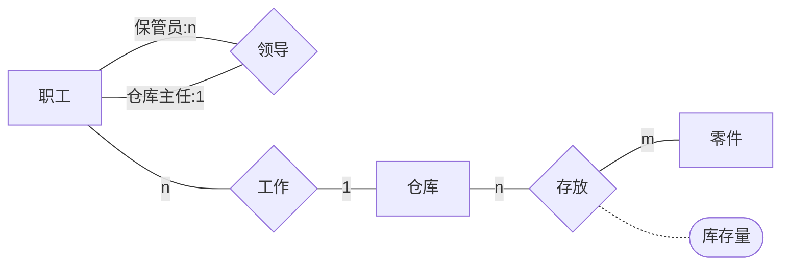
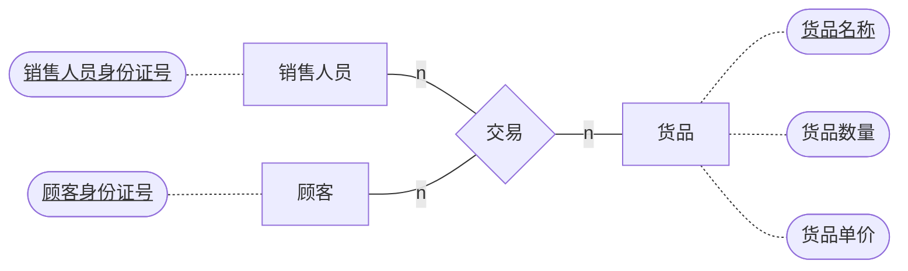
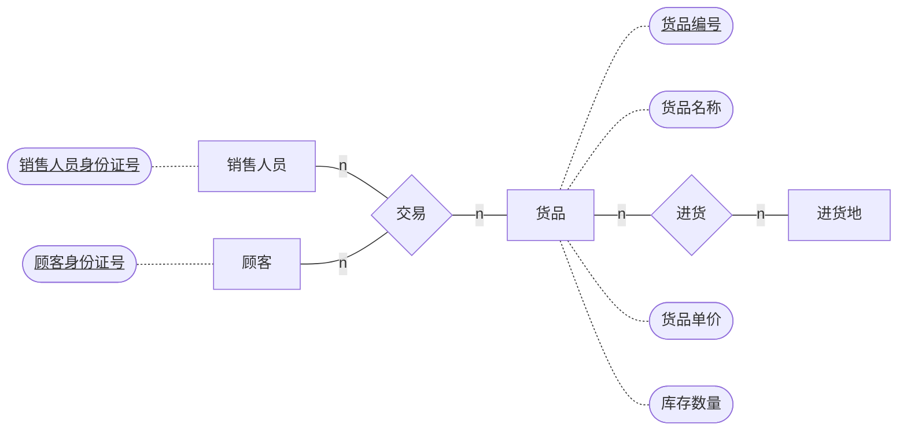
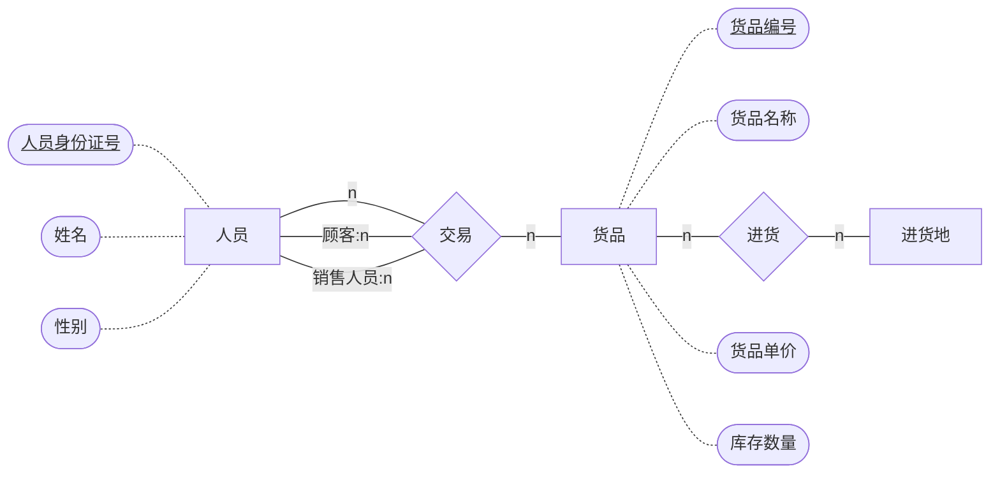
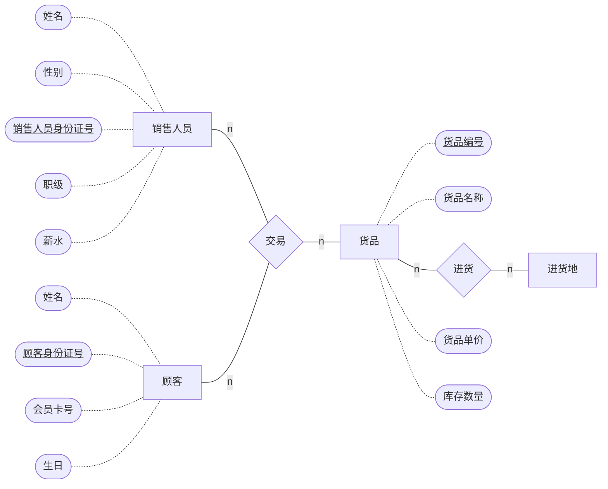
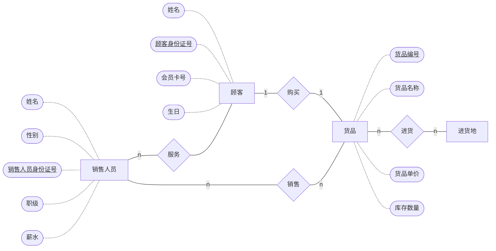

# ER模型习题

## 课上习题

> 一个仓库可以存放多种零件，一种零件可以存放在多个仓库中。 
>
> 某种零件在某个仓库中的数量用库存量描述。
>
> 一个仓库有多个职工当仓库保管员。
>
> 一个职工只能在一个仓库工作。
>
> 职工之间具有领导被领导的关系，即仓库主任领导若干保管员

### 具体分析

> 仓库和零件之间是**多对多**的存放关系
>
> 存放关系具备属性：库存量
>
> 仓库和职工是**一对多**的工作关系
>
> 职工和职工之间具有**一对多**的**一元**领导关系

### 具体实现

## 课后作业

### 1.0

> 现开发一套销售管理系统，需保存交易记录信息，包括销售人员身份证号、顾客身份证号、售卖货品名称、数量、单价。请绘制数据库建模的ER图。

#### 具体分析

> 实体：销售人员（<u>身份证号</u>）、顾客（<u>身份证号</u>）、货品（<u>货品名称</u>，货品数量、货品单价）
>
> 关系：销售人员、顾客、货品之间的**三元**交易关系
>
> Plus：这里貌似还可以将销售人员和顾客合并称为人员实体集，但是感觉那样对于关系的表述并没有三元关系来的清晰（因为销售人员和顾客之间的一元关系不太好表述）

#### 具体实现

### 2.0

> 现开发一套销售管理系统，需保存进销存信息，包括：1). 货品清单，包括货品编号、货品名称、单价、库存数量；2). 交易记录，包括销售人员身份证号、顾客身份证号、售卖货品编号。请绘制数据库建模的ER图。

#### 具体分析

> 和上一题比，增加了进销信息，增加了实体：进货地
>
> 实体：进货地、货品、顾客、销售人员（*具体属性就先省略不写了*）
>
> 关系：进货地和货品之间的多对多进货关系、销售人员顾客和货品之间的三元交易关系

#### 具体实现

### 3.0

> 现开发一套销售管理系统，需保存进销存信息，包括：1). 货品清单，包括货品编号、货品名称、单价、库存数量；2). 人员信息，包括人员身份证号，姓名，性别；3). 交易记录，包括销售人员身份证号、顾客身份证号、售卖货品编号。请绘制数据库建模的ER图。

#### 具体分析

> 和上一题相比，新增了需要保存的信息，人员身份证号、姓名、性别，如果还是按照之前那样将销售人员和顾客信息分开管理，**信息冗余过大**，所以此时应该将销售人员和顾客合并成人员实体集，再添加人员实体集内的一元关系

#### 具体实现

### 4.0

> 现开发一套销售管理系统，需保存进销存信息，包括：1). 货品清单，包括货品编号、货品名称、单价、库存数量；2). 销售人员信息，包括人员身份证号，姓名，性别，职级，薪水； 3). 顾客信息，包括身份证号，姓名，会员卡号，生日； 4). 交易记录，包括销售人员身份证号、顾客身份证号、售卖货品编号。请绘制数据库建模的ER图。

#### 具体分析

> 也不太清楚这样算不算数据冗余，但感觉还是将顾客和销售人员分开清晰一些

#### 具体实现

### 4.1

> 进一步的，若要记录的是口罩销售，每人限定只能买一次，怎样建模

#### 具体分析

> 这样设定的话，就必须**拆分原先的三元交易关系**，首先口罩和顾客之间就需要变成一对一的购买关系，而销售人员和顾客之间仍然要维持多对多的服务关系，货品和销售人员也需要维持多对多的销售关系。

#### 具体实现

