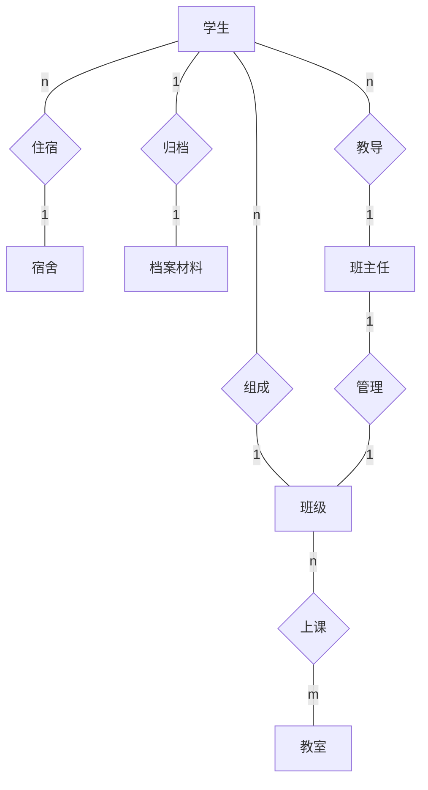
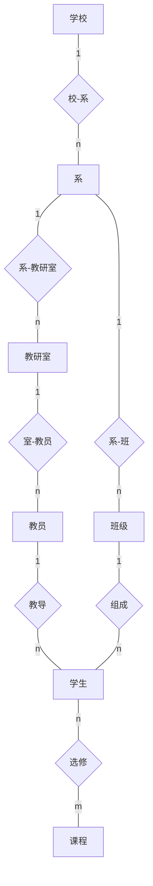
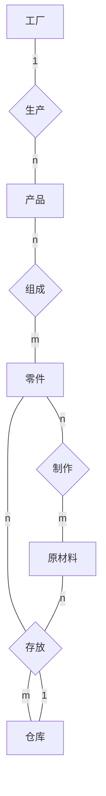
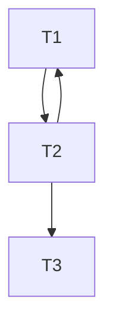

[toc]

# 习题&复习

## SQL 语言以及使用

## 数据库备份与恢复

事务原语：

1. `INPUT(X)`:把数据项 X 读到内存缓冲区
2. `READ(X,t)`:把数据项 X 拷贝到事务的本地变量 t 中
3. `WRITE(X,t)`:把事务本地变量 t 拷贝回数据项 X
4. `OUTPUT(X)`:把数据项 X 写到磁盘记录中

缓冲区处理策略：

-   **Force**：内存中的数据最晚在 commit 的时候写入磁盘
-   _No Force_：内存中的数据可以一直保留，在 commit 之后过一段时间再写入磁盘(更加灵活)
-   **Steal**：允许在事务 commit 之前把内存中的数据写入磁盘(更加灵活)
-   _No Steal_：不允许在 commit 之前把内存中的数据写入磁盘

`Force+No Steal`的缓冲区处理策略可以保证在突然断电的情况下，已提交事务已经全部写入磁盘，且未提交事务未写入磁盘，这种策略**不需要使用任何日志文件恢复事务**，但是*数据读写性能不高*
`Steal+No Force`的缓冲区处理策略有最快的读写速度，但是需要日志文件辅助恢复

事务故障的恢复

-   undo：对未提交事务进行回滚，清除该事务对数据库的所有修改
-   redo：重做已提交事务，将未写入磁盘的数据写入

1. `No Steal+No Force`:数据可以在 commit 之后写入+不允许在 commit 前将数据写入磁盘，所以不需要处理未提交事务，只需要重做已提交事务即可
   需要**redo**日志文件解决内存数据丢失问题
2. `Steal+Force`:数据最晚在 commit 时写入+可以在 commit 之前将数据写入磁盘，所以不需要处理已提交事务，只需要回滚未提交事务的修改即可
   需要**undo**日志文件清除数据文件的未提交数据
3. `Steal+No Force`:两个都要处理，所以同时需要两种日志文件
   需要**redo/undo**日志文件恢复数据
4. `No Steal+Force`:不用管

注意：对于所有**更新**操作，都是先写日志文件，再写数据文件

-   Redo:<T,X,v>,T 事务已经更新数据项 X，其**新值**是 v
-   Undo:<T,X,v>,T 事务已经更新数据项 X，其**更新前的旧值**是 v
-   Undo/Redo:<T,X,u,v>,T 事务已经更新数据项 X，其*新值*是 v，*旧值*是 u

## 例题

### 1

> 登记日志文件时为什么必须先写日志文件，后写数据库？

-   写日志文件快速，写数据库慢速，如果在写入数据库之前发生了故障或异常情况，数据可能会丢失或出现不一致的情况
-   先写日志文件，可以确保在发生异常情况时，数据仍然可以从日志文件中恢复

### 2

> 考虑如下的日志记录

| Number | Log           |
| ------ | ------------- |
| 1      | <start T1>    |
| 2      | <T1,A,10>     |
| 3      | <start T2>    |
| 4      | <T2,B,9>      |
| 5      | <T1,C,11>     |
| 6      | <commit T1>   |
| 7      | <T2,C,13>     |
| 8      | <start T3>    |
| 9      | <T3,A,8>      |
| 10     | <rollback T2> |
| 11     | <T3,B,7>      |
| 12     | <start T4>    |
| 13     | <commit T3>   |
| 14     | <T4,C,12>     |

1. T1、T3 已完成且 commit，需要重做，T4 未完成，T2 则是已完成但是也需要重做(回滚) ✅
2. 10 后续开始的事务不需要考虑，所以 T1 需要重做，T2 和 T3 需要回滚 ✅
3. 同理，9 后续开始的事务不需要考虑，所以 T1 需要重做，T2 和 T3 需要回滚 ✅
4. 需要重做 T1，回滚 T2 ✅

### 3

> 考虑上题的日志记录，假设开始时 A、B、C 的值都是 0
>
> 显然，上面的这个日志是 redo 日志

1. 如果系统故障发生在 14 之后，写出系统恢复后 A、B、C 的值
   A=8,B=7,C=11 ✅
2. 如果系统故障发生在 12 之后，写出系统恢复后 A、B、C 的值
   A=10,B=0,C=11 ✅
3. 如果系统故障发生在 10 之后，写出系统恢复后 A、B、C 的值
   A=10,B=0,C=11 ✅
4. 如果系统故障发生在 9 之后，写出系统恢复后 A、B、C 的值
   A=10,B=0,C=11 ✅
5. 如果系统故障发生在 7 之后，写出系统恢复后 A、B、C 的值
   A=10,B=0,C=11 ✅
6. 如果系统故障发生在 5 之后，写出系统恢复后 A、B、C 的值
   A=0,B=0,C=0 ✅

### 4

| Number | Log         |
| ------ | ----------- |
| 1      | <start T>   |
| 2      | <T,A,10,11> |
| 3      | <start U>   |
| 4      | <U,B,20,21> |
| 5      | <T,C,30,31> |
| 6      | <U,D,40,41> |
| 7      | <commit U>  |

> We first identify the transactions that we need to redo and those that we need to undo. U must be redo, T must be undo.

By reading the log we can conclude that:

A: A might have had its value changed on disk.
B: B might have had its value changed on disk.
C: C might have had its value changed on disk.
D: D might have had its value changed on disk.

## 数据库规范化理论

数据库设计问题

1. 数据冗余：例如每个系名和系主任的名字存储的次数等于该系的学生 人数乘以每个学生选修的课程门数，同时学生的姓名、年龄 也都要重复存储多次
2. 插入异常：如果某个新系没有招生，尚无学生时，则系名和系主任的 信息无法插入到数据库中
3. 删除异常：某系学生全部毕业而没有招生时，删除全部学生的记录 则系名、系主任也随之删除，而这个系依然存在，在数据库 中却无法找到该系的信息
4. 更新异常：如果学生改名，则该学生的所有记录都要逐一修改 SN

-   平凡函数依赖：$X->Y$,_Y 是 X 的子集_,比如$(SNO,CNO)\to SNO$
-   非平凡函数依赖：$X->Y$,Y 不是 X 的子集,平时讨论的一般都是非平凡函数依赖

**投影分解**：设$R(X,Y,Z)$,X,Y,Z 为不相交的属性集合,如果$X\to Y or X\to Z$,则有$R(X,Y,Z)=R1[X,Y]\bowtie R2[X,Z]$

设关系模式$R(U)$,U 是属性全集,X 、 Y、Z 是 U 的子集

-   完全函数依赖：如果$X\to Y$,且对于$X$的任何一个真子集$X^{'}$,都有$X^{'}\nrightarrow Y$,则称 Y 对 X 完全函数依赖,记为$X\xrightarrow[]{f} Y$
-   部分函数依赖：对于$X$的某个真子集$X^{'}$,有$X^{'}\nrightarrow Y$,则称 Y 对 X 部分函数依赖,记为$X\xrightarrow[]{p} Y$,典型的例子就是平凡函数依赖
-   传递函数依赖：若$X\to Y \ but \ Y\nrightarrow X \ and \ Y\to Z$,则成 Z 对 X 为传递函数依赖,记作$X\xrightarrow{t} Z$

**候选键**：设$K$为关系模式$R<U,F>$中的属性或属性组合，若$K\xrightarrow{f} U$,则$K$为关系$R$的一个候选键

若关系 R 有多个候选键，则可以选择其中任意一个为主键

若$S\supset K$,则 S 是 R 的一个*超键*

在任一候选键中出现过的属性为主属性，主属性之外的称为*非主属性*

-   第一范式`1NF`：最基本的规范形式，只要求**关系中的每个属性都是不可再分的简单项**
-   第二范式`2NF`：在 1NF 的基础上，要求每个非主属性都**完全函数依赖**于 R 的任意候选键
-   第三范式`3NF`：在 2NF 的基础上，消除了**非主属性对候选键的传递依赖**

例：关系模式$TCS(T,C,S)$,候选键为$(C,S) or (T,S)$，所以没有非主属性，为 3NF，但显然好存在着数据冗余(每个教师只开一门课，但是每个选课该教师该课程的学生都要记录一次该信息)、插入异常等等

-   BC 范式`BCNF`：在 3NF 的基础上消除了**主属性的传递函数依赖和部分函数依赖**

例：将$SNC(Sno,Sn,Cno,Score)$规范到 BCNF

显然可以分为两个关系，一个是 S 学生关系，另外一个是 SC 选课关系

S(Sno,Sn),SC(Sno,Cno,Score)

S 主属性和非主属性唯一，显然为 BCNF
SC 主属性为(Sno,Cno)，非主属性为 Score，同样为 BCNF

例：$SD(Sno,Sn,Age,Dept,Mn)$

1. 基于$Dept\to Mn$分解，得到$S(Sno,Sn,Age,Dept),D(Dept,Mn)$
2. 基于$Sno\to Mn$分解，得到$S(Sno,Sn,Age,Dept),D(Sno,Mn)$
3. 基于$Mn\to Dept$分解

推理规则

1. 自反律：$若Y\subseteq X\subseteq U,则X\to Y为F所蕴含$
2. 增广律：$若X\to Y为F所蕴含，且Z\subseteq U,则XZ\to YZ为F所蕴含$
3. 传递律：$若X\to Y以及Y\to Z为F所蕴含，则X\to Z为F所蕴含$
4. 合并规则：$X\to Y,X\to Z,则X\to YZ$
5. 伪传递规则：$X\to Y,WY\to Z,则XW\to Z$
6. 分解规则：$X\to Y,Z\subseteq Y,则X\to Z$

函数依赖闭包：在关系模式$R<U,F>$中为$F$所逻辑蕴含的函数依赖的全体叫做 F 的闭包，记为$F^+$

设 F 为属性集 U 上的一组函数依赖，$X\subseteq U$,则$X_F^{+}=\{A|X\to A能有F根据Armstrong公理导出\}$，称$X_F^{+}$为属性集 X 关于函数依赖集 F 的闭包

无损连接性分解的判定方法

R(U,F),U={A,B,C},F={B->C}

R 的一个分解为 R1(A,B),R2(B,C)

| A   | B   | C   |
| --- | --- | --- |
| a1  | a2  | b13 |
| b21 | a2  | a3  |

U={A,B,C,D,E},F={A->C,B->C,C->D,DE->C,CE->A},R 的一个分解为 R1(AD)，R2(AB)，R3(BE)，R4(CDE)，R5(AE),试判断这个分解是否具有无损连接性？

| A   | B   | C   | D   | E   |
| --- | --- | --- | --- | --- |
| a1  | b12 | b13 | a4  | b15 |
| a1  | a2  | b23 | b24 | b25 |
| b31 | a2  | b33 | b34 | a5  |
| b41 | b42 | a3  | a4  | a5  |
| a1  | b52 | b53 | b54 | a5  |

A->C

| A      | B   | C     | D   | E   |
| ------ | --- | ----- | --- | --- |
| **a1** | b12 | b13   | a4  | b15 |
| **a1** | a2  | _b13_ | b24 | b25 |
| b31    | a2  | b33   | b34 | a5  |
| b41    | b42 | a3    | a4  | a5  |
| **a1** | b52 | _b13_ | b54 | a5  |

B->C

| A      | B      | C     | D   | E   |
| ------ | ------ | ----- | --- | --- |
| **a1** | b12    | b13   | a4  | b15 |
| **a1** | **a2** | _b13_ | b24 | b25 |
| b31    | **a2** | _b13_ | b34 | a5  |
| b41    | b42    | a3    | a4  | a5  |
| **a1** | b52    | _b13_ | b54 | a5  |

C->D

| A      | B      | C         | D    | E   |
| ------ | ------ | --------- | ---- | --- |
| **a1** | b12    | **b13**   | _a4_ | b15 |
| **a1** | **a2** | **_b13_** | _a4_ | b25 |
| b31    | **a2** | **_b13_** | _a4_ | a5  |
| b41    | b42    | a3        | a4   | a5  |
| **a1** | b52    | **_b13_** | _a4_ | a5  |

DE->C

| A   | B   | C   | D   | E   |
| --- | --- | --- | --- | --- |
| a1  | b12 | a3  | a4  | b15 |
| a1  | a2  | a3  | a4  | b25 |
| b31 | a2  | a3  | a4  | a5  |
| b41 | b42 | a3  | a4  | a5  |
| a1  | b52 | a3  | a4  | a5  |

CE->A

| A   | B   | C   | D   | E   |
| --- | --- | --- | --- | --- |
| a1  | b12 | b13 | a4  | b15 |
| a1  | a2  | b13 | a4  | b25 |
| a1  | a2  | a3  | a4  | a5  |
| a1  | b42 | a3  | a4  | a5  |
| a1  | b52 | a3  | a4  | a5  |

R(A,B,C,D),分解{R1(A,B),R2(BC),R3(C,D)}

函数依赖集 F={A->B,B->C,C->D,D->A}

显然，A->B 包含 R1，B->C 包含 R2，C->D 包含 R3

所以只需要验证，是否有 D->A 被分解 p 所保持即可

```c
result=x;
while(result changes){
    for each Ri//分解后的
        t=(result 交 Ri)+ 交Ri
}
```

result={D}

## 数据库设计

> 只要学会 E-R 图绘制即可

实体：学生、宿舍、档案材料、班级、班主任



### 例题

#### 1

> 学校中有若干系，每个系有若干班级和教研室，每个教研室有若干教员，其中有的教授和副教授每人各带若干研究生，每个班有若干学生，每个学生选修若干课程，每门课可由若干学生选修。请用 E-R 图画出此学校的概念模型。

实体：学校、系、班级、教研室、教员、学生、课程



#### 2

> 某工厂生产若干产品，每种产品由不同的零件组成，有的零件可用在不同的产品上。这些零件由不同的原材料制成，不同零件所用的材料可以相同。这些零件按所属的不同产品分别放在仓库中， 原材料按照类别放在若干仓库中。请用 E-R 图画出此工厂产品、零件、材料、仓库的概念模型。

实体：工厂、产品、零件、原材料、仓库



需要思考的问题：一种零件是放在一个仓库还是多个仓库中？

零件按照不同产品为依据存放，而不同产品可以由相同零件组成，所以一种零件可以存放在不同的仓库中，是多对多的关系

## 事务管理

四种数据不一致性

1. 丢失修改：指事务 1 与事务 2 从数据库中读入同一数据并修改，事务 2 的提交结果破坏了事务 1 的提交结果，导致事务 1 的修改被丢失
2. 不可重复读：指事务 1 读取数据后，事务 2 执行更新操作，使得事物 1 无法再现前一次的读取结果
3. 读"脏"数据：事务 1 修改某一数据，并将其写回磁盘，事务 2 读取同一数据后，事务 1 由于某种原因被撤销，此时事务 1 已经修改过的数据恢复原值，事务 2 读到的数据就与数据库中的数据不一致，是不正确的数据

设 T1、T2、T3 是如下三个事务，设 A 的初值为 0

T1: A=A+2
T2: A=A\*2
T3: A=A\*\*2

A=0,2,4,16,8

| T1      | T2      | T3       |
| ------- | ------- | -------- |
| Read A  |         |          |
| A=A+2   |         |          |
| Write A |         |          |
|         | Read A  |          |
|         | A=A\*2  |          |
|         | Write A |          |
|         |         | Read A   |
|         |         | A=A\*\*2 |
|         |         | Write A  |
|         |         | Commit   |
| Commit  |         |          |
|         | Commit  |          |

执行结果：A=16

T1->T2->T3

| T1      | T2      | T3       |
| ------- | ------- | -------- |
| Read A  |         |          |
|         | Read A  |          |
| A=A+2   |         |          |
| Write A |         |          |
|         | A=A\*2  |          |
|         | Write A |          |
|         |         | Read A   |
|         |         | A=A\*\*2 |
|         |         | Write A  |
|         |         | Commit   |
| Commit  |         |          |
|         | Commit  |          |

执行结果：A=0



| Number | Log                 |
| ------ | ------------------- |
| 1      | <**start** T1>      |
| 2      | <T1,A,10>           |
| 3      | <**start** T2>      |
| 4      | <T2,B,5>            |
| 5      | <T1,C,7>            |
| 6      | <**start** T3>      |
| 7      | <T3,D,12>           |
| 8      | <_commit_ T1>       |
| 9      | <start CKPT(T2,T3)> |
| 10     | <**start** T4>      |
| 11     | <T2,E,5>            |
| 12     | <_commit_ T2>       |
| 13     | <T3,F,1>            |
| 14     | <T4,G,15>           |
| 15     | <end CKPT>          |
| 16     | <_commit_ T3>       |
| 17     | <**start** T5>      |
| 18     | <T5,H,3>            |
| 19     | <start CKPT(T4,T5)> |
| 20     | <_commit_ T5>       |

1. 找到最后一个检查点记录
2. 由该检查点记录得到检查点建立时刻所有正在执行的事务清单`active-lists`
    - 建立 undo-list
    - 建立 redo-list
      把所有 active-list 暂时放入 undo-list
3. 从检查点开始正向扫描文件
    - 如果有新开始的事务 T，把 T 暂时放入 undo-list
    - 如果有已完成的事务 T，则把 T 从 undo-list 移动到 redo-list 中
