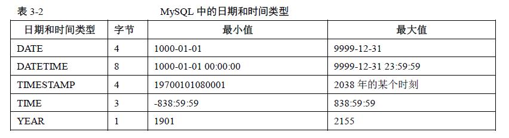
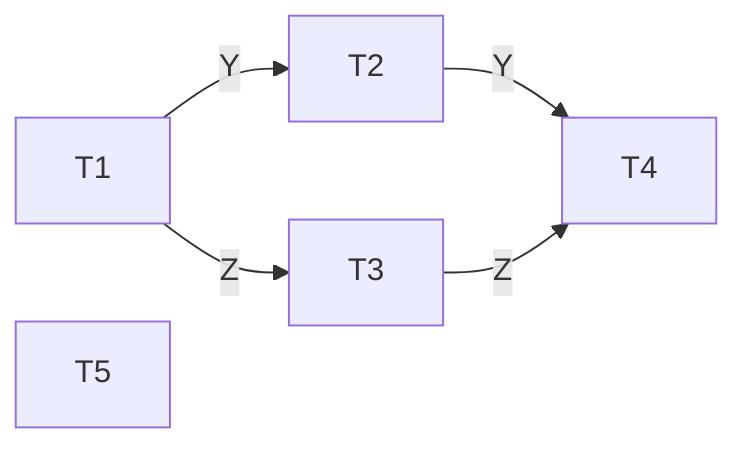

[toc]

# 数据库复习

## 关系代数

## SQL 语言

### 查询语句执行顺序

```sql
select ...
from ...
where ...
group by ...
having ...
order by ...;
```

1. `from`语句组装来自不同数据源的数据->**首先获取到查询总表**
2. `where`语句基于执行条件对记录行进行筛选->对获取到的数据进行**初步筛选**
3. `group by`语句将初步筛选后的数据划分为多个分组->**对数据按照依据列进行分组**，如果使用了`group by`，那么**后续步骤得到的数据都只能是分组依据列和聚合函数值**
4. `select`对最终显示的数据列进行选择->选出数据列，如果之前使用了`group by`则`select`字句也**只能包含分组依据列和聚合函数**
5. `having`语句对分组结果进行筛选->类似`where`，但作用对象是组，同理，在`having`语句中出现的**只能是作为分组依据的列或者聚集函数**
6. `order by`对结果进行排序->排序

### 数据库/表基本操作

```sql
-- 查看数据库
show databases;
-- 使用数据库
use db1;
-- 查看数据库内的表
show tables;
-- 创建数据库(数据库没有`if [not] exists`之类的运用)
create database db1;
-- 删除数据库
drop database db1;
```

### 表创建

```sql
create table [if not exists] tb1(
    col_name type constraint_1 constraint_2...
);
```

#### 数据类型(type)

1. 数值型

    - 整型：$tinyint,smallint,mediuint,int,bigint$
    - 浮点型(不常用)：$float(M,D),decimal(M,D)$,M 表示浮点型的长度（不包括符号和小数点）,D 表示小数点后面数字的位数

    ```sql
    create table tb_name(
        id int,
        primary key(id)
    );
    ```

2. 字符型

    - $char,varchar,binary,varbinary,text$
    - 比较常见的只有 char 和 varchar

    ```sql
    create table tb_name(
        id int,
        # 10代表可以存储的字符长度
        name varchar(10),
        primary key(id)
    );
    ```

3. 日期时间型
   

    - $date,time,datetime,timestamp$
    - $date$时间类型为`YYYY-MM-DD`,用于表示日期
    - $time$时间类型为`HH:MM:SS`,用于表示时间
    - $datetime$时间类型为`YYYY-MM-DD HH:MM:SS`
    - $timestamp$时间类型为`YYYY-MM-DD HH:MM:SS`格式和 datetime 相同，但是取值范围要小于 datetime 范围

    ```sql
    create table birth(
        id int auto_increment,
        birthday date,
        primary key(id)
    );
    insert into birth(birthday)
    values
    (curdate()),
    (date(now())),
    ('1999-01-12');
    ```

4. 枚举型

    - $enum$

    ```sql
    create table tb1(
        id int,
        pri enum('LOW','MEDIUM','HIGH'),
        primary key(id)
    );
    ```

5. 布尔型

    - $bool$
    - mysql 中没有独立的 bool 类型，所以数据库中声明的 bool 值会被自动转化为$tinyint$,1 代表 true,0 代表 false

    ```sql
    create table tb1(
        id int,
        win bool,
        primary key(id)
    );
    insert into tb1(id,win)
    values
    (1,1),
    (2,true);
    ```

#### 约束(constraint)

-   `default`:默认约束，用于指定某列的默认值
-   `not null`:非空约束，用于约束某列非空
-   `auto_increment`:自增长约束，该列不需要用户输入，而是由数据库系统根据定义自动赋值(每增加一条记录，主键就会自动以相同的步长增长)，注意一个表中**只能有一个**`auto_increment`约束，并且*该字段必须有唯一索引*
-   `unique`:唯一值约束，用于某列不能出现重复值
-   `primary key`:主键约束
-   `foreign key`:外键约束

```sql
create table tb2(
    id int,
    primary key(id)
);
create table tb1(
    id int auto_increment,
    name varchar(10) not null,
    age int default(15),
    num int unique,
    primary key(id,num),
    foreign key(num) references tb2(id)
);
```

### 单表查询

```sql
create table tb1(
    id int auto_increment,
    name char(10) not null,
    age int default(18),
    primary key(id)
);
-- 查询所有
select * from tb1;
-- 查询学号、姓名
select id,name
from tb1;
-- 查询经过计算的值(as后是重新命名的列名)
select id+1 as id_1
from tb1;
-- 取消重复行(需要注意的是distinct作用的范围是所有目标列)
select distinct name
from tb1;
-- 保留重复行(all为默认值)
select all name
from tb1;
-- 大小比较
select * from tb1
where age>20 and id<2;
-- `between...and`
select * from tb1
where age between 10 and 20;
-- 集合选择
select * from tb1
where age in (18,29,50);
-- 字符串匹配1(`%`代表匹配任意长度的字符串)
select * from tb1
where name like "%吴%";
-- 字符串匹配2(`_`代表匹配单个字符)
select * from tb1
where name like "吴__"
-- 字符串匹配3(当用户要查询的字符串本身就含有 % 或 _ 时，要使
用escape '<换码字符>'对其进行转义)
select * from tb1
where name like 'DB*_%i__' escape '*';
-- 涉及空值的查询
select * from tb1
where name is not null;
-- 查询结果排序(asc为升序，desc为降序，空值默认为最小值)
select * from tb1
order by age asc;
```

### 聚集和分组

> 在 select 子句中可以使用集函数，对指定的列进行聚合计算

-   count([distinct|all]<列名>|\*)计数
-   sum([distinct|all]<列名>)总和
-   avg([distinct|all]<列名>)平均数
-   max([distinct|all]<列名>)最大值
-   min([distinct|all]<列名>)最小值

```sql
-- 查询学生总人数
select count(*) from stu;
```

> 使用`group by`对初步筛选后的数据划分为多个组，可以细化集函数的作用对象，对查询结果分组后，集函数将分别作用于每个组
>
> where 子句不能使用集函数，因为*执行 where 语句时，还未对查询结果进行分组*

```sql
select A,count(*)
from tb1
group by A;
```

> 使用`having`语句筛选出最终结果,通过 having 语句筛选出符合特定条件的组

```sql
select A,count(*)
from tb1
group by A
having count(*)>5;
```

## 多表查询

> `from`语句中涉及多表的连接操作

```sql
-- 广义笛卡尔积连接
select * from stu,sc;
-- 等值连接(以下二者等价)
select * from stu,sc
where stu.no=sc.no;
select * from stu join sc
on stu.no=sc.no;
-- 自然连接
select * from stu natural join sc;
-- 自连接查询(起别名)
select First.Cno,Second.Cno
from Course as First join Course as Second
on First.Cpno=Second.Cno;
-- 内连接
select * from tb1 join tb2
on tb1.id=tb2.id;
-- 外连接(左)
select * from tb1 left join tb2
on tb1.id=tb2.id;
-- 外连接(右)
select * from tb1 right join tb2
on tb1.id=tb2.id;
-- 外连接(全)
select * from tb1 left join tb2 on tb1.id=tb2.id
union
select * from tb1 right join tb2 on tb1.id=tb2.id;
```

内外连接所用表 👇🏻
tb1

| id  | name |
| --- | ---- |
| 1   | wwt  |
| 2   | GG   |
| 3   | null |
| 4   | CC   |

tb2

| id  | age  |
| --- | ---- |
| 1   | 12   |
| 2   | null |
| 3   | 18   |
| 5   | 20   |

### 子查询

```sql
-- where语句嵌套
select sname from stu
where sno in(
    select sno from sc
    where cno=2
);
-- from语句临时表(需要起别名才能使用)
select SIS.Sno,Sname,Cno
from SC,(
    select Sno,Sname from stu
    where Sdept='IS'
) as SIS
where SC.Sno=SIS.Sno
```

### 表修改

```sql
alter table tb_name
[add new_col_name data_type [integrity_constraints]|integrity_constraints]
[drop col_name|integrity_constraints]
[modify col_name data_type [integrity_constraints]]
[change col_name new_col_name data_type [integrity_constraints]];
```

```sql
# 添加字段
alter table tb_name add co_name varchar(80) not null;
# 删除字段
alter table tb_name drop co_name;
# 修改字段
alter table tb_name modify co_name char(10) default 'GG';
```

### 数据更新

```sql
-- 数据插入(省略)
-- 数据删除
delete from tb_name
where ...;
-- 数据清空
delete from tb_name;
-- 数据更新
update tb_name
set Sage=22 -- 此处条件可以为多个，条件之间使用','隔开
where Sno='95001';
-- 数据更新(表达式)
update tb_name
set Sage=Sage+1;
```

### 视图

> 视图是一种虚拟表，是从一个或几个表中导出的表，它的定义和名字很像，“视图”
>
> 本质上就是在数据字典中存储的一条`select`语句

```sql
create view <视图名> [(<列名>[,<列名>...])]
as
<子查询>
[with check option];
```

```sql
create view IS_S1(Sno,Sname,Grade)
as
select Student.Sno,Sname,Grade
from Student,SC
where Sdept='IS' and Student.Sno=SC.Sno and SC.Cno='1';
```

需要注意的是，**带表达式的视图必须明确定义组成视图的各个属性列名**

```sql
create view BT_S(Sno,Sname,Sbirth)
as
select Sno,Sname,2000-Sage
from Student
where Sdept='IS'
with check option;
```

并且，透过视图进行增删改操作时，不能破坏视图中定义的谓词条件(子查询中的条件表达式)

## 数据库编程

### 存储过程

> 可以将*多次重复执行*的代码段编写成一个过程，保存在数据库中，供需要的时候调用
>
> 位于数据库服务器上，调用的时候无需通过网络传输大量数据
>
> 可以作为一种安全机制来加以充分利用。例如参数化的存储过程可以防止 SQL 注入式的攻击

**创建、删除、调用基本语法**

```sql
-- 创建
create procedure p_name(
    [in|out|inout] param_name type [,...]
)
[begin]
    sql_statement
[end]
-- 删除
drop procedure p_name
-- 调用
call procedure (param_name type [,...])
```

```sql
delimiter $$
-- in代表输入参数，out代表输出参数
create procedure delete matches(in player_no int)
begin
    delete from tb1
    where id=player_no;
end $$
```

```sql
delimiter $$
create procedure out_param(out p_out int)
begin
    select p_out;
    set p_out=2;
    select p_out;
end $$
-- 执行call out_param(@p_out)会将变量@p_out设置为2
```

```sql
-- 存储过程体
begin
    begin
        begin
            statements;
        end
    end
end
-- 打标签
label1: begin
    label2: begin
        label3: begin
            statements;
        end label3;
    end label2;
end label1
```

变量声明

```sql
declare variable_name [,variable_name...] type [default value];
```

```sql
delimiter $$
create procedure pro1(in param1 int)
begin
    declare variable1 char(10);
    if param1=17 then
        set variable1='birds';
    else
        set variable1='tests';
    end if;
    insert into tables values (variable1);
end
```

#### 条件语句

> 需要注意的是，内部变量仅在`begin...end`结构内有效，执行到 end 时，内部变量消失

`if then...else...end if`

```sql
delimiter $$
create procedure pro1(in param1 int)
begin
    declare var int;
    set var=param1+1;
    if var=0 then
        insert into t values(17);
    end if;
    if param1=0 then
        update t set s1=s1+1;
    else
        update t set s1=s1+1;
    end if;
end $$
```

`case when then ... when then ... else ... end case`

```sql
delimiter $$
create procedure pro1(in param1 int)
begin
    declare var int;
    set var=param1+1;
    case var
        when 0 then
            insert into t values(17);
        when 1 then
            insert into t values(18);
        else
            insert into t values(19);
    end case;
end $$
```

#### 循环语句

`while ... end while`

```sql
delimiter $$
create procedure pro1()
begin
    declare var int default(0);
    while var<6 do
        insert into t values(var);
        set var=var+1;
    end while;
end
```

`repeat ... end repeat`

```sql
delimiter $$
create procedure pro1()
begin
    declare v int default(0);
    repeat
        insert into t values(v);
        set v=v+1;
        until v>=5;
    end repeat;
end$$
```

`loop ... endloop`

```sql
delimiter $$
create procedure pro1()
begin
    declare v int default(0);
    set v=0;
    loop_label:loop
        insert into t values(v);
        set v=v+1;
        if v=3 then
            -- 类似于continue
            iterate loop_label;
        end if;
        if v>=5 then
            -- leave语句的意义是离开循环，类似于break
            leave loop_label;
        end if;
    end loop;
end$$
```

## 完整性约束

### 静态列级约束

> 对列的值域、类型、是否空值约束
>
> 直接通过 constraint 约束即可

```sql
create table tb1(
    id int primary key,
    name varchar(10) not null
);
```

### 静态元组约束

> 规定元组的各个列之间的约束关系
>
> 通过`check`约束实现

```sql
create table tb1(
    id int primary key,
    age1 int,
    age2 int,
    check(age1<=age2)
);
```

### 静态关系约束

> 关系的**各个元组**之间或若干关系之间存在的各种联系或约束
>
> 需要通过*触发器*实现

比方说职工平均工资<=部门经理工资...

### 动态列级约束

> 修改列定义或列值时应该满足的约束条件
>
> 1. 修改列定义：由数据库自动实现
> 2. 修改列值：由**触发器**实现

### 动态元组约束

> 修改元组值时，各个字段之间需要满足的约束条件
> 职工工资调整不得低于其原来工资 + 工龄\*1.5
> *触发器*实现

### 动态关系约束

> 对关系变化前后状态的限制条件
>
> 具体内容在事务处理部分讲解

### 触发器

> 是用于实现复杂逻辑的用户自定义约束的工具
>
> 是一种**特殊的存储过程**（由数据库自动调用，用户无法调用，且没有参数和返回值）

```sql
create [or replace] trigger trigger_name
[before|after|instead of] trigger_event on tb_name
[for each row[when trigger_condition]]
trigger_body;
```

```sql
create trigger trigger_name
[before|after] trigger_event on tb_name
[for each row[when trigger_condition]]
trigger_body;
```

应用实例：

-   Fruits(<u>Fname</u>,Price);Sells(<u>Cname</u>,Fname,<u>Stime</u>,Quantity)
-   当*向 Sells 表中插入一条新的购买记录时，若 Fname 在 fruits 中不存在，则需要向 Fruits 表中插入一条新的记录*，其中 Fname 为新购买记录中的水果名称，Price 为 NULL

```sql
create trigger fruit_trigger
after insert on sells -- 事件
for each row
when(new.Fname not in(select Fname from Fruits))
insert into Fruits(Fname)
values
(new.Fname);
```

-   `before`,`after`参数指定了触发器执行的时间，在事件之前或之后
-   `for each row`表示任何一条记录上的操作满足触发事件都会触发触发器，缺省为每执行一条语句触发一次
-   **trigger_event**
    -   insert 型触发器：插入某一行时激活触发器
    -   update 型触发器：更改某一行时激活触发器，通过 update 语句触发
    -   delete 型触发器：删除某一行时激活触发器
-   _new/old_
    -   insert 型触发器：new 代表将要插入的数据，old 代表已经插入的新数据
    -   update 型触发器：new 代表新数据，old 代表原数据
    -   delete 型触发器：old 代表将要或已经被删除的原数据
        并且 old 是只读的，而 new 则可以在触发器中使用 set 赋值(**不会再次激活触发器**)

```sql
create table account(
    acct_num int,
    amount decimal(10,2)
);
insert into account
values
(137,14.98),(141,1937.50),(97,-100.00);
delimiter $$
create trigger upd_check
before update on account
for each row
begin
    if new.amount<0 then
        set new.amount=0;
    elseif new.amount>100 then
        set new.amount=100;
    end if;
end$$
delimiter ;
update account
set amount=-10
where acct_num=137;
```

## 数据库安全

> 数据库的一大特点是数据可以共享，但显然这种共享不能是无条件的共享
>
> 数据库中数据的共享是在 DBMS 统一的严格的控制下的共享，即*只允许有合法使用权限的用户访问允许他存取的数据*
>
> 数据库的安全是指保护数据库，防止因用户非法使用数据库造成数据泄露、更改或破坏等恶意人为破坏问题

## 并发控制

> 每个用户在存取数据库中的数据时，都是并行存取的
>
> 这就导致了如果不对并发操作加以控制就可能会产生不正确的数据，破坏数据的一致性
>
> 数据库的并发控制是以**事务**为基本单位进行的，通过*对事务所操作的数据施加封锁*来实现一致性

### 事务(transaction)

> 事务是用户定义的一个数据库操作序列，这些操作要么全做，要么全不做，**是一个不可分割的工作单位**
>
> **事务的开始与结束可以由用户显式控制**，如果用户没有显式的定义事务，则由 DBMS 按照缺省规定自动划分事务（通常一条 DML 语句为一个事务）

事务例子

```sql
begin transaction
    read A
    A=A-100
    if A<0 then
        begin
            display 'A余额不足'
            Rollback
        end
    else -- 拨款
        read B
        B=B+100
        display '拨款完成'
        Commit
end
```

1. `read(A)`
2. `A:=A-100`
3. `write(A)`
4. `read(B)`
5. `B:=B+100`
6. `write(B)`

-   事务是并发控制的基本单位，也是遇到各类数据库错误后进行数据恢复的处理单位
-   数据的特征（**ACID**）
    -   原子性（Atomicity）
        -   事务中包含的操作要么全做，要么全不做
        -   系统应该保证只执行了一部分的事务不会对数据库状态产生影响
            如果事务因为软硬件故障在第三步和第六步之间终止退出了，部分操作完成而部分操作未完成，则数据库会处于不一致状态，钱会丢失
    -   隔离性（Isolation）
        -   **并发执行的各个事务之间不能互相干扰**
        -   一个事务内部的操作以及使用的数据对其他并发事务是隔离的
        -   **每个事务在执行的时候应该感觉不到其他事务的存在**
            如果在第三步和第六步中间，另一个事务 T2 被允许访问已被事务 T1 部分修改了的数据库，则它看到的是一个“不一致”的数据库
    -   一致性（Consistency）
        -   _事务的隔离执行必须保证数据库的一致性_。假定事务的一致性规定是正确的，则数据库在事务执行前是一致的，执行过程中可能暂时出现不一致，而当事务执行完后，数据库仍会处于一致性状态
            _隐含的完整性约束条件_，需要由用户根据业务规则在事务代码中做出“一致性”的规定，比如在转账例子中，A 和 B 账户的金额总和在事务执行前后不能发生改变
    -   持久性（Durability）
        -   一个事务一旦提交（Commit）后，它对数据库的影响必须是永久的。
-   事务的执行状态 - 活动状态（Active）：事务的初始状态；事务在执行时处于这种状态 - 部分提交状态（Partially Committed）：对数据库进行了部分更新，但是事务并未最后结束 - 失败状态（Failed）：由于物理 or 逻辑错误导致事务语句无法继续进行下去 - 中止状态（Aborted）：事务回滚所有操作，数据库恢复到事务开始之前的状态 - 提交状态（Committed）：事务正确执行完成的状态
    

### 并发操作带来的数据不一致性

> 当同一数据库系统中有多个事务并发运行的时候，如果不加以适当控制，可能会破坏事务的隔离性，产生数据的不一致性

#### 丢失修改（lost update）

> 指**事务 1 和事务 2 从数据库读入同一数据并修改**，事务 2 的提交结果破坏了事务 1 提交的结果，导致事务 1 的修改被丢失

| step | T1         | T2         |
| ---- | ---------- | ---------- |
| 1    | read A=16  |            |
| 2    |            | read A=16  |
| 3    | A=A-1      |            |
| 4    | write A=15 |            |
| 5    |            | A=A-1      |
| 6    |            | write A=15 |

#### 不可重复读（non-repeatable read）

> 不可重复读是指**事务 1 读取数据后，事务 2 执行更新操作，使事务 1 无法再现前一次的读取结果**

三种不可重复读：事务 1 读取某数据后

1. 事务 2 对其进行了修改，当事务 1 再次读取该数据时，得到与前一次不同的值
2. 事务 2 删除了其中部分记录，事务 1 再次读取数据发现某些记录神秘消失
3. 事务 2 插入一些记录，当事务 1 再次按相同条件读取数据时，发现多了一些记录

后两种不可重复读也被称为*幻影现象*

| step | T1                              | T2                            |
| ---- | ------------------------------- | ----------------------------- |
| 1    | read A=50;read B=100;sum(A,B)   |                               |
| 2    |                                 | read B=100;B=B\*2;write B=200 |
| 3    | read A=50;read B=200;_sum(A,B)_ |                               |

| step | T1                            | T2       |
| ---- | ----------------------------- | -------- |
| 1    | read A=50;read B=100;sum(A,B) |          |
| 2    |                               | delete B |
| 3    | read A;_read B_               |          |

#### 读脏数据（dirty read）

> 事务 1 修改某一数据，并将其写回磁盘，事务 2 **读取同一数据**后，事务 1 由于某种原因被撤销，这时事务 1 已修改过的数据恢复原值，事务 2 读到的数据就与数据库中的就与数据库中的数据不一致，又称为脏数据

| step | T1                        | T2                     |
| ---- | ------------------------- | ---------------------- |
| 1    | read C=100;C=C\*2;write C |                        |
| 2    |                           | read C=200             |
| 3    | Rollback;now C=100;       |                        |
| 4    |                           | _C=200_ was dirty data |

> 这里发现的一个小 bug，无法试下表格内中文文本的自动对齐

#### 事务的并发控制机制

> 对事务的并行运行顺序进行合理安排，达成事务的隔离性和一致性

##### 调度

> 就是**妥善安排并发运行的事务中各条指令的执行顺序**
>
> 将所有事务串行起来的调度策略一定是正确的调度策略（虽然是最低效的调度）

###### 前驱图

> 是一种有效的冲突可串行化的测试方式

-   是一种有向图
    -   顶点是事务的名称
    -   对于两个顶点：事务 Ti 和事务 Tj，如果这两个事务冲突，且是事务 Ti 先访问的冲突资源，则画一个从 Ti 到 Tj 的弧
    -   可以在弧上标注冲突资源的名称

| step | T1       | T2       | T3       | T4       | T5      |
| ---- | -------- | -------- | -------- | -------- | ------- |
| 1    |          | read(X)  |          |          |         |
| 2    | read(Y)  |          |          |          |         |
| 3    | read(Z)  |          |          |          |         |
| 4    |          |          |          |          | read(V) |
| 5    |          |          |          |          | read(W) |
| 6    |          |          |          |          | read(W) |
| 7    |          | read(Y)  |          |          |         |
| 8    |          | write(Y) |          |          |         |
| 9    |          |          | write(Z) |          |         |
| 10   | read(U)  |          |          |          |         |
| 11   |          |          |          | read(Y)  |         |
| 12   |          |          |          | write(Y) |         |
| 13   |          |          |          | read(Z)  |         |
| 14   |          |          |          | write(Z) |         |
| 15   | read(U)  |          |          |          |         |
| 16   | write(U) |          |          |          |         |



1. 当且仅当前驱图是无环的时候，对应的调度是冲突可串行的(也就是说**如果有环，则必定不可串行**)
2. 当前驱图是无环的时候，冲突等价的串行化调度的事务执行顺序可以通过对*图的拓扑排序*获得(T5->T1->T2->T3->T4)

如何进行拓扑排序 👇🏻

1. 选择无前驱节点输出
2. 删除对应节点有向边
3. 循环

**什么是可恢复的调度**

> 如果 T9 在 step3 后立即提交，且 T8 在 T9 提交后执行失败回滚，此时会导致数据库处于不一致的状态

| step | T8       | T9      |
| ---- | -------- | ------- |
| 1    | read(A)  |         |
| 2    | write(A) |         |
| 3    |          | read(A) |
| 4    | read(B)  |         |

如何避免上述情况的发生：若**事务 Tj 读取了 Ti 之前写入的数据**，则*Ti 的提交操作*应该在*Tj 的提交操作* **之前**发生，这可以避免前面数据回滚导致的不一致问题

**级联回滚**

> 无论是什么原因，如果 Ti 失败了，为了保证事务的原子性就必须回滚该事务，同时由于系统中事务的并发执行，就必须回滚哪些依赖于 Ti 事务的事务，也就是那些读取了 Ti 所写数据的事务也必须被同时回滚掉
>
> 调度 10 是可恢复的调度，如果它失败了，就需要回滚 T10、T11、T12 三个事务

| step | T10      | T11      | T12     |
| ---- | -------- | -------- | ------- |
| 1    | read(A)  |          |         |
| 2    | read(B)  |          |         |
| 3    | write(A) |          |         |
| 4    |          | read(A)  |         |
| 5    |          | write(A) |         |
| 6    |          |          | read(A) |

**无级联调度**

> 若事务 Tj 读取了事务 Ti 之前写入的数据，则 Ti 的提交操作应该在 Tj 的读取操作之前发生
>
> 无级联调度也是可恢复调度，并且是一种较高的调度要求

#### 锁

> 基本封锁类型：
>
> -   排他锁（eXclusive lock，简称 X 锁）
> -   共享锁（Share lock，简称 S 锁）

-   X 锁：若事务 T 对数据对象 A 加上 X 锁，则**只允许 T 读取和修改 A**，_其他任何事务都不能再对 A 加任何类型的锁_，直到 T 释放 A 上的锁
-   S 锁：若事务 T 对数据对象 A 加上 S 锁，则**其他事务只能再对 A 加 S 锁**，而不能加 X 锁，直到 T 释放 A 上的 S 锁，这就*保证了其他事务在 T 释放 R 上的 S 锁之前，只能读取 R，而不能再对 R 做任何修改*

**封锁协议**：基于锁这个工具，涉及一组规则，来合理安排一组并发事务的交错运行的指令，使得产生的调度是可串行的和可恢复的，甚至是无级联的

##### 三级封锁协议

###### 一级封锁协议

> 事务 T 在修改数据 R 之前必须先对其加**X 锁**，直到事务结束才释放
>
> 因为读数据不需要加锁，所以它不能保证不可重复读和“脏读”

没有*丢失修改*

| step | T1               | T2         |
| ---- | ---------------- | ---------- |
| 1    | Xlock A;get lock |            |
| 2    | read A=16        |            |
| 3    |                  | Xlock A    |
| 4    | A=A-1            | wait       |
| 5    | write A=15       | wait       |
| 6    | commit           | wait       |
| 7    | Unlock A         | wait       |
| 8    |                  | get lock   |
| 9    |                  | read A=15  |
| 10   |                  | A=A-1      |
| 11   |                  | write A=14 |
| 12   |                  | commit     |
| 13   |                  | unlock A   |

无法避免*不可重复读*

| step | T1           | T2          |
| ---- | ------------ | ----------- |
| 1    | read A=50    |             |
| 2    | read B=100   |             |
| 3    | sum(A,B)=150 |             |
| 4    |              | Xlock B     |
| 5    |              | get lock    |
| 6    |              | read B=100  |
| 7    |              | B=B\*2      |
| 8    |              | write B=200 |
| 9    |              | commit      |
| 10   |              | Unlock B    |
| 11   | read A=50    |             |
| 12   | read B=200   |             |
| 13   | sum(A,B)=250 |             |

###### 二级封锁协议

> 在一级封锁协议的基础上，要求**事务 T 在读取数据 R 前必须先加 S 锁**，读完后即可释放 S 锁
>
> 二级封锁协议可以防止丢失修改和读“脏”数据

防止*脏读*

| step | T1                                  | T2        |
| ---- | ----------------------------------- | --------- |
| 1    | Xlock A;get Xlock                   |           |
| 2    | read A=16                           |           |
| 3    |                                     |           |
| 4    | A=A-1                               |           |
| 5    | write A=15                          |           |
| 6    |                                     | Slock A   |
| 7    | Rollback(maybe if failed,Rollback?) | wait      |
| 8    | Unlock A                            | wait      |
| 9    |                                     | get Slock |
| 10   |                                     | read A=15 |
| 11   |                                     | unlock A  |

###### 三级封锁协议

> 在一级封锁协议的基础上，要求事务 T 在读取数据 R 之前必须先对其加 S 锁，*直到事务结束*才能释放
>
> 三级封锁协议可防止丢失修改、读脏数据和不可重复读

###### 事务隔离级别

> 数据库允许用户选择隔离级别，**不同隔离级别对应于不同等级的封锁协议**

....

##### 二阶段锁协议

> 三级封锁协议讨论了封锁的时机，目的是从不同程度上解决数据不一致性问题，但没有讨论调度的正确性
>
> 为了保证并行操作的正确性，DBMS 的并行控制机制必须提供一定的手段来保证调度是可串行化的
>
> 两阶段锁协议（ Two-Phase Locking，简称**2PL**）是一种能够保证并发执行结果正确性的封锁协议

1. **在对任何数据进行读、写操作之前，事务首先要获得对该数据的封锁**
2. 在释放一个封锁之后，事务不再获得任何其他封锁

_对一组遵守两段锁协议的事务，可以实现可串行化调度，使得其并行执行的结果一定是正确的_

两段锁协议可以解决所有数据不一致的问题，但**不能解决级联回滚**问题

在两阶段锁协议基础上，增加规则：事务获得的锁只有在事务结束时候才释放可解决 👆🏻 问题

第三级封锁协议与严格的两阶段锁协议一致，**遵循第三级封锁协议的事务必然遵守两阶段锁协议**

| T1   | T1 buffer | T2     | T2 buffer | database |
| ---- | --------- | ------ | --------- | -------- |
| R(x) | 100       |        |           | 100,1000 |
| W(x) | 200       |        |           | 200,1000 |
|      |           | R(x)   | 200       | 200,1000 |
| R(y) | 200,1000  |        |           | 200,2000 |
| W(y) | 200,2000  |        |           | 200,2000 |
|      |           | R(Y)   | 200,2000  | 200,2000 |
|      |           | W(y)   | 200,3000  | 200,3000 |
|      |           | W(x)   | 300,3000  | 300,3000 |
|      |           | commit |           |          |

调度：

-   串行调度
-   非串行调度
    通过**前驱图**判断是否可串行化
    -   可串行调度：只考虑冲突串行化
    -   不可串行调度
        -   可恢复调度：调度中的所有事务仅在它从中读取值的所有事务都完全执行后才提交，则调度是可恢复的
        -   不可回复调度：T2 从 T1 中读取了数据，并且在 T1 提交之前提交，则该调度不可恢复（如果 T1 执行失败，需要回滚，由于 T2 此时已经提交无法回滚，但是 T1 可回滚，于是 T2 中读取到的数据就和最后 T1 回滚恢复得到的数据不一致，这也就是脏读）

## 备份与恢复

-   事务原语
    -   input(X):把数据项 X 读到内存缓冲区
    -   read(X,t):把数据项 X 拷贝到事务的本地变量 t 中
    -   write(X,t):把事务本地变量 t 拷贝会数据项 X 中
    -   output(X):将数据项 X 写到磁盘里记录下来

# 杂

SD(SNO,SN,AGE,DEPT,MN)

首先分解为根据实体关系分解为描述学生主体的 S(SNO,SN,AGE)和描述系主体的 D(DEPT,MN)

SNO -> DEPT DEPT !-> SNO DEPT -> MN

求属性集$X(X\subseteq U)$关于$U$上的函数依赖集$F$的闭包$X_{F^+}$的算法

-   输入：$X,F$
-   输出：$X_{F^+}$

1. 令$X(0)=X,i=0$
2. 求$B$,这里$B=\{A|(\exist V)(\exist W)(V\to W\in F\land V\subseteq X(i)\land A\subset W)\}$;
   V 是 X 的子集，W 是 V 根据函数依赖 F 推出的集合，A 则是 W 的子元素
   总结一句话，B 就是 X(i)根据函数依赖集 F 推出的元素集合
3. $X(i+1)=B\cup X(i)$
4. 判断$X(i+1)?=X(i)$
5. 若相等或者$X(i)=U$,则$X(i)$就是$X_{F^+}$,算法终止
6. 若否,则 $i=i+1$,返回第 2 步继续

已知关系模式$R<U,F>$,其中$U=\{A,B,C,D,E\};F=\{AB\to C,B\to D,C\to E,EC\to B,AC\to B\}$,求$(AB)_{F^+}$

1. $X(0)=\{AB\}$
2. $X(1)=\{ABCD\}$
3. $X(2)=\{ABCDE\}$

对于关系模式$S<U,F>$,其中
$U=\{SNO,Sdept,MN,Cname,G\}\\ F=\{SNO\to Sdept,Sdept\to MN,(SNO,Cname)\to G\}$

设$F^{'}=\{SNO\to Sdept,SNO\to MN,Sdept\to MN,(SNO,Cname)\to G,(SNO,Sdept)\to Sdept\}$

则$F^{'}$不是最小覆盖集，而$F$是最小覆盖集

因为$F^{'}-\{SNO-MN\}与F^{'}等价$

最小依赖集的构造方法

1. 逐一检查 F 中各个函数的依赖，对于$X\to A_1A_2A_3...$类的函数，利用分解规则分解为$\{X\to A_j|j=1,2,...,k\}$
2. 逐一检查 F 中各个函数依赖$FD_i: X\to A$,令$G=F-\{X\to A\}$,若$A\in X_G^{+}$,则可以从 F 中去除此依赖（F 去除该依赖后，仍然可以通过 G 自身推导得出 A，所以该依赖是冗余依赖）
3. 逐一检查 F 中各个函数依赖$FD_i: X\to A$,设$X=B_1B_2B_3...B_m$,逐一考察$B_i$,若$A\in (X-B_i)_F^{+}$,则可以以$X-B_i$取代$X$(推导条件冗余)

经过上述处理后，最后剩下来的就一定是极小依赖集

$F=\{A\to B,B\to A,B\to C,A\to C,C\to A\}$

1. 无冗余
2. 去除 A->B,发现无法推导出 B
   去除 B->A,发现可以推导出 A,直接去除
   去除 B->C,发现可以推导出 C,直接去除
   去除 A->C,发现无法推导出 C
   去除 C->A,发现无法推导出 A
   得到$F=\{A\to B,A\to C,C\to A\}$
3. 无冗余

最终得到最小依赖集为$F=\{A\to B,A\to C,C\to A\}$

转换规则

1. 一个实体型转换为一个关系模式
2. 一个 m:n 联系转换为一个关系模式
3. 一个 1:1 联系可以转换为一个独立的关系模式，也可以与任意一端的关系模式合并
4. 一个 1:n 联系可以转换为一个独立的关系模式，也可以与 n 端对应的关系模式合并
5. 三个或三个以上实体间的一个多元联系可以转换为一个关系模式
