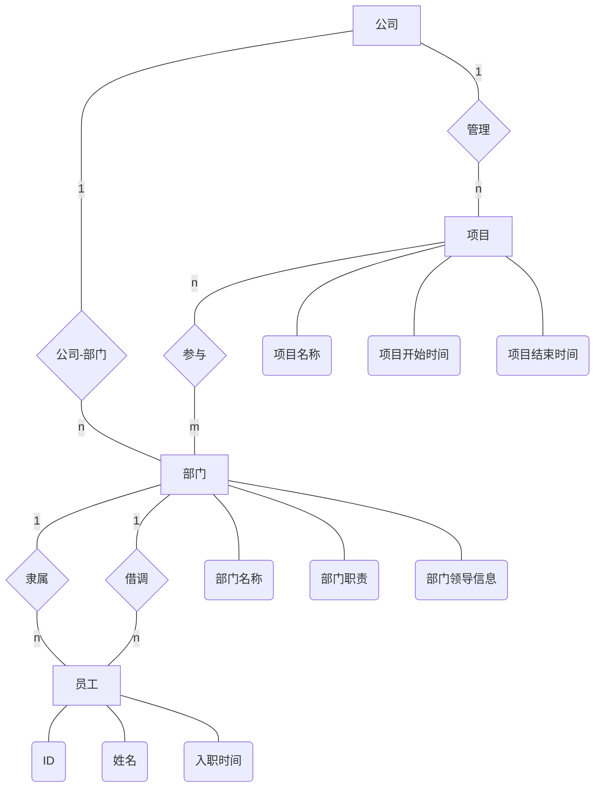

1. D
2. C 需要注意的是除并不属于集合运算
3. A
4. A
5. D
6. B
7. E
8. D
9. B
10. A
11. A
12. C

13. 试述数据库三层模式结构的含义：
    - 外模式：就是用户视图的逻辑表示
    - 逻辑模式：数据库的全局逻辑结构
    - 内模式：数据库实际存储的物理结构
14. 举例说明什么是动态关系级完整性约束
    - 对关系变化前后状态的限制条件，比如事务的一致性、原子性等约束条件
15. 简述索引的作用和工作原理
    - 用于提高数据库的查询效率

R

| A   | B   | C   |
| --- | --- | --- |
| 1   | 3   | 4   |
| 3   | 4   | 2   |
| 1   | 5   | 6   |
| 7   | 3   | 4   |

S

| D   | B   | C    |
| --- | --- | ---- |
| 1   | 3   | null |
| 2   | 3   | 4    |
| 3   | 4   | 2    |

给出$\Pi_{R.A,S.B}(\sigma_{R.A=S.D}(R\bowtie S))$

| **A** | B   | C   | D   | **B** | C    |
| ----- | --- | --- | --- | ----- | ---- |
| 1     | 3   | 4   | 1   | 3     | null |
| 3     | 4   | 2   | 3   | 4     | 2    |
| 1     | 5   | 6   | 1   | 3     | null |

| A   | B   |
| --- | --- |
| 1   | 3   |
| 3   | 4   |
| 1   | 3   |

| A   | B   | C   | D   | B   | C    |
| --- | --- | --- | --- | --- | ---- |
| 1   | 3   | 4   | 1   | 3   | null |
| 1   | 3   | 4   | 2   | 3   | 4    |
| 1   | 3   | 4   | 3   | 4   | 2    |
| 3   | 4   | 2   | 1   | 3   | null |
| 3   | 4   | 2   | 2   | 3   | 4    |
| 3   | 4   | 2   | 3   | 4   | 2    |
| 1   | 5   | 6   | 1   | 3   | null |
| 1   | 5   | 6   | 2   | 3   | 4    |
| 1   | 5   | 6   | 3   | 4   | 2    |
| 7   | 3   | 4   | 1   | 3   | null |
| 7   | 3   | 4   | 2   | 3   | 4    |
| 7   | 3   | 4   | 3   | 4   | 2    |

Country(Cname,Cap,Space)

City(Ctname,Cap,Pop)

NCountry(Cname,NCname)

1. $\Pi_{NCname}(\sigma_{Cname='China'}(NCountry))$

2. $\Pi_{Ctname,Pop}(\sigma_{Cname='China'}(\mathop{Country\bowtie City}\limits_{City.Cap=Country.Cap}))$
3. $NCountry\div(\Pi_{NCname}(\sigma_{Cname="Garman"}(NCountry)))$\

```sql
select Country.Cname
from Country left join NCountry
on Country.Cname=NCountry.Cname
where NCountry.Cname is null
```

```sql
select Cname,count(*)
from NCountry
group by Cname
having count(*)>5
order by count(*) asc;
```

```sql
select NCname
from NCountry join NCountry as NC
on NCountry.NCname=NC.Cname and NCountry.Cname!=NC.NCname
where Cname='China'
```

```sql
create view v1(Cname,Pop)
select Cname,max(Pop)
from Country natural join City
group by Cname
with check option
```

```sql
alter table Country add Cnum int;
```

```sql
update Country
set (Cnum)=(
    select count(*)
    from City
    group by Cap
    where City.Cap=Country.Cap
)
```

```sql
-- (Cname,Ctname,Pop)
select test1.Cname,test2.Ctname,test1.Pop
from (
    select Cname,min(Pop)
    from City natural join Country
    group by Cname
) as test1 join (
    select *
    from City natural join Country
) as test2 on
test1.Cname=test2.Cname and test1.Pop=test2.Pop
```



公司唯一，所以不用为它单独设计数据模型

部门(部门名称,部门职责,部门领导信息)

员工(ID,姓名,入职时间,隶属部门名,被借调部门名)

项目(项目名称,项目开始时间,项目结束时间)

项目-部门(项目名称,部门名称)

min:5+3

AB->CD,A->D

AB->C,A->D

AB->C,AB->D

主属性是(A,B)

数据库设计过程

1. 需求分析阶段
    - 准确了解与分析用户需求
    - 整个设计过程的基础，是最困难、耗时的一步
      **数据流图**、**数据字典**、
2. 概念逻辑设计阶段
    - E-R 图设计
      数据抽象、选择局部应用、注意设计分 E-R 图、集成局部视图并解决冲突
3. 逻辑结构设计阶段
    - 将 E-R 图转换为具体的数据模型(关系模型等等)
      关系模型、数据模型优化、设计用户子模式
4. 数据库物理设计阶段
    - 进行物理存储安排，建立索引
5. 数据库实施阶段
