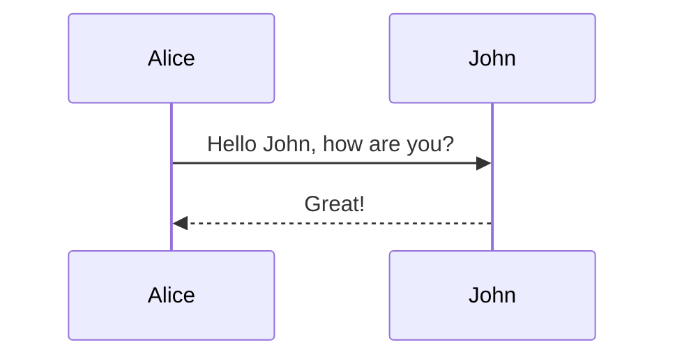
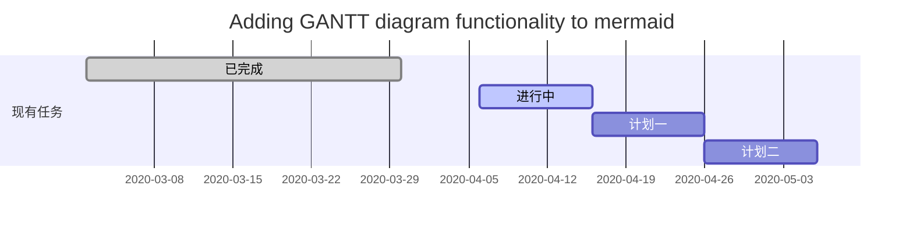
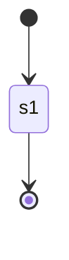
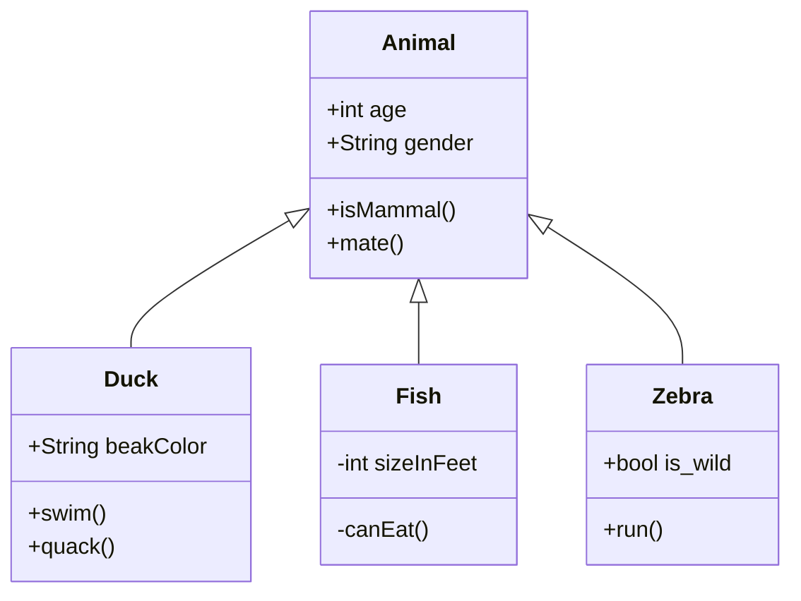
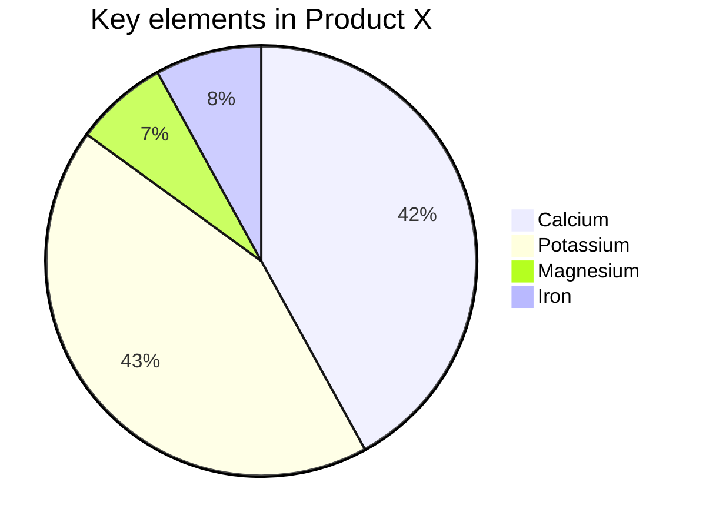

[toc]

# Typora使用手册

## Markdown基础语法

### 任务列表

> 比较麻烦，需要`-空格[空格]空格Java `，下面是示例

- [ ] Java
- [x] C++

- [ ] Python
- [x] C#

### 水平分割线

> `***`or`---`

---

### 高亮

> 显示效果:==高亮==
>
> 源代码:`==高亮==`

### 字体颜色

> 显示效果:I'm red.
>
> 源代码:`I'm red.`

## 快捷键骚操作

### 搜索

> `Ctrl+F`

### 替换

> `Ctrl+H`：搜索并替换选中文字

## 进阶语法

> 我暂时使用的还不是很熟练，/(ㄒoㄒ)/~~

### 表情

> 好赞的功能，有两种使用方法

1. 直接`Win+.`打开Windows的表情面板挑选
2. 直接利用代码输入，比方说笑脸就是:happy:`:happy:`

### 各种图的绘制

#### 流程图

#### 时序图

#### 甘特图

#### 状态图

> 语法解释：`[*]` 表示开始或者结束，如果在箭头右边则表示结束。

#### 类图

> 和C++、Java中的类一致，就是对其的说明
>
> 语法解释：
>
> `<|--` 表示`继承`，`+` 表示 `public`，`-` 表示 `private`

#### 饼图

## 终极技巧-自定义CSS语法

> 路漫漫其修远兮，吾将上下而求索

## PicGo-图片插入配套软件