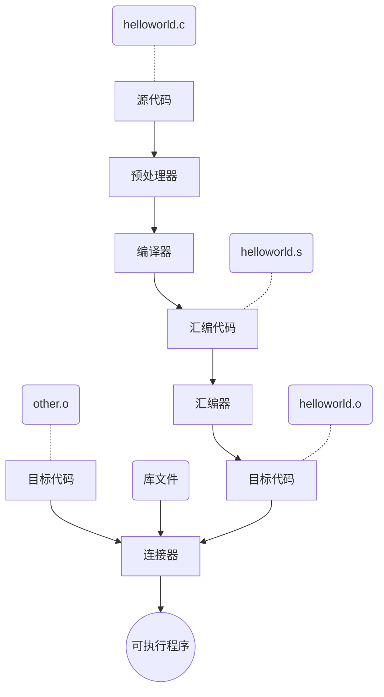

### 基本文件指令

> 参数顺序是无所谓的嗷，还有指令是支持正则表达式滴
>
> Plus：`ctrl+insert`是linux控制台的复制指令，`shift+insert`则是linux控制台的粘贴指令

1. `ls`:展示指令，类比windows中的`dir`

   - `ls -l`:显示文件的**详细信息**，包括==是否是文件夹==、==读写权限==、==大小==、==修改实践==等等

   - `ls -lh`:指令-lh代表人性化显示所查看的内容，比方说下面两条指令的对比，原来显示的是121288字节，加上h后显示为119k

     ==ls kill -l==:`-rwxr-xr-x 1 root root 121288 Dec 22  2018 sed`

     ==ls kill -lh==:`-rwxr-xr-x 1 root root 119K Dec 22  2018 sed`

   - `ls -a`:显示所有文件，能够显示**被隐藏**起来的文件（一般都是以`.`开头的文件）

   - `ls -ll`=`ls -la`

2. `pwd`:显示当前所在路径

3. `cd`:切换目录指令，不加参数默认返回家目录

   - `cd ..`:返回上层目录
   - `cd -`:返回上一个你待过的目录

4. `cp`:文件复制+粘贴+(重命名)命令，文件复制具体操作如下图所示

   

   - `cp a b -r`:将整个a目录复制到b目录下面

     如果存在==转义字符==，直接+\表示即可

   - `cp a ./c -r`:直接在当前目录下复制一份`a`目录并重命名为`c`，`-r`代表操作文件夹

   - ```
     for var in *.txt
     do
     	cp "$var" "$var.bat"
     done
     ```

     

5. `mkdir`:创建文件夹

   - `mkdir a`:创建一个`a`文件夹
   - `mkdir a/b/c -p`:创建一个a文件夹，并在a文件夹下创建一个b文件夹，并在b文件夹下创建一个c文件夹(都是在文件夹不存在的情况下创建的)，-p用于连续创建文件夹

6. `rm`:删除文件

   - `rm tmp.txt tmp2.txt`:删除`tmp.txt`和`tmp2.txt`两个文件
   - `rm a -r`:删除名为`a`的文件夹，删除多个`rm a b c -r=rm {a..c} -r`
   - `rm {a..c}.txt`:删除`a.txt,b.txt,c.txt`
   - `rm *`:删除当前文件夹下的所有东西，所以`rm a/*`就是删除a文件夹下的所有内容
   - `rm * -rf`:**毁灭吧！！！**（删除所有内容，包括未显示的文件夹，f代表提高权限）

7. `touch`:==创建一个文件==，只是单纯的创建，和vim的创建并编辑不同

8. `mv`:剪切+粘贴指令

   - `mv a/tmp.txt b/`:简简单单嗷
   - `mv tmp2.txt tmp.txt`:就是重命名
   - `mv dir_a/{a.txt,b.txt,c.txt} dir_b/`:移动多个文件，复制同理

9. `cat`:==查看文件的内容==

   - `cat tmp.cpp`:直接在控制台上显示查看内容
   - `cat cpuinfo`:（需要cd到/proc文件夹）查看服务器配置文件

> Plus:删除指定文件
>
> `find -type f -name "*.txt" -delete`:删除当前目录下所有后缀为txt的文件
>
> ```shell
> for var in *.txt
> do
> 	rm "$var"
> done
> ```

## OS新增内容：GCC

> 讲解了一下Linux服务器下如何编译运行C代码具体操作

示例：Linux下直接使用gcc将helloworld.c编译成可执行文件helloworld

```shell
gcc helloworld.c -o helloworld # 得到可执行文件
gcc -E helloworld.c # 只进行预处理
gcc helloworld.c -S -o helloworld.S # 汇编得到helloworld.S
gcc helloworld.c -c -o helloworld.o # 只编译，不链接
gcc -M helloworld.c # 列出文件依赖
```

复习以下C语言编译的基本流程



## OS新增内容：Make和Makefile

### 概述

学习Makefile前，先来了解一下Makefile是干什么用的？

[Makefile](https://www.zhaixue.cc/makefile/makefile-intro.html)是在Linux环境下 C/C++ 程序开发必须要掌握的一个工程管理文件

首先我们假设一个情景，你写了一个helloworld.c文件，此时它还是一个单文件程序，不需要和其他任何文件链接，所以执行它，只需要

```shell
gcc helloworld.c -o helloworld
./helloworld
```

此时对于单文件以及一些比较简单的程序，使用gcc编译运行还是非常方便的

---

此时我们再假设一个情景，你正在开发一个很大的项目，里面可能有几百个c源文件（不要问我为什么非要用c开发这种项目emm），并且它们之间都是相互链接的，那么此时再次编译运行整个项目，就需要......

```shell
gcc moudle1.c moudle2.c ... moudle100.c ... -o a.out
./a.out
```

这是不是太麻烦了点呢？（废话.jpg）

这种时候**自动化编译工具make**就派上用场了，使用make编译程序，不需要每次都输入源文件，直接再命令行下敲击make命令，即可一键自动化完成编译（make编译依赖于Makefile文件，并且可以直接把make指令看作**宏定义**来理解）

总结：==make和Makefile就是为了方便Linux下文件编译运行而产生的（主要用于替代win系统中编译器为我们做的事情，并且由于执行主要依赖于shell命令，自由化程度比起编译器来更高，并且支持的语言不仅仅局限于c）==

### 具体使用

> 使用了一下后，感觉Makefile的原理非常像宏定义？？？

- Makefile文件的基本格式

  ```shell
  target1: dependencies1(构建target目标所需的依赖文件)
  	command1
  	command2
  	... # 获取到target文件所需要执行的指令集合
  target2: ....
  	...
  ```

  再看一个具体实例

  ```shell
  a.out: helloworld.o
      gcc -o a.out helloworld.o
  helloworld.o: helloworld.c
      gcc -c -o helloworld.o helloworld.c
  clean:
      rm -f a.out helloworld.o
  ```

### 网址实例操作

#### Level1

```c
//hellomake.c
#include <hellomake.h>

int main() {
  // call a function in another file
  myPrintHelloMake();

  return(0);
}
```

```c
//hellofunc.c
#include <stdio.h>
#include <hellomake.h>

void myPrintHelloMake(void) {

  printf("Hello makefiles!\n");

  return;
}
```

```c
//hellomake.h
/*
example include file
*/

void myPrintHelloMake(void);
```

**直接使用gcc编译**

```shell
gcc hellomake.c hellofunc.c -I -o hellomake
# -I代表gcc会在当前目录下寻找所包含的头文件
```

**使用makefile**

```shell
hellomake: hellomake.c hellofunc.c
	gcc hellomake.c hellofunc.c -o hellomake -I ./ # 在当前路径下查找所需头文件
```


## OS新增内容：ctags

> 同样在了解ctags的使用之前，先来了解一下ctags的具体功能
>
> 简单来说：IDEA中不是有个功能，ctrl+方法，再点击就会自动转到该方法具体实现的源文件相应位置处，这样查看起源代码来非常方便快捷，而ctags就是Linux下执行这一功能的（总而言之这些新增的东西全都是为了弥补Linux下没有编辑器的缺陷）

1. 执行`ctags -R *`：在代码目录下生成文件tags
2. 然后在你想要查看的函数那里`ctrl+]`即可跳转到函数实现处
3. 最后`ctrl+o`跳转回原文件


## 光标切换

**使用`echo -ne "\e[2 q"`和`echo -ne "\e[6 q"`可以使得Linux光标在粗光标和细光标之间相互切换**

## 基本语法

### 字符串

> 默认定义的都是字符
>
> 字符串可以使用单引号、双引号，也可以不加引号

**关于单引号和双引号的区别**

- 单引号中的内容会**原样输出**，**不会执行**，**不会取变量**
- 双引号中的内容会==执行==，可以==取变量==

```shell
name=yxc
echo 'hello $name\"hh\"' # 单引号字符串，输出hello $name\"hh\"
echo "hello $name\"hh\"" # 双引号字符串，输出hello yxc"hh"
```

获取字符串长度#

```shell
name="yxc"
echo ${#name} # 输出3，无法直接查看字符串的长度${12345}
```

提取子串

```shell
name="hello,yxc"
echo ${name:0:5} # 提取从0开始的5个字符
```

### 默认变量

#### 文件参数变量

执行`shell`脚本的时候，可以向脚本中传递参数。`$1`是的一个参数，`$2`是第二个参数，一次类推....特殊的有，`$0`是文件名(包含路径，或者说执行命令更恰当)

创建文件`test.sh`

```shell
#! /bin/bash
echo "文件名为:"$0
echo "第一个参数"$1
echo "第二个参数"$2
echo "第三个参数"$3
echo "第四个参数"$4
```

然后执行`test.sh`

1. `$n`:表示传递的第n个参数
2. `$#`:表示传递的参数个数
3. `$*`:表示所有参数构成的用空格隔开的字符串，比如`1 2 3 4`
4. `$@`:表示所有参数构成的用双引号括起来+空格的字符串，大部分情况与3相同
5. `$$`:表示脚本当时运行的进程
6. `$?`:表示上一条命令的退出状态，（注意不是stdout，而是exit code）。0表示正常退出，其他值表示错误，就像c++中的`return 0`（这条指令非常常用）
7. `$(command)`:很常用，返回command这条命令的stdout(**输出结果**)，相当于命令中的内容直接被stdout取代了
8. command:两边加上`,同上，但是不可嵌套

### 数组

> shell中的数组可以存放多个不同类型的值，只支持一维数组，初始化时不需要指明数组大小，下标从**0**开始

**定义**

==数组用小括号表示，元素之间用空格隔开==

```shell
array=(1 abc "yxc" 123)
# 也可以直接定义数组中某个元素的值
array[0]=1
array[1]=abc
array[2]="def"
arrray[3]="1234"
```

**读取数组中某个元素的值**

==${array_name[i]}==

**读取所有存在值**

==${array_name[@ or *]}==

**求数组长度**

==${#array_name[@ or *]}==

```shell
#! /bin/bash
array[0]=123
array[1]="132454"
array[1000]=abc

echo "读取所有存在的值"${array[*]}
echo "输出数组长度"${#array}
# 输出值自己运行一下就知道了
```

### expr命令

> expr...是命令形式的，存在stdout和exit code，而'expr...'则纯粹是一个输出，比方说'expr 3 \\> 3'就在指令中就纯粹等于0（这个之前有提到过，\`用于获取指令的stdout，等同于`$()`）

> shell中无法直接求解3+4=?这样的表达式，所以必须使用`expr`命令
>
> 基本格式`expr 表达式`，expr指令返回值到stdout
>
> 而下面的test命令是用exit code来返回结果的

- 用空格隔开每一项
- 用反斜杠放在shell特定的字符前面（发现表达式运行错误时，可以试试转义）
- 对包含空格和其他特殊字符的字符串要用引号括起来
- expr会在stdout中输出结果。如果为逻辑关系表达式，则结果为真，stdout为1，否则为0（类比if）。
- expr的exit code：如果为逻辑关系表达式，则结果为真，exit code为0，否则为1（类比return）。

#### 字符串表达式

- `length string`

  返回string字符串的长度

  ```shell
  expr length "123"
  # 输出3
  # 脚本中
  name="123"
  echo `expr length "$name"`
  ```

- `index string charest`
  charset中任意单个字符在string中最先出现的字符位置，下标从1开始。如果在string中完全不存在charset中的字符，则返回0。

  ```shell
  str="hello world"
  echo `expr "$str" low`
  # 输出3
  ```

- `substr string position length`
  返回string字符串中从position开始，长度最大为length的子串。如果position或length为负数、0或非数值，则返回空字符串。

  ```shell
  str="hello world"
  echo `expr substr "$str" 2 3`
  # 输出:ell
  ```

#### 整数表达式

> 注意同样需要使用空格隔开

+ `+-`
  加减运算。两端参数会转换为整数，如果转换失败则报错。

* `* / %`
  乘，除，取模运算。两端参数会转换为整数，如果转换失败则报错。

* `()`

  可以该表优先级，但需要用**反斜杠转义**

```shell
a=3
b=4

echo `expr $a + $b` # 7
echo `expr $a - $b` # -1
echo `expr $a \* $b` # 12
echo `expr $a / $b` # 0
echo `expr $a % $b` # 3
echo `expr \( $a + 1 \) \* \( $b + 1 \)`  # 输出20，值为(a + 1) * (b + 1)
# 该类表达式写法，先写正常表达式，再加空格，再加转义字符
```

#### 逻辑表达式

- `|`:类似于c++中的`||`（注意这个不是重定向！！它是在expr指令你内部的）

  如果第一个参数非空且非0，则返回**第一个参数的值**，否则返回第二个参数的值。但要求第二个参数的值也是非空或非0，否则返回0。如果第一个参数是非空或非0时，不会计算第二个参数。

- `&`:类似于c++中的`&&`

  如果两个参数都非空且非0，则返回**第一个参数**，否则返回0。如果第一个参为0或为空，则不会计算第二个参数。

- `< <= = == != >= >`
  比较两端的参数，如果为true，则返回1，否则返回0。"=="是"="的同义词。expr首先尝试将**两端参数转换为整数**，并做算术比较，如果转换失败，则按字符集排序规则做字符比较。

- `()`:作用与之前类似不支持浮点数

- 这些操作

```shell
#! /bin/bash
a=3
b=4

echo `expr $a \> $b` # 输出0，需要转义
echo `expr $a '<' $b` # 输出1，也可以利用引号代替
echo `expr $a '>=' $b` # 输出0
echo `expr $a \<\= $b`  # 输出1

c=0
d=5

echo `expr $c \& $d`  # 输出0
echo `expr $a \& $b`  # 输出3
echo `expr $c \| $d`  # 输出5
echo `expr $a \| $b`  # 输出3
```

> 因为shell脚本一般是用来**处理文件**而不是用于数值计算的，所以各种数值计算的操作就很蛋疼

### read命令

> 用于从标准输入中读取单行数据，当读取到==文件结束符==时，exit code为1，否则为0（文件结束符可以用ctrl+d代替）

**参数说明**

- `-p`:后面可以接**提示信息**`read -p "my name is:" name`
- `-t`:后面跟**秒数**，定义输入字符的等待时间，超过等待时间自动忽略此命令

### echo命令

> 可以使用`man echo`查看echo的相关参数

- `-e`:打开转义，之后就支持换行符了

  末尾+`"\c"`可以取消末尾的自带换行

- `>`:输出重定向

  ```shell
  echo "hello world" > output.txt
  ```

- 获取命令的输出

  ```shell
  echo `date`
  # date获取当前的标准时间，虽然这貌似是``的作用(和$()等效)
  ```

### printf命令

> 和C/C++中几乎完全一模一样，所以直接看案例即可，参数之间用**空格**隔开

```shell
printf "%10d.\n" 123  # 占10位，右对齐
printf "%-10.2f.\n" 123.123321  # 占10位，保留2位小数，左对齐
printf "My name is %s\n" "yxc"  # 格式化输出字符串
printf "%d * %d = %d\n"  2 3 `expr 2 \* 3` # 表达式的值作为参数

# 输出结果
       123.
123.12    .
My name is yxc
2 * 3 = 6
```

### test命令与判断符号[]

**逻辑运算符**：`&&`和`||`
`&&`表示与，`||`表示或
二者具有短路原则：
`expr1 && expr2`：当`expr1`为假时，直接忽略`expr2`
`expr1 || expr2`：当`expr1`为真时，直接忽略`expr2`
表达式的`exit code`为**0**，表示**真**；为**1**，表示**假**。（**与C/C++中的定义相反**）

和之前的区别是，之前是按照stdout来判断，这里是按照exit code来判断

#### test命令

> 主要用于**判断文件类型**和比较**两个元素的值（特指整数和字符串）**

比较expr和test

- expr:stdout，1表示真，0表示假（等价于cout）
- test:exit code，0表示真，1表示假（等价于return）
- 凡是进程状态表示结果的，都是0表示真

```shell
test 2 -lt 3 # 2<3，为真，返回0
echo $? # 输出0
```

```shell
test -e test.sh && echo "Exist" || echo "Not exist" # 判断文件是否存在
# && 和 ||组合可以得到if-else的作用
# ...&&...||...=if...else...
```

参数介绍:

**文件类型判断**:`test -e/-f/-d filename`

| 参数 |        代表含义         |
| :--: | :---------------------: |
|  -e  |  文件是否存在（exist）  |
|  -f  |   是否为文件（file）    |
|  -d  | 是否为目录（directory） |

**文件权限判断**（判断的是当前正在操作的用户）:`test -r filename`

| 参数 |       代表含义        |
| :--: | :-------------------: |
|  -r  | 文件是否可读（read）  |
|  -w  | 文件是否可写（write） |
|  -x  |    文件是否可执行     |
|  -s  |    是否为非空文件     |

**整数之间的判断**:和latex公式的语法极其类似

| 参数 | 代表含义 |
| :--: | :------: |
| -eq  |   a==b   |
| -ne  |   a!=b   |
| -gt  |   a>b    |
| -lt  |   a<b    |
| -ge  |   a>=b   |
| -le  |   a<=b   |

**字符串比较**

|        参数        |             代表含义             |
| :----------------: | :------------------------------: |
|   test -z string   |          string是否为空          |
|   test -n string   |       是否非空（-n可省略）       |
| test str1 == str2  | str1 == str2（注意一定要加空格） |
| test str1 != str2  |            str1!=str2            |
| test str1 \\< str2 |          支持字符串比较          |

**多重条件判定**:`test -r filename -a -x filename`

| 参数 |                       代表含义                       |
| :--: | :--------------------------------------------------: |
|  -a  |                **两条件是否同时成立**                |
|  -o  |                两条件是否至少一个成立                |
|  !   | 取反，如`test ! -x file`，当file不可执行时，返回true |

#### 判断符号[]

> []与test用法几乎一模一样，更常用于if语句中（至少在y总的认知中是一模一样的）。
>
> 另外[[]]是[]的加强版，支持的特性更多（应该用[]就够了）

```shell
[ 2 -lt 3 ] # 为真，返回true
echo $? # 0
acs@9e0ebfcd82d7:~$ ls  # 列出当前目录下的所有文件
homework  output.txt  test.sh  tmp
acs@9e0ebfcd82d7:~$ [ -e test.sh ] && echo "exist" || echo "Not exist"
exist  # test.sh 文件存在
acs@9e0ebfcd82d7:~$ [ -e test2.sh ] && echo "exist" || echo "Not exist"
Not exist  # testh2.sh 文件不存在
# 一般用[]和test即可
```

**注意事项**

- []内的每一项都要用**空格隔开**
- 中括号内的**变量**，必须用**双引号**括起来（不写括号的化变量内已存在空格就会出错）
- 中括号内的**常数**，最好用**单或双引号**括起来

```shell
name="acwing yxc"
[ "$name" == "acwing yxc" ] # 正确
```

### 判断语句

> `if...then`:类比c++中的`if-else`语句

**单层if**

```shell
if condition # 判断的是这个表达式的退出状态（目前为止以输出判断的貌似只有&和|）
then
	语句1
	语句2
	......
fi

# 举例
a=3
b=4
if [ "$a" -lt "$b" ] && [ "$a" -gt "2" ]
then
	echo $a"在范围内"
fi # if判断语句结束标识符
```

**单层if-else**

```shell
if condition
then
	语句1
	语句2
	......
else
	语句1
	语句2
	......
fi

# 举例
a=3
b=4

if ! [ "$a" -lt "$b" ]
then
    echo ${a}不小于${b}
else
    echo ${a}小于${b}
fi
```

**多层if-elif-elif-else**

```shell
if condition
then
	语句1
	语句2
	......
elif condition
	语句1
	语句2
	......
elif condition
	语句1
	语句2
	......
else
	语句1
	语句2
	......
fi

# 举例
a=4

if [ $a -eq 1 ]
then
    echo ${a}等于1
elif [ $a -eq 2 ]
then
    echo ${a}等于2
elif [ $a -eq 3 ]
then
    echo ${a}等于3
else
    echo 其他
fi
```

### 循环语句

#### for语句

**for…in…do…done**

> 基本格式如下（其余内容都是in后面的变种）

```shell
for i in ...
do
	...
	...
done
```

- in+空格隔开的内容

  ```shell
  for i in a b c
  do
  	echo $i
  done
  ```

- in+数组

  ```shell
  for i in ${arr[*]}
  do
  	echo $i
  done
  ```

- in+命令返回的结果

  ```shell
  for i in $(ls)
  do
  	echo $i >> output.txt # 追加重定向(自动创建output.txt)
  done
  ```

- in+seq命令生成的整数序列

  ```shell
  for i in $(seq 1 10) # 1 2 3 ... 10
  do
  	echo $i
  done
  ```

- in+bash内嵌的范围写法

  ```shell
  for i in {1..10}
  do 
  	echo $i
  done
  for i in {a..z}
  do 
  	echo $i
  done
  for i in {z..a}
  do
  	echo $i
  done
  ```

**for ((…;…;…)) do…done**

> 和C++几乎完全一致，除了双括号和不需要变量定义

```shell
for((i=1;i<10;i++))
do
	echo $i
done
```

#### while语句

> 死循环时可以使用ctrl+c直接杀死进程

**while…do…done循环**

> 同样和C++中几乎一致

```shell
while condition
do
	...
done
```

**until..do..done循环**

```shell
until condition # 和while类似，不过until只有在condition为假的时候才执行...内容
# 这个不用记忆,直接while ! condition就能代替
do
	...
done
```

#### break和continue

> 和C++中基本一致，唯一不同的是，break不能跳出case

### 关于死循环的处理方式

1. ctrl+d：文件结束符退出循环

2. ctrl+c：直接杀死当前正在运行的进程退出循环（当然你要在进程下）

3. 首先top，查看当前正在运行的所有进程，找到死循环进程对应的pid，运行指令`kill -9 pid`即可

   plus:可以使用==shift+m==使得**进程按照内存排序**（不然内存老是跳来跳去的不好定位）

### 函数

> bash中的函数类似于C/C++中的函数，但是return的返回值与C/C++中的不同，返回的是exit code，取值为0-255，0表示正常结束

- 如果想要获取函数的输出结果，可以通过`echo`输出到`stdout`中，然后通过`$(function_name)`来获取`stdout`中的结果
- 函数的`return`值可以通过`$?`来获取

**命令格式**

```shell
func_name(){
	语句1
	语句2
	....
}
```

**获取函数输出内容和返回值**（0-255）

```shell
output=$(func_name)
ret=$?
```

**获取函数参数**

> 和一般的文件输出参数类似
>
> 函数中的`$1`就表示第一个输入参数，`$2`就表示第二个输入参数

```shell
func(){
	if [ $1 -le 0 ]
	then
		echo 0
		return 0
	fi
	sum=$(func $(expr $1 - 1))
	echo $(expr $sum + $1)
}
echo $(func 10)
```

### exit命令

> 用于退出当前的`shell`进程，并返回一个退出状态（可以理解为C++中的return）

```shell
#! /bin/bash

if [ $# -ne 1 ]  # 如果传入参数个数等于1，则正常退出；否则非正常退出。
then
    echo "arguments not valid"
    exit 1
else
    echo "arguments valid"
    exit 0
fi
```

### 文件重定向

> 每一个程序在执行的时候，都是在一个独立的进程，而每一个进程，在Linux里面，默认都会打开三个文件**stdin**、**stdout**、**stderr**

1. stdin：标准输入，从命令行读取数据，文件描述符为0
2. stdout：标准输出，向命令行输出数据，文件描述符为1
3. stderr：标准错误输出，像命令行输出数据，文件描述符为2

==可以使用文件重定向将这三个文件重定向到其他文件中去==（记忆前三条即可）

|      命令      |                  说明                   |
| :------------: | :-------------------------------------: |
|  `cmd > file`  |         将stdout重定向到file中          |
|  `cmd < file`  |          将stdin重定向到file中          |
| `cmd >> file`  |    将stdout以追加方式重定向到file中     |
| `cmd n> file`  |       将文件描述符n重定向到file中       |
| `cmd n>> file` | 将文件描述符n以追加的方式重定向到file中 |

### 引入外部文件

> 就类似于C/C++中的include操作，bash也可以引入其他文件中的代码

```shell
# 语法格式
. filename
# 或者
source filename
```

引入文件之后，你就可以调用其中的函数和变量啦！！！

### OS新增内容：find

> 文件搜索指令find，用于在指定目录下查找符合自己列举条件的文件。
>
> 条件包括但不限于：文件名、文件类型、用户、时间戳......

find指令基本形式：`find [-H] [-L] [-P] [-D debugopts] [-Olevel] [path...] [expression]`

**删去不常用参数**：`find [path...] [expression]`

- path：find命令所查找的目录路径。
- expression：可以分为`-options [-print -exec -ok ...]`
  - -options：用于指定find命令的常用选项
  - -print：find命令将匹配文件输出到标准输出
  - -exec：find命令将匹配的文件执行该参数给出的shell命令，常用形式`'command' {} \`，注意空格

<u>find指令基本结构</u>

```shell
find start_directory test 
     options 
     criteria_to_match 
     action_to_perform_on_results
```

空讲参数没啥意义，下面举几个示例来理解以下

---

#### find命令常用示例

> 返回的都是所查找到文件的路径，如下图
>
> 

1. `-name filename`在当前目录下查找名为filename的文件

   - `find . -name "*.txt"`查找到当前目录下的所有txt文件

2. `-exec 'command' {} \`对查找到的文件做出command操作

   - `find . -name "*.txt" -exec "rm" {} \;`删除所有txt格式的文件
   - `find . -regex "\\./[a-z]+.*.txt" -exec rm {} \;`找到当前目录下所有小写字母开头的txt文件并删除

3. `-type`：指定搜索的文件类型，一般而言只需要知道`d:目录`、`f:普通文件`即可

4. `empty`：查找到路径下所有空文件和文件夹

5. `-regex "pattern" `注意pattern包括了文件路径（-name也支持一部分但是不完全）

   比方说我想要搜索当前目录下的`ab1.txt`

   ```shell
   find -regex "./[a-b]{2}.txt" -print
   ```


其他根据权限、修改时间、文件大小的options就等用到的时候再来更新吧.......（虽然感觉基本用不到）

### OS新增内容：grep

> 和find指令类似，都是查找指令，但是grep指令的功能是在指定的文件中查找指定内容
>
> 是一种强大的文本搜索工具，能使用正则表达式搜索文本，并将匹配到的行打印出来。

基本命令格式：`grep [options] pattern file`

[options]主要参数介绍

| 参数 |                      含义                      |
| :--: | :--------------------------------------------: |
|  -c  |       只输出匹配行的计数（输出总共几行）       |
|  -i  |         不区分大小写（只适用于单字符）         |
|  -h  |         查询多文件的时**不显示文件名**         |
|  -l  | 查询多文件的时候只输出包含pattern的**文件名**  |
|  -n  |             显示匹配行以及**行号**             |
|  -v  | **反向显示**（显示的是不包含匹配文本的所有行） |
|  -s  |                 不显示错误信息                 |
|  -r  |               文件夹**递归查找**               |

pattern：正则相关内容，注意字符匹配符号和Java中支持的不太一样，建议采用[a-z1-9]这样的形式（貌似不支持\\\\w这种）

#### 配合find指令使用

- `find . -regex "\\./[a-z]+.*.txt" -exec grep -l "test" {} \;`在当前路径下查找所有包含test字符串的以至少一个小写字母开头的txt文件并输出相应文件名

  建议配合测试文件使用

  ```shell
  #! /bin/bash
  for i in {a..z}
  do
          if [ -e $i.txt ]
          then
                  rm "$i.txt"
          fi
          touch "$i.txt"
          for j in {1..10}
          do
                  if [ $i \< "j" ]
                  then
                          echo $i$j'test' >> $i.txt
                  else
                          echo 'TEST' >> $i.txt
                  fi
          done
  done
  ```

  再执行上述查找指令的输出结果

  

### OS新增内容：tree

> 基本使用形式：`tree [options] path`
>
> 效果：以树状形式显示出path文件路径下的所有文件，一般用于检查lab实验代码是否符合相关需求
>
> 参数：-a代表列举所有文件（默认也是），-d只列举目录
>
> tree指令掌握这点就行了。

### OS新增内容：locate

> locate和find类似，但是它的速度要快于find，因为locate直接查找的是数据库，个人认为只要掌握find指令的使用即可（而且网上对于locate指令的教程也不是很多）

### OS新增内容：chmod

> 权限分配指令，具体权限可以使用`ls -ll filename`查看
>
> - 第1位为文件类型，`-`代表是普通文件，`d`代表是文件夹
>
> - 第2-4位为用户(作者)本身权限，第5-7位为同组权限，第8-10位为其他用户的权限
>
> 
>
> **常用**：`chmod +x file.sh`，这样file脚本就能直接使用`./file.sh`运行了。

chmod指令基本格式：`chmod [ugoa] [][+-=][rwx]] filename`

- u 表示该文件的拥有者，g 表示与该文件的拥有者属于同一个群组，o 表示其他以外的人，a 表示这三者皆是。

- \+ 表示增加权限、- 表示取消权限、= 表示唯一设定权限。

- r 表示可读取，w 表示可写入，x 表示可执行。

- 此外chmod也可以用数字来表示权限，格式为：

  ```shell
  chmod abc 文件
  ```

  abc为三个数字，分别表示拥有者，群组，其他人的权限。r=4，w=2，x=1，用这些数字的加和来表示权限。例如`chmod 777 file`和`chmod a=rwx file`效果相同

### OS新增内容：diff

> 用于比较两个文件的差异（第一次使用是在git里，`git diff filename`用于比较暂存区和工作区文件的差异）

diff指令基本格式：`diff [options] file1 file2`

| 参数 |        作用        |
| :--: | :----------------: |
|  -b  |   不检查空格字符   |
|  -B  |     不检查空行     |
|  -q  | 只检查是否存在差异 |

### OS新增内容：sed

> ised是一个文本编辑工具，可以将其类比为**命令行中的vim**
>
> 二者的区别在于：vim采用的是交互式文本编辑模式，而sed采用的是流编辑模式（所以可以将其**应用在脚本中**）
>
> 需要掌握的操作：替换s、新增a、插入i、删除d、行替换c、行写入w

#### sed命令执行顺序

> ==sed命令以行为执行单位==

1. 每次仅读取一行内容

2. 根据提供的规则命令匹配修改数据。注意，sed**默认不会直接修改源文件的数据**，而是将数据复制到缓冲区中，修改也仅限于缓冲区中的数据（可以使用**-i**来直接修改源文件）

3. 将结果输出

   一行数据匹配完成后，它将会继续读取下一行数据，并且**不断重复这一过程**，直到将文件中所有数据处理完毕

**sed命令基本格式**：`sed [-options] 'command' filename`

| options（常用） |                    功能                     |
| :-------------: | :-----------------------------------------: |
|       -n        |     安静模式（只输出经过sed处理的内容）     |
|       -e        | 进行多项编辑（可以对输入行应用多条sed语句） |
|       -i        |           直接修改读取的档案内容            |


#### 替换

> 命令基本格式（也就是command的基本格式）：[address]s/pattern/replacement/flags
>
> - address：表示指定要操作的具体行（这个具体内容留到删除命令再讲）
> - pattern：需要替换的内容
> - replacement：需要替换的新内容

flags标记的各种形式

| flags  |                             功能                             |
| :----: | :----------------------------------------------------------: |
|   n    | 1~512 之间的数字，表示指定要替换的字符串在行中出现第几次时才进行替换。 |
|   g    |  对数据中所有匹配到的内容进行替换（默认的话只会替换第一个）  |
|   p    |               打印匹配到的行，通常和-n结合使用               |
| w file |                  将缓冲区的内容写入指定文件                  |

- `sed 's/test/Test/2' data.txt`：将每行中的第二个test替换成Test

- -n禁止sed输出所有文件内容，p输出修改行，二者结合就是只输出被替换命令修改的行

  ```shell
  [root@localhost ~]# cat data5.txt
  This is a test line.
  This is a different line.
  [root@localhost ~]# sed -n 's/test/trial/p' data5.txt
  This is a trial line.
  ```

- `sed -n 's/test/Test/wp test.txt' data.txt`：将替换内容写入data.txt

- `sed -n '2,3s/test/Tests/p' a.txt`：指定替换2-3行的内容

#### 删除

> 命令基本格式：[address]d
>
> 用于删除文本中的特定行，如果忘记指定行的话，默认删除文件中的所有内容
>
> ```shell
> sed 'd' data.txt
> ```

- `sed '3d' data.txt`：指定删除第3行
- `sed '2,3d' data.txt`：指定删除2-3行的内容
- `sed '2,$d' data.txt`：\$是特殊的文件结束符，代表文件末尾

#### 附加、插入和行替换

> a命令表示再指定行的后面附加一行，i命令表示在指定行的前面插入一行（同时介绍两个指令的原因是二者的指令格式几乎完全相同）
>
> 基本格式：[address]a/i/c \新文本内容

- `sed '3a \123456' a.txt`：在文件的第三行后面添加一行123456
- `sed '3a \123456\7890' a.txt`：添加多行数据使用连续的`\`即可

#### 行写入

> 使用w命令讲文本指定行内容写入其他文件
>
> 基本格式：`[address]w filename`

- `sed '2,3w data.txt' a.txt`：将a.txt中的2-3行的内容写入data.txt中

### OS新增内容：awk

> 除了使用sed命令外，Linux系统中还有一个功能更加强大的文本数据处理工具——awk
>
> **匹配模式和sed类似**：逐行扫描文件（从第 1 行到最后一行），寻找含有目标文本的行，如果匹配成功，则会在该行上执行用户想要的操作；反之，则不对行做任何处理。
>
> **基本格式**：`awk [-options] 'command' filename`

*选项*（常用）：`-F fs`，**指定fs作为输入行的分隔符**

脚本基本格式：`'匹配规则{执行命令}'`

#### awk的数据字段变量

> awk的主要特性之一就是它会自动给每一行的每个数据元素分配一个变量
>
> - $0 代表整个文本行；
> - $1 代表文本行中的第 1 个数据字段；
> - $2 代表文本行中的第 2 个数据字段；
> - $n 代表文本行中的第 n 个数据字段。
>
> 前面说过，在 awk 中，默认的字段分隔符是任意的空白字符（例如空格或制表符）。 在文本行中，每个数据字段都是通过字段分隔符划分的。awk 在读取一行文本时，会用预定义的字段分隔符划分每个数据字段。（**OS实验上基本使用的是awk的字符分割功能**）

- `echo "my name is abc" | awk '{$4="wwt";print $0}'`：`|`是管道，会将command1的stdout发送给command2的stdin，而command2在将stdout默认发送给输出，`;`用于分割awk中的多条指令，首先将\$4赋值为"wwt"，再将整体输出。所以输出为"my name is wwt"
- `awk '$1>2 {print $1,$3}' data.txt`：输出data.txt中所有第一项大于2的行，并输出第一项和第三项
