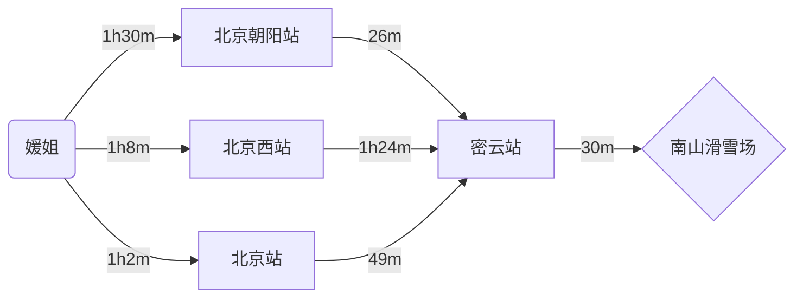
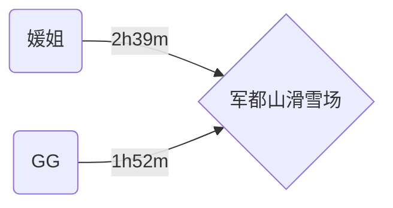
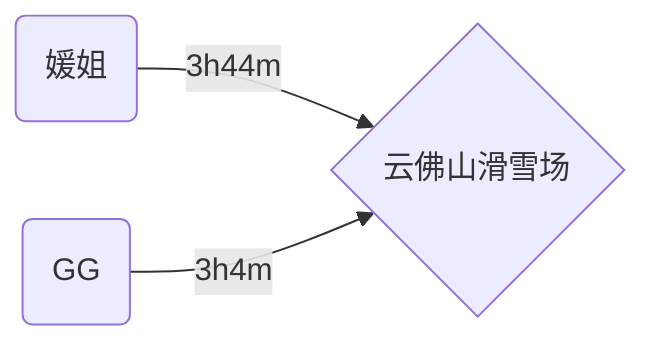
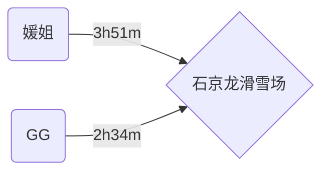
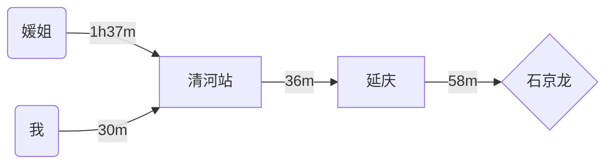
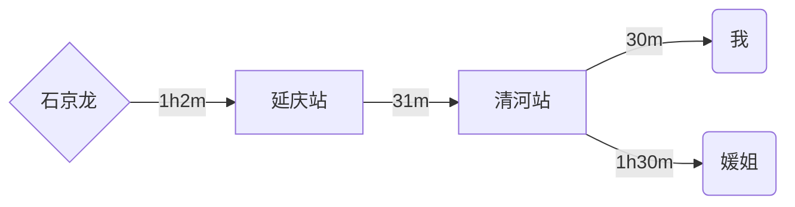

# 滑雪🏂🏻

>   滑雪场：南山、怀北、军都山、渔阳、石京龙、万龙、莲花山、云佛山、云居、八达岭、蓝调庄园、华彬生态园

# 不推荐

## 南山

***Price***：滑雪(2h)340+门票20+租赁(40+10+25+20+5+30=130)= ==490==

貌似也挺贵的emmmm，暂时不考虑🙅🏻‍♀️

## 怀北

***Price***：门票300+租赁(40+25+30+30+10+30=165)+缆车80+……= ==500+==

好贵直接不考虑🙅🏻‍♀️（关键坐个缆车还要80什么鬼😅）

## 渔阳

路途4h起步不考虑🙅🏻‍♀️

## 万龙

***Price***：滑雪509+租赁(60+30+20+30+40=180)= ==689==😇

在张家口，路途时间长（但实际和石京龙也差不多，媛4h32m，我2h35m）

贵贵贵贵贵不考虑🙅🏻‍♀️

## 莲花山

暂停营业🙅🏻‍♀️

## 云居

暂停营业🙅🏻‍♀️

## 八达岭

暂停营业🙅🏻‍♀️

## 蓝调庄园

暂停营业🙅🏻‍♀️

## 华彬生态园

暂停营业🙅🏻‍♀️

# 推荐

## 军都山

***Price***：滑雪(4h)180+租赁(30+30+30+30=120)= ==300==

交通方便可以地铁直达，感jio还阔以（但貌似比较适合老手）

## 云佛山

***Price***：滑雪(4h)99+租赁(40+30+30+20+10)= ==229==

emmmmm虽然便宜但貌似21年出了场服务态度相关的纠纷

## 石京龙

***Price***：滑雪(4h)170+租赁(30+20+20+30=100)= ==270==

缺点比较明显，交通不方便（几乎没地铁）

## 方案一：石京龙

>   媛姐发烧好辣🎉，开心捏

单纯坐地铁+公交的话时间太长，大概4h9m，所以选择先做地铁到火车站，坐一站火车，再做地铁/公交到目的地，具体路线如下👇🏻

清河站发车的话，只有08:13和10:58这两趟车比较合适，但08:13也太早了（媛姐那过来就得两小时了真顶不住），所以选`10:58`这趟，这样的话媛姐大概***8点半***左右出发就行

然后到目的地大概**13点**左右，滑雪🏂🏻可以滑到下午**17点**，虽然有夜场但是园方要清扫半小时才开，但是估计我们也滑不了多久因为最迟一趟延庆回北京北的火车是`19:31`出发滴，也就是说我们下午场结束再在边上逛会儿就可以准备返回了……

返程路线如下👇🏻

最后你到家大概是**9点半**左右

***总结***：石京龙交通确实是大问题，==来回6h结果只能滑4h==。所以哪怕你这周发烧好了我也是不太推荐去石京龙的~~（其他滑雪场要么没开要么死贵要么路途比石京龙还夸张）~~，毕竟身体本来就虚，在路上颠簸6h（如果地铁没抢到座位更是受罪😵），然后还要在最低零下7度的天气滑雪，哇靠，想想都要GGbond了，而且如果发烧刚好又被出去玩整复发了那我真的是原地负荆请罪😇。。。。。。

## 方案二：军都山

>   平行宇宙里的媛姐依旧发烧于是只能躺床上睡大觉😴，时间来到下星期……
>
>   正好军都山开放哩（11.30开放），而且军都山从地理位置上来说也比石京龙要合适捏（离我们近而且还有地铁直达哦👍）

不用坐火车可以直接地铁直达，好好好🤩

媛姐大概**9点半**左右出发就行，晚点也没事

因为都要坐昌平线，所以我们可以在***西二旗站***会和（刚好是你那边的首发站）

到了之后可以直接滑到晚上`18:00`，如果不够滑的话继续滑夜场也行，考虑到地铁我们最迟可以滑到`20:30`

然后就是平平无奇的返程，就直接把上面👆🏻这图反过来看就行啦（不画了就）

