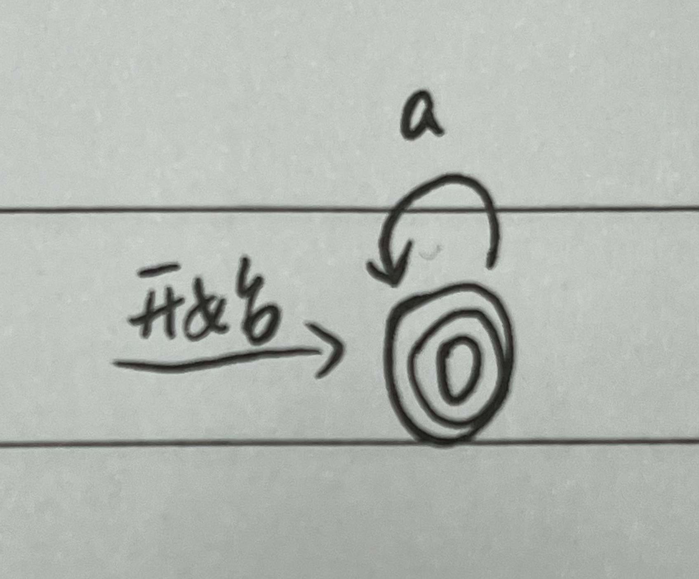

# 第五次作业

> 令 A、B、C 是任意正则表达式，证明一下关系成立
>
> $A|A=A$
>
> $(A*)*=A*$
>
> $A*=\varepsilon|AA*$
>
> $(AB)*A=A(BA)*$
>
> $(A|B)*=(A*B*)*=(A*|B*)*$

可将正则表达式转化为正则文法

S->A|A=>S->A,S->A=>S->A

S->`(A*)*`=>S->`B*`=>S->`B*B`=>S->`BS`,S->B=>S->`A*S`,S->`A*`

S->$\varepsilon|AA*$=>$S->\varepsilon,S->AA*$=>$S->\varepsilon,S->A*$

对于 0 次，有 $(AB)*A=A=A(BA)*$
对于 1~n 次，有 $(AB)^{n}A=A(BA)^{n-1}A=A(BA)^{n}$

直接采用语义证明，$(A|B)*$描述的是 A 或 B 的任意组合，而 $(A*B*)*$ , $(A*|B*)*$ 描述的是 A 和 B 的任意组合，因此两者相等。

> 构造下列正则表达式相应的 DFA，并进行化简
>
> `1(0|1)*|0`
>
> `1(1010*|1(010)*1)*0`
>
> `1(0|1)*101`

> 将 A，B 分别确定化，最小化

> 构造一 DFA，它接受{0,1}上所有满足如下条件的字符串：每个 1 都有 0 直接跟在右边

构造正则：`(0|10)*`
构造 DFA：
