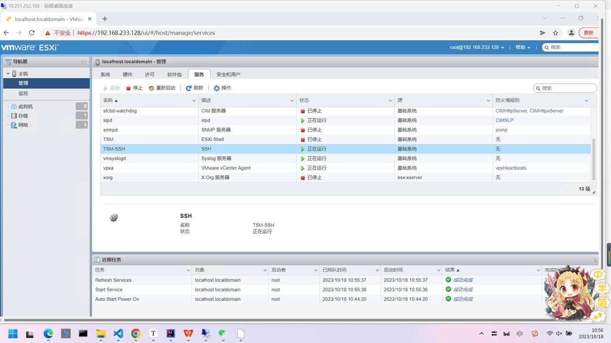
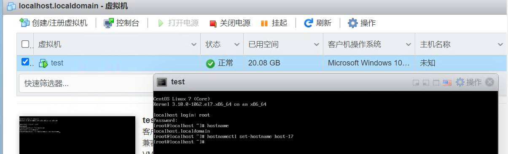
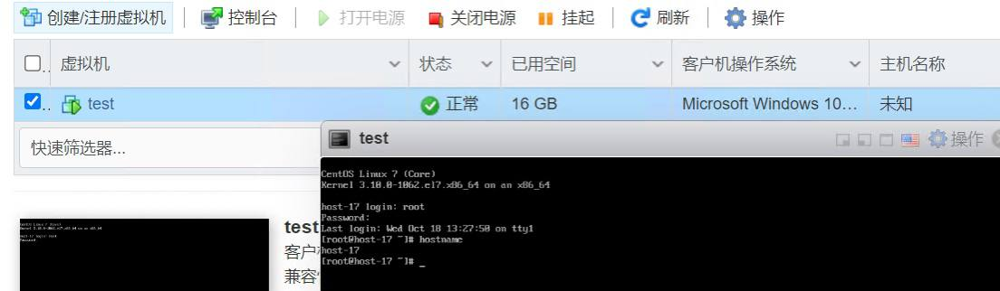
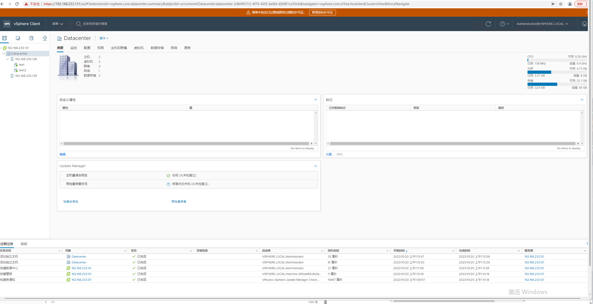

## Lab02 虚拟化实验

> 组号： 17
|      | 学号     | 姓名   |
| ---- | -------- | ------ |
| 1    | 21371518 | 薛天钰 |
| 2    | 20373873 | 潘语依 |
| 3    | 20373914 | 吴文韬 |

---

## 实验内容

**思考题1：你需要通过 SSH 连接到这台 ESXi 主机的终端来进行运维，在哪里开启这个功能？（截图作答）**

使用 SSH 客户端通过 ESXi 主机的 IP 地址连接到终端，使用管理员权限进行登录。

**任务1：CentOS 安装完成后，修改主机名为 `host-<组号>`，打开控制台并将浏览器截图**

更改前：

更改后：

**思考题2：vmx, vmdk, vswp 文件的作用分别是什么？**

1. **VMX 文件 (Virtual Machine Configuration File)**:
   - **作用**: VMX 文件是虚拟机的配置文件，包含有关虚拟机的各种设置和参数的信息，例如虚拟硬件配置、虚拟机的操作系统类型、网络设置等。
   - **描述**: VMX 文件是文本文件，通常以 .vmx 扩展名结尾。它是虚拟机的蓝图，指导虚拟化软件如何创建和管理虚拟机。可以编辑 VMX 文件以更改虚拟机的配置选项。
2. **VMDK 文件 (Virtual Machine Disk File)**:
   - **作用**: VMDK 文件包含虚拟机的虚拟硬盘数据。这些文件模拟物理硬盘，用于存储虚拟机的操作系统、应用程序和数据。
   - **描述**: VMDK 文件通常以 .vmdk 扩展名结尾，可以有不同的格式，例如单个 VMDK、多个分割的 VMDK 或其他格式。这些文件模拟硬盘的读写操作，使虚拟机可以在其上执行操作系统和应用程序。
3. **VSWP 文件 (Virtual Machine Swap File)**:
   - **作用**: VSWP 文件是虚拟机的交换文件，用于处理虚拟机内存中的临时数据。是在虚拟机内存不足时用来提供额外内存的一种机制，以防止虚拟机因内存不足而崩溃。
   - **描述**: VSWP 文件通常以 .vswp 扩展名结尾，在虚拟机的数据存储中创建。当虚拟机内存资源不足时，虚拟化平台将使用 VSWP 文件来执行交换操作，以便继续虚拟机的运行。

**思考题3：ESXi如何获取到该虚拟机的CPU使用率？**

ESXi本身是一个虚拟化平台，并不主动获取虚拟机的CPU使用率。而ESXi提供了性能计数器和API，允许查询虚拟机的性能数据，包括CPU使用率。ESXi的性能计数器系统定期收集虚拟机和主机的性能数据，这些性能数据存储在ESXi主机上，并可以通过VMware vCenter Server或API来访问：

1. **使用VMware vCenter Server**：
   VMware vCenter Server是VMware的中央管理工具，用于管理虚拟化环境。它可以通过ESXi主机的API获取虚拟机性能数据，包括CPU使用率。可以登录到vCenter Server，选择虚拟机并查看其性能图表和报告，以获取CPU使用率数据。
2. **使用vSphere API**：
   VMware提供了vSphere API，允许开发人员通过编程方式获取虚拟机性能数据，包括CPU使用率。可以使用vSphere API与ESXi主机通信，并查询虚拟机的性能数据。这通常需要编写自定义脚本或应用程序来实现。

**思考题4：ESXi如何获取到该虚拟机的IP地址？**

ESXi本身不存储虚拟机的IP地址信息，因为ESXi主机主要是虚拟化平台，不直接处理虚拟机的网络配置。虚拟机的IP地址分配通常由DHCP服务器、静态配置或其他网络管理工具来完成。ESXi主要提供虚拟机网络连接的基础设施。

要获取虚拟机的IP地址，需要登录到虚拟机的操作系统或使用网络工具（例如网络管理工具或DHCP服务器）来查询分配给虚拟机的IP地址。

**任务2：将你的 vSphere Client 界面截图**

> vSphere Client至少需要10GB内存和100GB存储空间，所以需要额外新建一个满足该容量的ESXi虚拟机用于配置vSphere Client

