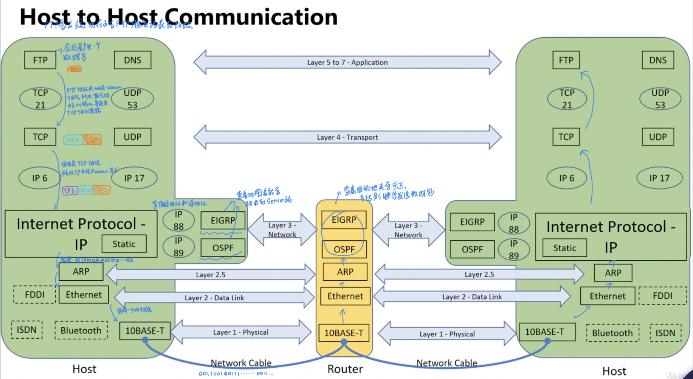

# 现实模型类比

> 以*寄快递*为例，假设现在有住在`区域6`的`a`、`b`、`c`三人，要寄**包裹**📦 给位于`区域1`的`A`、`B`、`C`三人

要寄包裹，首先需要一个包装，然后需要一份快递单，上面记录了基本的快递信息，包括出发地、目的地、邮寄方式(平邮、保险邮)

包裹就是应用层需要发送的数据，或者说包裹由应用层负责产生，传输层则决定了包裹是否需要买保险(这是由程序员决定的)，第三层的IP协议则提供了起始地址和目标地址，现在有了包裹，有了地址，又买了保险，还需要什么呢？还需要一张地图，这是由第三层的路由协议提供的

那么现在有了地址和地图，还需要什么呢？还需要邮寄的路线，这是由二层协议来做决定的，第二层有很多协议，但是现在运用最广泛的协议是Ethernet协议(以太网协议有一个自己的地址格式，叫**MAC地址**)

上面的邮寄过程其实还有点问题，以为信息只记录了起始地址和目标地址，并不知道这个包裹是谁寄给谁的，还缺少了寄件人和收件人，这部分信息在计算机网络中是**端口号**，由传输层协议提供，记录在`TCP/UDP Header`中

**IANA端口号规范**指的是由互联网号码分配机构（IANA）分配和管理的端口号标准规范。常见的TCP/IP网络协议通信都需要使用端口号，如HTTP协议使用80端口，SMTP协议使用25端口等。

根据IANA的分类，端口号分为三类：

1. 熟知端口号（Well Known Ports）：0~1023。这些端口号被系统预留，一般只有特权用户或服务程序才能使用。其中，0号端口被保留，不能用于通信。
2. 注册端口号（Registered Ports）：1024~49151。这些端口号可以被用户应用程序或系统服务程序使用，但需要提前向IANA进行注册申请，并遵循规定的使用约定。例如，Web服务常用的443端口和FTP服务常用的21端口就属于注册端口号。
3. 动态端口号（Dynamic or Private Ports）：49152~65535。这些端口号不受保护和限制，可以被任何应用程序使用。一般情况下，操作系统会从这个端口号范围中随机选择一个可用的端口号来作为客户端应用程序的源端口(*在计算机往外发送数据包的时候，源端口号一般都是在动态端口号随机挑选一个发送的*)

如下图所示

- Data:应用层产生的数据为Data，也被称为报文
- Segment:应用层产生的Data到了传输层被称为Segment
- Frame:传输层产生的Segment到了数据链路层被称为Frame
- Bits:数据链路层产生的Frame到了物理层被称为Bits

## 为什么叫TCP/IP协议簇

1. 1973年，TCP协议被提出，但是的网络，全部都依靠TCP这一种协议进行数据传输
2. 到了1978年，人们慢慢觉得TCP协议过于庞大臃肿，于是将TCP协议的内容单独分出一部分，称之为IP协议
3. 到了1980年，UDP协议被提出，但是由于以往命名的习惯，所以干脆还是沿用之前的*TCP/IP协议簇*这个名称

# 实际网络模型

<table style="text-align:center;">
    <th>OSI Model</th>
    <th>TCP/IP Model</th>
    <th colspan="12">TCP/IP Protocol Suite</th>
    <tr>
        <td>Application</td>
        <td rowspan="3">Application</td>
        <td rowspan="3" colspan="2">Telnet</td>
        <td rowspan="3" colspan="2">FTP</td>
        <td rowspan="3" colspan="2">SMTP</td>
        <td rowspan="3" colspan="2">DNS</td>
        <td rowspan="3" colspan="2">RIP</td>
        <td rowspan="3" colspan="2">SNMP</td>
    </tr>
    <tr>
        <td>Presentation</td>
    </tr>
    <tr>
        <td>Session</td>
    </tr>
    <tr>
        <td>Transport</td>
        <td>Transport Layer</td>
        <td colspan="6" style="font-weight: bold;">TCP</td>
        <td colspan="6">UDP</td>
    </tr>
    <tr>
        <td>Network</td>
        <td>Network</td>
        <td colspan="2" style="background-color: magenta; font-style: italic;">ARP</td>
        <td colspan="6" style="font-weight: bold;">IP</td>
        <td colspan="2" style="background-color: magenta; font-style: italic;">IGMP</td>
        <td colspan="2">ICMP</td>
    </tr>
    <tr>
        <td>Data link</td>
        <td>Data link</td>
        <td rowspan="2" colspan="3" style="background-color: cyan;">Ethernet(以太网协议)</td>
        <td rowspan="2" colspan="3" style="background-color: cyan;">Token Ring(令牌环协议)</td>
        <td rowspan="2" colspan="3" style="background-color: cyan;">Frame Relay(帧中继协议)</td>
        <td rowspan="2" colspan="3" style="background-color: cyan;">ATM</td>
        <td rowspan="2" style="font-style: italic;color: red;">注意,这部分协议均不属于TCP/IP协议簇</td>
    </tr>
    <tr>
        <td>Physical</td>
        <td>Physical</td>
    </tr>
</table>

# 底层数据发送

> 已知在传输层协议的时候，是根据端口号来判断数据应该发送给那个应用程序，那么在1层、2层等等的时候又是怎么判断数据应该如何传输给上层协议的呢？

NIC: Network Interface Card,也就是网卡

## 物理层

> 物理层存在的东西是网卡，上面图中网卡从左到右分别接入的是：网线、光纤、串口(v.35)

如果数据是经过网线、光纤传输过来的话，物理层就会把数据传输给上层的以太网协议；经过串口传输的数据就不会传输给以太网协议，而是传输给串口给PPP协议

为什么物理层会知道通过什么传输的要发送给什么协议呢？这是因为网线、光纤、串口这些传输设备就是根据以太网、PPP协议中的规范设计的

## 数据链路层

> 二层向三层传输数据，是通过数据包中的`Ethernet Type`字段判断的
>
> 如果`Ethernet Type=0x0800`,就发送给上层的IP协议(IPv4)
> 如果`Ethernet Type=0x86DD`,就发送给上层的IPv6协议

也就是下面中的`MAC、LLC`中有一个`Ethernet Type`字段定义了要传输给上层什么协议

## 网络层

> 这一层的判断方式又和上面的不大相同，数据包发送的方向有两种选择了，一种是继续向上层协议(TCP/UDP)传输，一种是横向传输，也就是传输给网络层的其他协议处理
>
> 决定传输对象的字段为`Protocol Number`，具体情况如下图所示

## 传输层

> 很简单，根据端口号决定发送给什么上层协议(程序)进行处理

## 基本传输流程(简陋)

