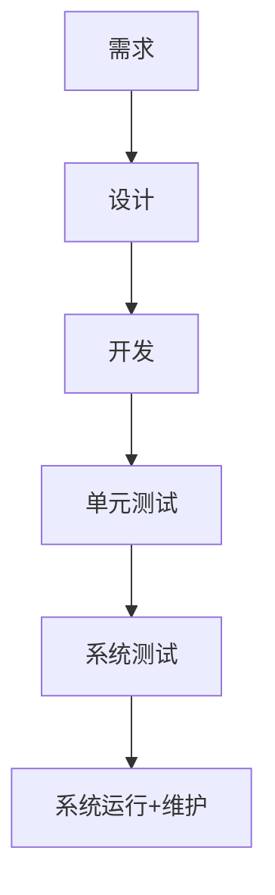

# 软件工程

## 具体项目

图书影视交流平台

为了方便广大用户无障碍地交流图书与影视，现为此开发图书影视交流平台。平台功能主要包括对图书和影视进行评级、小组活动、话题广场等。该平台具体功能详述如下：

**主页**展示热点内容。热点内容包括**流行图书**、**流行影视**、**热门评论**、**热门话题**。游客和注册用户均可对热点内容进行浏览和访问。但游客不能进行操作，如对流行图书进行评论等。只有注册用户才能进行操作。

**检索**。首页检索栏根据输入关键词进行全站检索，按照不同类别（图书，影视，小组及小组讨论，话题及话题内容）返回检索结果。游客及注册用户均可以检索。

**各功能主页**:**图书**、**影视**、**小组**、**话题**四个功能分别有其对应主页。各功能主页必须有针对于该功能的检索栏，其余页面内展示内容自定。

评论图书。注册用户可在对应图书主页对图书进行评分以及撰写评论。评论必须包含评论标题以及不少于25字符的评论内容。

图书评论反馈。注册用户可对现有的评论进行点赞、反对以及举报。其中举报需要填写举报详情单，包括举报标题及不少于15字符的举报原因。

评论影视。注册用户可在对应影视主页对影视进行评分以及撰写评论。评论必须包含评论标题以及不少于25字符的评论内容。

影视评论反馈。注册用户可对现有的评论进行点赞、反对以及举报。其中举报需要填写举报详情单，包括举报标题及不少于15字符的举报原因。

参与话题。话题可与具体图书或影视相关，也可无关。某话题下所有用户发表内容应以一定方式在话题页展示。注册用户参与某话题后，可发表与话题相关的图片及文字。

参与小组。话题可与具体图书或影视相关，也可无关。某小组下所有用户发表内容应以一定方式在小组页面内展示。注册用户加入某小组后，可发表帖子（帖子必须包含标题及不少于25字符的内容）。未加入小组的用户只能浏览小组内的帖子。

管理小组。小组成员均可申请成为小组管理员。小组管理员具有对帖子进行置顶、精华、删除的权限。

## 瀑布式开发

> 适用于需求**固定**的开发模式

## 软件文档

1. 开发计划文档
2. 需求分析文档
3. 软件设计文档
4. 测试分析文档
5. 软件部署文档

